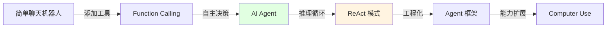
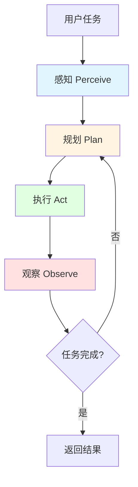
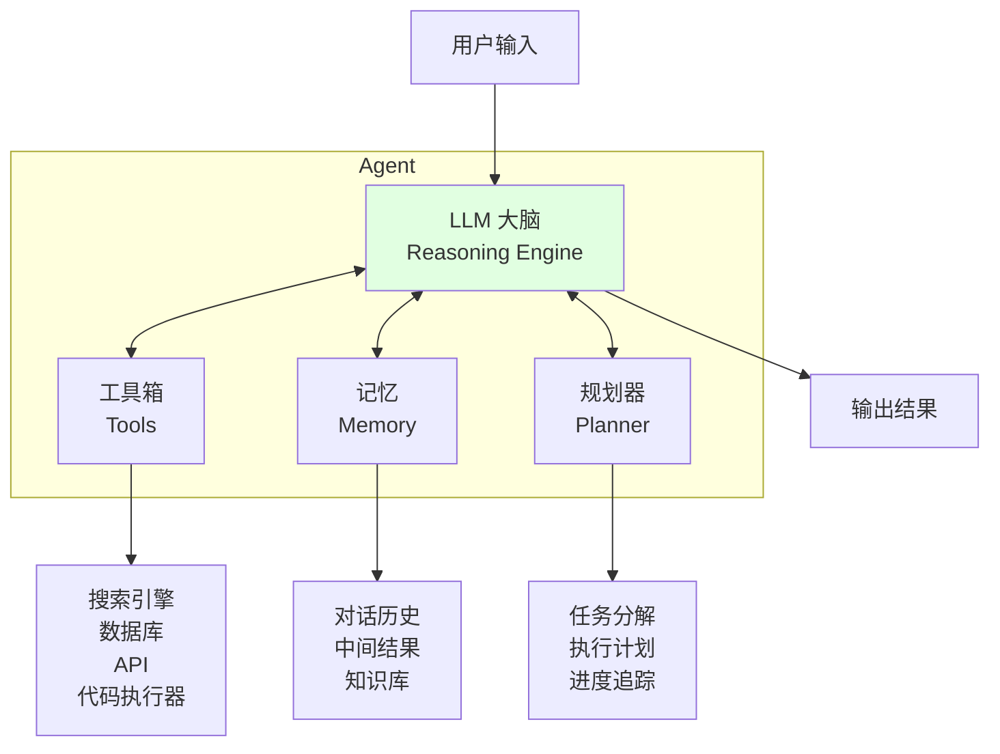
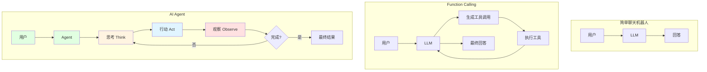
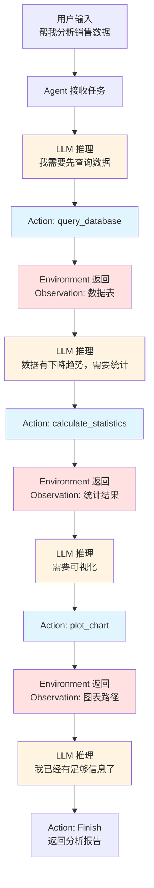

# 第 9 章：AI Agent

> 学完本章，你能：理解 Agent 本质，手写 ReAct Agent，使用主流框架构建 Agent

想象一下，如果 AI 不只是回答问题，而是能自己思考"接下来该干啥"，像一个靠谱的 AI 打工人一样，自己决定用哪个工具、调用几次，直到把活儿干完——这就是我们今天要聊的 Agent！



## 9.1 Agent 核心概念 <DifficultyBadge level="intermediate" /> <CostBadge cost="$0" />

> 前置知识：7.1 Function Calling 基础

### 为什么需要它？（Problem）

当你掌握了 Function Calling 之后，会发现一个新问题：**谁来决定何时调用哪个工具？**

::: tip 类比时间
想象你在管理一个实习生。如果你每次都要告诉他"第一步做这个，第二步做那个"，那你累不累？如果他能自己想"哦，我需要先查数据，再算个数，最后写报告"，是不是就轻松多了？Agent 就是这样的"自主实习生"。
:::

**场景 1：订机票任务**

用户："帮我订一张明天从北京到上海的机票"

```python
# 需要依次调用多个工具
1. search_flights(from="北京", to="上海", date="2026-02-21")
2. check_seat_availability(flight_id="CA1234")  
3. get_user_payment_info()
4. book_flight(flight_id="CA1234", passenger_info={...})
5. send_confirmation_email(booking_id="BK789")
```

**问题：**
- 如果手动编排，就是在写 if-else —— 和传统编程没区别
- 如果让 LLM 一次性规划，中间状态变了怎么办？（比如座位被抢了）
- 如果工具调用失败了，需要重试或换方案，谁来处理？

**场景 2：数据分析任务**

用户："分析一下最近一个月的销售数据，找出下降趋势的原因"

```python
# 不确定需要调用多少次工具
1. query_database(sql="SELECT * FROM sales WHERE date > '2026-01-20'")
2. 发现异常 → calculate_statistics(data)
3. 需要更多数据 → query_database(sql="SELECT * FROM marketing WHERE...")  
4. 生成图表 → plot_chart(data, type="line")
5. 写报告 → generate_report(findings)
```

**问题：**
- **调用次数不确定**：可能需要 3 次，也可能需要 10 次
- **每次调用依赖上次结果**：下一步取决于当前发现了什么
- **需要中间推理**：不是简单的"调用工具"，而是"思考→行动→观察→再思考"

**根本矛盾：**

Function Calling 解决了 **"如何用工具"**，但没解决 **"何时用、用哪个、用多少次"**。

这就需要 **AI Agent**——一个能 **自主决策、持续行动** 的智能体。

::: warning 注意
Agent 不是魔法！它本质上是"多次调用 LLM + 循环决策"。每次循环都要花钱、花时间。所以简单任务别用 Agent，就像你不会请一个项目经理来帮你倒杯水。
:::

**一句话总结：** Agent = 会自己决定"下一步干啥"的 AI 打工人。

### 它是什么？（Concept）

**AI Agent 是什么？**

简单来说，Agent 就是一个 **AI 打工人**，你给他一个任务，他自己琢磨怎么干，干完了告诉你。

AI Agent（智能体）是一个能够：
1. **感知（Perceive）**：理解任务和环境状态
2. **规划（Plan）**：决定下一步做什么
3. **执行（Act）**：调用工具或生成输出
4. **观察（Observe）**：查看执行结果
5. **循环迭代**：根据观察结果调整计划

直到任务完成。



**AI Agent vs 简单 LLM 调用**

| 维度 | 简单 LLM 调用 | Function Calling | AI Agent |
|-----|-------------|------------------|----------|
| **交互次数** | 一次性 | 一次或少数几次 | 多次循环，直到完成 |
| **决策能力** | 人工决定提示词 | 人工决定调用哪个工具 | AI 自主决定下一步 |
| **工具使用** | 无 | 调用预定义工具 | 自主选择和组合工具 |
| **错误处理** | 无法处理 | 需要人工干预 | 自动重试或调整策略 |
| **任务复杂度** | 单一问答 | 单步或简单多步 | 复杂多步，需要推理 |

**关键差异：自主决策（Autonomy）**

```python
# 简单 LLM 调用：你决定一切
response = llm.chat("什么是 Python?")

# Function Calling：你决定何时调用
if user_asks_weather():
    result = call_weather_api()
    response = llm.chat(f"天气是 {result}")

# AI Agent：AI 决定做什么
agent = Agent(tools=[weather, calculator, search])
response = agent.run("帮我规划明天的行程")  # AI 自己决定调用哪些工具、调用几次
```

::: tip 打工人比喻
- **简单 LLM**：你问"1+1=?"，它答"2"，就这样。
- **Function Calling**：你说"查个天气"，它知道要调 API，但你得告诉它什么时候查。
- **Agent**：你说"帮我规划明天行程"，它自己想：先查天气、再查日程、算个通勤时间、最后给建议。你啥都不用管！
:::

**一句话总结：** Agent 的核心是"自主决策循环"——它自己想、自己做、自己看结果、自己决定下一步。

**Agent 的核心组件**



1. **LLM 大脑（Reasoning Engine）**
   - 核心推理引擎
   - 理解任务、做决策、生成行动

2. **工具箱（Tools）**
   - 可调用的外部功能
   - 如：搜索引擎、数据库、计算器、代码执行器

3. **记忆（Memory）**
   - 短期记忆：当前任务的对话历史和中间结果
   - 长期记忆：知识库、过往经验

4. **规划器（Planner）**
   - 任务分解：将大任务拆成小步骤
   - 执行计划：决定先做什么、后做什么
   - 进度追踪：知道自己做到哪一步了

**Agent vs 聊天机器人 vs Function Calling**



**关键特征：**

1. **简单聊天机器人**：
   - 单次对话，无状态
   - 不能使用工具
   - 适合：FAQ、闲聊

2. **Function Calling**：
   - 可以调用工具
   - 但需要人工决定调用逻辑
   - 适合：已知工作流的任务

3. **AI Agent**：
   - 自主决策、循环执行
   - 能处理开放性、不确定性任务
   - 适合：复杂任务、需要多步推理

### 动手试试（Practice）

**概念演示：Agent 的思考过程**

我们先不写代码，通过一个例子理解 Agent 的工作流程。

**任务：** "帮我计算 (123 + 456) × 789 的结果，并告诉我这个数字是否是质数"

**Agent 的推理过程：**

```
[Step 1] 感知任务
用户要求：计算表达式并判断质数
分析：需要两个工具 —— 计算器 + 质数判断器

[Step 2] 规划
Plan:
  1. 先用计算器算出 (123 + 456) × 789
  2. 拿到结果后，用质数判断器检查
  3. 返回最终答案

[Step 3] 执行 - 第 1 次循环
Think: "我需要先计算表达式"
Act: 调用 calculator((123 + 456) × 789)
Observe: 得到结果 456831

[Step 4] 执行 - 第 2 次循环  
Think: "我拿到了计算结果 456831，现在需要判断是否是质数"
Act: 调用 is_prime(456831)
Observe: 得到结果 False (456831 = 3 × 152277)

[Step 5] 完成
Think: "我已经完成了所有需要的计算"
Final Answer: "(123 + 456) × 789 = 456831，这不是质数，因为它可以被 3 整除"
```

**对比：如果是 Function Calling**

```python
# 需要人工写逻辑
result1 = calculator((123 + 456) * 789)
result2 = is_prime(result1)
response = f"{result1} 是{'质数' if result2 else '不是质数'}"
```

**Agent 的优势：**
- 不需要人工写 if-else
- 自动决定调用顺序
- 可以处理不确定的任务（如"分析数据"）

**真实 Agent 架构图**



**Agent 能做什么？不能做什么？**

✅ **Agent 擅长的任务：**
1. **多步推理任务**：需要多次思考和行动
2. **不确定性任务**：不知道具体需要几步
3. **需要工具组合**：一个任务需要调用多个工具
4. **需要中间判断**：根据中间结果决定下一步

❌ **Agent 不适合的任务：**
1. **简单问答**：直接 LLM 调用更快更便宜
2. **固定流程**：已知步骤的任务用硬编码更可靠
3. **实时性要求高**：Agent 循环需要多次 LLM 调用，耗时较长
4. **成本敏感**：每次循环都要调用 LLM，成本是普通调用的 N 倍

::: warning 别滥用 Agent
用 Agent 解决简单问题就像开坦克去买菜——能到，但没必要。记住：**能用一次 LLM 调用搞定的，别用 Agent。**
:::

**一句话总结：** Agent 适合"我不知道要几步才能完成"的任务，不适合"一句话就能回答"的问题。

### 小结（Reflection）

- **解决了什么**：理解了 Agent 的本质——不是"调用工具"，而是"自主决策循环"
- **没解决什么**：知道了 Agent 是什么，但还不知道怎么实现——下一节手写一个最简单的 Agent
- **关键要点**：
  1. **Agent 的核心是自主决策**：不需要人工编排，AI 自己决定下一步
  2. **Agent 的工作循环**：感知 → 规划 → 执行 → 观察 → 循环
  3. **Agent vs Function Calling**：Function Calling 是工具，Agent 是使用工具的智能体
  4. **Agent 适合复杂多步任务**：不确定性、需要推理、需要工具组合
  5. **Agent 不是银弹**：简单任务用 Agent 是浪费，成本和延迟都更高

---

*最后更新：2026-02-20*
