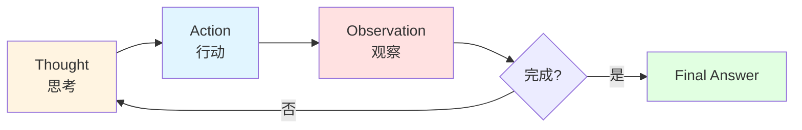
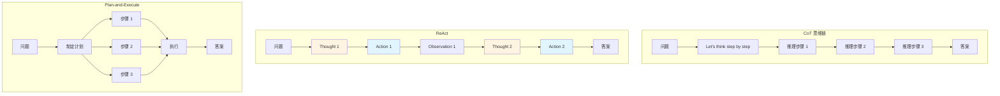

# 9.2 ReAct 模式 <DifficultyBadge level="intermediate" /> <CostBadge cost="$0.05" />

> 前置知识：7.1 Function Calling 基础、9.1 Agent 核心概念

听说过"想一下再做"吗？我们教 AI 的时候发现，如果让它边想边说出来，它就不容易"瞎蒙"了。这就是 ReAct——让 AI 像我们一样，先想"我要干啥"，再动手干活儿，干完看看结果，然后再想下一步。

### 为什么需要它？（Problem）

上一节我们理解了 Agent 的本质：**循环推理和行动**。但具体怎么实现呢？

**核心挑战：如何让 LLM 既思考又行动？**

看一个失败的例子：

```python
# 错误示例：直接让 LLM 调用工具
prompt = "计算 123 + 456 的结果，并判断是否是质数"
response = llm.chat(prompt, tools=[calculator, is_prime])
# 问题：LLM 可能直接回答"579，不是质数"（瞎猜）
# 或者只调用一个工具，没有形成推理链
```

**问题 1：LLM 会"跳过思考"**
- 直接给答案，不调用工具
- 或者调用工具，但不解释为什么

**问题 2：无法形成推理链**
- 需要多步推理时，LLM 容易"断片"
- 没有明确的思考→行动→观察循环

**问题 3：调试困难**
- 不知道 AI 在想什么
- 出错时无法追踪推理过程

**我们需要一个明确的模式，强制 LLM 遵循"思考→行动"的节奏。**

这就是 **ReAct**。

::: tip 想一下再做
ReAct 就像你妈告诉你："别急着动手，先想想怎么做！"LLM 也一样，得让它养成"想一下再做"的好习惯，不然它就瞎搞。
:::

**一句话总结：** ReAct = 强制 AI 说出"我要干啥、为啥要干"，再让它动手。

### 它是什么？（Concept）

**ReAct = Reasoning（推理）+ Acting（行动）**

ReAct 是一个简单但强大的 Agent 模式，核心思想：

> **每次行动前，必须先思考；每次行动后，必须观察结果。**

::: tip 类比做菜
想象你在教一个从没做过饭的人：
- ❌ **不好的方式**："去做个西红柿炒蛋"（然后他可能直接把生鸡蛋扔锅里）
- ✅ **ReAct 方式**：
  - 想：我需要先打鸡蛋
  - 做：打鸡蛋
  - 看：嗯，打好了
  - 想：现在该热锅了
  - 做：开火热油
  - 看：油热了，可以炒了
  - ...（直到做完）
:::

**一句话总结：** ReAct 就是"想→做→看→想→做→看"的循环，直到任务完成。



**ReAct 循环的三个阶段：**

1. **Thought（思考）**
   - LLM 生成推理过程
   - 明确说明"我现在要做什么、为什么"

2. **Action（行动）**
   - 调用工具或执行操作
   - 格式：`Action: tool_name[input]`

3. **Observation（观察）**
   - 返回工具执行结果
   - 格式：`Observation: result`

**示例：完整的 ReAct 推理链**

任务："北京现在几点？那里现在是白天还是晚上？"

```
Thought 1: 我需要先获取北京的当前时间
Action 1: get_current_time[Beijing]
Observation 1: 2026-02-20 14:30:00

Thought 2: 现在是 14:30，下午 2 点半，应该是白天
Action 2: Finish[北京现在是 2026-02-20 14:30（下午 2 点半），是白天]
```

**ReAct vs 其他模式**

| 模式 | 思考方式 | 适用场景 | 优点 | 缺点 |
|-----|---------|---------|------|------|
| **ReAct** | 交替推理和行动 | 需要工具的任务 | 可解释、易调试 | 每步都调用 LLM，成本高 |
| **CoT (思维链)** | 一次性推理 | 纯推理任务 | 简单、便宜 | 不能用工具 |
| **Plan-and-Execute** | 先规划再执行 | 已知步骤的任务 | 效率高 | 不能动态调整计划 |



**ReAct 的提示词结构**

```
You run in a loop of Thought, Action, Observation.
At the end of the loop you output a Final Answer.

Use Thought to describe your reasoning about the question.
Use Action to run one of the available actions.
Observation will be the result of running those actions.

Available actions:
- calculator[expression]: Calculate a math expression
- search[query]: Search the internet
- finish[answer]: Return the final answer

Example session:
Question: What is 25 * 4 + 10?
Thought 1: I need to calculate this expression
Action 1: calculator[25 * 4 + 10]
Observation 1: 110
Thought 2: I have the answer
Action 2: finish[110]

Now it's your turn:
Question: {user_question}
```

**关键设计要点：**

1. **明确的格式约定**
   - `Thought N:`、`Action N:`、`Observation N:` 有固定格式
   - 便于解析和调试

2. **Few-shot 示例**
   - 给 LLM 看一个完整的例子
   - 帮助 LLM 理解格式

3. **Finish 动作**
   - 明确的终止信号
   - 避免无限循环

**ReAct 的实现逻辑**

```python
def react_agent(question, tools, max_steps=10):
    """
    ReAct Agent 的核心循环
    """
    prompt = build_react_prompt(question, tools)
    
    for step in range(1, max_steps + 1):
        # 1. LLM 生成 Thought + Action
        response = llm.chat(prompt)
        
        # 2. 解析 Action
        action = parse_action(response)
        
        # 3. 执行 Action
        if action.name == "finish":
            return action.input  # 返回最终答案
        
        observation = execute_tool(action.name, action.input)
        
        # 4. 添加 Observation 到 prompt
        prompt += f"\nObservation {step}: {observation}"
        prompt += f"\nThought {step + 1}:"
    
    return "Max steps reached"
```

### 动手试试（Practice）

我们从零开始手写一个 ReAct Agent，不使用任何框架。

**任务目标：**
- 支持两个工具：计算器 + 维基百科搜索
- 能够处理需要多步推理的问题
- 输出完整的推理过程

**第 1 步：定义工具**

```python
import re
import requests

# 工具 1: 计算器
def calculator(expression: str) -> str:
    """
    计算数学表达式
    """
    try:
        # 安全的计算：只允许数字和基本运算符
        result = eval(expression, {"__builtins__": {}}, {})
        return str(result)
    except Exception as e:
        return f"Error: {str(e)}"

# 工具 2: 维基百科搜索（简化版）
def wikipedia_search(query: str) -> str:
    """
    搜索维基百科并返回摘要
    """
    try:
        url = "https://en.wikipedia.org/api/rest_v1/page/summary/" + query
        response = requests.get(url)
        if response.status_code == 200:
            data = response.json()
            return data.get("extract", "No summary found")
        else:
            return "Not found"
    except Exception as e:
        return f"Error: {str(e)}"

# 工具注册表
TOOLS = {
    "calculator": calculator,
    "search": wikipedia_search,
}
```

**第 2 步：构建 ReAct 提示词**

```python
REACT_PROMPT_TEMPLATE = """You run in a loop of Thought, Action, Observation.
At the end of the loop you output a Final Answer.

Use Thought to describe your reasoning about the question.
Use Action to run one of the available actions - actions are like Python function calls.
Observation will be the result of running those actions.

Available actions:
- calculator[expression]: Calculate a math expression. Example: calculator[25 * 4 + 10]
- search[query]: Search Wikipedia. Example: search[Python programming language]
- finish[answer]: Return the final answer and stop. Example: finish[The answer is 42]

IMPORTANT: 
- You can only use ONE action per step
- Always output "Thought N:" before "Action N:"
- After each action, wait for "Observation N:" before continuing

Example session:
Question: What is the population of the capital of France?
Thought 1: I need to first find out what the capital of France is.
Action 1: search[capital of France]
Observation 1: Paris is the capital and most populous city of France.
Thought 2: Now I know the capital is Paris. I need to find its population.
Action 2: search[population of Paris]
Observation 2: As of 2023, the population of Paris is approximately 2.2 million.
Thought 3: I have the answer now.
Action 3: finish[The population of Paris is approximately 2.2 million]

Now it's your turn:
Question: {question}
Thought 1:"""

def build_prompt(question: str) -> str:
    return REACT_PROMPT_TEMPLATE.format(question=question)
```

**第 3 步：解析 Action**

```python
def parse_action(text: str) -> tuple[str, str]:
    """
    解析 LLM 输出中的 Action
    
    格式: Action N: tool_name[input]
    返回: (tool_name, input)
    """
    # 匹配 "Action N: tool_name[input]"
    action_pattern = r"Action \d+: (\w+)\[(.*?)\]"
    match = re.search(action_pattern, text)
    
    if match:
        tool_name = match.group(1)
        tool_input = match.group(2)
        return tool_name, tool_input
    
    return None, None
```

**第 4 步：实现 ReAct 循环**

```python
from openai import OpenAI

client = OpenAI()

def react_agent(question: str, max_steps: int = 10, verbose: bool = True) -> str:
    """
    ReAct Agent 主循环
    """
    prompt = build_prompt(question)
    
    if verbose:
        print("=" * 80)
        print(f"Question: {question}")
        print("=" * 80)
    
    for step in range(1, max_steps + 1):
        # 1. LLM 生成推理和行动
        response = client.chat.completions.create(
            model="gpt-4.1-mini",
            messages=[{"role": "user", "content": prompt}],
            temperature=0,  # 确定性输出
        )
        
        llm_output = response.choices[0].message.content
        
        if verbose:
            print(f"\n{llm_output}")
        
        # 2. 解析 Action
        tool_name, tool_input = parse_action(llm_output)
        
        if tool_name is None:
            return "Error: Failed to parse action"
        
        # 3. 检查是否结束
        if tool_name == "finish":
            if verbose:
                print("\n" + "=" * 80)
                print(f"Final Answer: {tool_input}")
                print("=" * 80)
            return tool_input
        
        # 4. 执行工具
        if tool_name not in TOOLS:
            observation = f"Error: Unknown tool '{tool_name}'"
        else:
            observation = TOOLS[tool_name](tool_input)
        
        if verbose:
            print(f"Observation {step}: {observation}")
        
        # 5. 更新 prompt
        prompt += llm_output
        prompt += f"\nObservation {step}: {observation}\n"
        prompt += f"Thought {step + 1}:"
    
    return "Error: Max steps reached without finishing"
```

**第 5 步：测试 Agent**

```python
# 测试 1: 需要计算的问题
question1 = "What is (123 + 456) * 789?"
answer1 = react_agent(question1)

# 测试 2: 需要搜索的问题
question2 = "Who created Python programming language?"
answer2 = react_agent(question2)

# 测试 3: 需要多步推理的问题
question3 = "What is the population of the birthplace of the creator of Python?"
answer3 = react_agent(question3)
```

**运行结果示例：**

```
================================================================================
Question: What is the population of the birthplace of the creator of Python?
================================================================================

Thought 1: I need to first find out who created Python.
Action 1: search[creator of Python]
Observation 1: Python was created by Guido van Rossum in 1991.

Thought 2: Now I know Guido van Rossum created Python. I need to find his birthplace.
Action 2: search[Guido van Rossum birthplace]
Observation 2: Guido van Rossum was born in Haarlem, Netherlands.

Thought 3: Now I know he was born in Haarlem. I need to find the population of Haarlem.
Action 3: search[population of Haarlem Netherlands]
Observation 3: As of 2023, Haarlem has a population of approximately 162,000.

Thought 4: I have all the information I need.
Action 4: finish[The population of Haarlem, the birthplace of Python creator Guido van Rossum, is approximately 162,000]
================================================================================
Final Answer: The population of Haarlem, the birthplace of Python creator Guido van Rossum, is approximately 162,000
================================================================================
```

**第 6 步：添加安全机制**

```python
def react_agent_safe(question: str, max_steps: int = 10, verbose: bool = True) -> dict:
    """
    带错误处理和统计的 ReAct Agent
    """
    prompt = build_prompt(question)
    history = []
    total_tokens = 0
    
    for step in range(1, max_steps + 1):
        try:
            response = client.chat.completions.create(
                model="gpt-4.1-mini",
                messages=[{"role": "user", "content": prompt}],
                temperature=0,
            )
            
            llm_output = response.choices[0].message.content
            total_tokens += response.usage.total_tokens
            
            # 记录历史
            history.append({
                "step": step,
                "thought_and_action": llm_output,
            })
            
            # 解析 Action
            tool_name, tool_input = parse_action(llm_output)
            
            if tool_name is None:
                return {
                    "status": "error",
                    "message": "Failed to parse action",
                    "history": history,
                }
            
            # 检查终止
            if tool_name == "finish":
                return {
                    "status": "success",
                    "answer": tool_input,
                    "steps": step,
                    "total_tokens": total_tokens,
                    "history": history,
                }
            
            # 执行工具
            observation = TOOLS.get(tool_name, lambda x: f"Unknown tool: {tool_name}")(tool_input)
            
            history[-1]["observation"] = observation
            
            # 更新 prompt
            prompt += llm_output
            prompt += f"\nObservation {step}: {observation}\n"
            prompt += f"Thought {step + 1}:"
            
        except Exception as e:
            return {
                "status": "error",
                "message": str(e),
                "history": history,
            }
    
    return {
        "status": "timeout",
        "message": f"Max steps ({max_steps}) reached",
        "history": history,
    }
```

<ColabBadge path="demos/09-ai-agents/react_agent.ipynb" />

::: details 完整可运行脚本（点击展开）

把上面 6 个步骤的代码合并成一个文件，复制即可运行：

```bash
pip install openai requests python-dotenv
```

```python
import re
import os
import requests
from openai import OpenAI
from dotenv import load_dotenv

load_dotenv()
client = OpenAI()

# ===== 工具定义 =====
def calculator(expression: str) -> str:
    try:
        result = eval(expression, {"__builtins__": {}}, {})
        return str(result)
    except Exception as e:
        return f"Error: {str(e)}"

def wikipedia_search(query: str) -> str:
    try:
        url = "https://en.wikipedia.org/api/rest_v1/page/summary/" + query
        response = requests.get(url)
        if response.status_code == 200:
            data = response.json()
            return data.get("extract", "No summary found")
        else:
            return "Not found"
    except Exception as e:
        return f"Error: {str(e)}"

TOOLS = {
    "calculator": calculator,
    "search": wikipedia_search,
}

# ===== ReAct 提示词 =====
REACT_PROMPT_TEMPLATE = """You run in a loop of Thought, Action, Observation.
At the end of the loop you output a Final Answer.

Use Thought to describe your reasoning about the question.
Use Action to run one of the available actions.
Observation will be the result of running those actions.

Available actions:
- calculator[expression]: Calculate a math expression. Example: calculator[25 * 4 + 10]
- search[query]: Search Wikipedia. Example: search[Python programming language]
- finish[answer]: Return the final answer and stop.

IMPORTANT: 
- You can only use ONE action per step
- Always output "Thought N:" before "Action N:"

Example session:
Question: What is the population of the capital of France?
Thought 1: I need to first find out what the capital of France is.
Action 1: search[capital of France]
Observation 1: Paris is the capital and most populous city of France.
Thought 2: Now I know the capital is Paris. I need to find its population.
Action 2: search[population of Paris]
Observation 2: As of 2023, the population of Paris is approximately 2.2 million.
Thought 3: I have the answer now.
Action 3: finish[The population of Paris is approximately 2.2 million]

Now it's your turn:
Question: {question}
Thought 1:"""

def build_prompt(question: str) -> str:
    return REACT_PROMPT_TEMPLATE.format(question=question)

# ===== Action 解析 =====
def parse_action(text: str) -> tuple[str, str]:
    action_pattern = r"Action \d+: (\w+)\[(.*?)\]"
    match = re.search(action_pattern, text)
    if match:
        return match.group(1), match.group(2)
    return None, None

# ===== ReAct Agent 主循环 =====
def react_agent(question: str, max_steps: int = 10, verbose: bool = True) -> str:
    prompt = build_prompt(question)
    if verbose:
        print("=" * 80)
        print(f"Question: {question}")
        print("=" * 80)
    for step in range(1, max_steps + 1):
        response = client.chat.completions.create(
            model="gpt-4.1-mini",
            messages=[{"role": "user", "content": prompt}],
            temperature=0,
        )
        llm_output = response.choices[0].message.content
        if verbose:
            print(f"\n{llm_output}")
        tool_name, tool_input = parse_action(llm_output)
        if tool_name is None:
            return "Error: Failed to parse action"
        if tool_name == "finish":
            if verbose:
                print(f"\nFinal Answer: {tool_input}")
            return tool_input
        if tool_name not in TOOLS:
            observation = f"Error: Unknown tool '{tool_name}'"
        else:
            observation = TOOLS[tool_name](tool_input)
        if verbose:
            print(f"Observation {step}: {observation}")
        prompt += llm_output
        prompt += f"\nObservation {step}: {observation}\n"
        prompt += f"Thought {step + 1}:"
    return "Error: Max steps reached"

# ===== 运行测试 =====
if __name__ == "__main__":
    answer = react_agent("What is (123 + 456) * 789?")
    print(f"\nResult: {answer}")
```
:::

### 小结（Reflection）

- **解决了什么**：从零手写了一个 ReAct Agent，理解了 Agent 的核心实现原理
- **没解决什么**：手写 Agent 代码量多、容易出错、缺少高级特性——下一节介绍成熟的 Agent 框架
- **关键要点**：
  1. **ReAct = 推理 + 行动**：每次行动前思考，每次行动后观察
  2. **提示词工程是关键**：明确的格式约定让 LLM 遵循 ReAct 模式
  3. **解析 Action 是核心逻辑**：用正则表达式提取工具名和输入
  4. **循环直到 finish**：Agent 自己决定什么时候完成任务
  5. **手写 Agent 的价值**：理解原理后，用框架才能游刃有余

**从手写到框架：**
- 手写 Agent：~100 行代码，需要自己处理所有细节
- Agent 框架：~10 行代码，自动处理解析、错误、记忆等

下一节，我们将用 OpenAI Agents SDK 重写这个 Agent，体验框架的威力。

---

*最后更新：2026-02-20*
