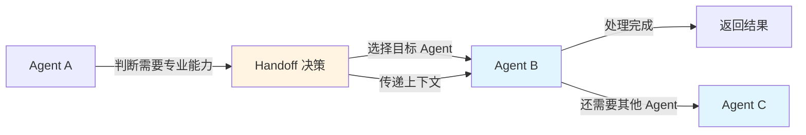
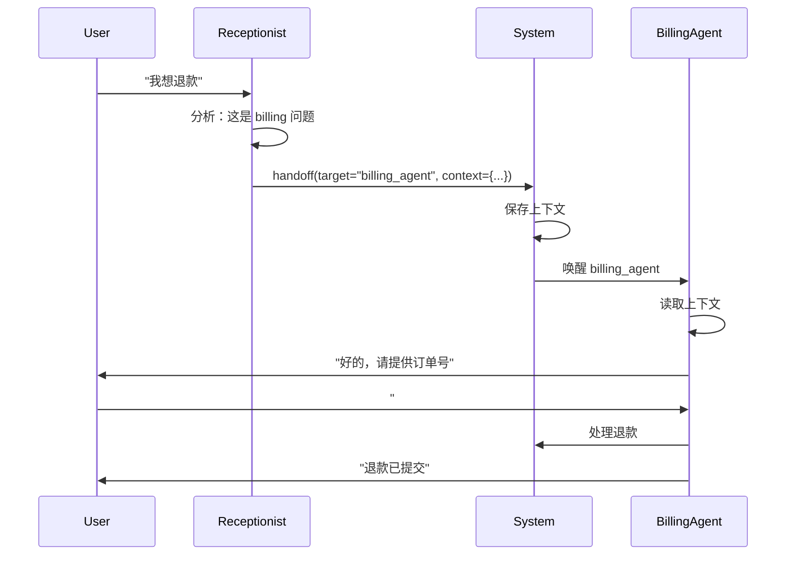
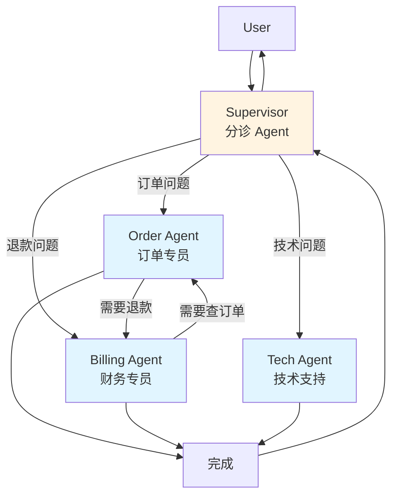

# 10.2 Sub-Agent 与 Handoff <DifficultyBadge level="advanced" /> <CostBadge cost="$0.10" />

> 前置知识：9.3 Agent 框架实战、10.1 多 Agent 架构

想象一下，你去医院看病：先挂号（前台），然后医生看病（专科医生），可能还要做检查（检验科），最后拿药（药房）。这个"转诊"的过程，在 AI 世界里叫 **Handoff**——把任务从一个 Agent 传给另一个。

::: tip 类比：医院转诊
- **前台护士**："你这个症状，去看骨科。"（Handoff 到骨科医生）
- **骨科医生**："需要拍个片，去放射科。"（Handoff 到放射科）
- **放射科**："片子出来了，回骨科看结果。"（Handoff 回骨科）

这就是 Handoff——任务在不同专家之间流转，每个人只干自己擅长的。
:::

### 为什么需要它？（Problem）

上一节我们学习了多 Agent 协作的四种模式，但有一个核心问题没解决：

**Agent 怎么知道什么时候该"移交"任务？**

**场景：客服系统**

```
User: "我的订单 #12345 还没发货，想退款"

Receptionist Agent:
  - 这是订单问题？还是退款问题？
  - 我应该转给订单专员？还是财务专员？
  - 如果订单专员处理不了，怎么再转给财务？
  - 如何确保信息不丢失？
```

**问题 1：决策复杂**
```python
# 朴素的实现
def handle_request(user_message):
    if "订单" in user_message:
        return order_agent.run(user_message)
    elif "退款" in user_message:
        return billing_agent.run(user_message)
    elif "技术" in user_message:
        return tech_agent.run(user_message)
    else:
        return "抱歉，我不知道该转给谁"

# 问题：
# - 关键词匹配太简单，容易误判
# - 无法处理复杂情况（既有订单又有退款）
# - 硬编码，难以扩展
```

**问题 2：上下文丢失**
```python
# Agent A 处理后转给 Agent B
result_A = agent_A.run(user_message)
result_B = agent_B.run(result_A)  # Agent B 看不到原始用户消息！

# 问题：
# - Agent B 不知道完整上下文
# - 无法追溯历史对话
```

**问题 3：无法回退**
```python
# 转错了怎么办？
receptionist → order_agent  # 转错了，应该转给 billing
# 能不能回到 receptionist 重新分配？
```

**我们需要一个标准的"移交"机制。**

::: warning 别小看 Handoff
Handoff 看起来简单，实际上有很多坑：
- **转错了怎么办？**（订单问题转给了技术支持）
- **上下文丢了怎么办？**（用户说了什么，下一个 Agent 不知道）
- **无限转圈怎么办？**（A 转 B，B 转 C，C 又转回 A）

所以需要一个**标准的、可靠的** Handoff 机制。
:::

**一句话总结：** Handoff = Agent 之间的"转诊"，得确保转对人、信息不丢、不转圈。

### 它是什么？（Concept）

**Handoff（移交）是什么？**

Handoff 是多 Agent 系统中，一个 Agent 将任务转交给另一个 Agent 的机制。

::: tip 类比：接力赛
想象一场接力赛：
- **决策**：判断什么时候该交棒了
- **传递**：把棒（任务 + 上下文）交给队友
- **控制**：交棒后，你就不管了，队友接着跑

Handoff 也一样——判断时机、传递任务、交出控制权。
:::

**一句话总结：** Handoff = 判断"该谁上了"+ 传递任务和上下文 + 交出控制权。



**Handoff 的三个要素：**

1. **决策（Decision）**
   - 何时移交？
   - 移交给谁？

2. **上下文传递（Context Transfer）**
   - 传递哪些信息？
   - 如何保证信息完整？

3. **流程控制（Control Flow）**
   - 移交后谁在控制？
   - 能否回退？

**OpenAI Agents SDK 的 Handoff 机制**

OpenAI Agents SDK 原生支持 Handoff：

```python
# 定义 Handoff 目标
handoff_to_billing = {
    "type": "handoff",
    "target": "billing_agent",
    "description": "Transfer to billing specialist for payment issues"
}

# 创建 Agent 时声明 Handoff
receptionist = client.beta.assistants.create(
    name="Receptionist",
    instructions="You are a receptionist. When users ask about billing, hand off to billing agent.",
    handoffs=[handoff_to_billing],
)
```

**Handoff 的工作流程：**



**Supervisor + Worker 模式**

最常用的 Handoff 模式：一个 Supervisor 管理多个 Workers



**特点：**
- Supervisor 负责分诊和协调
- Workers 负责专业任务
- Workers 之间可以相互 Handoff
- 所有结果最终回到 Supervisor

**Triage Agent 模式**

专门的"分诊"Agent，决定路由逻辑

```python
triage_agent = client.beta.assistants.create(
    name="Triage Agent",
    instructions="""Analyze user requests and route to the appropriate specialist:
    
- Order Agent: order status, tracking, cancellation
- Billing Agent: payments, refunds, invoices  
- Tech Agent: technical issues, bugs, API problems
- General Agent: other questions

Always provide a reason for your routing decision.""",
    handoffs=[
        {"type": "handoff", "target": "order_agent"},
        {"type": "handoff", "target": "billing_agent"},
        {"type": "handoff", "target": "tech_agent"},
        {"type": "handoff", "target": "general_agent"},
    ],
)
```

**Handoff vs Function Calling**

| 对比项 | Function Calling | Handoff |
|-------|-----------------|---------|
| **目标** | 调用工具/API | 转移给另一个 Agent |
| **返回** | 同步返回结果 | 可能需要多轮对话 |
| **上下文** | 单次调用 | 持续的对话上下文 |
| **控制权** | 当前 Agent 保持控制 | 转移控制权 |
| **适用** | 数据查询、计算 | 需要专业能力的任务 |

```python
# Function Calling：调用工具后立即返回
result = call_tool("get_weather", location="Beijing")
print(f"The weather is {result}")

# Handoff：转移给另一个 Agent，可能需要多轮对话
handoff_to("weather_expert")
# Weather Expert Agent 接管，可能会问更多问题
# "你想知道今天的天气还是未来一周的？"
```

### 动手试试（Practice）

我们构建一个**客服系统**，包含 1 个 Supervisor + 3 个 Worker Agents。

**系统架构：**

```
Supervisor (Receptionist)
├── Order Agent (订单专员)
├── Billing Agent (财务专员)
└── Tech Agent (技术支持)
```

**第 1 步：定义 Worker Agents**

```python
from openai import OpenAI

client = OpenAI()

# Worker 1: Order Agent
order_agent = client.beta.assistants.create(
    name="Order Specialist",
    instructions="""You are an order specialist.
    
Your responsibilities:
- Check order status
- Track shipments
- Handle cancellations
- Update shipping addresses

If the user wants a refund, hand off to Billing Agent.

Always be professional and helpful.""",
    model="gpt-4.1-mini",
    tools=[
        {
            "type": "function",
            "function": {
                "name": "get_order_status",
                "description": "Get the status of an order",
                "parameters": {
                    "type": "object",
                    "properties": {
                        "order_id": {"type": "string"}
                    },
                    "required": ["order_id"],
                },
            },
        }
    ],
    # Order Agent 可以 handoff 到 Billing
    handoffs=[
        {
            "type": "handoff",
            "target": "billing_agent",
            "description": "Hand off to billing for refund requests"
        }
    ],
)

# Worker 2: Billing Agent
billing_agent = client.beta.assistants.create(
    name="Billing Specialist",
    instructions="""You are a billing specialist.

Your responsibilities:
- Process refunds
- Handle payment issues
- Generate invoices
- Update payment methods

If you need order details, hand off to Order Agent.

Always verify the order status before processing refunds.""",
    model="gpt-4.1-mini",
    tools=[
        {
            "type": "function",
            "function": {
                "name": "process_refund",
                "description": "Process a refund for an order",
                "parameters": {
                    "type": "object",
                    "properties": {
                        "order_id": {"type": "string"},
                        "amount": {"type": "number"},
                    },
                    "required": ["order_id", "amount"],
                },
            },
        }
    ],
    handoffs=[
        {
            "type": "handoff",
            "target": "order_agent",
            "description": "Hand off to order specialist for order details"
        }
    ],
)

# Worker 3: Tech Agent
tech_agent = client.beta.assistants.create(
    name="Tech Support",
    instructions="""You are a technical support specialist.

Your responsibilities:
- Troubleshoot technical issues
- Help with API problems
- Debug integration issues
- Provide technical documentation

If the issue is not technical, hand off to Receptionist.""",
    model="gpt-4.1-mini",
    tools=[{"type": "code_interpreter"}],
    handoffs=[
        {
            "type": "handoff",
            "target": "receptionist",
            "description": "Hand off to receptionist for non-technical issues"
        }
    ],
)
```

**第 2 步：定义 Supervisor Agent**

```python
# Supervisor: Receptionist (分诊)
receptionist = client.beta.assistants.create(
    name="Receptionist",
    instructions="""You are a friendly receptionist for customer support.

Your job is to understand the user's request and route them to the right specialist:

- Order Specialist: order status, tracking, cancellation, shipping
- Billing Specialist: refunds, payments, invoices, billing issues
- Tech Support: API errors, technical bugs, integration problems

Analyze the user's message carefully and hand off to the most appropriate specialist.

If you're unsure, ask clarifying questions before handing off.""",
    model="gpt-4.1-mini",
    handoffs=[
        {
            "type": "handoff",
            "target": "order_agent",
            "description": "Hand off to order specialist"
        },
        {
            "type": "handoff",
            "target": "billing_agent",
            "description": "Hand off to billing specialist"
        },
        {
            "type": "handoff",
            "target": "tech_agent",
            "description": "Hand off to tech support"
        },
    ],
)
```

**第 3 步：实现工具函数**

```python
# 模拟数据库
ORDERS = {
    "12345": {
        "status": "shipped",
        "amount": 99.99,
        "items": ["Widget A", "Widget B"],
        "tracking": "TRK-98765",
    },
    "67890": {
        "status": "pending",
        "amount": 149.99,
        "items": ["Gadget X"],
        "tracking": None,
    },
}

def get_order_status(order_id: str) -> str:
    """获取订单状态"""
    order = ORDERS.get(order_id)
    if order:
        return f"Order {order_id}: {order['status']}. Tracking: {order.get('tracking', 'N/A')}"
    return f"Order {order_id} not found"

def process_refund(order_id: str, amount: float) -> str:
    """处理退款"""
    order = ORDERS.get(order_id)
    if not order:
        return f"Order {order_id} not found"
    
    if amount > order["amount"]:
        return f"Refund amount ${amount} exceeds order total ${order['amount']}"
    
    return f"Refund of ${amount} for order {order_id} processed successfully"

TOOL_MAP = {
    "get_order_status": get_order_status,
    "process_refund": process_refund,
}
```

**第 4 步：运行多 Agent 系统**

```python
def run_multi_agent_system(user_message: str, verbose: bool = True):
    """
    运行多 Agent 客服系统
    """
    # 创建线程
    thread = client.beta.threads.create()
    
    # 添加用户消息
    client.beta.threads.messages.create(
        thread_id=thread.id,
        role="user",
        content=user_message,
    )
    
    if verbose:
        print(f"\n{'='*80}")
        print(f"User: {user_message}")
        print(f"{'='*80}\n")
    
    # 从 Receptionist 开始
    current_agent = receptionist.id
    
    while True:
        # 运行当前 Agent
        run = client.beta.threads.runs.create(
            thread_id=thread.id,
            assistant_id=current_agent,
        )
        
        # 轮询状态
        while True:
            run_status = client.beta.threads.runs.retrieve(
                thread_id=thread.id,
                run_id=run.id,
            )
            
            if verbose:
                print(f"[{get_agent_name(current_agent)}] Status: {run_status.status}")
            
            # 需要执行工具
            if run_status.status == "requires_action":
                tool_outputs = []
                
                for tool_call in run_status.required_action.submit_tool_outputs.tool_calls:
                    function_name = tool_call.function.name
                    function_args = eval(tool_call.function.arguments)
                    
                    if verbose:
                        print(f"  🔧 Calling: {function_name}({function_args})")
                    
                    result = TOOL_MAP[function_name](**function_args)
                    
                    if verbose:
                        print(f"  📊 Result: {result}")
                    
                    tool_outputs.append({
                        "tool_call_id": tool_call.id,
                        "output": result,
                    })
                
                client.beta.threads.runs.submit_tool_outputs(
                    thread_id=thread.id,
                    run_id=run.id,
                    tool_outputs=tool_outputs,
                )
            
            # 需要 Handoff
            elif run_status.status == "requires_handoff":
                handoff = run_status.required_handoff
                
                if verbose:
                    print(f"  🔄 Handoff to: {handoff.target}")
                    print(f"  💬 Reason: {handoff.reason}")
                
                # 切换到目标 Agent
                current_agent = get_agent_id(handoff.target)
                
                # 确认 Handoff
                client.beta.threads.runs.submit_handoff(
                    thread_id=thread.id,
                    run_id=run.id,
                    handoff_id=handoff.id,
                )
                break  # 进入下一个 Agent 的循环
            
            # 完成
            elif run_status.status == "completed":
                messages = client.beta.threads.messages.list(thread_id=thread.id)
                final_message = messages.data[0].content[0].text.value
                
                if verbose:
                    print(f"\n{'='*80}")
                    print(f"[{get_agent_name(current_agent)}] {final_message}")
                    print(f"{'='*80}\n")
                
                return final_message
            
            # 失败
            elif run_status.status in ["failed", "cancelled", "expired"]:
                print(f"❌ Run {run_status.status}")
                return None
            
            # 等待
            import time
            time.sleep(1)

def get_agent_name(agent_id: str) -> str:
    """获取 Agent 名称"""
    mapping = {
        receptionist.id: "Receptionist",
        order_agent.id: "Order Specialist",
        billing_agent.id: "Billing Specialist",
        tech_agent.id: "Tech Support",
    }
    return mapping.get(agent_id, "Unknown")

def get_agent_id(agent_name: str) -> str:
    """根据名称获取 Agent ID"""
    mapping = {
        "receptionist": receptionist.id,
        "order_agent": order_agent.id,
        "billing_agent": billing_agent.id,
        "tech_agent": tech_agent.id,
    }
    return mapping.get(agent_name)
```

**第 5 步：测试多 Agent 协作**

```python
# 测试 1：订单查询（单 Agent）
result1 = run_multi_agent_system(
    "我的订单 #12345 发货了吗？"
)

# 测试 2：退款（需要 Handoff）
result2 = run_multi_agent_system(
    "订单 #12345 我不想要了，帮我退款"
)

# 测试 3：复杂情况（多次 Handoff）
result3 = run_multi_agent_system(
    "我的订单 #67890 还没发货，能不能取消并退款？"
)
```

**运行结果示例：**

```
================================================================================
User: 订单 #12345 我不想要了，帮我退款
================================================================================

[Receptionist] Status: in_progress
[Receptionist] Status: requires_handoff
  🔄 Handoff to: billing_agent
  💬 Reason: User is requesting a refund

[Billing Specialist] Status: in_progress
  🔧 Calling: get_order_status({'order_id': '12345'})
  📊 Result: Order 12345: shipped. Tracking: TRK-98765

[Billing Specialist] Status: in_progress
  🔧 Calling: process_refund({'order_id': '12345', 'amount': 99.99})
  📊 Result: Refund of $99.99 for order 12345 processed successfully

[Billing Specialist] Status: completed

================================================================================
[Billing Specialist] Your refund of $99.99 for order #12345 has been processed successfully. 
You should see the amount back in your account within 3-5 business days.
================================================================================
```

**第 6 步：添加日志和监控**

```python
class HandoffTracker:
    def __init__(self):
        self.handoffs = []
    
    def record_handoff(self, from_agent: str, to_agent: str, reason: str):
        self.handoffs.append({
            "from": from_agent,
            "to": to_agent,
            "reason": reason,
            "timestamp": time.time(),
        })
    
    def get_path(self) -> str:
        """获取 Handoff 路径"""
        path = [self.handoffs[0]["from"]]
        for h in self.handoffs:
            path.append(h["to"])
        return " → ".join(path)
    
    def get_statistics(self) -> dict:
        """获取统计信息"""
        return {
            "total_handoffs": len(self.handoffs),
            "path": self.get_path(),
            "agents_involved": len(set(h["from"] for h in self.handoffs) | set(h["to"] for h in self.handoffs)),
        }
```

<ColabBadge path="demos/10-multi-agent/handoff.ipynb" />

### 小结（Reflection）

- **解决了什么**：掌握了 Handoff 机制，构建了一个完整的多 Agent 客服系统
- **没解决什么**：这还是一个简单的案例——下一节做一个更复杂的真实项目
- **关键要点**：
  1. **Handoff 是多 Agent 的核心**：实现任务在 Agent 之间流转
  2. **Supervisor + Worker 是经典模式**：一个协调者 + 多个专家
  3. **上下文自动传递**：框架自动管理对话历史
  4. **Worker 之间可以互相 Handoff**：不一定要回到 Supervisor
  5. **声明式配置**：在创建 Agent 时声明 Handoff 目标

**从简单到复杂：**
- 本节的客服系统是 Handoff 的基础应用
- 下一节我们将构建一个更复杂的研究系统，涉及更多 Agent 协作

---

*最后更新：2026-02-20*
