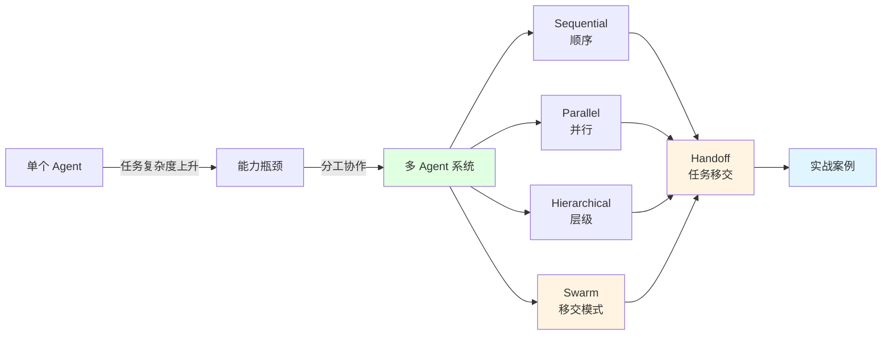
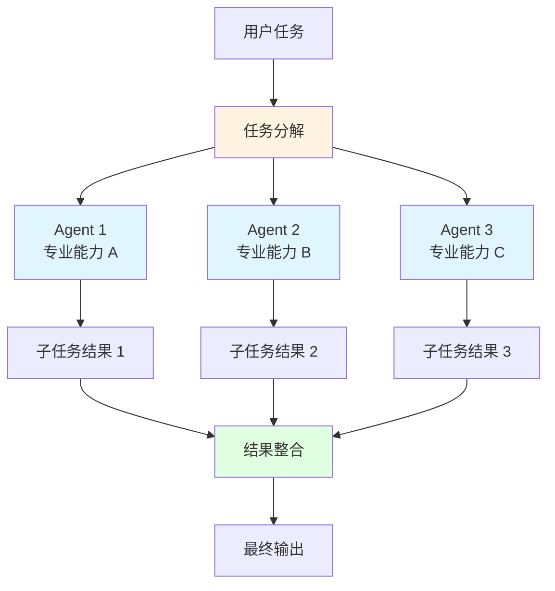
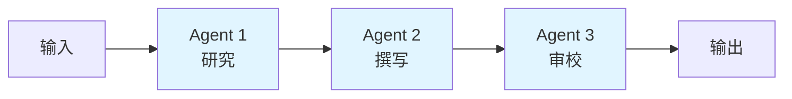
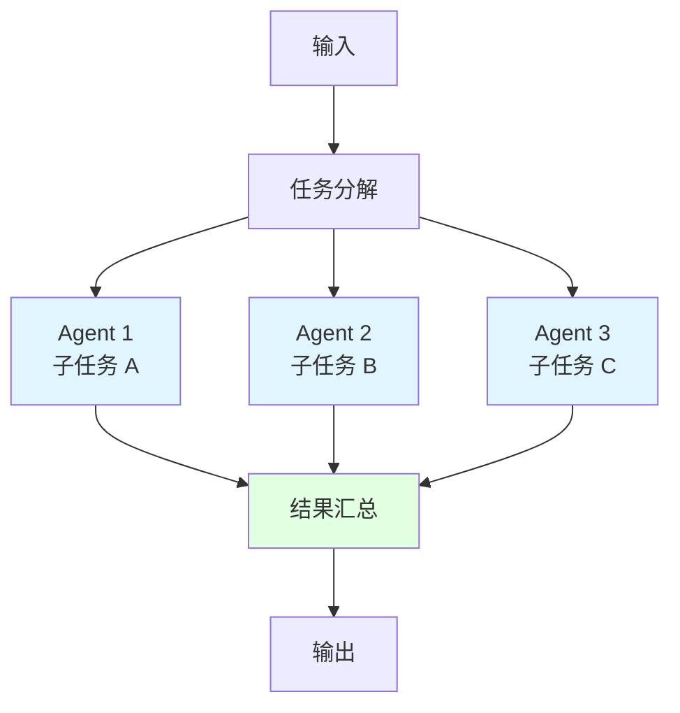
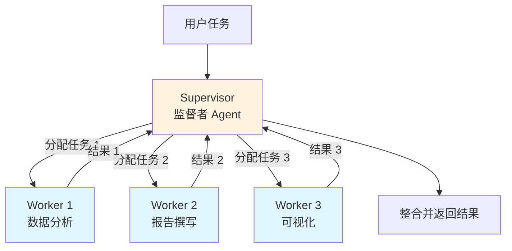
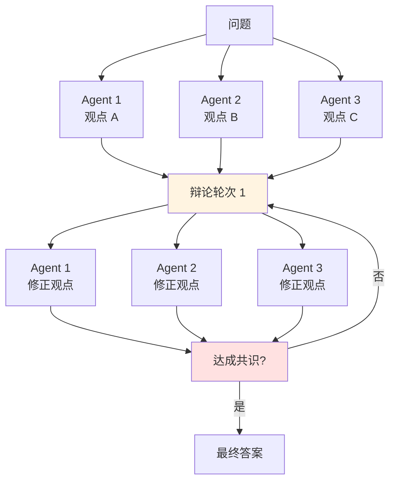
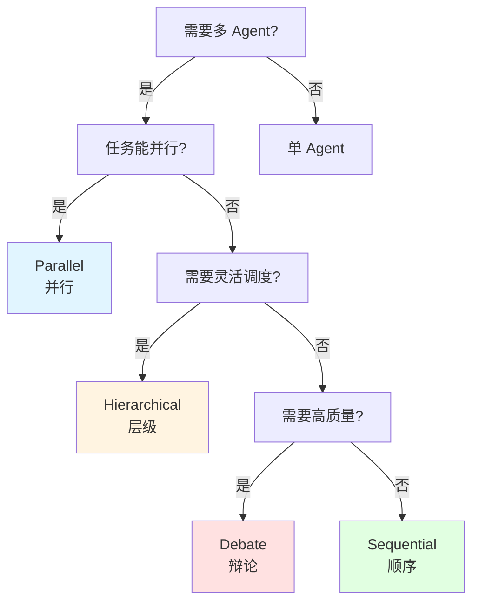
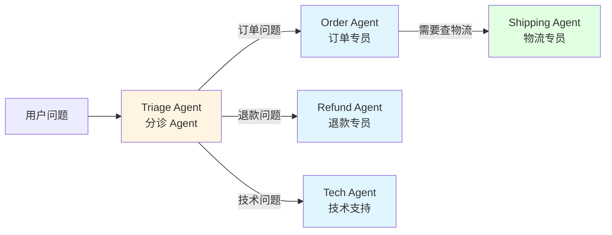
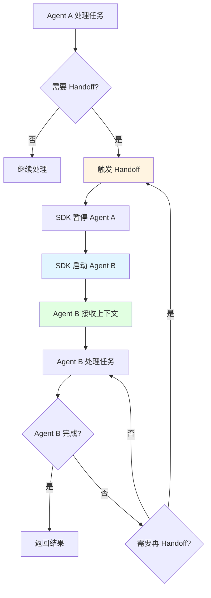

# 第 10 章：Multi-Agent

> 学完本章，你能：设计多 Agent 协作系统，实现任务分发与 Handoff

一个 AI 打工人不够用？那就组个 AI 团队！就像公司里有研发、测试、运营一样，多个 Agent 也能各司其职、互相配合。这一章我们就来看看怎么让 AI 们"团队协作"。

::: tip AI 团队 vs 一个人包办
想象你要做一个项目：
- **一个人包办**：你又要写代码、又要测试、又要写文档，累死还容易出错。
- **团队协作**：张三写代码、李四测试、王五写文档，各干各的，效率高还专业。
Agent 也一样——单个 Agent 能力有限，多个 Agent 配合才能干大事！
:::



## 10.1 多 Agent 架构 <DifficultyBadge level="advanced" /> <CostBadge cost="$0" />

> 前置知识：9.1 Agent 核心概念

### 为什么需要它？（Problem）

单个 Agent 已经很强大了，为什么还需要多个 Agent 协作？

::: tip 类比：装修房子
假如你要装修房子，你会怎么选：
- ❌ **方案 A**：找一个"全能师傅"，他会水电、木工、油漆……但每样都不精通
- ✅ **方案 B**：找专业团队，水电工、木工、油漆工各干各的，专业又高效

Agent 也一样——一个 Agent 啥都干，每样都不精；多个 Agent 分工，各展所长！
:::

**场景 1：写一篇技术博客**

单个 Agent 尝试：

```
User: "写一篇关于 RAG 的技术博客"

Agent (all-in-one):
1. 研究 RAG 技术
2. 组织文章结构  
3. 撰写内容
4. 检查语法和逻辑
5. 生成配图建议
6. 优化 SEO

问题：
- 推理链太长，容易"走神"
- 研究不够深入，因为还要顾及写作
- 写作质量下降，因为还要考虑 SEO
- 无法并行处理，效率低
```

多 Agent 协作：

```
Researcher Agent: 专注研究 RAG，提供详细资料
Writer Agent: 基于资料，专注写作质量
Reviewer Agent: 检查逻辑和语法
SEO Agent: 优化标题和关键词

优势：
- 每个 Agent 职责单一，做得更好
- 可以并行工作（研究的同时准备大纲）
- 互相审查，质量更高
```

**场景 2：客服系统**

单个 Agent 尝试：

```
User: "我的订单怎么还没发货？"

All-in-one Agent:
- 需要知道订单查询的所有知识
- 需要知道物流追踪的所有知识  
- 需要知道退款流程的所有知识
- 需要知道技术支持的所有知识

问题：
- Prompt 太长，Token 浪费
- 知识混杂，容易答错
- 无法专业化
```

多 Agent 协作：

```
Triage Agent (分诊):
  "这是订单问题，转给订单专员"
  
Order Agent (订单专员):
  查询订单 → "订单已发货，转给物流专员"
  
Shipping Agent (物流专员):
  追踪物流 → 提供详细信息

优势:
- 每个 Agent 只需要专业知识
- Prompt 短小精悍
- 可以独立优化和测试
```

**核心问题：单个 Agent 的能力上限**

| 维度 | 单个 Agent | 多 Agent 系统 |
|-----|-----------|-------------|
| **任务复杂度** | 中等 | 高 |
| **专业深度** | 泛化 | 专精 |
| **并行能力** | 无 | 有 |
| **可维护性** | 困难（职责多） | 容易（职责单一） |
| **扩展性** | 低 | 高 |
| **成本** | 单次高 | 总体可控 |

### 它是什么？（Concept）

**多 Agent 系统的核心：分工与协作**

就像一个公司，有 CEO 统筹、有各部门干活。多 Agent 系统也是这样：有的 Agent 负责协调（Supervisor），有的 Agent 负责干活（Worker）。

::: tip 类比：餐厅运作
- **老板（Supervisor）**：接待客人、分配任务、协调全局
- **厨师（Worker）**：专注做菜
- **服务员（Worker）**：专注上菜
- **收银员（Worker）**：专注结账

每个人只干自己擅长的，效率最高！
:::

**一句话总结：** 多 Agent = 有人管事（Supervisor）+ 有人干活（Worker）。



**多 Agent 协作的四种模式**

### 1. Sequential（顺序执行）

**特点：** 流水线模式，一个 Agent 完成后交给下一个



**适用场景：**
- 内容创作（研究 → 撰写 → 编辑）
- 数据处理（提取 → 清洗 → 分析）
- 软件开发（设计 → 编码 → 测试）

**优势：**
- 逻辑清晰，易于理解
- 每个阶段可以专注优化
- 容易追踪和调试

**劣势：**
- 串行执行，耗时较长
- 前一个 Agent 出错会阻塞整个流程

**代码示例：**

```python
def sequential_multi_agent(task):
    # Agent 1: 研究
    research_result = researcher_agent.run(task)
    
    # Agent 2: 撰写（基于研究结果）
    draft = writer_agent.run(f"基于以下资料写作：\n{research_result}")
    
    # Agent 3: 审校
    final = reviewer_agent.run(f"审校以下内容：\n{draft}")
    
    return final
```

### 2. Parallel（并行执行）

**特点：** 多个 Agent 同时工作，最后汇总结果



**适用场景：**
- 市场调研（多个 Agent 调研不同竞品）
- 数据收集（从多个来源并行抓取）
- 代码审查（多个 Agent 检查不同方面）

**优势：**
- 速度快，同时执行
- 互相独立，不会相互影响

**劣势：**
- 需要最终汇总逻辑
- 可能产生冲突结果

**代码示例：**

```python
import asyncio

async def parallel_multi_agent(task):
    # 并行执行多个 Agent
    results = await asyncio.gather(
        agent1.run_async(task),
        agent2.run_async(task),
        agent3.run_async(task),
    )
    
    # 汇总结果
    final = summarizer_agent.run(f"汇总以下结果：\n{results}")
    return final
```

### 3. Hierarchical（层级/监督者模式）

**特点：** 一个 Supervisor Agent 管理多个 Worker Agents



**适用场景：**
- 复杂项目管理
- 客服系统（分诊 + 专员）
- 研究报告（协调多个研究员）

**优势：**
- 清晰的指挥链
- 灵活的任务分配
- 可以动态调整计划

**劣势：**
- Supervisor 成为瓶颈
- 增加了一层抽象

**代码示例：**

```python
def hierarchical_multi_agent(task):
    supervisor = SupervisorAgent()
    workers = {
        "analyst": AnalystAgent(),
        "writer": WriterAgent(),
        "visualizer": VisualizerAgent(),
    }
    
    # Supervisor 分配任务
    plan = supervisor.plan(task)
    
    results = {}
    for step in plan:
        worker = workers[step.agent]
        results[step.agent] = worker.run(step.task)
    
    # Supervisor 整合结果
    final = supervisor.integrate(results)
    return final
```

### 4. Debate/Consensus（辩论/共识）

**特点：** 多个 Agent 通过辩论达成共识



**适用场景：**
- 复杂决策（投资建议）
- 创意生成（头脑风暴）
- 问题求解（数学证明）

**优势：**
- 多角度思考，质量高
- 互相挑战，减少错误

**劣势：**
- 耗时长，成本高
- 可能无法达成共识

**代码示例：**

```python
def debate_multi_agent(question, rounds=3):
    agents = [AgentA(), AgentB(), AgentC()]
    
    # 初始观点
    opinions = [agent.think(question) for agent in agents]
    
    # 辩论轮次
    for round in range(rounds):
        new_opinions = []
        for i, agent in enumerate(agents):
            others = opinions[:i] + opinions[i+1:]
            new_opinion = agent.debate(question, others)
            new_opinions.append(new_opinion)
        opinions = new_opinions
    
    # 达成共识
    consensus = consensus_agent.merge(opinions)
    return consensus
```

**多 Agent 通信机制**

Agent 之间如何沟通？

| 机制 | 说明 | 示例 |
|-----|------|------|
| **Shared Memory** | 共享内存/黑板 | 所有 Agent 读写同一个数据结构 |
| **Message Passing** | 消息传递 | Agent A 发消息给 Agent B |
| **Handoff** | 任务移交 | Agent A 完成后移交给 Agent B |
| **Event Bus** | 事件总线 | Agent 发布/订阅事件 |

```python
# 示例：Shared Memory
class SharedMemory:
    def __init__(self):
        self.data = {}
    
    def write(self, key, value):
        self.data[key] = value
    
    def read(self, key):
        return self.data.get(key)

# Agent 1 写入
shared_memory.write("research_result", "...")

# Agent 2 读取
research = shared_memory.read("research_result")
```

**多 Agent 系统设计原则**

✅ **单一职责（Single Responsibility）**
- 每个 Agent 只做一件事，做好一件事

✅ **松耦合（Loose Coupling）**
- Agent 之间通过接口通信，不直接依赖实现

✅ **可组合（Composable）**
- 可以灵活组合不同 Agent

✅ **可观测（Observable）**
- 记录每个 Agent 的输入输出，便于调试

✅ **容错（Fault Tolerant）**
- 一个 Agent 失败不应该导致整个系统崩溃

### 动手试试（Practice）

**概念演示：四种模式的对比**

我们用伪代码对比四种模式处理同一个任务："分析竞品并写报告"

**Sequential（顺序）：**

```python
# 串行执行
result = sequential_pipeline([
    ("research", "收集竞品信息"),
    ("analyze", "分析竞品策略"),
    ("write", "撰写分析报告"),
    ("review", "审校报告"),
])

# 耗时：10 + 8 + 12 + 5 = 35 秒
# 优点：逻辑清晰
# 缺点：耗时长
```

**Parallel（并行）：**

```python
# 并行收集多个竞品的信息
competitor_data = parallel_execute([
    ("research_A", "分析竞品 A"),
    ("research_B", "分析竞品 B"),
    ("research_C", "分析竞品 C"),
])

# 汇总
report = summarizer.run(competitor_data)

# 耗时：max(10, 12, 8) + 5 = 17 秒
# 优点：速度快
# 缺点：需要汇总逻辑
```

**Hierarchical（层级）：**

```python
# Supervisor 制定计划
supervisor = SupervisorAgent()
plan = supervisor.plan("分析竞品并写报告")

# 分配任务
results = {}
for task in plan.tasks:
    worker = get_worker(task.type)
    results[task.id] = worker.run(task)

# Supervisor 整合
final_report = supervisor.integrate(results)

# 耗时：2 + 20 + 3 = 25 秒（规划 + 执行 + 整合）
# 优点：灵活、可控
# 缺点：增加了规划开销
```

**Debate（辩论）：**

```python
# 三个 Agent 分别分析
agent_A = "从产品角度分析"
agent_B = "从营销角度分析"  
agent_C = "从技术角度分析"

# 多轮辩论
for round in range(3):
    opinions = debate_round([agent_A, agent_B, agent_C])

# 达成共识
final_report = consensus(opinions)

# 耗时：(8 * 3) * 3 + 5 = 77 秒（3 轮 × 3 个 Agent）
# 优点：质量高、全面
# 缺点：耗时长、成本高
```

**选择决策树：**



### 5. OpenAI Swarm 模式（Routines + Handoffs）

**特点：** 轻量级教育框架,用"例程"和"移交"实现 Agent 协作

::: tip 什么是 Swarm?
OpenAI 在 2024 年开源了 [Swarm](https://github.com/openai/swarm),一个**实验性的教育框架**,专门用来探索多 Agent 协作模式。它不是生产级产品,但展示了 OpenAI 对多 Agent 的设计思路。

核心理念:**让 Agent 协作像写函数一样简单**
:::

**两个核心概念:**

1. **Routines（例程）** = Instructions（指令）+ Tools（工具）
   - 就像一个员工的"岗位职责说明书"
   - 定义了这个 Agent 会做什么、怎么做

2. **Handoffs（移交）** = 从一个 Agent 转交给另一个 Agent
   - 就像客服把问题"转接"给专家
   - Agent 主动决定何时移交、移交给谁



**代码示例（Swarm 风格）：**

```python
from swarm import Swarm, Agent

# 定义 Agent
triage_agent = Agent(
    name="Triage Agent",
    instructions="你是客服分诊员,根据问题类型转接到对应专员",
    functions=[transfer_to_order, transfer_to_refund, transfer_to_tech]
)

order_agent = Agent(
    name="Order Agent", 
    instructions="你是订单专员,处理订单查询、修改、取消等问题",
    functions=[query_order, cancel_order, transfer_to_shipping]
)

shipping_agent = Agent(
    name="Shipping Agent",
    instructions="你是物流专员,提供物流追踪和配送信息",
    functions=[track_shipment]
)

# Handoff 函数（移交）
def transfer_to_order():
    """转接到订单专员"""
    return order_agent

def transfer_to_shipping():
    """转接到物流专员"""  
    return shipping_agent

# 执行
client = Swarm()
response = client.run(
    agent=triage_agent,
    messages=[{"role": "user", "content": "我的订单什么时候发货?"}]
)
```

**执行流程：**

```
1. User → Triage Agent
   "我的订单什么时候发货?"
   
2. Triage Agent 分析 → 调用 transfer_to_order()
   
3. → Order Agent 接手
   查询订单状态 → "已发货,转给物流专员"
   
4. Order Agent 调用 transfer_to_shipping()
   
5. → Shipping Agent 接手
   追踪物流 → 返回详细信息
```

**与传统模式的对比：**

| 维度 | Hierarchical（层级） | Swarm（移交） |
|-----|---------------------|--------------|
| **控制方式** | Supervisor 集中控制 | Agent 自主决策移交 |
| **职责边界** | Supervisor 分配任务 | Agent 自己判断是否移交 |
| **灵活性** | 中等（需修改 Supervisor） | 高（修改单个 Agent） |
| **复杂度** | 需要 Supervisor 规划逻辑 | 每个 Agent 只管自己 |
| **适用场景** | 任务规划清晰的场景 | 动态决策、对话式场景 |

**为什么 Swarm 适合对话式 AI?**

```python
# 传统 Hierarchical 需要预判所有可能路径
supervisor.plan([
    "if 订单问题 → Order Agent",
    "if 订单问题 + 物流 → Order → Shipping",
    "if 退款问题 → Refund Agent",
    # ... 需要穷举所有路径
])

# Swarm 让每个 Agent 自主决策
order_agent.instructions = """
处理订单问题。
如果用户问到物流,调用 transfer_to_shipping() 移交。
"""
# 简单、灵活、易维护
```

### 6. OpenAI Agents SDK Handoff（官方实现）

::: tip Swarm vs Agents SDK
- **Swarm**：实验性教育框架,展示概念
- **Agents SDK v2**：生产级 SDK,Handoff 是一等公民
  
Swarm 证明了 Handoff 模式的价值,所以 OpenAI 把它内置到了官方 SDK！
:::

**Agents SDK v2 的 Handoff 原语**

OpenAI Agents SDK（从 v2 开始）将 Handoff 作为**内置原语**,不再需要自己实现移交逻辑。

**核心 API：**

```python
from openai import OpenAI
from openai.agents import Agent, Handoff

client = OpenAI()

# 定义 Handoff（移交规则）
handoff_to_specialist = Handoff(
    target_agent="specialist_agent_id",
    condition="当用户问题需要专业知识时"
)

# 创建 Agent 时声明 Handoff
general_agent = client.agents.create(
    name="General Agent",
    instructions="你是通用助手,遇到专业问题转给专家",
    handoffs=[handoff_to_specialist]  # 声明可以移交给谁
)

specialist_agent = client.agents.create(
    name="Specialist Agent", 
    instructions="你是专业领域专家"
)

# 执行（SDK 自动处理 Handoff）
thread = client.threads.create()
client.threads.messages.create(
    thread_id=thread.id,
    role="user",
    content="我有一个复杂的技术问题..."
)

run = client.threads.runs.create(
    thread_id=thread.id,
    agent_id=general_agent.id
)

# SDK 会自动检测 Handoff 并切换 Agent
```

**Handoff 的生命周期：**



**Handoff 与 Function Calling 的区别**

很多人会困惑：Handoff 和 Function Calling 有什么区别？

| 维度 | Function Calling | Handoff |
|-----|-----------------|---------|
| **目的** | 调用外部工具/API | 转交控制权给另一个 Agent |
| **返回值** | 返回到原 Agent | 不返回（或返回给用户） |
| **上下文** | 调用完成后继续原流程 | 移交后由新 Agent 继续 |
| **用途** | 查数据、执行操作 | 换一个"大脑"处理 |

```python
# Function Calling：调用工具,然后回来
agent.run("查一下天气")
→ 调用 get_weather() 
→ Agent 收到结果继续处理
→ "北京今天晴,20°C"

# Handoff：移交控制权
general_agent.run("帮我做财务规划")  
→ 触发 handoff_to_financial_expert
→ 财务专家 Agent 接手
→ "让我来帮你做详细的财务分析..."
```

**实战示例：客服系统**

```python
from openai import OpenAI

client = OpenAI()

# 1. 创建专家 Agents
order_agent = client.agents.create(
    name="Order Specialist",
    instructions="专门处理订单相关问题:查询、修改、取消",
    tools=[query_order_tool, cancel_order_tool]
)

refund_agent = client.agents.create(
    name="Refund Specialist", 
    instructions="专门处理退款相关问题",
    tools=[process_refund_tool]
)

# 2. 创建主 Agent（带 Handoff）
main_agent = client.agents.create(
    name="Customer Service",
    instructions="""
    你是客服助手。
    - 订单问题 → 移交给 Order Specialist
    - 退款问题 → 移交给 Refund Specialist
    - 简单问题自己处理
    """,
    handoffs=[
        Handoff(target_agent=order_agent.id, condition="订单相关"),
        Handoff(target_agent=refund_agent.id, condition="退款相关")
    ]
)

# 3. 用户对话
thread = client.threads.create()

# 用户问题
client.threads.messages.create(
    thread_id=thread.id,
    role="user", 
    content="我的订单 #12345 什么时候发货?"
)

# SDK 自动处理：main_agent → order_agent
run = client.threads.runs.create(
    thread_id=thread.id,
    agent_id=main_agent.id
)

# 查看结果（order_agent 的回复）
messages = client.threads.messages.list(thread_id=thread.id)
```

**Handoff 的最佳实践**

✅ **明确移交条件**
```python
# ❌ 不好：条件模糊
handoff = Handoff(target_agent=expert, condition="复杂问题")

# ✅ 好：条件具体
handoff = Handoff(
    target_agent=expert, 
    condition="当用户询问技术实现细节、架构设计或性能优化时"
)
```

✅ **携带必要上下文**
```python
# Agent 在移交时应该总结关键信息
instructions = """
移交前,总结用户问题的关键点:
- 问题类型
- 已提供的信息  
- 用户期望
"""
```

✅ **避免循环移交**
```python
# ❌ 不好：可能死循环
agent_A.handoffs = [handoff_to_B]
agent_B.handoffs = [handoff_to_A]

# ✅ 好：设计清晰的流程
agent_A.handoffs = [handoff_to_B]  
agent_B.handoffs = [handoff_to_C]  # 或返回结果
```

✅ **监控 Handoff 链路**
```python
# 记录 Handoff 路径便于调试
def log_handoff(from_agent, to_agent, reason):
    print(f"{from_agent} → {to_agent}: {reason}")
    
# User → Triage → Order → Shipping
```

**Swarm vs Agents SDK：该用哪个？**

| 场景 | 推荐方案 |
|-----|---------|
| **学习 Handoff 概念** | Swarm（代码简单,概念清晰） |
| **原型验证** | Swarm（快速搭建） |
| **生产环境** | Agents SDK（官方支持,稳定可靠） |
| **需要高级功能**（线程管理、状态持久化等） | Agents SDK |
| **简单脚本** | Swarm（依赖少） |

<ColabBadge path="demos/10-multi-agent/architectures.ipynb" />

### 小结（Reflection）

- **解决了什么**：理解了为什么需要多 Agent，以及六种主要的协作模式（包括 OpenAI 的现代化方案）
- **没解决什么**：知道了模式，但还不知道如何在实际项目中实现完整的 Handoff 机制——下一节介绍 Handoff 的深入实现
- **关键要点**：
  1. **单 Agent 有能力上限**：复杂任务需要分工协作
  2. **传统协作模式**：Sequential（顺序）、Parallel（并行）、Hierarchical（层级）、Debate（辩论）
  3. **现代 Handoff 模式**：
     - **Swarm**：轻量级教育框架，用 Routines + Handoffs 实现 Agent 自主移交
     - **Agents SDK**：生产级方案，Handoff 作为一等公民内置到 SDK
  4. **选择模式看场景**：
     - 能并行就并行（Parallel）
     - 需要灵活调度用层级（Hierarchical）
     - 对话式场景用 Handoff（Swarm/Agents SDK）
     - 追求质量用辩论（Debate）
  5. **Handoff vs Function Calling**：
     - Function Calling = 调用工具后返回
     - Handoff = 转交控制权，换"大脑"
  6. **设计原则**：单一职责、松耦合、可组合、可观测、容错
  7. **通信机制**：Shared Memory、Message Passing、Handoff、Event Bus

**从理论到实践：**
- 理解了架构模式，包括 OpenAI 推荐的 Handoff 模式
- Swarm 适合学习和原型，Agents SDK 适合生产环境
- 下一步是深入实现完整的 Handoff 系统

---

## 过渡：当 Agent 需要跨平台协作

学完多 Agent 协作，你可能会遇到一个现实问题：

> **你公司用 Cursor，合作方用 Claude，另一个团队用 LangChain——它们的 Agent 怎么互相调用工具？**

答案是：目前不能。因为每家的 API 格式、工具定义方式都不一样。就好比安卓充电口、苹果 Lightning、老诺基亚的圆孔——你出门得带三根线。

**这就是"协议"要解决的问题。**

类比一下：
| 现实世界 | AI 世界 |
|---------|--------|
| USB-C 统一了充电口 | **MCP** 统一了 AI 工具接口 |
| 快递公司之间的转运协议 | **A2A** 让不同 Agent 互相协作 |
| 国际物流标准 | **ANP** 实现大规模 Agent 网络互联 |

**下一章只需要你理解一个核心思想：协议 = 大家约定好的沟通格式。** 就像你和外卖小哥约定"放门口"一样简单——只不过是 AI 之间的"放门口"。

::: tip 别慌
第 11 章重理解轻实操。你不需要从零实现一个协议，只需要知道"它是什么"和"什么时候用"就够了。
:::

---

*最后更新：2026-02-20*
