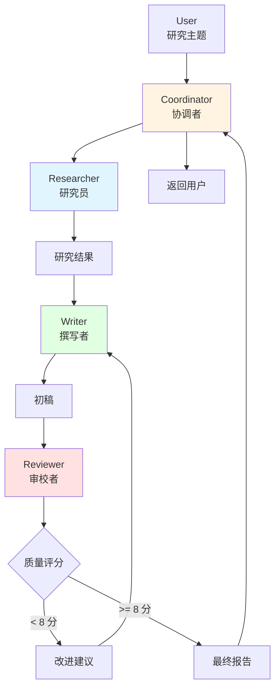

# 10.3 实战：多 Agent 研究系统 <DifficultyBadge level="advanced" /> <CostBadge cost="$0.20" />

> 前置知识：10.1 多 Agent 架构、10.2 Sub-Agent 与 Handoff

终于到实战环节了！前面我们学了理论，现在来造一个真正能用的系统——**AI 研究报告生成系统**。想象一下，你只要说"帮我研究一下 AI Agent 市场"，然后系统自动：研究员去搜资料、作家写报告、审稿员检查质量，最后给你一份专业报告！

::: tip 类比：杂志社的工作流程
- **记者（Researcher）**：出去采访、收集资料
- **作家（Writer）**：根据资料写文章
- **编辑（Reviewer）**：审稿、提意见、决定是否发表
- **主编（Coordinator）**：协调整个流程

我们要做的系统就是这样的"AI 杂志社"！
:::

### 为什么需要它？（Problem）

前面我们学习了 Handoff 机制，构建了一个简单的客服系统。现在让我们挑战一个**更复杂、更真实**的场景。

**场景：AI 研究报告生成系统**

任务："写一份关于'2026 年 AI Agent 市场趋势'的研究报告"

**如果用单个 Agent：**

```
All-in-one Agent:
1. 搜索资料（广度不够）
2. 分析数据（深度不够）
3. 撰写报告（质量不够）
4. 审校润色（标准不清）

问题：
- 推理链太长，容易"走神"
- 每个环节都是浅尝辄止
- 没有互相审查，质量无保障
- 无法并行，耗时太长
```

**如果用多 Agent 协作：**

```
Researcher Agent (研究员):
  - 深度搜索和分析资料
  - 提取关键数据和趋势
  - 专注信息的准确性和全面性

Writer Agent (撰写者):
  - 组织文章结构
  - 将研究结果转化为流畅的文字
  - 专注可读性和逻辑性

Reviewer Agent (审校者):
  - 检查事实准确性
  - 审查逻辑一致性
  - 提出改进建议
  - 专注质量保证

优势:
- 每个 Agent 专精一个领域
- 可以多轮迭代，互相反馈
- 质量显著提升
```

**核心挑战：**
1. **如何协调多个 Agent？** Researcher → Writer → Reviewer 的流程
2. **如何处理反馈？** Reviewer 提出修改意见后，如何返回给 Writer？
3. **如何避免无限循环？** 什么时候停止迭代？
4. **如何追踪进度？** 知道当前在哪一步，已完成多少？

::: warning 真实项目的坑
多 Agent 系统最容易遇到的问题：
- **无限循环**：Reviewer 说不行，Writer 改了，Reviewer 还是说不行……（得设上限）
- **上下文爆炸**：每个 Agent 都要完整上下文，Token 费用爆炸（得用共享内存）
- **协调复杂**：Agent 越多，沟通成本越高（别搞太复杂）
:::

**一句话总结：** 多 Agent 实战的核心挑战 = 协调流程 + 处理反馈 + 防止失控。

### 它是什么？（Concept）

**多 Agent 研究系统架构**



**系统组件：**

1. **Coordinator（协调者）**
   - 接收用户任务
   - 分配给 Researcher
   - 追踪整体进度
   - 返回最终结果

2. **Researcher（研究员）**
   - 搜索相关资料
   - 分析数据和趋势
   - 生成研究摘要
   - 工具：搜索引擎、数据库

3. **Writer（撰写者）**
   - 基于研究结果撰写报告
   - 组织结构和逻辑
   - 确保可读性
   - 可以多次修改

4. **Reviewer（审校者）**
   - 评估报告质量（1-10 分）
   - 检查事实准确性
   - 提出具体改进建议
   - 决定是否需要返工

**工作流程：**

```
[Step 1] User 提交研究主题
         ↓
[Step 2] Coordinator 分配给 Researcher
         ↓
[Step 3] Researcher 搜索资料、分析数据
         ↓
[Step 4] Researcher Handoff 给 Writer（附带研究结果）
         ↓
[Step 5] Writer 撰写初稿
         ↓
[Step 6] Writer Handoff 给 Reviewer
         ↓
[Step 7] Reviewer 评估质量
         ↓
         ├─ 如果 score >= 8 → 完成，返回给 Coordinator
         └─ 如果 score < 8 → Handoff 回 Writer（附带修改建议）
                             ↓
                      [Step 5] Writer 修改（最多 3 轮）
```

**关键设计要点：**

✅ **单向流 + 反馈循环**
- 主流程：Researcher → Writer → Reviewer → Done
- 反馈流：Reviewer → Writer（最多 3 次）

✅ **质量门禁**
- Reviewer 评分决定是否通过
- 低于 8 分自动返工

✅ **防止无限循环**
- 最多 3 轮修改
- 超过 3 轮强制通过

✅ **上下文共享**
- Shared Memory 保存研究结果
- 所有 Agent 可以访问

### 动手试试（Practice）

我们来构建这个完整的研究系统。

**第 1 步：定义 Shared Memory**

```python
class SharedMemory:
    """
    共享内存，供所有 Agent 访问
    """
    def __init__(self):
        self.data = {
            "topic": None,
            "research_findings": None,
            "draft_version": 0,
            "current_draft": None,
            "review_feedback": [],
            "final_report": None,
        }
    
    def set(self, key: str, value):
        self.data[key] = value
        print(f"📝 Memory updated: {key}")
    
    def get(self, key: str):
        return self.data.get(key)
    
    def increment_version(self):
        self.data["draft_version"] += 1
        return self.data["draft_version"]
    
    def add_feedback(self, feedback: str, score: int):
        self.data["review_feedback"].append({
            "feedback": feedback,
            "score": score,
            "version": self.data["draft_version"],
        })

# 初始化共享内存
shared_memory = SharedMemory()
```

**第 2 步：定义工具函数**

```python
import requests
from typing import List, Dict

def search_web(query: str) -> str:
    """
    搜索互联网（简化版）
    实际应用中应该使用 Tavily、Serper 等专业搜索 API
    """
    # 这里用 Wikipedia API 作为示例
    try:
        url = f"https://en.wikipedia.org/api/rest_v1/page/summary/{query.replace(' ', '_')}"
        response = requests.get(url)
        if response.status_code == 200:
            data = response.json()
            return data.get("extract", "No information found")
        return "No information found"
    except:
        return "Search failed"

def save_research_findings(findings: str) -> str:
    """
    保存研究结果到共享内存
    """
    shared_memory.set("research_findings", findings)
    return "Research findings saved"

def get_research_findings() -> str:
    """
    获取研究结果
    """
    findings = shared_memory.get("research_findings")
    if findings:
        return findings
    return "No research findings available"

def save_draft(draft: str) -> str:
    """
    保存草稿
    """
    version = shared_memory.increment_version()
    shared_memory.set("current_draft", draft)
    return f"Draft v{version} saved"

def get_current_draft() -> str:
    """
    获取当前草稿
    """
    draft = shared_memory.get("current_draft")
    version = shared_memory.get("draft_version")
    if draft:
        return f"[Version {version}]\n\n{draft}"
    return "No draft available"

def get_review_history() -> str:
    """
    获取审校历史
    """
    feedback = shared_memory.get("review_feedback")
    if not feedback:
        return "No review history"
    
    history = []
    for i, fb in enumerate(feedback, 1):
        history.append(f"Review {i} (v{fb['version']}): Score {fb['score']}/10\n{fb['feedback']}")
    
    return "\n\n".join(history)

def save_review(feedback: str, score: int) -> str:
    """
    保存审校意见
    """
    shared_memory.add_feedback(feedback, score)
    return f"Review saved with score {score}/10"

TOOL_MAP = {
    "search_web": search_web,
    "save_research_findings": save_research_findings,
    "get_research_findings": get_research_findings,
    "save_draft": save_draft,
    "get_current_draft": get_current_draft,
    "get_review_history": get_review_history,
    "save_review": save_review,
}
```

**第 3 步：创建 Researcher Agent**

```python
from openai import OpenAI

client = OpenAI()

researcher = client.beta.assistants.create(
    name="Research Specialist",
    instructions="""You are a thorough research specialist.

Your job:
1. Search for information about the given topic
2. Analyze trends, data, and key insights
3. Organize findings into a structured research summary
4. Save the findings and hand off to Writer

Research Structure:
- Executive Summary (2-3 sentences)
- Key Findings (3-5 bullet points)
- Trends Analysis
- Data & Statistics
- Conclusions

Be comprehensive but concise. Focus on facts and data.""",
    model="gpt-4.1-mini",
    tools=[
        {
            "type": "function",
            "function": {
                "name": "search_web",
                "description": "Search the web for information",
                "parameters": {
                    "type": "object",
                    "properties": {
                        "query": {"type": "string"}
                    },
                    "required": ["query"],
                },
            },
        },
        {
            "type": "function",
            "function": {
                "name": "save_research_findings",
                "description": "Save research findings to shared memory",
                "parameters": {
                    "type": "object",
                    "properties": {
                        "findings": {"type": "string"}
                    },
                    "required": ["findings"],
                },
            },
        },
    ],
    handoffs=[
        {
            "type": "handoff",
            "target": "writer",
            "description": "Hand off to writer after completing research"
        }
    ],
)
```

**第 4 步：创建 Writer Agent**

```python
writer = client.beta.assistants.create(
    name="Content Writer",
    instructions="""You are a skilled content writer.

Your job:
1. Get research findings from memory
2. Write a well-structured, engaging report
3. If this is a revision, review previous feedback and improve accordingly
4. Save the draft and hand off to Reviewer

Report Structure:
- Title
- Executive Summary
- Introduction
- Main Body (with subheadings)
- Key Insights
- Conclusion

Writing Guidelines:
- Clear and professional tone
- Logical flow
- Use data from research
- 800-1200 words
- Include specific examples

If revising:
- Address all feedback points
- Explain what you changed""",
    model="gpt-4.1-mini",
    tools=[
        {
            "type": "function",
            "function": {
                "name": "get_research_findings",
                "description": "Get research findings from memory",
                "parameters": {"type": "object", "properties": {}},
            },
        },
        {
            "type": "function",
            "function": {
                "name": "get_review_history",
                "description": "Get previous review feedback",
                "parameters": {"type": "object", "properties": {}},
            },
        },
        {
            "type": "function",
            "function": {
                "name": "save_draft",
                "description": "Save draft to memory",
                "parameters": {
                    "type": "object",
                    "properties": {
                        "draft": {"type": "string"}
                    },
                    "required": ["draft"],
                },
            },
        },
    ],
    handoffs=[
        {
            "type": "handoff",
            "target": "reviewer",
            "description": "Hand off to reviewer after completing draft"
        }
    ],
)
```

**第 5 步：创建 Reviewer Agent**

```python
reviewer = client.beta.assistants.create(
    name="Quality Reviewer",
    instructions="""You are a meticulous quality reviewer.

Your job:
1. Read the current draft
2. Evaluate quality on multiple dimensions
3. Provide a score (1-10) and specific feedback
4. If score >= 8: approve and hand off to coordinator
5. If score < 8 AND draft_version < 3: hand off to writer for revision
6. If draft_version >= 3: approve anyway (max iterations reached)

Evaluation Criteria:
- Accuracy: Are facts correct?
- Completeness: All key points covered?
- Clarity: Is it easy to understand?
- Structure: Logical organization?
- Engagement: Interesting to read?

Feedback Format:
Score: X/10

Strengths:
- ...

Areas for Improvement:
- [Specific issue 1]
- [Specific issue 2]

Suggestions:
- [Specific suggestion 1]
- [Specific suggestion 2]

Be constructive and specific.""",
    model="gpt-4.1-mini",
    tools=[
        {
            "type": "function",
            "function": {
                "name": "get_current_draft",
                "description": "Get the current draft",
                "parameters": {"type": "object", "properties": {}},
            },
        },
        {
            "type": "function",
            "function": {
                "name": "save_review",
                "description": "Save review feedback and score",
                "parameters": {
                    "type": "object",
                    "properties": {
                        "feedback": {"type": "string"},
                        "score": {"type": "integer", "minimum": 1, "maximum": 10},
                    },
                    "required": ["feedback", "score"],
                },
            },
        },
    ],
    handoffs=[
        {
            "type": "handoff",
            "target": "writer",
            "description": "Hand off back to writer for revision if score < 8"
        },
        {
            "type": "handoff",
            "target": "coordinator",
            "description": "Hand off to coordinator if approved"
        },
    ],
)
```

**第 6 步：创建 Coordinator Agent**

```python
coordinator = client.beta.assistants.create(
    name="Project Coordinator",
    instructions="""You are the project coordinator for a research report system.

Your job:
1. Receive the research topic from the user
2. Hand off to Researcher to start the process
3. When the report is approved, present it to the user

You manage the overall workflow but delegate all actual work to specialists.""",
    model="gpt-4.1-mini",
    handoffs=[
        {
            "type": "handoff",
            "target": "researcher",
            "description": "Hand off to researcher to start research"
        }
    ],
)
```

**第 7 步：运行完整系统**

```python
def run_research_system(topic: str, verbose: bool = True):
    """
    运行完整的研究系统
    """
    # 初始化
    shared_memory.set("topic", topic)
    
    # 创建线程
    thread = client.beta.threads.create()
    
    # 用户消息
    client.beta.threads.messages.create(
        thread_id=thread.id,
        role="user",
        content=f"Please create a research report on: {topic}"
    )
    
    if verbose:
        print(f"\n{'='*80}")
        print(f"🎯 Research Topic: {topic}")
        print(f"{'='*80}\n")
    
    # 从 Coordinator 开始
    current_agent = coordinator.id
    agent_map = {
        coordinator.id: ("Coordinator", coordinator),
        researcher.id: ("Researcher", researcher),
        writer.id: ("Writer", writer),
        reviewer.id: ("Reviewer", reviewer),
    }
    
    step = 0
    max_steps = 20  # 防止无限循环
    
    while step < max_steps:
        step += 1
        agent_name = agent_map[current_agent][0]
        
        if verbose:
            print(f"\n[Step {step}] Running {agent_name}...")
        
        # 运行 Agent
        run = client.beta.threads.runs.create(
            thread_id=thread.id,
            assistant_id=current_agent,
        )
        
        # 轮询
        while True:
            run_status = client.beta.threads.runs.retrieve(
                thread_id=thread.id,
                run_id=run.id,
            )
            
            # 需要执行工具
            if run_status.status == "requires_action":
                tool_outputs = []
                
                for tool_call in run_status.required_action.submit_tool_outputs.tool_calls:
                    func_name = tool_call.function.name
                    func_args = eval(tool_call.function.arguments)
                    
                    if verbose:
                        print(f"  🔧 {func_name}({func_args})")
                    
                    result = TOOL_MAP[func_name](**func_args)
                    
                    if verbose and len(result) < 100:
                        print(f"  ✓ {result}")
                    
                    tool_outputs.append({
                        "tool_call_id": tool_call.id,
                        "output": result,
                    })
                
                client.beta.threads.runs.submit_tool_outputs(
                    thread_id=thread.id,
                    run_id=run.id,
                    tool_outputs=tool_outputs,
                )
            
            # 需要 Handoff
            elif run_status.status == "requires_handoff":
                handoff = run_status.required_handoff
                target = handoff.target
                
                # 找到目标 Agent
                target_agent = None
                for agent_id, (name, agent) in agent_map.items():
                    if name.lower() == target.lower():
                        target_agent = agent_id
                        break
                
                if verbose:
                    print(f"  🔄 Handoff to {target}")
                
                # 切换 Agent
                current_agent = target_agent
                
                # 确认 Handoff
                client.beta.threads.runs.submit_handoff(
                    thread_id=thread.id,
                    run_id=run.id,
                    handoff_id=handoff.id,
                )
                break
            
            # 完成
            elif run_status.status == "completed":
                # 检查是否是最终完成（Coordinator 完成）
                if current_agent == coordinator.id and step > 1:
                    if verbose:
                        print(f"\n{'='*80}")
                        print(f"✅ Research system completed!")
                        print(f"{'='*80}\n")
                    
                    # 获取最终报告
                    final_draft = shared_memory.get("current_draft")
                    return {
                        "status": "success",
                        "report": final_draft,
                        "steps": step,
                        "versions": shared_memory.get("draft_version"),
                        "feedback_count": len(shared_memory.get("review_feedback")),
                    }
                break
            
            # 失败
            elif run_status.status in ["failed", "cancelled", "expired"]:
                print(f"❌ {agent_name} {run_status.status}")
                return {"status": "error", "message": run_status.status}
            
            import time
            time.sleep(1)
    
    return {"status": "timeout", "message": "Max steps reached"}
```

**第 8 步：测试完整系统**

```python
# 运行研究系统
result = run_research_system(
    topic="AI Agent市场趋势 2026",
    verbose=True
)

# 输出结果
print("\n" + "="*80)
print("📊 System Statistics:")
print("="*80)
print(f"Status: {result['status']}")
print(f"Total Steps: {result['steps']}")
print(f"Draft Versions: {result['versions']}")
print(f"Review Rounds: {result['feedback_count']}")

print("\n" + "="*80)
print("📄 Final Report:")
print("="*80)
print(result['report'])
```

**运行结果示例：**

```
================================================================================
🎯 Research Topic: AI Agent市场趋势 2026
================================================================================

[Step 1] Running Coordinator...
  🔄 Handoff to researcher

[Step 2] Running Researcher...
  🔧 search_web({'query': 'AI Agent market trends 2026'})
  🔧 search_web({'query': 'autonomous AI agents'})
  🔧 search_web({'query': 'AI agent adoption enterprise'})
  🔧 save_research_findings({...})
  ✓ Research findings saved
  🔄 Handoff to writer

[Step 3] Running Writer...
  🔧 get_research_findings({})
  🔧 save_draft({...})
  📝 Memory updated: draft_version
  ✓ Draft v1 saved
  🔄 Handoff to reviewer

[Step 4] Running Reviewer...
  🔧 get_current_draft({})
  🔧 save_review({'feedback': '...', 'score': 7})
  📝 Memory updated: review_feedback
  ✓ Review saved with score 7/10
  🔄 Handoff to writer

[Step 5] Running Writer...
  🔧 get_research_findings({})
  🔧 get_review_history({})
  🔧 save_draft({...})
  📝 Memory updated: draft_version
  ✓ Draft v2 saved
  🔄 Handoff to reviewer

[Step 6] Running Reviewer...
  🔧 get_current_draft({})
  🔧 save_review({'feedback': '...', 'score': 9})
  📝 Memory updated: review_feedback
  ✓ Review saved with score 9/10
  🔄 Handoff to coordinator

[Step 7] Running Coordinator...

================================================================================
✅ Research system completed!
================================================================================

================================================================================
📊 System Statistics:
================================================================================
Status: success
Total Steps: 7
Draft Versions: 2
Review Rounds: 2

================================================================================
📄 Final Report:
================================================================================
[The final report content would appear here...]
```

<ColabBadge path="demos/10-multi-agent/research_system.ipynb" />

### 小结（Reflection）

- **解决了什么**：构建了一个完整的多 Agent 协作系统，实现了研究→撰写→审校的闭环
- **没解决什么**：本章完成，下一章进入协议篇（MCP、OpenAPI 等）
- **关键要点**：
  1. **Shared Memory 是协作基础**：所有 Agent 共享状态和数据
  2. **质量门禁控制流程**：Reviewer 的评分决定是否继续迭代
  3. **防止无限循环**：设置最大迭代次数
  4. **清晰的职责分工**：Researcher、Writer、Reviewer 各司其职
  5. **可追踪的执行流程**：记录每一步的 Handoff 和工具调用

**多 Agent 系统设计经验：**

✅ **Do（推荐做）：**
1. 单一职责：每个 Agent 专注一件事
2. 明确的 Handoff 条件：什么时候移交，移交给谁
3. 共享内存：避免重复传递大量数据
4. 设置上限：防止无限循环和成本失控
5. 详细日志：便于调试和优化

❌ **Don't（避免做）：**
1. Agent 职责重叠：导致混乱
2. 复杂的循环：难以调试
3. 无限迭代：成本爆炸
4. 缺少协调者：流程难以控制
5. 忽略错误处理：系统不稳定

**真实应用场景：**

| 场景 | Agent 配置 | 预期效果 |
|-----|-----------|---------|
| **内容创作** | Research + Write + Review | 提升质量 50% |
| **代码审查** | Analyzer + Reviewer + Fixer | 减少 bug 70% |
| **市场调研** | Multiple Researchers + Synthesizer | 覆盖面 3x |
| **客户服务** | Triage + Specialists | 解决率 90%+ |
| **教育辅导** | Tutor + Explainer + Quiz Master | 学习效率 2x |

**第 10 章总结 ✅**

你已经掌握了多 Agent 系统的完整知识：
- ✅ 10.1 多 Agent 架构 - 四种协作模式
- ✅ 10.2 Sub-Agent 与 Handoff - 任务移交机制
- ✅ 10.3 实战：多 Agent 研究系统 - 完整的真实案例

**下一步：第 11 章 - 协议篇（MCP、OpenAPI 等）**

学习如何让 Agent 与外部系统标准化对接。

---

*最后更新：2026-02-20*
