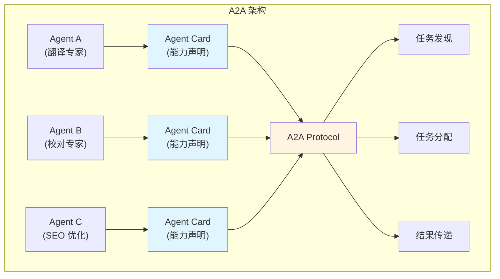
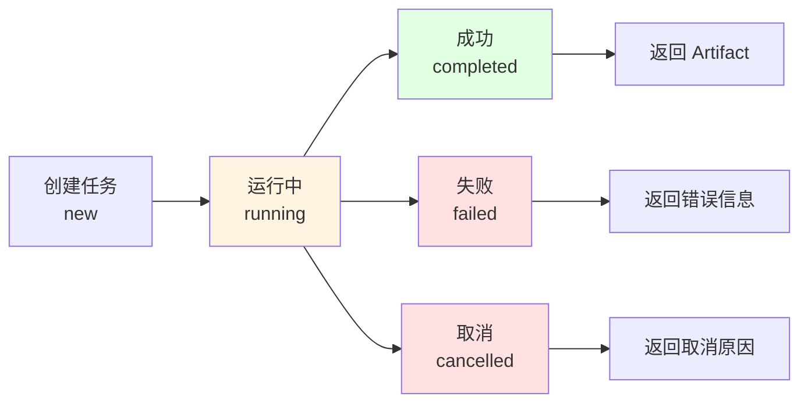

# 11.2 A2A 协议 <DifficultyBadge level="advanced" /> <CostBadge cost="$0" />

> 前置知识:11.1 MCP 协议详解、10.1 多 Agent 架构

### 为什么需要它?(Problem)

**问题:MCP 解决了"AI 调工具",但"AI 调 AI"呢?**

我们在第 10 章学了多 Agent 协作,但有个关键问题:

```
场景:你有一个翻译 Agent 和一个校对 Agent

传统做法:
┌──────────────────────────────────┐
│ 你的代码(硬编码协调逻辑)          │
│                                  │
│ 1. 调用翻译 Agent                │
│ 2. 解析翻译结果                  │
│ 3. 构造校对 Agent 的输入         │
│ 4. 调用校对 Agent                │
│ 5. 解析校对结果                  │
│ ...                              │
└──────────────────────────────────┘

问题:
❌ 协调逻辑写死在代码里
❌ 新增 Agent 需要修改协调代码
❌ Agent 之间无法"自我发现"
❌ 没有统一的通信格式
```

**真实案例:多 Agent 协作的困境**

```python
# 场景:内容创作流水线

# Agent 1:研究员
research_result = researcher_agent.run("研究 RAG 技术")

# Agent 2:作家(需要手动拼接输入)
article = writer_agent.run(f"""
    请基于以下研究资料写一篇博客:
    
    {research_result}
    
    要求:
    - 2000 字左右
    - 包含代码示例
    - 面向初学者
""")

# Agent 3:编辑(又要手动拼接)
final_article = editor_agent.run(f"""
    请审校以下文章:
    
    {article}
    
    检查:
    - 语法错误
    - 逻辑连贯性
    - 专业术语准确性
""")

# 问题:
# 1. 每个 Agent 的"接口"都不同,需要手动适配
# 2. 无法动态发现 Agent 的能力
# 3. 无法标准化任务传递
# 4. 难以追踪任务状态
```

**A2A 的核心问题:Agent 之间如何"互联互通"?**

类比互联网:
- **HTTP 之前**:每个网站自定义协议,互相访问很困难
- **HTTP 之后**:统一协议,任何网站都能互相访问

Agent 世界也需要一个"HTTP":
- **A2A 之前**:每个 Agent 自定义接口,协作需要硬编码
- **A2A 之后**:统一协议,Agent 之间可以自由协作

### 它是什么?(Concept)

**A2A = Agent-to-Agent Protocol(Agent 对 Agent 协议)**

A2A 是 Google 在 2025 年 1 月推出的开放协议,并于 2025 年初转由 **Linux Foundation** 治理,目标是**标准化 Agent 之间的通信和协作**。



**核心组件:**

| 组件 | 作用 | 类比 |
|-----|------|-----|
| **Agent Card** | Agent 的"名片",描述能力(基于 JSON 的标准化能力清单) | API 文档 |
| **Task** | 任务的标准格式 | HTTP Request |
| **Artifact** | 任务的输出格式 | HTTP Response |
| **Part** | Artifact 的组成单元 | Response Body |

**重要更新:**
- **ACP 合并**:IBM 和 Bee AI 推出的 ACP(Agent Communication Protocol)在 2025 年初合并到 A2A 规范中,避免标准分裂
- **Agent Cards**:作为 JSON 格式的能力清单,已成为 Agent 发现的标准化机制
- **SSE 流式传输**:支持 Server-Sent Events,可实时推送任务进度
- **生态发展**:截至 2026 年初,已有 **50+ 技术合作伙伴** 加入 A2A 生态

**Agent Card:Agent 的"自我介绍"**

每个 Agent 通过 Agent Card 声明自己的能力:

```json
{
  "name": "translator_agent",
  "description": "专业的中英文翻译 Agent",
  "version": "1.0.0",
  "capabilities": [
    {
      "name": "translate",
      "description": "翻译文本",
      "input_schema": {
        "type": "object",
        "properties": {
          "text": {
            "type": "string",
            "description": "待翻译的文本"
          },
          "from": {
            "type": "string",
            "enum": ["zh", "en"],
            "description": "源语言"
          },
          "to": {
            "type": "string",
            "enum": ["zh", "en"],
            "description": "目标语言"
          }
        },
        "required": ["text", "from", "to"]
      },
      "output_schema": {
        "type": "object",
        "properties": {
          "translated_text": {
            "type": "string",
            "description": "翻译后的文本"
          },
          "confidence": {
            "type": "number",
            "description": "翻译置信度"
          }
        }
      }
    }
  ],
  "author": "your-team",
  "contact": "team@example.com"
}
```

**任务生命周期:**



**Task:标准化任务格式**

```json
{
  "id": "task_123",
  "agent_id": "translator_agent",
  "capability": "translate",
  "input": {
    "text": "Hello, world!",
    "from": "en",
    "to": "zh"
  },
  "status": "running",
  "created_at": "2026-02-20T10:00:00Z",
  "updated_at": "2026-02-20T10:00:05Z"
}
```

**Artifact:标准化输出格式**

```json
{
  "task_id": "task_123",
  "status": "completed",
  "parts": [
    {
      "type": "text",
      "content": "你好,世界!"
    },
    {
      "type": "metadata",
      "content": {
        "confidence": 0.95,
        "model": "gpt-4",
        "cost": 0.002
      }
    }
  ],
  "completed_at": "2026-02-20T10:00:10Z"
}
```

**Parts:支持多种类型**

| Part 类型 | 说明 | 示例 |
|----------|------|-----|
| **text** | 文本内容 | 翻译结果、总结 |
| **image** | 图片(base64) | 生成的图表 |
| **file** | 文件引用 | 生成的 PDF、Excel |
| **metadata** | 元数据 | 置信度、成本、耗时 |
| **error** | 错误信息 | 失败原因 |

**A2A 协作流程:**

```mermaid
sequenceDiagram
    participant User as 用户/协调器
    participant AgentA as Agent A<br/>(翻译)
    participant AgentB as Agent B<br/>(校对)
    
    User->>AgentA: 1. GET /card (获取能力)
    AgentA->>User: Agent Card
    
    User->>AgentA: 2. POST /tasks (创建翻译任务)
    AgentA->>User: Task ID
    
    User->>AgentA: 3. GET /tasks/{id} (查询状态)
    AgentA->>User: status: running
    
    User->>AgentA: 4. GET /tasks/{id} (查询状态)
    AgentA->>User: status: completed + Artifact
    
    User->>AgentB: 5. POST /tasks (创建校对任务,输入是 A 的 Artifact)
    AgentB->>User: Task ID
    
    User->>AgentB: 6. GET /tasks/{id}
    AgentB->>User: status: completed + Artifact
    
    style AgentA fill:#e1f5ff
    style AgentB fill:#fff4e1
```

**A2A API 规范:**

```
核心端点:

GET  /card          - 获取 Agent Card(能力发现)
POST /tasks         - 创建任务(基于任务的工作流模型)
GET  /tasks/{id}    - 查询任务状态(支持 SSE 实时进度)
GET  /artifacts/{id} - 获取任务输出
POST /tasks/{id}/cancel - 取消任务

实时进度(SSE):
GET  /tasks/{id}/stream - 通过 Server-Sent Events 推送任务进度
```

**完整示例:翻译 + 校对流程**

```python
import requests

# 1. 查询翻译 Agent 的能力
card = requests.get("http://translator-agent.com/card").json()
print(f"Agent: {card['name']}")
print(f"能力: {card['capabilities']}")

# 2. 创建翻译任务
task = requests.post("http://translator-agent.com/tasks", json={
    "capability": "translate",
    "input": {
        "text": "Hello, world!",
        "from": "en",
        "to": "zh"
    }
}).json()

task_id = task["id"]

# 3. 轮询任务状态
import time
while True:
    status = requests.get(f"http://translator-agent.com/tasks/{task_id}").json()
    if status["status"] == "completed":
        break
    time.sleep(1)

# 4. 获取翻译结果
artifact = status["artifact"]
translated_text = artifact["parts"][0]["content"]
print(f"翻译结果: {translated_text}")

# 5. 将翻译结果传递给校对 Agent
review_task = requests.post("http://reviewer-agent.com/tasks", json={
    "capability": "review",
    "input": {
        "text": translated_text,
        "language": "zh"
    }
}).json()

# 6. 获取校对结果
review_id = review_task["id"]
while True:
    review_status = requests.get(f"http://reviewer-agent.com/tasks/{review_id}").json()
    if review_status["status"] == "completed":
        break
    time.sleep(1)

final_text = review_status["artifact"]["parts"][0]["content"]
print(f"最终结果: {final_text}")
```

**A2A vs MCP:**

| 维度 | MCP | A2A |
|-----|-----|-----|
| **目标** | AI 调工具 | Agent 调 Agent |
| **场景** | LLM 需要外部能力(天气、数据库) | Agent 之间协作(翻译→校对) |
| **通信** | JSON-RPC(同步为主) | REST API(异步为主) |
| **能力声明** | Tools/Resources/Prompts | Agent Card |
| **状态管理** | 无状态 | 有任务生命周期 |
| **复杂度** | 简单(单次调用) | 复杂(多步协作) |

**A2A 的优势:**

✅ **标准化接口**:所有 Agent 都用相同的 API 格式
✅ **能力发现**:通过 Agent Card(JSON 格式)自动发现 Agent 的能力
✅ **异步支持**:适合长时间运行的任务,支持 SSE 实时进度推送
✅ **可组合**:Agent 可以灵活组合成工作流(基于任务的模型)
✅ **可观测**:任务状态可追踪,便于调试
✅ **开放治理**:Linux Foundation 托管,中立的社区驱动发展

**A2A 的挑战:**

⚠️ **协议复杂**:比 MCP 复杂,学习成本高
⚠️ **生态早期**:2025 年 1 月才发布,虽有 50+ 合作伙伴但整体生态仍在建设中
⚠️ **网络开销**:基于 HTTP,有网络延迟
⚠️ **协调器必要**:需要一个"指挥官"来协调 Agent

### 动手试试(Practice)

**概念演示:A2A 协作模式**

我们用伪代码演示 A2A 的典型使用场景:

**场景 1:串行协作(翻译 → 校对)**

```python
# 协调器 Orchestrator
class A2AOrchestrator:
    def run_pipeline(self, text):
        # 1. 翻译
        translate_task = self.create_task(
            agent="translator_agent",
            capability="translate",
            input={"text": text, "from": "en", "to": "zh"}
        )
        
        translate_result = self.wait_for_completion(translate_task)
        
        # 2. 校对(使用翻译结果)
        review_task = self.create_task(
            agent="reviewer_agent",
            capability="review",
            input={"text": translate_result["translated_text"]}
        )
        
        return self.wait_for_completion(review_task)

# 使用
orchestrator = A2AOrchestrator()
result = orchestrator.run_pipeline("Hello, world!")
print(result)
```

**场景 2:并行协作(多个研究员同时调研)**

```python
class A2AOrchestrator:
    def parallel_research(self, topics):
        # 并行创建多个任务
        tasks = []
        for topic in topics:
            task = self.create_task(
                agent="researcher_agent",
                capability="research",
                input={"topic": topic}
            )
            tasks.append(task)
        
        # 等待所有任务完成
        results = [self.wait_for_completion(task) for task in tasks]
        
        # 汇总
        summary_task = self.create_task(
            agent="summarizer_agent",
            capability="summarize",
            input={"documents": results}
        )
        
        return self.wait_for_completion(summary_task)

# 使用
orchestrator = A2AOrchestrator()
result = orchestrator.parallel_research(["RAG", "Fine-tuning", "Prompt Engineering"])
print(result)
```

**场景 3:动态发现 Agent**

```python
class A2AOrchestrator:
    def discover_agents(self):
        # 从注册中心获取所有 Agent
        agents = self.registry.list_agents()
        
        for agent in agents:
            card = self.get_agent_card(agent)
            print(f"Agent: {card['name']}")
            print(f"能力: {[c['name'] for c in card['capabilities']]}")
    
    def find_agent_by_capability(self, capability_name):
        agents = self.registry.list_agents()
        for agent in agents:
            card = self.get_agent_card(agent)
            for capability in card['capabilities']:
                if capability['name'] == capability_name:
                    return agent
        return None

# 使用
orchestrator = A2AOrchestrator()
orchestrator.discover_agents()

# 动态查找翻译 Agent
translator = orchestrator.find_agent_by_capability("translate")
print(f"找到翻译 Agent: {translator}")
```

**完整示例在 Notebook 中:**

<ColabBadge path="demos/11-protocols/protocols_overview.ipynb" />

### 小结(Reflection)

- **解决了什么**:理解了 A2A 如何标准化 Agent 之间的通信,实现"Agent 调 Agent"
- **没解决什么**:A2A 是点对点协作,但如果有成百上千个 Agent 呢?大规模 Agent 网络如何管理?——下一节介绍 ANP 协议
- **关键要点**:
  1. **A2A 是 Agent 互联协议**:让 Agent 之间可以标准化通信和协作
  2. **Agent Card 是核心**:Agent 通过 Card 声明自己的能力,实现"自我发现"
  3. **任务生命周期**:new → running → completed/failed/cancelled
  4. **异步优先**:适合长时间运行的任务
  5. **与 MCP 互补**:MCP 解决"AI 调工具",A2A 解决"Agent 调 Agent"
  6. **需要协调器**:A2A 本身不提供自动协调,需要一个"指挥官"

**关键洞察:**
- A2A 的设计类似 RESTful API,容易理解和实现
- A2A 更适合**异步、长时间运行**的任务(研究、创作、分析)
- A2A 在 2025 年初转由 **Linux Foundation** 治理,保证中立性和开放性
- **ACP → A2A 合并**:IBM/Bee AI 的 ACP 协议已合并入 A2A,统一了 Agent 通信标准
- **Agent Cards** 成为标准化的能力发现机制,类似服务网格中的服务注册
- **50+ 技术伙伴**加入生态,包括云服务商、AI 框架、企业级平台等

---

*最后更新:2026-02-22*
