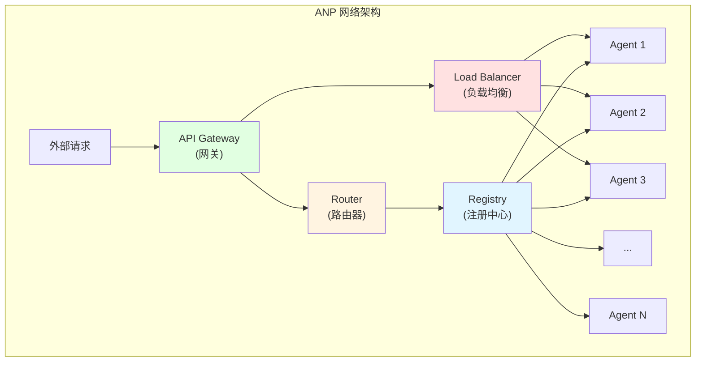
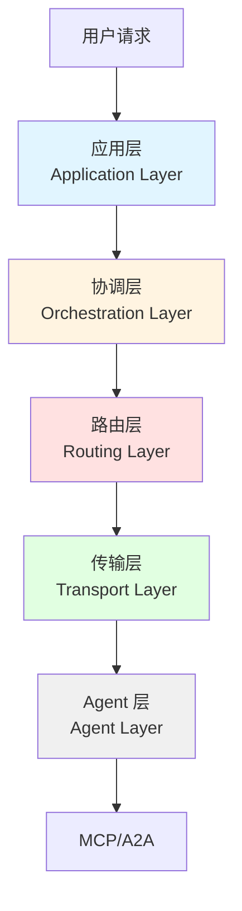

# 11.3 ANP 协议 <DifficultyBadge level="advanced" /> <CostBadge cost="$0" />

> A2A 让两个 Agent 握手，但 100 个 Agent 怎么开派对？ANP 来搭建 **Agent 互联网**！

> 前置知识:11.2 A2A 协议

### 为什么需要它?(Problem)

::: warning Agent 村变 Agent 城
**场景：**你的公司有 100 个 Agent，就像一个村子突然变成城市...

**A2A（点对点）= 村子时代**
- 张三找李四：敲门就行
- 10 个人互相认识，没问题

**ANP（大规模网络）= 城市时代**
- 100 万人找彼此：需要 GPS、电话簿、导航
- 没有基础设施就是一团乱麻
:::

**问题:A2A 是点对点,但大规模 Agent 网络怎么办?**

想象一个场景:

```
你的公司有 100 个 Agent:
- 10 个数据分析 Agent
- 20 个内容创作 Agent
- 15 个客服 Agent
- 30 个研发 Agent
- 25 个销售支持 Agent

问题:
❌ A2A 是点对点,如何让 100 个 Agent 互相发现?
❌ 如何管理 Agent 的注册和注销?
❌ 如何负载均衡(10 个数据分析 Agent 选哪个)?
❌ 如何处理 Agent 故障和容错?
❌ 如何跨组织协作(你的 Agent 调用其他公司的 Agent)?
```

**真实场景:Agent 互联网**

类比互联网的发展:

| 阶段 | 互联网 | Agent 世界 |
|-----|--------|-----------|
| **1.0** | 局域网(点对点) | 单个团队内的 Agent(A2A) |
| **2.0** | 互联网(路由、DNS) | 跨组织的 Agent 网络(ANP) |
| **3.0** | Web 2.0(搜索、社交) | Agent 市场、生态 |

A2A 解决了"局域网"的问题,但要实现"Agent 互联网",需要:

1. **服务发现**:类似 DNS,找到提供特定能力的 Agent
2. **路由**:类似 IP 路由,跨网络传递请求
3. **负载均衡**:类似 Load Balancer,分配任务到多个 Agent
4. **容错**:类似冗余备份,一个 Agent 挂了自动切换
5. **安全**:类似 HTTPS,确保通信安全
6. **计费**:类似云服务,按使用量计费

**ANP 的核心问题:如何让成千上万个 Agent 协同工作?**

### 它是什么?(Concept)

::: tip 类比时间：互联网的进化
**早期互联网（A2A）：**
- 两台电脑直连：插根网线就行
- 10 台电脑：弄个路由器

**现代互联网（ANP）：**
- 全球几十亿设备：需要 DNS、路由协议、CDN、负载均衡...
- 这才是真正的"互联网"

**ANP = Agent 的互联网时代** 🌐
:::

**ANP = Agent Network Protocol(Agent 网络协议)**

ANP 是 IBM Research 在 2024 年底提出的协议规范,目标是**构建大规模 Agent 互联网络**。



**核心组件:**

| 组件 | 作用 | 类比 |
|-----|------|-----|
| **Registry** | Agent 注册中心 | DNS 服务器 |
| **Router** | 路由请求到合适的 Agent | IP 路由器 |
| **Load Balancer** | 负载均衡 | Nginx/HAProxy |
| **Gateway** | 统一入口 | API Gateway |
| **Monitor** | 监控和健康检查 | Prometheus |
| **Broker** | 消息队列 | RabbitMQ/Kafka |

**ANP 架构层级:**



**层级说明:**

1. **应用层**:定义业务逻辑和工作流
2. **协调层**:管理任务分解和结果汇总
3. **路由层**:选择合适的 Agent 处理任务
4. **传输层**:处理网络通信(HTTP/gRPC/WebSocket)
5. **Agent 层**:实际执行任务的 Agent(基于 MCP/A2A)

**ANP 核心概念:**

### 1. Agent Registry(注册中心)

```json
// Agent 注册信息
{
  "agent_id": "translator_001",
  "name": "高级翻译 Agent",
  "capabilities": ["translate", "proofread"],
  "languages": ["zh", "en", "ja"],
  "endpoint": "https://translator.example.com",
  "health_check": "https://translator.example.com/health",
  "status": "online",
  "load": 0.3,  // 当前负载 30%
  "pricing": {
    "model": "pay-per-use",
    "rate": 0.01  // $0.01 per request
  },
  "metadata": {
    "region": "us-west",
    "version": "2.0.1",
    "owner": "acme-corp"
  }
}
```

### 2. Service Discovery(服务发现)

```python
# 查询能提供翻译能力的 Agent
agents = registry.find_agents(
    capability="translate",
    filters={
        "languages": ["zh", "en"],
        "load": {"$lt": 0.5},  # 负载 < 50%
        "status": "online"
    },
    sort_by="load"  # 按负载排序
)

# 返回:
# [
#   {"agent_id": "translator_001", "load": 0.3},
#   {"agent_id": "translator_002", "load": 0.4},
# ]
```

### 3. Smart Routing(智能路由)

```python
class ANPRouter:
    def route_task(self, task):
        # 1. 查找可用 Agent
        agents = self.registry.find_agents(
            capability=task.capability
        )
        
        # 2. 路由策略选择
        if self.strategy == "round_robin":
            agent = self.round_robin(agents)
        elif self.strategy == "least_load":
            agent = min(agents, key=lambda a: a.load)
        elif self.strategy == "geo_proximity":
            agent = self.nearest_agent(agents, task.region)
        
        # 3. 发送任务
        return agent.execute(task)
```

### 4. Fault Tolerance(容错机制)

```python
class ANPExecutor:
    def execute_with_retry(self, task, max_retries=3):
        for attempt in range(max_retries):
            try:
                agent = self.router.route_task(task)
                result = agent.execute(task)
                return result
            except AgentFailure as e:
                # Agent 故障,标记为 offline
                self.registry.mark_offline(agent.id)
                
                if attempt < max_retries - 1:
                    # 重试:选择另一个 Agent
                    continue
                else:
                    raise TaskFailure(f"任务失败,已重试 {max_retries} 次")
```

**ANP 工作流程:**

```mermaid
sequenceDiagram
    participant User as 用户
    participant Gateway as API Gateway
    participant Router as Router
    participant Registry as Registry
    participant Agent1 as Agent 1
    participant Agent2 as Agent 2
    
    User->>Gateway: 请求翻译
    Gateway->>Router: 转发请求
    Router->>Registry: 查询可用 Agent
    Registry->>Router: [Agent1(负载 30%), Agent2(负载 50%)]
    Router->>Router: 选择 Agent1(负载更低)
    Router->>Agent1: 发送任务
    Agent1->>Agent1: 执行任务
    Agent1->>Router: 返回结果
    Router->>Gateway: 返回结果
    Gateway->>User: 返回结果
    
    style Router fill:#fff4e1
    style Registry fill:#e1f5ff
    style Agent1 fill:#e1ffe1
```

**ANP vs A2A vs MCP:**

| 维度 | MCP | A2A | ANP |
|-----|-----|-----|-----|
| **目标** | AI 调工具 | Agent 调 Agent | 大规模 Agent 网络 |
| **规模** | 单个 AI + 多个工具 | 少数 Agent 协作 | 成百上千 Agent |
| **通信** | JSON-RPC(同步) | REST(异步) | 分布式(异步) |
| **发现** | 无 | Agent Card | Registry + Router |
| **路由** | 无 | 手动指定 | 智能路由 |
| **容错** | 无 | 需自己实现 | 内置重试、故障转移 |
| **负载均衡** | 无 | 无 | 支持 |
| **计费** | 无 | 无 | 支持 |
| **复杂度** | 低 | 中 | 高 |

**ANP 的优势:**

✅ **大规模支持**:可管理成千上万个 Agent
✅ **智能路由**:根据负载、地理位置、能力自动选择 Agent
✅ **高可用**:自动故障转移和重试
✅ **可扩展**:水平扩展,加机器就能提升能力
✅ **跨组织**:支持不同组织的 Agent 互联互通

**ANP 的挑战:**

⚠️ **复杂度高**:需要部署 Registry、Router、Gateway 等基础设施
⚠️ **尚在提案阶段**:ANP 规范还在讨论中,没有官方实现
⚠️ **生态缺失**:没有成熟的工具和平台
⚠️ **学习成本**:需要理解分布式系统的概念

### 动手试试(Practice)

**概念演示:ANP 网络架构**

由于 ANP 还在提案阶段,我们用伪代码演示核心概念:

**场景 1:Agent 注册**

```python
# Agent 启动时注册到 Registry
class TranslatorAgent:
    def __init__(self):
        self.agent_id = "translator_001"
        self.capabilities = ["translate", "proofread"]
    
    def register(self, registry_url):
        # 向注册中心注册
        response = requests.post(f"{registry_url}/agents/register", json={
            "agent_id": self.agent_id,
            "capabilities": self.capabilities,
            "endpoint": "https://my-agent.com",
            "health_check": "https://my-agent.com/health"
        })
        print(f"注册成功: {response.json()}")
    
    def heartbeat(self, registry_url):
        # 定期发送心跳
        while True:
            requests.post(f"{registry_url}/agents/{self.agent_id}/heartbeat", json={
                "status": "online",
                "load": self.get_current_load()
            })
            time.sleep(30)  # 每 30 秒一次
```

**场景 2:智能路由**

```python
class ANPRouter:
    def __init__(self, registry):
        self.registry = registry
        self.strategies = {
            "round_robin": self.round_robin,
            "least_load": self.least_load,
            "geo_proximity": self.geo_proximity
        }
    
    def route(self, task, strategy="least_load"):
        # 1. 查找可用 Agent
        agents = self.registry.find_agents(
            capability=task.capability,
            status="online"
        )
        
        if not agents:
            raise NoAvailableAgent(f"没有可用的 Agent 提供 {task.capability}")
        
        # 2. 应用路由策略
        selected_agent = self.strategies[strategy](agents, task)
        
        # 3. 发送任务
        return self.send_task(selected_agent, task)
    
    def least_load(self, agents, task):
        # 选择负载最低的 Agent
        return min(agents, key=lambda a: a.load)
    
    def geo_proximity(self, agents, task):
        # 选择地理位置最近的 Agent
        user_region = task.metadata.get("region", "us-west")
        return min(agents, key=lambda a: self.distance(a.region, user_region))
```

**场景 3:容错和重试**

```python
class ANPExecutor:
    def __init__(self, router, max_retries=3):
        self.router = router
        self.max_retries = max_retries
    
    async def execute(self, task):
        for attempt in range(self.max_retries):
            try:
                # 选择 Agent
                agent = self.router.route(task)
                
                # 执行任务(带超时)
                result = await asyncio.wait_for(
                    agent.execute(task),
                    timeout=60
                )
                
                return result
            
            except (AgentTimeout, AgentFailure) as e:
                print(f"尝试 {attempt + 1} 失败: {e}")
                
                # 标记 Agent 为不可用
                self.router.registry.mark_unhealthy(agent.id)
                
                if attempt < self.max_retries - 1:
                    # 重试
                    await asyncio.sleep(2 ** attempt)  # 指数退避
                    continue
                else:
                    raise TaskExecutionFailed(f"任务失败,已重试 {self.max_retries} 次")
```

**场景 4:负载均衡**

```python
class ANPLoadBalancer:
    def __init__(self, registry):
        self.registry = registry
        self.round_robin_index = {}
    
    def balance(self, capability):
        # 获取所有可用 Agent
        agents = self.registry.find_agents(
            capability=capability,
            status="online"
        )
        
        # 过滤负载过高的 Agent
        available_agents = [
            a for a in agents
            if a.load < 0.8  # 负载 < 80%
        ]
        
        if not available_agents:
            # 如果所有 Agent 都高负载,选择负载最低的
            return min(agents, key=lambda a: a.load)
        
        # Round Robin
        if capability not in self.round_robin_index:
            self.round_robin_index[capability] = 0
        
        index = self.round_robin_index[capability]
        agent = available_agents[index % len(available_agents)]
        
        self.round_robin_index[capability] += 1
        
        return agent
```

**完整示例在 Notebook 中:**

<ColabBadge path="demos/11-protocols/protocols_overview.ipynb" />

### 小结(Reflection)

- **解决了什么**:理解了 ANP 如何解决大规模 Agent 网络的管理问题
- **没解决什么**:三大协议(MCP、A2A、ANP)到底怎么选?它们是竞争还是互补?——下一节介绍协议生态全景
- **关键要点**:
  1. **ANP 是 Agent 互联网协议**:解决大规模 Agent 网络的管理、路由、容错
  2. **核心组件**:Registry(注册)、Router(路由)、Load Balancer(负载均衡)、Gateway(网关)
  3. **分层架构**:应用层 → 协调层 → 路由层 → 传输层 → Agent 层
  4. **智能路由**:根据负载、地理位置、能力自动选择 Agent
  5. **高可用**:自动故障转移、重试、健康检查
  6. **尚在提案阶段**:ANP 规范还在讨论中,生态正在建设

::: tip 一句话总结
**ANP = Agent 互联网，让成千上万个 Agent 像互联网一样协同工作，有 DNS、路由、负载均衡。**
:::

**关键洞察:**
- ANP 的设计类似**微服务架构**,将 Agent 当作服务来管理
- ANP 更适合**企业级、大规模**的 Agent 部署场景
- ANP 不是取代 MCP/A2A,而是构建在它们之上的**网络层**

---

*最后更新:2026-02-20*
