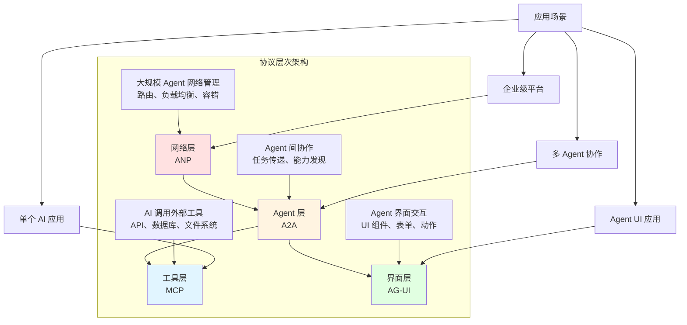
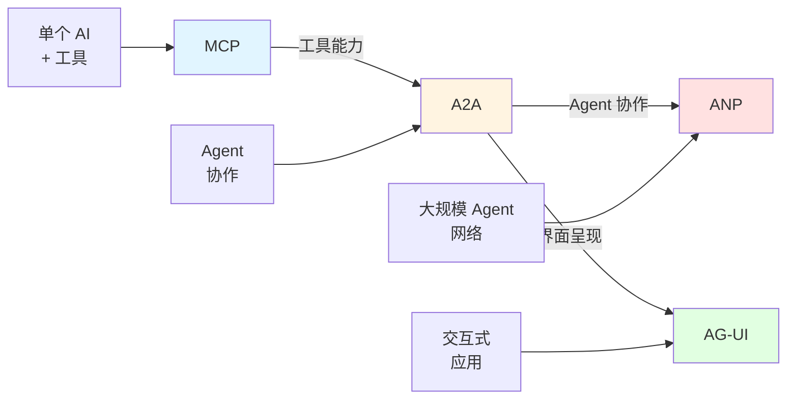
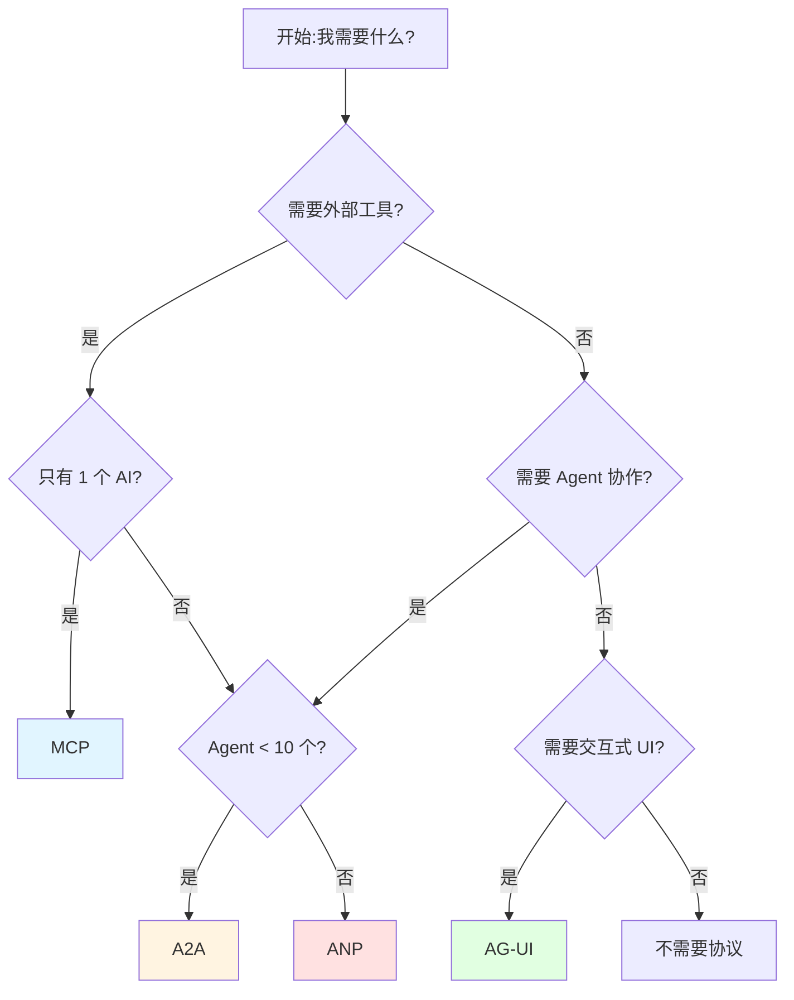

# 11.4 协议生态全景 <DifficultyBadge level="intermediate" /> <CostBadge cost="$0" />

> 前置知识:11.1 MCP、11.2 A2A、11.3 ANP

### 为什么需要它?(Problem)

**问题:三大协议到底怎么选?**

学完前三节,你可能有这些困惑:

```
❓ MCP、A2A、ANP 是竞争关系吗?
❓ 我的项目应该用哪个协议?
❓ 能不能同时用多个协议?
❓ 这些协议会互相取代吗?
```

**真实场景:选型困惑**

```python
# 场景 1:简单的天气查询
"Claude,北京今天天气怎么样?"
→ 用哪个协议?

# 场景 2:翻译 + 校对工作流
text → 翻译 Agent → 校对 Agent → 输出
→ 用哪个协议?

# 场景 3:企业级 Agent 平台
1000 个 Agent,跨部门协作,需要负载均衡和容错
→ 用哪个协议?
```

答案:**它们不是竞争,而是互补的不同层!**

### 它是什么?(Concept)

**三层协议模型:工具层 → Agent 层 → 界面层 → 网络层**



**每一层解决不同的问题:**

| 层级 | 协议 | 解决的问题 | 类比 |
|-----|------|-----------|-----|
| **工具层** | MCP | AI 如何调用外部工具 | USB 协议(连接设备) |
| **Agent 层** | A2A | Agent 之间如何协作 | HTTP(网页间通信) |
| **界面层** | AG-UI | Agent 如何交互式呈现 UI | HTML(网页展示) |
| **网络层** | ANP | 大规模 Agent 如何管理 | TCP/IP(互联网基础) |

**新增协议层:**
- **AG-UI**(详见 [11.5 节](./ag-ui.md)):Agent 可以动态生成 UI 组件,实现交互式应用
- **A2UI**:A2A 协议的 UI 扩展,支持 Agent 返回可交互界面
- **MCP Apps**:基于 MCP 的应用封装概念,将 MCP Server 打包为独立应用单元

**它们是递进和互补关系:**



**具体对比:**

### 1. 能力范围

```
MCP (工具层):
┌──────────────────────────┐
│  Claude  →  天气 API      │
│  Claude  →  数据库        │
│  Claude  →  文件系统      │
└──────────────────────────┘
聚焦:单个 AI 调用多个工具

A2A (Agent 层):
┌──────────────────────────┐
│  翻译 Agent → 校对 Agent  │
│  研究 Agent → 写作 Agent  │
│  分析 Agent → 可视化 Agent│
└──────────────────────────┘
聚焦:Agent 之间的协作
注:ACP(IBM/Bee AI)已合并入 A2A

AG-UI (界面层):
┌──────────────────────────┐
│  Agent → 动态表单        │
│  Agent → 数据可视化组件   │
│  Agent → 交互式仪表盘     │
└──────────────────────────┘
聚焦:Agent 生成可交互界面

ANP (网络层):
┌──────────────────────────┐
│  Registry (注册中心)      │
│  Router (智能路由)        │
│  Load Balancer (负载均衡) │
│  Gateway (统一入口)       │
└──────────────────────────┘
聚焦:大规模 Agent 网络管理
```

### 2. 通信模式

| 维度 | MCP | A2A | AG-UI | ANP |
|-----|-----|-----|-------|-----|
| **模式** | 同步 RPC | 异步 REST | UI 组件流 | 分布式消息 |
| **状态** | 无状态 | 有任务状态 | 有界面状态 | 有 Agent 状态 |
| **发现** | 无(预定义) | Agent Card | UI Schema | Registry |
| **超时** | 短(秒级) | 中(分钟级) | 实时交互 | 长(小时级) |

### 3. 适用场景

**MCP 适合:**

✅ 单个 AI 应用需要外部能力
✅ 工具数量不多(几个到几十个)
✅ 同步调用,快速返回
✅ 本地或简单远程工具

**示例:**
```python
# Claude Desktop 调用本地文件系统
"请帮我整理桌面的文件"
→ MCP Server (filesystem) 执行本地操作
```

**A2A 适合:**

✅ 多个 Agent 协作完成复杂任务
✅ Agent 数量中等(几个到几十个)
✅ 异步任务,可能耗时较长
✅ 需要能力发现和任务状态追踪

**示例:**
```python
# 内容创作流水线
用户输入 → 研究 Agent → 写作 Agent → 编辑 Agent → 输出
(每个 Agent 通过 A2A 协议通信)
```

**AG-UI 适合:**

✅ Agent 需要与用户交互式对话
✅ 动态生成表单、图表等 UI 组件
✅ 实时反馈和调整(如配置向导)
✅ 可视化工作流和结果展示

**示例:**
```python
# 数据分析向导
Agent 生成配置表单 → 用户选择参数 → Agent 展示可视化结果
(通过 AG-UI 协议返回交互式组件)
```

**ANP 适合:**

✅ 大规模 Agent 网络(成百上千个)
✅ 跨部门、跨组织协作
✅ 需要负载均衡、容错、监控
✅ 企业级平台和生态系统

**示例:**
```python
# 企业 Agent 平台
- 100 个数据分析 Agent
- 50 个客服 Agent
- 30 个研发 Agent
→ ANP 提供统一管理、路由、监控
```

### 4. 协议栈示例

**场景 1:简单查询(只用 MCP)**

```
用户: "北京今天天气?"
 ↓
Claude (LLM)
 ↓
MCP Client
 ↓
MCP Server (天气 API)
 ↓
外部天气服务
```

**场景 2:多 Agent 协作(MCP + A2A + AG-UI)**

```
用户: "写一篇 RAG 技术博客"
 ↓
协调器
 ↓
A2A → 研究 Agent
       ↓
       MCP → 搜索引擎、数据库
 ↓
A2A → 写作 Agent
       ↓
       MCP → 语法检查工具
 ↓
A2A → 编辑 Agent
 ↓
AG-UI → 返回可交互预览界面(实时编辑、反馈)
 ↓
最终输出
```

**场景 3:企业平台(MCP + A2A + ANP)**

```
用户: "分析本季度销售数据"
 ↓
ANP Gateway (统一入口)
 ↓
ANP Router (智能路由)
 ↓
ANP Registry (找到数据分析 Agent)
 ↓
ANP Load Balancer (选择负载低的 Agent)
 ↓
数据分析 Agent (通过 A2A 协作)
  ├→ 数据清洗 Agent
  │   └→ MCP → 数据库
  ├→ 统计分析 Agent
  │   └→ MCP → Python 执行环境
  └→ 可视化 Agent
      └→ MCP → 图表生成工具
 ↓
结果汇总
 ↓
ANP Gateway 返回用户
```

**三层协议的交互:**

```mermaid
sequenceDiagram
    participant User as 用户
    participant ANP as ANP<br/>(网络层)
    participant A2A as A2A<br/>(Agent 层)
    participant AGUI as AG-UI<br/>(界面层)
    participant MCP as MCP<br/>(工具层)
    participant Tool as 外部工具
    
    User->>ANP: 请求分析数据
    ANP->>ANP: 路由、负载均衡
    ANP->>A2A: 分配给数据分析 Agent
    A2A->>A2A: 任务分解
    A2A->>MCP: Agent 需要查询数据库
    MCP->>Tool: 执行 SQL
    Tool->>MCP: 返回数据
    MCP->>A2A: 数据返回
    A2A->>A2A: Agent 生成分析报告
    A2A->>AGUI: 生成可视化界面
    AGUI->>ANP: 返回交互式组件
    ANP->>User: 返回结果 + UI
    
    style ANP fill:#ffe1e1
    style A2A fill:#fff4e1
    style MCP fill:#e1f5ff
    style AGUI fill:#e1ffe1
```

**生态现状(2026 年 2 月):**

| 协议 | 成熟度 | 生态 | 采用情况 |
|-----|-------|------|---------|
| **MCP** | ⭐⭐⭐⭐⭐ 成熟 | Claude Desktop、Cursor、Windsurf 原生支持 | 广泛使用 |
| **A2A** | ⭐⭐⭐ 早期 | Linux Foundation 托管,50+ 技术伙伴,ACP 已合并 | 小范围试用 |
| **AG-UI** | ⭐⭐⭐ 新兴 | OpenAI、Anthropic 支持,A2UI 扩展协议 | 快速成长 |
| **ANP** | ⭐⭐ 提案 | IBM 研究项目,规范讨论中 | 概念阶段 |

**重要生态更新:**
- **ACP → A2A 合并**:IBM/Bee AI 的 ACP 协议已并入 A2A,统一了 Agent 通信标准
- **MCP Apps 概念**:社区开始将 MCP Server 封装为独立应用单元,类似"插件市场"
- **A2UI 协议**:A2A 的 UI 扩展,允许 Agent 响应中包含界面组件定义

### 动手试试(Practice)

**决策流程图:我应该用哪个协议?**



**实际案例对比:**

| 应用场景 | 推荐协议 | 理由 |
|---------|---------|-----|
| **个人 AI 助手** | MCP | 单个 AI,调用日历、邮件、文件等工具 |
| **代码审查工具** | MCP | 单个 AI,调用 Git、Linter、Test Runner |
| **内容创作平台** | A2A | 研究、写作、编辑等 Agent 协作 |
| **客服系统** | A2A | 分诊、订单、物流等专员 Agent 协作 |
| **数据分析向导** | AG-UI | 动态生成配置表单、交互式图表 |
| **配置管理界面** | AG-UI | Agent 生成参数表单,用户实时调整 |
| **企业 AI 平台** | ANP + A2A + MCP | 大规模 Agent,需要统一管理和路由 |
| **AI Agent 市场** | ANP + A2A | 第三方 Agent 互联,需要注册和发现 |

**实战建议:**

```python
# 1. 从 MCP 开始
# 适合:个人项目、小团队、快速原型

from mcp.server import Server

app = Server("my-tool")
@app.list_tools()
async def list_tools():
    return [Tool(name="search", ...)]

# 2. 扩展到 A2A
# 适合:多 Agent 协作、中型项目

class ResearchAgent:
    def get_card(self):
        return {"name": "researcher", "capabilities": [...]}
    
    def execute_task(self, task):
        # 调用其他 Agent
        result = call_a2a_agent("writer_agent", task)

# 3. 添加 AG-UI
# 适合:需要交互式界面的 Agent

class ConfigAgent:
    def generate_ui(self):
        return {
            "type": "form",
            "fields": [
                {"name": "param1", "type": "text"},
                {"name": "param2", "type": "select", "options": [...]}
            ]
        }

# 4. 演进到 ANP
# 适合:大规模、企业级、跨组织

class ANPPlatform:
    def __init__(self):
        self.registry = AgentRegistry()
        self.router = SmartRouter(self.registry)
        self.gateway = APIGateway(self.router)
```

**完整示例在 Notebook 中:**

<ColabBadge path="demos/11-protocols/protocols_overview.ipynb" />

### 小结(Reflection)

- **解决了什么**:理解了 MCP、A2A、AG-UI、ANP 协议的定位和选型逻辑
- **没解决什么**:知道了协议,但具体怎么构建有"记忆"的 AI 系统?——下一章介绍 RAG 和记忆存储
- **关键要点**:
  1. **四层模型**:MCP(工具层) → A2A(Agent 层) → AG-UI(界面层) → ANP(网络层)
  2. **不是竞争,是互补**:每一层解决不同规模和场景的问题
  3. **ACP 已合并入 A2A**:统一了 Agent 通信标准,避免生态分裂
  4. **AG-UI 新增层**:支持 Agent 生成交互式界面,A2UI 作为 A2A 扩展
  5. **MCP Apps**:社区封装概念,将 MCP Server 作为独立应用分发
  6. **选型原则**:从需求出发,不要过度设计
  7. **可以混用**:大型项目可以同时使用多个协议
  8. **成熟度不同**:MCP 成熟,A2A/AG-UI 早期,ANP 提案阶段
  9. **从小到大演进**:先用 MCP,需要时扩展到 A2A/AG-UI,企业级才考虑 ANP

**选型速查表:**

```
场景                     → 协议
─────────────────────────────────
个人 AI 助手              → MCP
代码生成工具              → MCP
内容创作平台              → A2A
客服系统                  → A2A
数据分析向导              → AG-UI
配置管理界面              → AG-UI
数据分析流水线            → A2A + AG-UI
企业 Agent 平台           → ANP + A2A + MCP
AI Agent 市场             → ANP + A2A
```

**下一步:**

第 11 章完成了"协议篇",理解了 AI 系统之间的互联互通。但还有一个关键问题:

**AI 怎么记住信息?怎么检索相关知识?**

→ 第 12 章:RAG & 记忆存储

---

*最后更新:2026-02-22*
