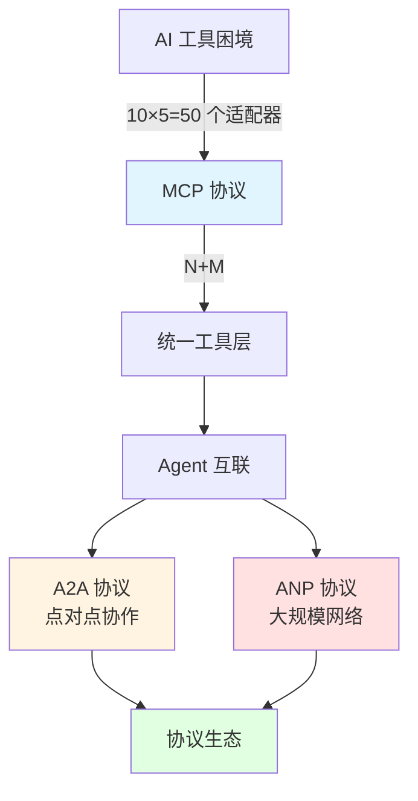
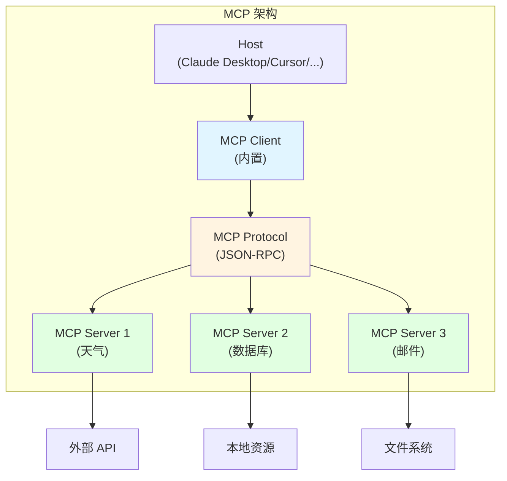
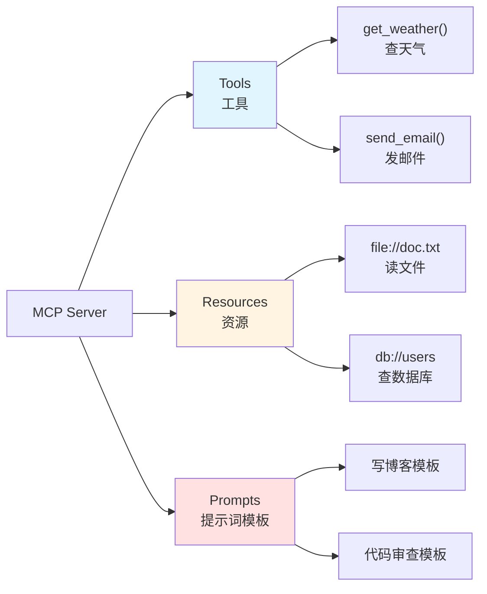

# 第 11 章:MCP / A2A / ANP

> 学完本章,你能:理解三大协议的定位和使用场景,实现 MCP Server

::: info 别被"协议"吓到
看到 MCP、A2A、ANP 这些缩写是不是头大？别慌，**本章重理解轻实操**。

你只需要记住一个核心思想：**协议 = 大家约定好的格式**。就像快递行业的标准：
- **MCP** = 统一快递单格式（所有快递公司用同一种运单）
- **A2A** = 快递公司之间的转运协议（顺丰的件可以转给中通送）
- **ANP** = 国际物流标准（跨国包裹怎么运输）

不需要你从零实现协议，只需要知道**什么场景用什么协议**。
:::



**章节导览:**

- **11.1 MCP 协议详解**:理解 MCP 架构,实现一个计算器 Server
- **11.2 A2A 协议**:Agent 之间如何发现和协作
- **11.3 ANP 协议**:大规模 Agent 网络互联
- **11.4 协议生态全景**:三层模型与选型指南

---

## 11.1 MCP 协议详解 <DifficultyBadge level="intermediate" /> <CostBadge cost="$0" />

> 有 10 个工具，5 个 AI 平台，要写 50 个适配器？醒醒！MCP 这个 **万能转接头** 来救你了。

> 前置知识:7.1 Function Calling 原理

### 为什么需要它?(Problem)

::: warning N×M 适配地狱
想象你是个万能插座制造商：
- 10 种电器（工具）
- 5 种国家插口标准（AI 平台）
- 传统方式：造 10×5=50 种适配器
- MCP 方式：造 10+5=15 个接口就够了

**你会选哪个？**
:::

**问题:AI 工具的 N×M 适配地狱**

假设你有 10 个工具(天气、数据库、邮件、日历...),想让 5 个 AI 平台都能用:

```
传统方式:
┌─────────────────────────────────────┐
│ 工具 1  →  OpenAI 适配器            │
│ 工具 1  →  Claude 适配器            │
│ 工具 1  →  Gemini 适配器            │
│ 工具 1  →  Cursor 适配器            │
│ 工具 1  →  Windsurf 适配器          │
│                                     │
│ 工具 2  →  OpenAI 适配器            │
│ 工具 2  →  Claude 适配器            │
│ ...                                 │
└─────────────────────────────────────┘

问题:
❌ 10 个工具 × 5 个平台 = 50 个适配器
❌ 每个平台 API 不同(OpenAI、Anthropic、Google...)
❌ 工具更新,所有适配器都要改
❌ 新增平台,所有工具都要重写
```

**真实案例:开发者的噩梦**

```python
# 同一个天气工具,需要写多个版本

# OpenAI 版本
def get_weather_openai():
    return {
        "type": "function",
        "function": {
            "name": "get_weather",
            "description": "获取天气",
            "parameters": {...}
        }
    }

# Anthropic 版本
def get_weather_anthropic():
    return {
        "name": "get_weather",
        "description": "获取天气",
        "input_schema": {...}  # 格式不同!
    }

# Google Gemini 版本
def get_weather_gemini():
    return FunctionDeclaration(
        name="get_weather",
        description="获取天气",
        parameters={...}  # 又是不同的格式!
    )
```

**MCP 的解决方案:从 N×M 到 N+M**

```
MCP 方式:
┌──────────────────────┐      ┌──────────────────────┐
│   工具 1 (MCP)       │◄─────┤   OpenAI (MCP 客户端) │
│   工具 2 (MCP)       │◄─────┤   Claude (MCP 客户端) │
│   工具 3 (MCP)       │◄─────┤   Gemini (MCP 客户端) │
│   ...                │◄─────┤   Cursor (MCP 客户端) │
│   工具 10 (MCP)      │◄─────┤   Windsurf (MCP 客户端)│
└──────────────────────┘      └──────────────────────┘

优势:
✅ 10 个工具 + 5 个平台 = 15 个实现(不是 50 个!)
✅ 工具只写一次,所有平台都能用
✅ 统一标准,维护简单
✅ 新增平台/工具,成本低
```

### 它是什么?(Concept)

::: tip 类比时间：万能转接头
你有美标、欧标、英标的电器，去不同国家旅行很头疼？

**MCP = 万能转接头**
- 一头连电器（工具）
- 一头连各国插座（AI 平台）
- 统一标准，到哪都能用！🔌
:::

**MCP = Model Context Protocol(模型上下文协议)**

MCP 是 Anthropic 在 2024 年 11 月推出的开放协议,目标是**标准化 AI 与工具的连接方式**。



**核心组件:**

| 组件 | 作用 | 示例 |
|-----|------|------|
| **Host** | AI 应用宿主 | Claude Desktop、Cursor、Windsurf |
| **MCP Client** | 内置在 Host 中 | 负责与 MCP Server 通信 |
| **MCP Server** | 工具提供方 | 天气 Server、数据库 Server、文件 Server |
| **Protocol** | 通信协议 | JSON-RPC 2.0 |
| **Transport** | 传输层 | stdio(本地)、SSE(远程) |

**MCP Server 提供三种能力:**



**1. Tools(工具):**

类似 Function Calling,提供可执行的函数:

```json
{
  "name": "get_weather",
  "description": "获取指定城市的天气",
  "inputSchema": {
    "type": "object",
    "properties": {
      "city": {
        "type": "string",
        "description": "城市名称"
      }
    },
    "required": ["city"]
  }
}
```

**2. Resources(资源):**

提供静态或动态的上下文数据:

```json
{
  "uri": "file:///project/README.md",
  "name": "项目说明",
  "description": "项目的 README 文档",
  "mimeType": "text/markdown"
}
```

**3. Prompts(提示词模板):**

预定义的 Prompt 模板:

```json
{
  "name": "code_review",
  "description": "代码审查模板",
  "arguments": [
    {
      "name": "code",
      "description": "要审查的代码",
      "required": true
    }
  ]
}
```

**MCP 协议工作流程:**

```mermaid
sequenceDiagram
    participant User as 用户
    participant Host as Claude Desktop
    participant Client as MCP Client
    participant Server as MCP Server
    participant API as 外部 API
    
    User->>Host: "北京今天天气怎么样?"
    Host->>Client: 需要调用工具
    Client->>Server: tools/list (列出可用工具)
    Server->>Client: [{name: "get_weather", ...}]
    Client->>Server: tools/call (调用 get_weather)
    Server->>API: 调用真实天气 API
    API->>Server: 返回天气数据
    Server->>Client: 返回结果
    Client->>Host: 工具结果
    Host->>User: "北京今天晴,15°C"
    
    style Client fill:#e1f5ff
    style Server fill:#fff4e1
```

**传输层(Transport):**

MCP 支持两种传输方式:

| 传输层 | 场景 | 实现方式 |
|-------|------|---------|
| **stdio** | 本地工具 | 通过标准输入输出通信 |
| **SSE** | 远程工具 | Server-Sent Events,HTTP 长连接 |

**stdio 示例:**

```python
# MCP Server 通过 stdin/stdout 与 Client 通信
import sys
import json

# 读取请求
request = json.loads(sys.stdin.readline())

# 处理请求
result = handle_request(request)

# 返回响应
print(json.dumps(result))
sys.stdout.flush()
```

**MCP 协议规范(JSON-RPC):**

```json
// 请求
{
  "jsonrpc": "2.0",
  "id": 1,
  "method": "tools/call",
  "params": {
    "name": "get_weather",
    "arguments": {
      "city": "北京"
    }
  }
}

// 响应
{
  "jsonrpc": "2.0",
  "id": 1,
  "result": {
    "content": [
      {
        "type": "text",
        "text": "北京今天晴,温度 15°C"
      }
    ]
  }
}
```

**MCP 生态现状(2026 年 2 月):**

| 支持方 | 进度 |
|-------|------|
| **Claude Desktop** | ✅ 原生支持 |
| **Claude Code** | ✅ 原生支持 |
| **Cursor** | ✅ 原生支持 |
| **Windsurf** | ✅ 原生支持 |
| **Zed Editor** | ✅ 原生支持 |
| **VS Code** | ✅ 原生支持(通过 GitHub Copilot) |
| **OpenAI** | ✅ 已采用(ChatGPT + API 支持) |

**官方 MCP Servers:**

- `@modelcontextprotocol/server-filesystem`:文件系统访问
- `@modelcontextprotocol/server-postgres`:PostgreSQL 数据库
- `@modelcontextprotocol/server-github`:GitHub API
- `@modelcontextprotocol/server-google-drive`:Google Drive
- `@modelcontextprotocol/server-slack`:Slack 集成

### 动手试试(Practice)

**实战:用 Python 实现一个简单的 MCP Server**

我们来实现一个计算器 MCP Server,提供加减乘除四个工具。

**步骤 1:安装 MCP SDK**

```bash
pip install mcp
```

**步骤 2:实现 MCP Server**

```python
# calculator_server.py
from mcp.server import Server
from mcp.server.stdio import stdio_server
from mcp.types import Tool, TextContent
import json

# 创建 MCP Server
app = Server("calculator-server")

# 定义工具:加法
@app.list_tools()
async def list_tools() -> list[Tool]:
    return [
        Tool(
            name="add",
            description="计算两个数的和",
            inputSchema={
                "type": "object",
                "properties": {
                    "a": {"type": "number", "description": "第一个数"},
                    "b": {"type": "number", "description": "第二个数"}
                },
                "required": ["a", "b"]
            }
        ),
        Tool(
            name="subtract",
            description="计算两个数的差",
            inputSchema={
                "type": "object",
                "properties": {
                    "a": {"type": "number", "description": "被减数"},
                    "b": {"type": "number", "description": "减数"}
                },
                "required": ["a", "b"]
            }
        ),
        Tool(
            name="multiply",
            description="计算两个数的积",
            inputSchema={
                "type": "object",
                "properties": {
                    "a": {"type": "number", "description": "第一个数"},
                    "b": {"type": "number", "description": "第二个数"}
                },
                "required": ["a", "b"]
            }
        ),
        Tool(
            name="divide",
            description="计算两个数的商",
            inputSchema={
                "type": "object",
                "properties": {
                    "a": {"type": "number", "description": "被除数"},
                    "b": {"type": "number", "description": "除数"}
                },
                "required": ["a", "b"]
            }
        )
    ]

# 实现工具调用
@app.call_tool()
async def call_tool(name: str, arguments: dict) -> list[TextContent]:
    a = arguments["a"]
    b = arguments["b"]
    
    if name == "add":
        result = a + b
    elif name == "subtract":
        result = a - b
    elif name == "multiply":
        result = a * b
    elif name == "divide":
        if b == 0:
            return [TextContent(type="text", text="错误:除数不能为 0")]
        result = a / b
    else:
        return [TextContent(type="text", text=f"未知工具:{name}")]
    
    return [TextContent(type="text", text=str(result))]

# 启动 Server
async def main():
    async with stdio_server() as (read_stream, write_stream):
        await app.run(read_stream, write_stream, app.create_initialization_options())

if __name__ == "__main__":
    import asyncio
    asyncio.run(main())
```

**步骤 3:配置 Claude Desktop**

编辑 `~/Library/Application Support/Claude/claude_desktop_config.json`:

```json
{
  "mcpServers": {
    "calculator": {
      "command": "python",
      "args": ["/path/to/calculator_server.py"]
    }
  }
}
```

**步骤 4:重启 Claude Desktop,测试**

在 Claude Desktop 中提问:

```
User: "帮我计算 123 + 456"

Claude: [调用 add 工具]
结果:579
```

**完整示例在 Notebook 中:**

<ColabBadge path="demos/11-protocols/mcp_server.ipynb" />

### 小结(Reflection)

- **解决了什么**:理解了 MCP 如何把 N×M 适配器问题简化为 N+M,并实现了一个简单的 MCP Server
- **没解决什么**:MCP 解决了"AI 调工具",但"AI 调 AI"呢?——下一节介绍 A2A 协议
- **关键要点**:
  1. **MCP 是标准化协议**:统一 AI 与工具的连接方式,避免 N×M 适配地狱
  2. **三种能力**:Tools(工具)、Resources(资源)、Prompts(提示词模板)
  3. **传输层**:stdio(本地)、SSE(远程)
  4. **协议格式**:JSON-RPC 2.0,简单清晰
  5. **生态支持**:Claude Desktop、Cursor、Windsurf 等主流工具已原生支持
  6. **实现简单**:用官方 SDK 可以快速实现一个 MCP Server

::: tip 一句话总结
**MCP = 万能转接头，一个协议让所有 AI 平台都能调你的工具，省下 N×M 个适配器。**
:::

**关键洞察:**
- MCP 不是唯一的工具协议,但它的**开放性和简单性**让它快速被采用
- MCP 目前主要解决**工具调用**层面的问题,不涉及 Agent 之间的协作

---

*最后更新:2026-02-20*
