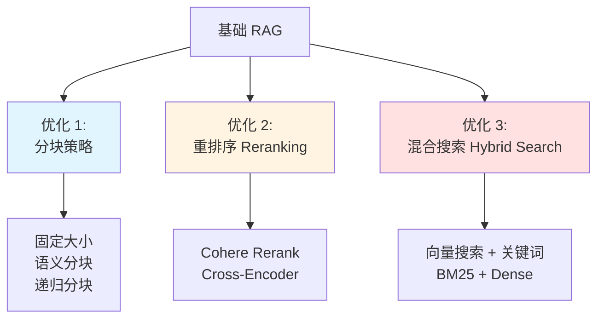
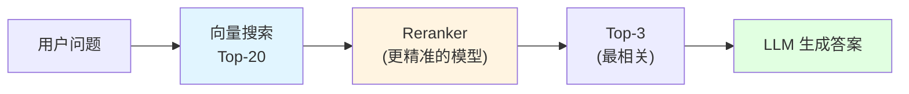
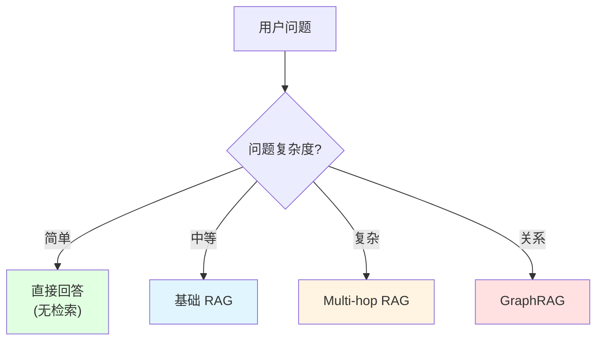

# 12.3 高级 RAG <DifficultyBadge level="advanced" /> <CostBadge cost="$0.05" />

> 前置知识:12.1 RAG 基础、12.2 Embedding

### 为什么需要它?(Problem)

**问题:基础 RAG 的检索质量问题**

```python
# 场景:用户问"Python 如何处理异常?"

文档库:
  - "Python 使用 try-except 处理异常。语法:try: code except Exception: handle"
  - "Java 中异常处理使用 try-catch"
  - "Python 的历史可以追溯到 1991 年..."
  - "异常情况下,系统会自动重启"

基础 RAG 检索结果(Top-3):
  1. "异常情况下,系统会自动重启" (包含"异常",但不相关!)
  2. "Python 使用 try-except 处理异常..." (正确!)
  3. "Python 的历史..." (包含"Python",但不相关!)

问题:
❌ 检索不准:相关文档排序不对
❌ 分块粗糙:切断了重要上下文
❌ 单一搜索:只用向量搜索,没有关键词匹配
```

### 它是什么?(Concept)

**高级 RAG 的三大优化方向:**



### 优化 1:分块策略(Chunking)

**问题:固定大小分块的缺陷**

```python
# 固定 1000 字符分块
text = """
Python 异常处理

Python 使用 try-except 语句处理异常。基本语法如下:

try:
    # 可能出错的代码
    result = 10 / 0
except ZeroDivisionError:
    # 处理特定异常
    print("除数不能为 0")
except Exception as e:
    # 处理其他异常
    print(f"发生错误:{e}")
finally:
    # 无论如何都会执行
    print("清理资源")
"""

# 如果在 "基本语法如下:" 这里截断
chunk1 = "Python 异常处理\n\nPython 使用 try-except 语句处理异常。基本语法如下:"
chunk2 = "\n\ntry:\n    result = 10 / 0\nexcept..."

# 问题:上下文被切断了!
```

**三种改进策略:**

| 策略 | 原理 | 优点 | 缺点 |
|-----|------|-----|------|
| **固定大小 + 重叠** | 块之间有重叠部分 | 简单 | 仍可能切断上下文 |
| **语义分块** | 按段落、句子边界切分 | 保持语义完整 | 需要 NLP 工具 |
| **递归分块** | 先按章节,再按段落,最后按句子 | 层次清晰 | 复杂度高 |

**实战:递归分块**

```python
from langchain.text_splitter import RecursiveCharacterTextSplitter

text_splitter = RecursiveCharacterTextSplitter(
    chunk_size=1000,
    chunk_overlap=200,
    separators=[
        "\n\n",  # 优先按空行切分(段落)
        "\n",    # 然后按换行切分(句子)
        "。",    # 中文句号
        " ",     # 空格
        ""       # 最后才按字符
    ]
)

chunks = text_splitter.split_text(text)
```

### 优化 2:重排序(Reranking)

**问题:向量搜索不够精准**

```
用户问题:"Python 如何处理异常?"

向量搜索 Top-5:
  1. 相关度 0.78 → "异常情况下,系统会..."(不相关,但向量接近)
  2. 相关度 0.76 → "Python 使用 try-except..."(相关!)
  3. 相关度 0.74 → "Java 异常处理..."(不相关)
  4. 相关度 0.72 → "Python 的历史..."(不相关)
  5. 相关度 0.70 → "异常处理的最佳实践..."(相关!)

问题:真正相关的文档排序不靠前
```

**Reranking:二次排序**



**实战:Cohere Rerank**

```python
import cohere

co = cohere.Client("your-api-key")

# 1. 向量搜索 Top-20
docs = vectorstore.similarity_search(question, k=20)

# 2. Rerank,只保留 Top-3
results = co.rerank(
    query=question,
    documents=[doc.page_content for doc in docs],
    top_n=3,
    model="rerank-multilingual-v3.0"
)

# 3. 获取重排序后的文档
reranked_docs = [docs[r.index] for r in results.results]
```

### 优化 3:混合搜索(Hybrid Search)

**问题:向量搜索对精确关键词不敏感**

```
用户问:"GPT-4 的 API 价格是多少?"

向量搜索:
  - 可能返回"GPT-3.5 的价格..."(向量相似,但模型不对)
  - 可能返回"API 调用方式..."(主题相关,但不是价格)

需要:同时匹配语义 + 精确关键词("GPT-4" + "价格")
```

**混合搜索:向量搜索 + BM25**

| 搜索方式 | 原理 | 适用 |
|---------|------|-----|
| **向量搜索** | 语义相似度 | 理解意图、同义词 |
| **BM25** | 关键词频率 | 精确匹配、专有名词 |
| **混合** | 两者结合 | 兼顾语义和精确度 |

**实战:LangChain + BM25**

```python
from langchain.retrievers import BM25Retriever, EnsembleRetriever
from langchain.vectorstores import Chroma

# 1. 向量检索器
vectorstore = Chroma.from_documents(documents, embeddings)
vector_retriever = vectorstore.as_retriever(search_kwargs={"k": 5})

# 2. BM25 检索器
bm25_retriever = BM25Retriever.from_documents(documents)
bm25_retriever.k = 5

# 3. 混合检索器
ensemble_retriever = EnsembleRetriever(
    retrievers=[vector_retriever, bm25_retriever],
    weights=[0.5, 0.5]  # 各占 50%
)

# 查询
docs = ensemble_retriever.get_relevant_documents("GPT-4 的价格")
```

### 其他高级技术

**1. Query Transformation(查询改写)**

```python
# 用户问题模糊
user_query = "它怎么用?"

# LLM 改写为明确问题
improved_query = "Python 中 try-except 异常处理的使用方法"

# 再进行检索
docs = vectorstore.similarity_search(improved_query)
```

**2. Metadata Filtering(元数据过滤)**

```python
# 只搜索 2024 年之后的文档
docs = vectorstore.similarity_search(
    query,
    k=5,
    filter={"year": {"$gte": 2024}}
)
```

**3. Parent Document Retrieval(父文档检索)**

```python
# 小块用于检索(精准)
# 大块用于生成(完整上下文)

small_chunks = split_documents(docs, chunk_size=200)
large_chunks = split_documents(docs, chunk_size=1000)

# 检索小块,返回对应的大块
retrieved_small = search(small_chunks)
returned_large = get_parent_chunks(retrieved_small)
```

### 2025-2026 前沿 RAG 模式

基础 RAG 像个只会查字典的学生,高级 RAG 会换着花样查,而这些新模式?它们学会了**自我反思**。

#### 1. Multi-hop RAG(多跳 RAG)

**问题:单次检索无法回答复杂问题**

```
用户问:"GPT-4 的作者之前发表过什么重要论文?"

需要:
  步骤 1: 检索"GPT-4 的作者" → 找到 Ilya Sutskever 等人
  步骤 2: 用作者名检索"Ilya Sutskever 的论文" → 找到 AlexNet、Transformer 等
  步骤 3: 组合信息生成答案

传统 RAG: 一次检索搞定,但可能检索不到关联信息
Multi-hop RAG: 链式检索,一步步找到答案
```

**实战:LangChain 多跳检索**

```python
from langchain.chains import RetrievalQA
from langchain.prompts import PromptTemplate

# 多跳检索链
multi_hop_template = """
步骤 1: 分析问题,提取关键实体
步骤 2: 用实体检索相关文档
步骤 3: 从文档中提取新实体
步骤 4: 用新实体再次检索
步骤 5: 综合所有信息回答

问题: {question}
"""

# 构建链式检索
chain = RetrievalQA.from_chain_type(
    llm=llm,
    retriever=vectorstore.as_retriever(),
    chain_type="multi_hop"  # 多跳模式
)
```

#### 2. Corrective RAG (CRAG)

**问题:检索到的文档可能不相关**

```
用户问:"2024 年 AI 领域最大突破是什么?"

第一次检索结果:
  - "2023 年 AI 发展回顾..."(时间不对!)
  - "AI 在医疗领域的应用..."(主题偏了!)
  - "2024 年区块链突破..."(领域错了!)

CRAG 的做法:
  1. 检索文档
  2. 用小模型评估相关性
  3. 如果不相关,重新改写查询并检索
  4. 如果还是不行,触发网络搜索
```

**实战:带纠错的 RAG**

```python
def corrective_rag(question):
    # 第一次检索
    docs = vectorstore.similarity_search(question, k=5)
    
    # 评估相关性(用小模型或规则)
    relevance_scores = evaluate_relevance(question, docs)
    
    if max(relevance_scores) < 0.7:  # 相关性不够
        # 重写查询
        improved_query = llm.invoke(f"重写问题使其更具体:{question}")
        docs = vectorstore.similarity_search(improved_query, k=5)
        
        # 还是不行?搜索网络
        if max(evaluate_relevance(improved_query, docs)) < 0.7:
            docs = web_search(question)  # 兜底:网络搜索
    
    return docs
```

#### 3. Self-RAG

**问题:RAG 不知道自己检索得好不好**

```
Self-RAG 的自我反思:

[检索] → [生成] → [反思 1: 检索到的文档相关吗?]
                    ↓ 不相关
                    [重新检索]
                    ↓ 相关
              [反思 2: 生成的答案有事实支持吗?]
                    ↓ 没有
                    [重新生成]
                    ↓ 有
              [反思 3: 答案完整吗?]
                    ↓ 不完整
                    [补充检索]
                    ↓ 完整
              [最终答案]
```

**实战:Self-RAG 流程**

```python
def self_rag(question):
    docs = vectorstore.similarity_search(question)
    
    # 生成答案
    answer = llm.invoke(f"根据文档回答:{question}\n\n文档:{docs}")
    
    # 自我反思 1: 文档相关吗?
    relevance = llm.invoke(f"这些文档与问题相关吗?问题:{question},文档:{docs}")
    if "不相关" in relevance:
        docs = corrective_search(question)  # 重新检索
    
    # 自我反思 2: 答案有依据吗?
    support = llm.invoke(f"答案有文档支持吗?答案:{answer},文档:{docs}")
    if "没有支持" in support:
        answer = llm.invoke(f"重新生成答案,严格基于文档:{docs}")
    
    # 自我反思 3: 答案完整吗?
    completeness = llm.invoke(f"答案完整吗?{answer}")
    if "不完整" in completeness:
        additional_docs = vectorstore.similarity_search(f"{question} 补充信息")
        answer = llm.invoke(f"补充答案:{answer}\n新文档:{additional_docs}")
    
    return answer
```

::: tip 小贴士
Self-RAG 的反思步骤会增加 2-3 倍的 API 调用,但检索质量显著提升。适合对准确性要求极高的场景。
:::

#### 4. Adaptive RAG

**问题:不是所有问题都需要复杂的 RAG**

```
问题分类:

简单问题:"今天天气如何?" → 直接回答,不需要检索
中等问题:"Python 如何读文件?" → 基础 RAG
复杂问题:"对比 Python/Node.js 的异步模型" → Multi-hop RAG
关系问题:"Alice 的团队负责哪些项目?" → GraphRAG (见 12.5)
```

**Adaptive RAG: 路由到不同策略**



**实战:路由策略**

```python
def adaptive_rag(question):
    # 用小模型分类问题复杂度
    classification = classify_question(question)
    
    if classification == "simple":
        return llm.invoke(question)  # 直接回答
    
    elif classification == "medium":
        docs = vectorstore.similarity_search(question)
        return generate_answer(question, docs)  # 基础 RAG
    
    elif classification == "complex":
        return multi_hop_rag(question)  # 多跳 RAG
    
    elif classification == "relational":
        return graph_rag(question)  # GraphRAG (见 12.5、12.6)
    
    else:
        return corrective_rag(question)  # 兜底:纠错 RAG

def classify_question(question):
    prompt = f"""
    分类问题复杂度:
    - simple: 常识问题,不需要检索
    - medium: 单文档可回答
    - complex: 需要多文档综合
    - relational: 涉及实体关系
    
    问题:{question}
    """
    return llm.invoke(prompt).strip()
```

#### 关键对比:四种模式

| 模式 | 核心思想 | 适用场景 | 成本 |
|-----|---------|---------|-----|
| **Multi-hop** | 链式检索 | 需要多步推理的问题 | 中等 |
| **CRAG** | 验证后重试 | 检索质量不稳定 | 中等 |
| **Self-RAG** | 生成后反思 | 对准确性要求极高 | 高 |
| **Adaptive** | 路由策略 | 问题类型多样 | 低 |

::: warning 成本警告
Self-RAG 的三轮反思可能让单次查询成本翻 3 倍。在生产环境中,建议先用 Adaptive RAG 分流,只对高价值问题使用 Self-RAG。
:::

### Agentic RAG:下一步

这些模式(Multi-hop、CRAG、Self-RAG、Adaptive)都是**朝着 Agent 化方向演进**:

- Multi-hop: Agent 决定何时进行下一跳检索
- CRAG: Agent 判断是否需要纠错
- Self-RAG: Agent 反思自己的输出质量
- Adaptive: Agent 路由到不同策略

想更进一步?**GraphRAG**(12.5)处理关系推理,**Agentic RAG**(12.6)让 RAG 系统真正自主决策。

### 动手试试(Practice)

完整的高级 RAG 实现,对比不同策略的效果。

<ColabBadge path="demos/12-rag-memory/advanced_rag.ipynb" />

### 小结(Reflection)

- **解决了什么**:掌握了提升 RAG 检索质量的优化技术,从基础优化到前沿模式
- **没解决什么**:这些模式处理文档检索,但复杂关系推理呢?——见 [12.5 GraphRAG](./graph-rag.md) 和 [12.6 Agentic RAG](./agentic-rag.md)
- **关键要点**:
  1. **基础优化**:分块策略、重排序、混合搜索
  2. **Multi-hop RAG**:链式检索处理多步推理
  3. **CRAG**:验证相关性,不行就重试或搜网络
  4. **Self-RAG**:三轮反思(相关性、支持度、完整性)
  5. **Adaptive RAG**:路由到不同策略,避免过度工程
  6. **成本权衡**:Self-RAG 质量高但贵 3 倍,生产环境先用 Adaptive 分流

---

*最后更新:2026-02-22*
