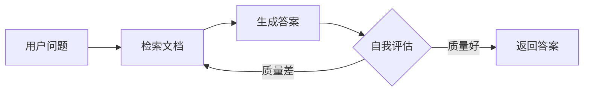
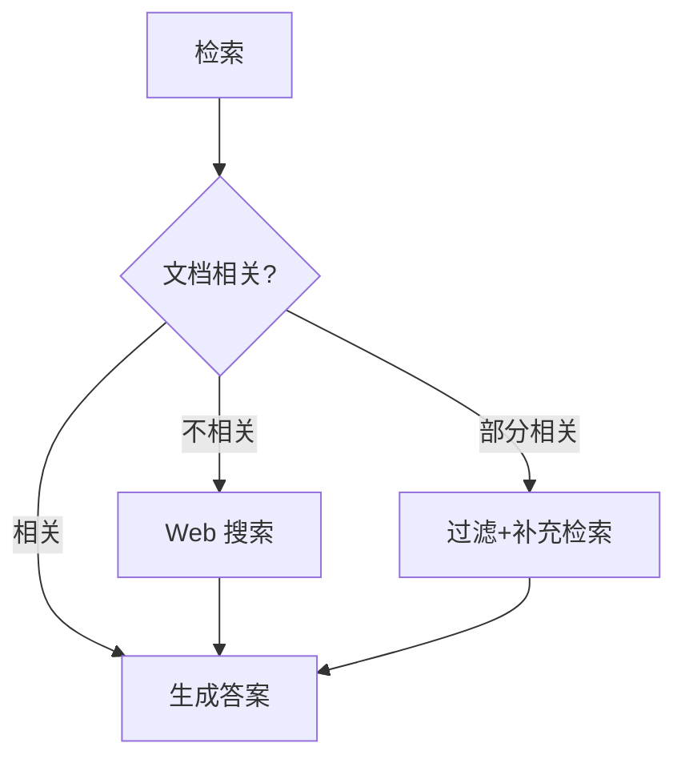
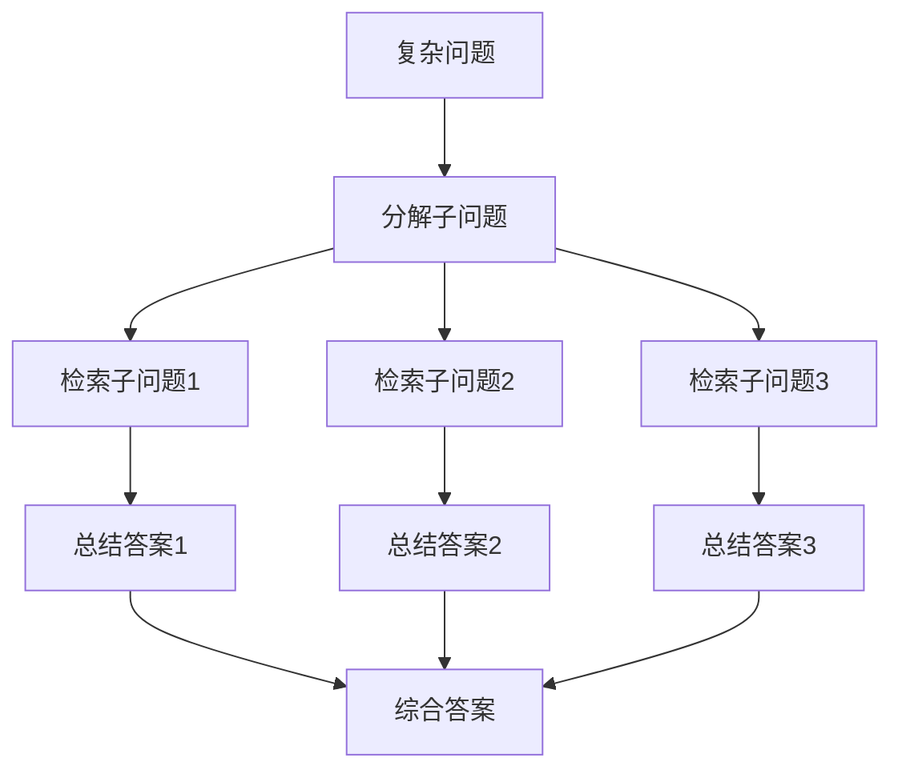
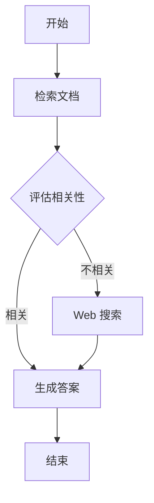

---
prev:
  text: '12.5 GraphRAG'
  link: '/zh/12-rag-memory/graph-rag'
next:
  text: '12.7 AI Memory 产品全景'
  link: '/zh/12-rag-memory/memory-products'
---

# 12.6 Agentic RAG

## 开篇:如果 RAG 会自己思考呢?

想象一下,你问助手:"为什么我家猫总是在凌晨3点叫?"

**传统 RAG**:  
→ 检索"猫 凌晨 叫"  
→ 返回前5条结果  
→ 生成答案:"可能是饿了或者无聊"  
→ 结束

**Agentic RAG**:  
→ "嗯,让我先查一下猫的生物钟..."(第1次检索)  
→ "等等,用户说的是凌晨3点,这是否与狩猎本能有关?"(第2次检索)  
→ "检索结果提到'黄昏/黎明活跃期',但凌晨3点不在这个范围..."(自我反思)  
→ "让我重新检索'猫 夜间活动异常'..."(纠正性检索)  
→ "找到了!可能是甲状腺问题或焦虑,建议看兽医"(最终答案)

这就是 Agentic RAG —— **会思考、会质疑、会迭代的检索系统**。

::: tip 核心区别
- **Traditional RAG**: 🤖 "我只是个搬运工,你要啥我搬啥"
- **Agentic RAG**: 🧠 "我是侦探,让我调查一下线索是否靠谱"
:::

---

## 传统 RAG 的三大硬伤

### 1. 单次检索盲区(One-Shot Blindness)

**场景**: "SpaceX 的 Starship 第三次试飞成功了吗?"

```python
# 传统 RAG 的检索逻辑
query = "Starship third flight success"
docs = vector_db.search(query, top_k=5)  # 一次检索
answer = llm.generate(docs)              # 直接生成

# 问题: 如果检索到的是第二次试飞的旧新闻怎么办?
# 答案: 不管,硬着头皮生成
```

**结果**: 可能返回过期信息,因为它不会验证时间线。

### 2. 无验证机制(No Fact-Checking)

**场景**: "Python 3.12 有哪些新特性?"

```python
# 传统 RAG
docs = retrieve("Python 3.12 features")  # 可能检索到 3.11 的文档
answer = generate(docs)                  # 生成答案,不管对不对

# Agentic RAG
docs = retrieve("Python 3.12 features")
if not verify_relevance(docs, "3.12"):   # 验证相关性
    docs = retrieve("Python 3.12 release notes official")  # 重新检索
answer = generate(docs)
```

### 3. 无路由能力(No Routing)

**问题类型**:
- 事实查询 → 应该用向量检索
- 代码问题 → 应该用代码搜索引擎
- 实时信息 → 应该调用搜索 API

**传统 RAG**: 全部用向量检索,一招鲜吃遍天(然后被吃了)

**Agentic RAG**: "让我想想该用哪个工具..."

---

## 什么是 Agentic RAG?

### 定义

> **Agentic RAG** = Agent(智能体)+ RAG(检索增强生成)

把 RAG 的检索过程交给一个**具有决策能力的 Agent**,让它决定:
- **WHEN**(何时检索): 是否需要检索?还是直接用已知知识?
- **WHERE**(从哪检索): 向量库?搜索引擎?SQL数据库?
- **HOW**(如何检索): 单次查询?还是多步推理?

### 核心架构

```
用户问题
   ↓
[Agent 规划器]
   ↓
   ├─→ 需要检索? → [检索工具选择]
   │                   ↓
   │              [执行检索]
   │                   ↓
   │              [验证结果]
   │                   ↓
   │              结果可靠? ──No──→ [重新检索/调整策略]
   │                   ↓ Yes
   └─→ 不需要检索 → [直接生成答案]
```

---

## 四大 Agentic RAG 模式

### 1. Self-RAG(自我反思 RAG)

**核心思想**: 生成答案后,自己评估答案质量,必要时重新检索。



**代码示例**(伪代码):

```python
def self_rag(query):
    max_iterations = 3
    
    for i in range(max_iterations):
        # 检索
        docs = retrieve(query)
        
        # 生成答案
        answer = llm.generate(f"基于文档: {docs}\n回答: {query}")
        
        # 自我评估
        score = llm.evaluate(f"答案: {answer}\n评分(1-10): ")
        
        if score >= 8:
            return answer  # 满意,返回
        
        # 不满意,改进查询
        query = llm.refine_query(query, answer, docs)
    
    return answer  # 达到最大迭代次数,返回最后结果
```

**适用场景**:
- 需要高质量答案的场景(医疗、法律咨询)
- 允许较长响应时间

::: warning 性能警告
Self-RAG 会多次调用 LLM,成本和延迟都会增加。生产环境建议设置 `max_iterations=2`。
:::

---

### 2. Corrective RAG(纠正性 RAG)

**核心思想**: 先判断检索结果是否相关,不相关就换个策略重新检索。



**代码示例**:

```python
from langchain.prompts import PromptTemplate
from langchain.chat_models import ChatOpenAI

def corrective_rag(query):
    # 第一步: 向量检索
    docs = vector_store.search(query, top_k=5)
    
    # 第二步: 相关性判断
    relevance_prompt = PromptTemplate.from_template(
        "文档: {docs}\n问题: {query}\n"
        "这些文档是否相关? 回答 RELEVANT/IRRELEVANT/PARTIAL"
    )
    
    llm = ChatOpenAI(model="gpt-4")
    relevance = llm.predict(relevance_prompt.format(docs=docs, query=query))
    
    # 第三步: 根据相关性决策
    if relevance == "RELEVANT":
        return llm.generate(f"基于文档: {docs}\n回答: {query}")
    
    elif relevance == "IRRELEVANT":
        # 完全不相关,使用 Web 搜索
        web_results = tavily_search(query)  # Tavily API
        return llm.generate(f"基于搜索: {web_results}\n回答: {query}")
    
    else:  # PARTIAL
        # 部分相关,过滤后补充检索
        filtered_docs = [d for d in docs if is_relevant(d, query)]
        additional_docs = web_search(query, top_k=2)
        all_docs = filtered_docs + additional_docs
        return llm.generate(f"基于文档: {all_docs}\n回答: {query}")

def is_relevant(doc, query):
    # 简单的关键词匹配或语义相似度
    return semantic_similarity(doc, query) > 0.7
```

**关键组件**:
- **相关性分类器**: 可以用小模型(如 BERT)或 LLM 判断
- **备用检索策略**: Web 搜索、SQL 查询、API 调用等

---

### 3. Adaptive RAG(自适应 RAG)

**核心思想**: 根据问题类型,自动选择检索策略。

```python
from enum import Enum

class QueryType(Enum):
    SIMPLE = "simple"          # 简单事实查询
    COMPLEX = "complex"        # 需要推理
    RECENT = "recent"          # 实时信息
    CODE = "code"              # 代码问题

def adaptive_rag(query):
    # 第一步: 分类问题类型
    query_type = classify_query(query)
    
    # 第二步: 路由到不同策略
    if query_type == QueryType.SIMPLE:
        # 简单查询 → 单次向量检索
        docs = vector_store.search(query, top_k=3)
        return llm.generate(f"基于: {docs}\n回答: {query}")
    
    elif query_type == QueryType.COMPLEX:
        # 复杂查询 → 多步推理 RAG
        return multi_hop_rag(query)
    
    elif query_type == QueryType.RECENT:
        # 实时信息 → 直接 Web 搜索
        web_results = tavily_search(query)
        return llm.generate(f"基于: {web_results}\n回答: {query}")
    
    elif query_type == QueryType.CODE:
        # 代码问题 → 代码搜索引擎
        code_results = github_code_search(query)
        return llm.generate(f"基于代码: {code_results}\n回答: {query}")

def classify_query(query):
    """使用 LLM 分类问题类型"""
    prompt = f"""
    问题: {query}
    
    这是什么类型的问题?
    - SIMPLE: 简单事实查询(如"什么是 RAG?")
    - COMPLEX: 需要多步推理(如"比较 RAG 和微调的优缺点")
    - RECENT: 实时信息(如"今天天气")
    - CODE: 代码问题(如"如何用 Python 实现快排?")
    
    只返回类型名称:
    """
    
    response = llm.predict(prompt).strip()
    return QueryType(response.lower())
```

**路由决策树**:

```
问题
 ├─ 包含时间词(今天/最新/现在) → Web 搜索
 ├─ 包含代码关键词(实现/代码/函数) → 代码搜索
 ├─ 包含比较/分析词 → 多步 RAG
 └─ 其他 → 向量检索
```

---

### 4. Multi-hop RAG(多跳 RAG)

**核心思想**: 一个问题需要多次检索,每次检索的结果是下次检索的输入。

**场景**: "LangChain 和 LlamaIndex 哪个更适合构建 Agentic RAG?"

```python
def multi_hop_rag(query):
    # 第一步: 分解问题
    sub_queries = decompose_query(query)
    # 输出: ["LangChain 的优势", "LlamaIndex 的优势", "Agentic RAG 的需求"]
    
    # 第二步: 逐个检索
    all_contexts = []
    for sub_q in sub_queries:
        docs = vector_store.search(sub_q, top_k=3)
        summary = llm.summarize(docs)  # 总结子答案
        all_contexts.append(summary)
    
    # 第三步: 综合生成最终答案
    final_context = "\n".join(all_contexts)
    return llm.generate(f"基于以下信息:\n{final_context}\n\n回答: {query}")

def decompose_query(query):
    """LLM 分解问题"""
    prompt = f"""
    将以下问题分解为3-5个子问题:
    {query}
    
    返回列表格式:
    1. ...
    2. ...
    """
    response = llm.predict(prompt)
    return parse_list(response)
```

**流程图**:



**适用场景**:
- 比较类问题("A vs B")
- 因果推理("为什么 X 导致 Y?")
- 综合分析("总结 X 的优缺点")

---

## 完整代码示例:LangGraph 构建 Agentic RAG

LangGraph 是 LangChain 的状态机框架,最适合构建 Agentic RAG。

### 安装依赖

```bash
pip install langgraph langchain langchain-openai faiss-cpu
```

### 完整代码

```python
from typing import TypedDict, Annotated, List
from langgraph.graph import StateGraph, END
from langchain_openai import ChatOpenAI, OpenAIEmbeddings
from langchain_community.vectorstores import FAISS
from langchain_core.documents import Document

# ============ 1. 定义状态 ============
class AgentState(TypedDict):
    query: str                    # 用户问题
    documents: List[Document]     # 检索到的文档
    answer: str                   # 生成的答案
    needs_web_search: bool        # 是否需要 Web 搜索
    iteration: int                # 迭代次数

# ============ 2. 初始化工具 ============
llm = ChatOpenAI(model="gpt-4o-mini", temperature=0)
embeddings = OpenAIEmbeddings()

# 创建示例向量库
docs = [
    Document(page_content="RAG 是检索增强生成,结合检索和生成两个步骤"),
    Document(page_content="Agentic RAG 让 Agent 控制检索流程,可以多次检索"),
    Document(page_content="LangGraph 是构建 Agent 工作流的状态机框架"),
]
vector_store = FAISS.from_documents(docs, embeddings)

# ============ 3. 定义节点函数 ============
def retrieve(state: AgentState) -> AgentState:
    """检索节点"""
    query = state["query"]
    docs = vector_store.similarity_search(query, k=3)
    state["documents"] = docs
    print(f"📚 检索到 {len(docs)} 个文档")
    return state

def evaluate_relevance(state: AgentState) -> AgentState:
    """评估相关性"""
    docs = state["documents"]
    query = state["query"]
    
    prompt = f"""
    问题: {query}
    文档: {[d.page_content for d in docs]}
    
    这些文档是否足够回答问题? 只回答 YES 或 NO:
    """
    
    response = llm.predict(prompt).strip()
    state["needs_web_search"] = (response == "NO")
    
    if state["needs_web_search"]:
        print("❌ 文档不相关,需要 Web 搜索")
    else:
        print("✅ 文档相关")
    
    return state

def web_search(state: AgentState) -> AgentState:
    """Web 搜索节点(模拟)"""
    query = state["query"]
    # 实际应该调用 Tavily API 或其他搜索引擎
    fake_results = [
        Document(page_content=f"来自 Web 的结果: {query} 的最新信息...")
    ]
    state["documents"] = fake_results
    print("🌐 执行 Web 搜索")
    return state

def generate_answer(state: AgentState) -> AgentState:
    """生成答案节点"""
    docs = state["documents"]
    query = state["query"]
    
    context = "\n".join([d.page_content for d in docs])
    prompt = f"基于以下文档:\n{context}\n\n回答问题: {query}"
    
    answer = llm.predict(prompt)
    state["answer"] = answer
    print(f"💡 生成答案: {answer[:50]}...")
    return state

# ============ 4. 构建图 ============
workflow = StateGraph(AgentState)

# 添加节点
workflow.add_node("retrieve", retrieve)
workflow.add_node("evaluate", evaluate_relevance)
workflow.add_node("web_search", web_search)
workflow.add_node("generate", generate_answer)

# 定义边
workflow.set_entry_point("retrieve")
workflow.add_edge("retrieve", "evaluate")

# 条件边: 根据相关性决定下一步
workflow.add_conditional_edges(
    "evaluate",
    lambda state: "web_search" if state["needs_web_search"] else "generate",
    {
        "web_search": "web_search",
        "generate": "generate"
    }
)

workflow.add_edge("web_search", "generate")
workflow.add_edge("generate", END)

# 编译图
app = workflow.compile()

# ============ 5. 运行 ============
if __name__ == "__main__":
    initial_state = {
        "query": "什么是 Agentic RAG?",
        "documents": [],
        "answer": "",
        "needs_web_search": False,
        "iteration": 0
    }
    
    result = app.invoke(initial_state)
    print("\n" + "="*50)
    print("最终答案:", result["answer"])
```

### 运行结果

```bash
📚 检索到 3 个文档
✅ 文档相关
💡 生成答案: Agentic RAG 是一种让 Agent 控制检索流程的增强版 RAG...

==================================================
最终答案: Agentic RAG 是一种让 Agent 控制检索流程的增强版 RAG,
可以根据需要多次检索、验证结果,并自适应选择检索策略。
```

### 流程可视化



---

## Agentic RAG 工具生态

### 1. LangGraph(推荐)

**优势**:
- 🎯 为 Agent 工作流设计,状态管理清晰
- 🔄 支持循环和条件分支
- 🛠️ 与 LangChain 工具生态无缝集成

**适用场景**: 需要复杂决策逻辑的 Agentic RAG

**代码结构**:
```python
StateGraph → 定义节点 → 添加边 → 编译 → 运行
```

---

### 2. LlamaIndex Agents

**优势**:
- 📦 开箱即用的 Agent 模板
- 🔗 原生支持多种向量库和 LLM
- 📊 内置 Observability(可观测性)

**代码示例**:

```python
from llama_index.core.agent import ReActAgent
from llama_index.tools import QueryEngineTool

# 创建检索工具
query_engine = index.as_query_engine()
query_tool = QueryEngineTool.from_defaults(
    query_engine=query_engine,
    name="vector_search",
    description="搜索文档库中的信息"
)

# 创建 Agent
agent = ReActAgent.from_tools([query_tool], llm=llm, verbose=True)

# 运行
response = agent.chat("什么是 Agentic RAG?")
```

**ReAct 模式**:
```
Thought: 我需要搜索 Agentic RAG 的定义
Action: vector_search("Agentic RAG")
Observation: [检索结果]
Thought: 结果看起来不完整,我需要更多信息
Action: vector_search("Agentic RAG examples")
Observation: [检索结果]
Thought: 现在我有足够信息了
Answer: Agentic RAG 是...
```

---

### 3. DSPy(Stanford)

**特点**: 用**编程**的方式定义 Agent 逻辑,而不是 Prompt。

```python
import dspy

class AgenticRAG(dspy.Module):
    def __init__(self):
        self.retrieve = dspy.Retrieve(k=3)
        self.generate = dspy.ChainOfThought("context, question -> answer")
    
    def forward(self, question):
        context = self.retrieve(question).passages
        return self.generate(context=context, question=question)

# 编译(自动优化 Prompt)
compiled_rag = dspy.teleprompt.BootstrapFewShot().compile(
    AgenticRAG(),
    trainset=my_trainset
)
```

**优势**: 自动优化 Prompt,适合研究和实验。

---

## 何时使用 Agentic RAG?

### 使用决策树

```
问题特点
 ├─ 需要多步推理? ──Yes──→ Multi-hop RAG
 ├─ 需要验证答案? ──Yes──→ Self-RAG
 ├─ 需要实时信息? ──Yes──→ Adaptive RAG(路由到 Web)
 ├─ 检索质量不稳定? ──Yes──→ Corrective RAG
 └─ 以上都不需要 ──→ 传统 RAG(更快更便宜)
```

### 成本对比

| 方案 | LLM 调用次数 | 延迟 | 成本 | 准确性 |
|------|-------------|------|------|--------|
| 传统 RAG | 1次 | 低 | $ | ⭐⭐⭐ |
| Corrective RAG | 2-3次 | 中 | $$ | ⭐⭐⭐⭐ |
| Self-RAG | 3-5次 | 高 | $$$ | ⭐⭐⭐⭐⭐ |
| Multi-hop RAG | 4-6次 | 高 | $$$ | ⭐⭐⭐⭐⭐ |

### 推荐策略

::: tip 生产环境建议
1. **默认用传统 RAG**: 80% 的场景够用
2. **关键问题用 Corrective RAG**: 验证+备用检索
3. **复杂分析用 Multi-hop RAG**: 多步推理
4. **实验性场景用 Self-RAG**: 追求极致质量

**混合策略**: 用 Adaptive RAG 根据问题类型自动路由!
:::

---

## 实战案例:客服系统的 Agentic RAG

**需求**: 构建一个能处理复杂客户问题的智能客服。

### 问题类型

1. **简单问题**: "你们的退货政策是什么?"  
   → 传统 RAG,查知识库

2. **需要验证**: "我的订单号 12345 什么时候发货?"  
   → Corrective RAG,查数据库验证订单号是否存在

3. **多步推理**: "为什么我的订单被取消了?怎么申诉?"  
   → Multi-hop RAG:
   - 第1步: 查订单状态
   - 第2步: 查取消原因
   - 第3步: 查申诉流程

### 架构

```python
def customer_service_rag(query, user_id):
    # 分类问题
    query_type = classify_query(query)
    
    if query_type == "simple":
        # 查知识库
        docs = kb_search(query)
        return generate(docs)
    
    elif query_type == "order_related":
        # 提取订单号
        order_id = extract_order_id(query)
        
        # 验证订单号
        order_exists = db.check_order(order_id, user_id)
        if not order_exists:
            return "订单号不存在,请检查"
        
        # 查订单信息
        order_info = db.get_order(order_id)
        
        # 生成答案
        return generate(f"订单信息: {order_info}\n问题: {query}")
    
    elif query_type == "complex":
        # 多步 RAG
        return multi_hop_rag(query, user_id)
```

---

## 总结

### 核心要点

1. **Agentic RAG** = Agent 控制的智能检索系统
2. **四大模式**:
   - Self-RAG: 自我反思,迭代改进
   - Corrective RAG: 验证结果,纠正错误
   - Adaptive RAG: 路由策略,因地制宜
   - Multi-hop RAG: 多步推理,综合分析
3. **工具**: LangGraph(灵活)、LlamaIndex(易用)、DSPy(科研)
4. **权衡**: 准确性 ↑,成本/延迟 ↑

### One-liner Summary

> **Agentic RAG 就是把 RAG 从"搬运工"升级为"侦探" —— 会思考、会质疑、会多次调查,直到找到真相。**

---

## 延伸阅读

- [LangGraph 官方文档](https://langchain-ai.github.io/langgraph/)
- [Self-RAG 论文](https://arxiv.org/abs/2310.11511)
- [Corrective RAG 论文](https://arxiv.org/abs/2401.15884)
- [LlamaIndex Agents 教程](https://docs.llamaindex.ai/en/stable/module_guides/deploying/agents/)

---

::: info 下一节预告
**12.7 AI Memory 产品全景** —— 从 Mem0 到 Langbase,看看市面上有哪些开箱即用的记忆系统。
:::
