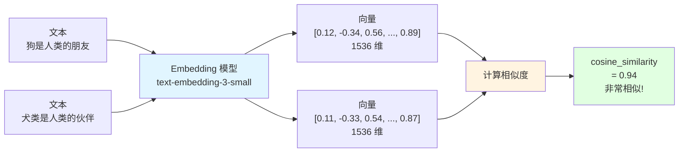

# 12.2 Embedding & 向量数据库 <DifficultyBadge level="intermediate" /> <CostBadge cost="$0.01" />

> 如何让 AI 知道"狗"和"犬类"是一回事？把文字变成 **GPS 坐标**，距离近的就是相似的！

> 前置知识:12.1 RAG 基础

### 为什么需要它?(Problem)

::: warning 关键词搜索的悲剧
**场景：**你搜索"如何训练狗"

文档 A："狗的训练方法..." ✅ 命中
文档 B："犬类的培训技巧..." ❌ 没命中（没有"狗"和"训练"这两个词）
文档 C："猫的饮食习惯..." ❌ 没命中

**问题：**关键词匹配像个死脑筋，不懂"狗=犬类"、"训练=培训"
:::

**问题:文本相似度怎么计算?**

```python
# 场景:用户搜索"如何训练狗"
文档 A:"狗的训练方法包括奖励和惩罚..."
文档 B:"猫的饮食习惯是..."
文档 C:"犬类的培训技巧涉及正强化..."

# 关键词匹配:
"训练狗" vs 文档 A → 命中"训练"和"狗" ✅
"训练狗" vs 文档 B → 无命中 ❌
"训练狗" vs 文档 C → 无命中("犬类"、"培训",没有"狗"和"训练") ❌

# 问题:关键词匹配无法理解语义
"狗" = "犬类"?
"训练" = "培训"?
```

**Embedding 的作用:将语义转换为数字**

```
文本 → Embedding 模型 → 向量(数字数组)

"狗的训练"    → [0.8, 0.1, -0.3, ...]
"犬类的培训"  → [0.78, 0.12, -0.28, ...]  # 向量接近!
"猫的饮食"    → [-0.2, 0.9, 0.5, ...]     # 向量远离!

相似度 = cosine_similarity(vector1, vector2)
```

### 它是什么?(Concept)

::: tip 类比时间：把文字变成 GPS 坐标
**传统搜索（关键词）：**
- "北京路"和"京城大道"搜不出来（字面不同）
- 就像只能靠路牌文字找路

**Embedding（向量搜索）：**
- 把地址变成 GPS 坐标 (39.9°N, 116.4°E)
- 距离近的地方就是"相似"的
- "狗"和"犬类"坐标很近，AI 知道它们是一回事

**Embedding = 把文字变成 GPS 坐标** 📍
:::

**Embedding:文本的数字表示**



**主流 Embedding 模型:**

| 模型 | 提供商 | 维度 | 成本 | 性能 |
|-----|-------|-----|------|-----|
| **text-embedding-3-small** | OpenAI | 1536 | $0.02/1M tokens | ⭐⭐⭐⭐ |
| **text-embedding-3-large** | OpenAI | 3072 | $0.13/1M tokens | ⭐⭐⭐⭐⭐ |
| **text-embedding-ada-002** | OpenAI | 1536 | $0.10/1M tokens | ⭐⭐⭐ |
| **embed-english-v3.0** | Cohere | 1024 | $0.10/1M tokens | ⭐⭐⭐⭐ |
| **bge-large-zh-v1.5** | BAAI | 1024 | 免费(自部署) | ⭐⭐⭐⭐ |

**相似度计算:Cosine Similarity**

```python
import numpy as np

def cosine_similarity(vec1, vec2):
    """计算两个向量的余弦相似度"""
    dot_product = np.dot(vec1, vec2)
    norm1 = np.linalg.norm(vec1)
    norm2 = np.linalg.norm(vec2)
    return dot_product / (norm1 * norm2)

# 示例
vec_dog = [0.8, 0.1, -0.3]
vec_puppy = [0.78, 0.12, -0.28]
vec_cat = [-0.2, 0.9, 0.5]

print(cosine_similarity(vec_dog, vec_puppy))  # 0.998(非常相似)
print(cosine_similarity(vec_dog, vec_cat))    # -0.15(不相似)
```

**向量数据库:专为向量搜索设计**

传统数据库 vs 向量数据库:

```
MySQL(传统):
SELECT * FROM docs WHERE title LIKE '%狗%';
→ 精确匹配,无法理解语义

Chroma(向量数据库):
SELECT * FROM docs ORDER BY vector_distance(embedding, query_vector) LIMIT 3;
→ 语义搜索,找最相似的内容
```

**主流向量数据库对比:**

| 数据库 | 类型 | 特点 | 适用场景 |
|-------|------|-----|---------|
| **Chroma** | 本地/云 | 轻量、易用、Python 友好 | 开发、小规模 |
| **Pinecone** | 云服务 | 托管、高性能、免运维 | 生产环境 |
| **Milvus** | 开源 | 高性能、分布式、企业级 | 大规模部署 |
| **Weaviate** | 开源/云 | GraphQL、混合搜索 | 复杂查询 |
| **Qdrant** | 开源/云 | Rust 编写、高性能 | 性能要求高 |
| **FAISS** | 本地库 | Facebook 开源、极快 | 研究、原型 |

### 动手试试(Practice)

**实战:用 ChromaDB 构建本地向量搜索**

```python
# 1. 安装
!pip install chromadb openai

# 2. 创建向量库
import chromadb
from chromadb.utils import embedding_functions

# 使用 OpenAI Embedding
openai_ef = embedding_functions.OpenAIEmbeddingFunction(
    api_key="your-api-key",
    model_name="text-embedding-3-small"
)

client = chromadb.Client()
collection = client.create_collection(
    name="my_collection",
    embedding_function=openai_ef
)

# 3. 添加文档
documents = [
    "狗是人类最忠诚的朋友,它们聪明、友好",
    "猫是独立的动物,喜欢安静的环境",
    "犬类需要定期训练和社交化",
    "猫咪的饮食习惯与狗完全不同"
]

collection.add(
    documents=documents,
    ids=["doc1", "doc2", "doc3", "doc4"]
)

# 4. 查询
results = collection.query(
    query_texts=["如何训练狗?"],
    n_results=2
)

print("相关文档:")
for doc in results['documents'][0]:
    print(f"  - {doc}")

# 输出:
# 相关文档:
#   - 犬类需要定期训练和社交化
#   - 狗是人类最忠诚的朋友,它们聪明、友好
```

**完整示例在 Notebook:**

<ColabBadge path="demos/12-rag-memory/vector_search.ipynb" />

### 小结(Reflection)

- **解决了什么**:理解了 Embedding 的原理和向量数据库的作用
- **没解决什么**:基础 RAG 检索效果不理想怎么办?——下一节介绍高级 RAG 技术
- **关键要点**:
  1. **Embedding 将语义转为向量**:语义相似 → 向量接近
  2. **向量搜索高效**:百万级文档,毫秒级检索
  3. **主流 Embedding 模型**:OpenAI、Cohere、开源模型
  4. **向量数据库**:Chroma(简单)、Pinecone(托管)、Milvus(企业级)
  5. **相似度计算**:Cosine Similarity、欧氏距离、点积

::: tip 一句话总结
**Embedding = 把文字变成 GPS 坐标，语义相似的文本坐标就近，向量数据库就是语义搜索引擎。**
:::

---

*最后更新:2026-02-20*
