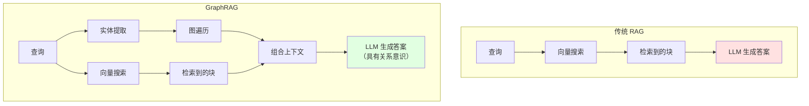
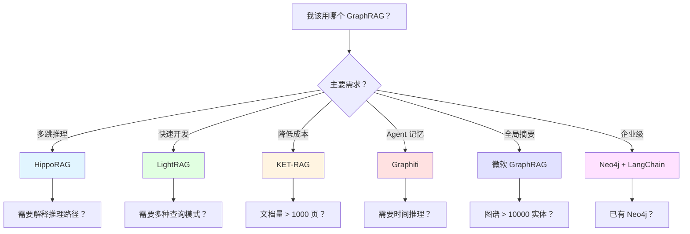

# 12.5 GraphRAG

<DifficultyBadge level="advanced" />
<CostBadge cost="$0.05" />

> 前置章节：12.1 RAG 基础、12.2 嵌入向量

### 为什么需要它？（问题）

传统 RAG 有个不可告人的秘密：它**在回答关系问题时很糟糕**。

```
你的知识库：
  文档 1："Alice 是 Acme Corp 的 CTO"
  文档 2："Acme Corp 在 2025 年收购了 Beta Inc"
  文档 3："Beta Inc 的主要产品是 CloudDB"

用户："Alice 的公司有什么产品？"

传统 RAG：检索文档 1（Alice → Acme）和可能的文档 3（CloudDB）
但错过了连接：Alice → Acme → 收购 Beta → CloudDB

GraphRAG：构建知识图谱，跟随关系链，
正确回答："Alice 的公司 Acme Corp 收购了 Beta Inc，
该公司生产 CloudDB。"
```

::: tip 类比
传统 RAG 就像一个能在图书馆找到任何书的图书管理员，但不理解"书 A 的作者"与"书 B 中提到的教授"是同一个人。GraphRAG 是那个还保持着一切如何连接的心理地图的图书管理员。
:::

### 它是什么？（概念）

**GraphRAG** = 知识图谱 + 向量检索协同工作。



**工作原理：**

1. **索引阶段**：从文档中提取实体和关系 → 构建知识图谱
2. **查询阶段**：从问题中提取实体 → 遍历图获取相关实体 → 与向量检索的块组合 → 生成答案

**何时使用什么：**

| 场景 | 传统 RAG | GraphRAG |
|------|----------|----------|
| "我们的退款政策是什么？" | 很好 | 过度设计 |
| "项目 X 与团队 Y 有何关系？" | 很差 | 很好 |
| "谁批准了功能 Z 的预算？" | 错过连接 | 跟随链条 |
| 简单事实查找 | 完美 | 不必要的开销 |
| 多跳推理 | 挣扎 | 闪耀 |

::: warning 诚实说
GraphRAG 为你的 RAG 流水线增加了显著的复杂性和成本。如果你 90% 的查询都是简单的事实查找（"API 速率限制是多少？"），坚持使用常规 RAG。GraphRAG 适用于用户问的问题需要跨文档连接点的情况。
:::

### 微软的 GraphRAG 实现

微软在 2024 年开源了 [graphrag](https://github.com/microsoft/graphrag)，它已成为参考实现。

**核心概念**：使用 LLM 自动从文档中提取实体和关系，无需手动标注就能构建知识图谱。

```python
# 简化的 GraphRAG 概念
# 步骤 1：使用 LLM 提取实体和关系
prompt = """
从这段文本中提取所有实体及其关系：
"Alice 在 2024 年加入 Acme Corp 担任 CTO。Acme Corp 总部位于旧金山。"

输出为 JSON：
"""
# LLM 返回：
# entities: [Alice, Acme Corp, CTO, SF, 2024]
# relations: [(Alice, ROLE_AT, Acme Corp), (Acme Corp, LOCATED_IN, SF)]

# 步骤 2：存储在图数据库中
# 步骤 3：查询时，遍历图 + 向量搜索
```

### 2025-2026 GraphRAG 工具生态

过去一年，GraphRAG 从概念验证变成了**生产级工具**。各家工具的定位很明确：

| 工具 | 最适合 | 发表/发布 | 核心优势 |
|-----|--------|----------|---------|
| **HippoRAG** | 多跳推理 | NEURIPS 2024 | 模拟海马体记忆机制 |
| **LightRAG** | 开发体验 | EMNLP 2025 | 简单 API、快速上手 |
| **KET-RAG** | 成本优化 | KDD 2025 | 索引成本降低 90% |
| **Graphiti** | Agent 记忆 | Zep 2025 | 时间感知知识图谱 |
| **MS GraphRAG** | 社区摘要 | 微软 2024 | 原创实现、稳定 |
| **Neo4j** | 企业集成 | - | 成熟图数据库 |

#### 1. HippoRAG：多跳推理之王

**特点**：受人类海马体启发，模拟记忆提取过程

```
问题："Alice 的公司收购的产品是什么？"

HippoRAG 的推理路径：
  1. [检索] Alice → 找到 Acme Corp
  2. [关联] Acme Corp → 找到收购关系 → Beta Inc
  3. [推理] Beta Inc → 找到产品 → CloudDB
  4. [验证] 向量搜索确认每步的文档支持

传统 GraphRAG：可能直接返回 Acme Corp 的信息，错过收购链
HippoRAG：像人类一样"回忆"关联信息
```

**实战：HippoRAG 使用**

```python
from hipporag import HippoRAG

# 初始化
hippo = HippoRAG(
    llm=llm,
    embedding_model=embeddings,
    graph_store="neo4j"
)

# 索引文档（自动构建记忆图）
hippo.index(documents)

# 查询（多跳推理）
result = hippo.query(
    "Alice 的公司收购的产品是什么？",
    max_hops=3,  # 最多 3 跳推理
    return_path=True  # 返回推理路径
)

print(result.answer)  # "CloudDB"
print(result.path)    # Alice → Acme → Beta → CloudDB
```

::: tip 何时用 HippoRAG
- 问题需要 2 跳以上推理
- 需要解释"AI 怎么找到答案的"
- 知识库有复杂实体关系网络
:::

#### 2. LightRAG：最佳开发体验

**特点**：3 行代码上手，自动处理图构建和查询

```python
from lightrag import LightRAG

# 初始化（自动配置）
rag = LightRAG(working_dir="./graph_cache")

# 插入文档（自动提取实体和关系）
rag.insert("""
Alice 在 2024 年加入 Acme Corp 担任 CTO。
Acme Corp 在 2025 年收购了 Beta Inc。
Beta Inc 的主要产品是 CloudDB。
""")

# 查询（自动决定是否需要图遍历）
answer = rag.query("Alice 负责的公司有什么产品？")
print(answer)  # "Alice 担任 CTO 的 Acme Corp 收购了 Beta Inc，该公司的产品是 CloudDB。"
```

**四种查询模式：**

```python
# 1. 朴素模式：只用向量搜索
rag.query("Python 是什么？", mode="naive")

# 2. 本地模式：实体 + 直接关系
rag.query("Alice 在哪工作？", mode="local")

# 3. 全局模式：社区摘要（类似微软 GraphRAG）
rag.query("公司之间有哪些收购关系？", mode="global")

# 4. 混合模式：自动选择（推荐）
rag.query("Alice 的团队负责什么产品？", mode="hybrid")
```

::: tip 何时用 LightRAG
- 快速原型开发
- 不想配置复杂参数
- 需要多种查询模式支持
- 发表于 EMNLP 2025，学术认可
:::

#### 3. KET-RAG：成本杀手

**特点**：通过"知识增强的 Token"减少索引成本

```
传统 GraphRAG 索引成本：
  - 1000 页文档
  - 每页调用 LLM 提取实体 → 1000 次 API 调用
  - GPT-4: $30-50

KET-RAG 的优化：
  - 批量处理，共享上下文
  - 只对关键实体调用 LLM
  - 其他实体用 NER 模型提取
  - 成本：$3-5（降低 90%）
```

**实战：KET-RAG**

```python
from ketrag import KETRAG

rag = KETRAG(
    llm=llm,
    use_cheap_ner=True,  # 用开源 NER 模型
    llm_only_for_relations=True,  # LLM 只提取关系
    batch_size=50  # 批量处理
)

# 索引（成本优化）
rag.index(documents)  # 比传统方法便宜 10 倍

# 查询（质量不变）
answer = rag.query("Alice 的团队负责什么？")
```

::: tip 何时用 KET-RAG
- 需要索引大量文档（>1000 页）
- 预算有限
- 对查询速度要求不高
- 发表于 KDD 2025，工业界认可
:::

#### 4. Graphiti：Agent 的记忆系统

**特点**：时间感知的知识图谱，专为 Agent 设计

```
普通 GraphRAG：静态知识图谱
  - "Alice 是 Acme Corp 的 CTO"

Graphiti：时间感知图谱
  - "Alice 从 2024-01-15 起担任 Acme Corp 的 CTO"
  - "Alice 在 2024-03-20 批准了 Project X 的预算"
  - "Alice 在 2024-06-10 的会议上说'Q3 聚焦 AI'"
```

**实战：Graphiti（by Zep）**

```python
from graphiti import Graphiti
from datetime import datetime

# 初始化（时间感知）
graphiti = Graphiti(
    zep_api_key="your-key",
    enable_temporal=True
)

# 添加事件（带时间戳）
graphiti.add_event(
    text="Alice 批准了 Project X 的预算",
    timestamp=datetime(2024, 3, 20),
    entities=["Alice", "Project X"]
)

# 查询（可以问"什么时候"）
answer = graphiti.query("Alice 什么时候批准了 Project X？")
# → "Alice 在 2024 年 3 月 20 日批准了 Project X 的预算"

# 时间范围查询
events = graphiti.query_temporal(
    "Alice 在 Q2 做了什么决策？",
    start_date=datetime(2024, 4, 1),
    end_date=datetime(2024, 6, 30)
)
```

**Graphiti 的杀手级功能：**

1. **时间推理**："Alice 批准预算后做了什么？"
2. **事件溯源**："为什么 Project X 被取消了？"（追踪决策链）
3. **记忆演化**：实体属性随时间变化（职位、关系等）

::: tip 何时用 Graphiti
- 构建长期运行的 Agent
- 需要追踪决策历史
- 问题涉及"什么时候、为什么、后来怎么样"
- 与 Zep 的会话记忆无缝集成
:::

#### 5. 微软 GraphRAG：社区摘要

**特点**：将图聚类成"社区"，生成摘要回答全局问题

```
场景：分析公司组织架构

文档：
  - "Alice 是 CTO，管理工程团队"
  - "Bob 是工程经理，向 Alice 汇报"
  - "Carol 是产品经理，向 David 汇报"
  - "David 是 CPO"

微软 GraphRAG：
  1. 构建图：Alice → Bob, David → Carol
  2. 聚类：发现两个社区（工程团队、产品团队）
  3. 生成摘要：
     - 社区 1："工程团队由 Alice 领导，包括 Bob"
     - 社区 2："产品团队由 David 领导，包括 Carol"
  4. 查询"公司有哪些团队？"：直接从摘要回答（快！）
```

**实战：微软 GraphRAG**

```python
from graphrag.query import GlobalSearch, LocalSearch

# 全局搜索（用社区摘要）
global_search = GlobalSearch(
    llm=llm,
    graph=graph,
    use_community_summary=True
)

# 适合宏观问题
answer = global_search.search("公司的组织架构是怎样的？")
# → 从社区摘要快速生成概览

# 本地搜索（实体 + 关系遍历）
local_search = LocalSearch(
    llm=llm,
    graph=graph
)

# 适合具体问题
answer = local_search.search("Alice 管理哪些人？")
# → 遍历 Alice 的直接关系
```

::: tip 何时用微软 GraphRAG
- 需要回答"整体概况"问题
- 知识图谱很大（>10000 实体）
- 追求稳定性（微软维护）
- 不介意复杂配置
:::

#### 6. Neo4j：企业级图数据库

**特点**：成熟的图数据库，与各种 GraphRAG 框架集成

```python
from langchain_community.graphs import Neo4jGraph
from langchain.chains import GraphCypherQAChain

# 连接 Neo4j
graph = Neo4jGraph(
    url="bolt://localhost:7687",
    username="neo4j",
    password="password"
)

# 用 Cypher 查询（图查询语言）
result = graph.query("""
MATCH (alice:Person {name: 'Alice'})-[:WORKS_AT]->(company:Company)
MATCH (company)-[:ACQUIRED]->(acquired:Company)
MATCH (acquired)-[:PRODUCES]->(product:Product)
RETURN product.name
""")

# 或用 LangChain 自动生成 Cypher
qa_chain = GraphCypherQAChain.from_llm(
    llm=llm,
    graph=graph
)
answer = qa_chain.run("Alice 的公司收购的产品是什么？")
```

**Neo4j 的优势：**

1. **成熟稳定**：10+ 年开发历史
2. **性能强大**：百万实体级别的图遍历
3. **可视化**：内置图浏览器
4. **生态丰富**：与 LangChain、LlamaIndex、HippoRAG 等集成

::: tip 何时用 Neo4j
- 企业生产环境
- 需要复杂图查询（多跳、路径查找）
- 已有 Neo4j 基础设施
- 团队熟悉 Cypher 语言
:::

### 工具选择指南



**快速决策：**

- **原型开发** → LightRAG（3 行代码）
- **生产环境 + 多跳推理** → HippoRAG
- **预算紧张** → KET-RAG
- **构建 Agent** → Graphiti（by Zep）
- **大规模知识库** → 微软 GraphRAG + Neo4j
- **已有 Neo4j** → 直接集成 LangChain

### 实战：组合使用多个工具

实际项目中，可以**组合使用**多个工具：

```python
# 示例：客服 Agent 记忆系统

# 1. Graphiti：存储用户对话历史（时间感知）
from graphiti import Graphiti
memory = Graphiti(enable_temporal=True)
memory.add_event(
    "用户 Alice 在 2024-01-15 投诉了产品 Bug",
    timestamp=datetime(2024, 1, 15)
)

# 2. LightRAG：索引产品文档（快速检索）
from lightrag import LightRAG
docs_rag = LightRAG(working_dir="./product_docs")
docs_rag.insert(product_documentation)

# 3. HippoRAG：处理复杂问题（多跳推理）
from hipporag import HippoRAG
complex_rag = HippoRAG(graph_store="neo4j")

# 4. 路由逻辑
def customer_service_agent(question):
    if "什么时候" in question or "历史" in question:
        # 时间相关 → Graphiti
        return memory.query_temporal(question)
    
    elif is_complex_question(question):
        # 多跳推理 → HippoRAG
        return complex_rag.query(question, max_hops=3)
    
    else:
        # 简单文档查询 → LightRAG
        return docs_rag.query(question, mode="hybrid")

# 查询
answer = customer_service_agent("Alice 上次投诉的产品有哪些已知问题？")
# → Graphiti 找到"2024-01-15 投诉"
# → HippoRAG 推理"投诉 → 产品 → 已知问题"
# → LightRAG 检索产品文档中的问题列表
```

### 总结（反思）

- **我们解决了什么**：理解 GraphRAG 的应用场景，掌握 2025-2026 年的主流工具选型
- **关键要点**：
  1. 传统 RAG 检索**块**，GraphRAG 理解**关系**
  2. **工具选型**：
     - HippoRAG：多跳推理 + 路径解释
     - LightRAG：最佳开发体验（EMNLP 2025）
     - KET-RAG：降低 90% 索引成本（KDD 2025）
     - Graphiti：Agent 时间感知记忆（by Zep）
     - 微软 GraphRAG：社区摘要 + 稳定性
     - Neo4j：企业级图数据库
  3. **何时使用**：问题需要跨文档**多跳推理**时才用 GraphRAG
  4. **不要过度工程**——大多数问答系统用常规 RAG 就很好
  5. **组合使用**：Graphiti(历史) + LightRAG(文档) + HippoRAG(复杂推理)

**下一步**：想让 RAG 系统自主决策、使用工具、执行复杂任务？见 [12.6 Agentic RAG](./agentic-rag.md)

> *"GraphRAG 是知道拼图块在哪里和真正看到它们形成的画面之间的区别。2025 年的工具让这一切变得实用了。"*

---

*最后更新：2026-02-22*
