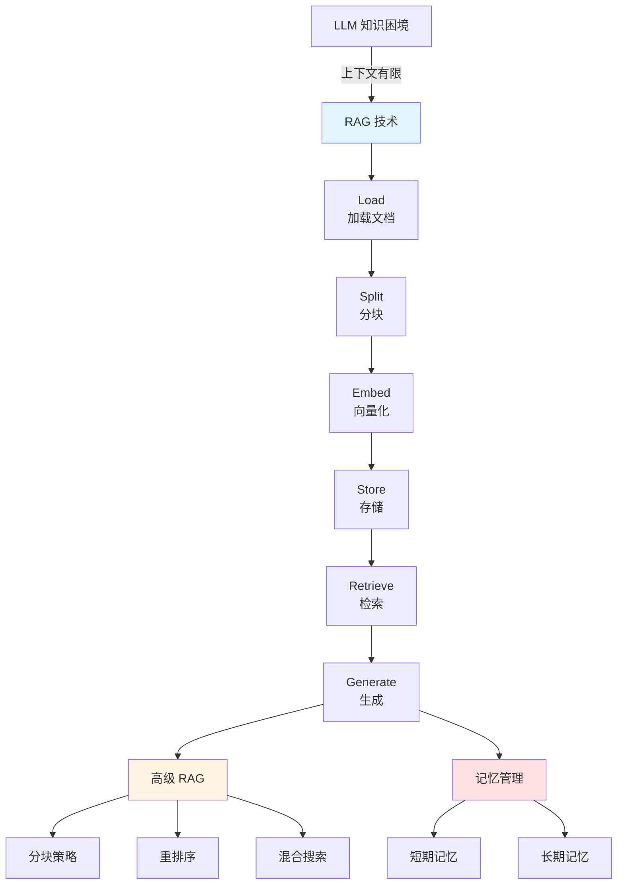
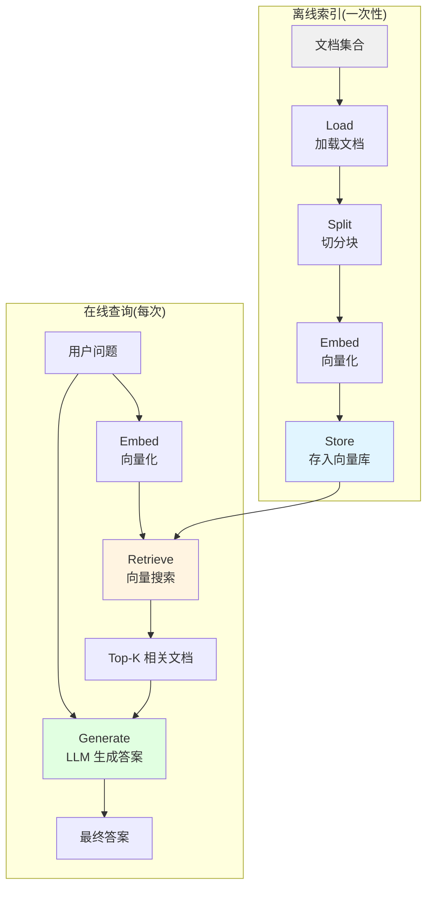

# 第 12 章:RAG & 记忆存储

> 学完本章,你能:构建 RAG 系统,使用向量数据库,实现 AI 记忆管理



**章节导览:**

- **12.1 RAG 基础**:理解 RAG 原理,从零构建 RAG 系统
- **12.2 Embedding & 向量数据库**:向量化与向量搜索
- **12.3 高级 RAG**:分块策略、重排序、混合搜索
- **12.4 Memory & Storage**:AI 记忆管理,对话上下文保持

---

::: tip 运行环境
本章代码涉及多个库，建议一次性安装：
```bash
pip install openai langchain chromadb python-dotenv
```
部分高级示例还需要：
```bash
pip install rank_bm25 cohere  # 混合检索、重排序
```
:::

## 12.1 RAG 基础 <DifficultyBadge level="intermediate" /> <CostBadge cost="$0.02" />

> LLM 就像个学霸，但考试不让看书？RAG 说：让 AI **开卷考试**，成绩蹭蹭涨！

> 前置知识:3.1 LLM 基础

### 为什么需要它?(Problem)

::: warning LLM 的三大尴尬时刻
**尴尬 1：时间旅行者的困惑**
- 用户："2026 年谁当选了？"
- GPT-4："我的知识截止 2024 年 12 月..."
- 用户：💢

**尴尬 2：公司机密读不到**
- 用户："我们公司的销售政策是？"
- Claude："我没见过你们的内部文档..."
- 用户：💢💢

**尴尬 3：信息过载宕机**
- 你：塞 100 万字进 Prompt
- LLM："太多了，我头晕..." *挂了*
- 你：💢💢💢
:::

**问题:LLM 的三大知识困境**

```
困境 1:知识过时
─────────────────
GPT-4.1 训练数据截止 2024 年 12 月
Claude Sonnet 4.6 训练数据截止 2024 年 10 月
用户: "2026 年谁是总统?"
LLM: "我不知道 2026 年的信息"

困境 2:私有数据
─────────────────
公司内部文档、用户数据、代码库
LLM 训练时没见过,无法回答

困境 3:上下文长度有限
─────────────────
GPT-4.1: 1M tokens
GPT-5: 400K tokens
但全塞进 Prompt:
  ❌ 成本高($0.01/1K tokens,300 页=$30)
  ❌ 效果差(信息过载,注意力分散)
  ❌ 延迟高(处理时间长)
```

**三种解决方案对比:**

| 方案 | 原理 | 优点 | 缺点 | 适用场景 |
|-----|------|-----|------|---------|
| **Long Context** | 塞进 Prompt | 简单 | 贵、慢、效果差 | 小规模、一次性 |
| **Fine-tuning** | 重新训练模型 | 效果好 | 成本高、数据会过时、训练慢 | 专业领域、稳定知识 |
| **RAG** | 外挂知识库 | 成本低、实时更新、灵活 | 检索质量影响效果 | 通用场景、动态数据 |

**RAG 是什么?**

RAG = **R**etrieval **A**ugmented **G**eneration(检索增强生成)

```
传统 LLM:
用户问题 → LLM → 答案
(仅依赖训练时的知识)

RAG:
用户问题 → [检索相关知识] → LLM + 知识 → 答案
(动态注入外部知识)
```

**真实案例:客服机器人**

```python
# 传统方式:全塞 Prompt
prompt = f"""
你是客服机器人,请回答用户问题。

公司信息:
{全部产品手册}  # 假设 50 万字
{全部 FAQ}       # 假设 10 万字
{全部政策文档}   # 假设 5 万字

用户问题:{question}
"""

问题:
❌ 65 万字 ≈ 160 万 tokens
❌ 成本:$16/次查询(GPT-4)
❌ 延迟:10+ 秒
❌ 效果:LLM 被无关信息淹没

# RAG 方式:只检索相关内容
prompt = f"""
你是客服机器人,请回答用户问题。

相关信息:
{检索出的 3 段相关内容}  # 假设 2000 字

用户问题:{question}
"""

优势:
✅ 2000 字 ≈ 500 tokens
✅ 成本:$0.005/次查询
✅ 延迟:1 秒
✅ 效果:LLM 专注于相关信息
```

### 它是什么?(Concept)

::: tip 类比时间：开卷考试
**闭卷考试（传统 LLM）：**
- 只能靠脑子里的知识
- 知识过时？没办法
- 没学过的？不会

**开卷考试（RAG）：**
- 可以翻书、查资料
- 最新知识？查书就行
- 专业问题？找到相关章节就能答

**RAG = 给 AI 开卷考试的资格** 📚
:::

**RAG 工作流程:**



**六个核心步骤:**

### 1. Load(加载文档)

```python
# 支持多种格式
from langchain.document_loaders import (
    TextLoader,       # .txt
    PyPDFLoader,      # .pdf
    UnstructuredMarkdownLoader,  # .md
    CSVLoader,        # .csv
    JSONLoader,       # .json
    WebBaseLoader     # 网页
)

# 示例:加载 PDF
loader = PyPDFLoader("document.pdf")
documents = loader.load()
```

### 2. Split(切分块)

为什么要切分?
- Embedding 模型有长度限制(通常 512 tokens)
- 小块更精准(检索时)
- 控制成本(每次查询只返回几个小块)

```python
from langchain.text_splitter import RecursiveCharacterTextSplitter

text_splitter = RecursiveCharacterTextSplitter(
    chunk_size=1000,        # 每块 1000 字符
    chunk_overlap=200,      # 块之间重叠 200 字符
    length_function=len,
    is_separator_regex=False,
)

chunks = text_splitter.split_documents(documents)
```

### 3. Embed(向量化)

将文本转换为向量(数字数组):

```python
from openai import OpenAI

client = OpenAI()

# 文本 → 向量
response = client.embeddings.create(
    model="text-embedding-3-small",
    input="这是一段文本"
)

vector = response.data[0].embedding
# [0.123, -0.456, 0.789, ...] (1536 维)
```

**为什么需要向量化?**

```
文本 A:"狗是人类的朋友"
文本 B:"犬类是人类的好伙伴"

如果用关键词匹配:
  → 完全不匹配(没有相同词)

如果用向量:
  → 向量 A 和向量 B 很接近(语义相似)
  → cosine_similarity(A, B) = 0.92
```

### 4. Store(存储)

将向量存入向量数据库:

```python
from langchain.vectorstores import Chroma

vectorstore = Chroma.from_documents(
    documents=chunks,
    embedding=OpenAIEmbeddings(),
    persist_directory="./chroma_db"
)
```

### 5. Retrieve(检索)

根据问题向量,检索最相关的文档块:

```python
# 用户问题
question = "狗的特点是什么?"

# 检索 Top-3 相关文档
docs = vectorstore.similarity_search(question, k=3)

for doc in docs:
    print(doc.page_content)
```

### 6. Generate(生成答案)

将检索到的文档 + 问题 → LLM 生成答案:

```python
from openai import OpenAI

client = OpenAI()

# 构造 Prompt
context = "\n\n".join([doc.page_content for doc in docs])
prompt = f"""
请基于以下信息回答问题:

{context}

问题:{question}
"""

# 生成答案
response = client.chat.completions.create(
    model="gpt-4.1-mini",
    messages=[{"role": "user", "content": prompt}]
)

print(response.choices[0].message.content)
```

**完整 RAG 流程代码:**

```python
from langchain.document_loaders import TextLoader
from langchain.text_splitter import RecursiveCharacterTextSplitter
from langchain.embeddings import OpenAIEmbeddings
from langchain.vectorstores import Chroma
from openai import OpenAI

# 1. Load
loader = TextLoader("knowledge.txt")
documents = loader.load()

# 2. Split
text_splitter = RecursiveCharacterTextSplitter(
    chunk_size=1000,
    chunk_overlap=200
)
chunks = text_splitter.split_documents(documents)

# 3. Embed + 4. Store
vectorstore = Chroma.from_documents(
    documents=chunks,
    embedding=OpenAIEmbeddings()
)

# 5. Retrieve
question = "用户的问题"
docs = vectorstore.similarity_search(question, k=3)

# 6. Generate
client = OpenAI()
context = "\n\n".join([doc.page_content for doc in docs])
prompt = f"基于以下信息回答问题:\n\n{context}\n\n问题:{question}"

response = client.chat.completions.create(
    model="gpt-4.1-mini",
    messages=[{"role": "user", "content": prompt}]
)

print(response.choices[0].message.content)
```

**RAG vs Fine-tuning vs Long Context:**

| 维度 | RAG | Fine-tuning | Long Context |
|-----|-----|-------------|-------------|
| **成本** | 低($0.01/查询) | 高($100-$10,000) | 中($0.30/查询) |
| **实时性** | 实时更新 | 重新训练 | 实时 |
| **数据量** | 无限(外部库) | 有限(训练集) | 有限(128K tokens) |
| **准确性** | 中(取决于检索) | 高 | 中(注意力分散) |
| **延迟** | 中(检索+生成) | 低(直接生成) | 高(长文本处理) |
| **适用场景** | 动态知识、通用 | 专业领域、固定知识 | 单文档分析 |

### 动手试试(Practice)

完整的 RAG 系统实现,从文本文件构建知识库并回答问题。

<ColabBadge path="demos/12-rag-memory/basic_rag.ipynb" />

### 小结(Reflection)

- **解决了什么**:理解了 RAG 如何解决 LLM 的知识困境,并掌握了基础 RAG 流程
- **没解决什么**:RAG 的核心是向量搜索,但向量是什么?向量数据库如何工作?——下一节详解
- **关键要点**:
  1. **RAG 解决三大困境**:知识过时、私有数据、上下文长度
  2. **六步流程**:Load → Split → Embed → Store → Retrieve → Generate
  3. **核心原理**:检索相关知识,动态注入 Prompt
  4. **成本优势**:只检索相关内容,不需要全量训练或全量输入
  5. **实时更新**:知识库更新,立即生效
  6. **RAG vs 其他方案**:各有优劣,根据场景选择

::: tip 一句话总结
**RAG = 开卷考试，让 AI 边查资料边答题，成本低、效果好、知识还能实时更新。**
:::

**关键洞察:**
- RAG 不是替代 Fine-tuning,而是**互补**:Fine-tuning 提升模型能力,RAG 提供最新知识
- RAG 的效果**高度依赖检索质量**:检索不准,再强的 LLM 也没用

---

*最后更新:2026-02-20*
