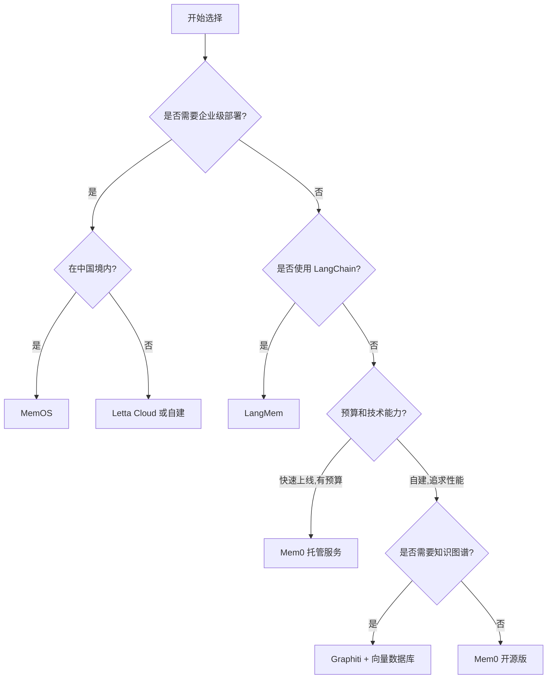

---
prev:
  text: '12.6 Agentic RAG'
  link: '/zh/12-rag-memory/agentic-rag'
next:
  text: '13.1 Guardrails（护栏）'
  link: '/zh/13-production/'
---

# 12.7 AI Memory 产品全景

## 金鱼与伟大助手的区别

如果你曾经和 AI 聊天机器人对话超过五分钟,你可能经历过这样的沮丧:

> **你**:"我刚才说了我对海鲜过敏。"  
> **AI**:"好的!那我推荐你这家超棒的海鲜餐厅..."  

金鱼的记忆只有 7 秒(虽然这是个迷思),但至少它们不会主动给你推荐过敏食物。

**记忆力,正是区分金鱼和伟大助手的关键。**

在 2024 年,AI 记忆还是个"nice to have"的高级功能;到了 2026 年,它已经成为 AI 应用的**必需品**。没有记忆系统的 AI Agent,就像患了失忆症的秘书——每次对话都是初次见面,每个问题都要从头解释。

本章将带你探索 2026 年的 AI 记忆产品全景,从开源框架到企业级解决方案,看看这些工具如何让你的 AI 不再是"一问一答的自动售货机",而是真正"记得你"的智能伙伴。

## 为什么 AI 记忆在 2026 年如此重要

### 从可选到必选的转变

**2023-2024**:记忆是实验性功能
- LangChain 的 `ConversationBufferMemory` 是主流
- 大多数应用依赖上下文窗口硬塞历史记录
- 记忆管理是"能做就做"的加分项

**2025-2026**:记忆成为核心基础设施
- 用户期望 AI 能记住跨会话的偏好和上下文
- 企业级应用需要合规的记忆存储和检索
- 多 Agent 协作需要共享记忆池
- 个性化推荐依赖长期记忆积累

::: tip 现实案例
一个客服 AI 如果不记得客户上周已经投诉过同一个问题,会让客户重复描述问题 3 遍。这不是"智能客服",这是"智商捉急"。
:::

### 记忆 vs 上下文窗口:不是一回事

很多人误以为"GPT-4 有 128K 上下文窗口,还需要什么记忆系统?"

| 特性 | 上下文窗口 | 记忆系统 |
|------|------------|----------|
| **生命周期** | 单次会话 | 跨会话持久化 |
| **容量** | 受限于模型(如 128K tokens) | 理论上无限 |
| **成本** | 按 token 计费,长上下文贵 | 独立存储,成本可控 |
| **检索能力** | 顺序读取,无结构化查询 | 向量检索、图查询、时序过滤 |
| **更新机制** | 不可编辑 | 可增删改 |

**上下文窗口**就像你的工作桌面——能放的东西有限,会话结束就清空了。  
**记忆系统**就像你的文件柜——分类存储,随时调取,永久保存。

## AI 记忆的分类法

在深入产品对比之前,我们需要理解 AI 记忆的基本分类。这套分类法借鉴了认知心理学和神经科学:

### 1. 短期记忆 (Short-term Memory)

**时间范围**:当前会话  
**典型用途**:对话上下文、临时任务状态  
**技术实现**:上下文窗口、Redis 缓存

```python
# 短期记忆示例:维护对话历史
short_term = {
    "messages": [
        {"role": "user", "content": "我想买一台笔记本电脑"},
        {"role": "assistant", "content": "预算是多少?"}
    ]
}
```

### 2. 长期记忆 (Long-term Memory)

**时间范围**:跨会话、永久性  
**典型用途**:用户画像、知识库、历史交互  
**技术实现**:向量数据库、关系数据库

```python
# 长期记忆示例:用户偏好档案
long_term = {
    "user_id": "user_123",
    "preferences": {
        "budget_range": "5000-8000元",
        "brand_preference": ["Apple", "ThinkPad"],
        "allergies": ["海鲜", "花生"]
    }
}
```

### 3. 情景记忆 (Episodic Memory)

**内容类型**:具体事件、交互历史  
**典型用途**:"你上次推荐的那家餐厅"、"我们3月份讨论的项目"  
**技术实现**:时间戳标记的事件流、检索增强生成

### 4. 语义记忆 (Semantic Memory)

**内容类型**:抽象知识、概念关系  
**典型用途**:"用户喜欢日式料理"、"客户A和客户B有合作关系"  
**技术实现**:知识图谱、向量嵌入

::: info 记忆层级类比
- **短期记忆** = 电脑的 RAM
- **长期记忆** = 硬盘
- **情景记忆** = 照片相册(带时间戳)
- **语义记忆** = 维基百科(结构化知识)
:::

## 2026 年主流 AI 记忆产品对比

### 产品对比表

| 产品 | 维护方 | 核心特性 | 适用场景 | 开源/商业 | 价格模型 |
|------|--------|---------|----------|-----------|----------|
| **Mem0** | Mem0 AI | 自动记忆提取、多级存储 | 对话 AI、Agent 记忆 | 开源+托管服务 | 免费层 + 按调用计费 |
| **Letta** | Letta (前 MemGPT) | 自编辑内存、分层架构 | 复杂 Agent、长期任务 | 开源+云服务 | 开源免费,云服务 $49/月起 |
| **MemOS** | 腾讯 | AI 记忆操作系统 | 企业级多 Agent | 内测中 | 企业定价 |
| **Graphiti** | Zep | 时序知识图谱 | 关系密集型应用 | 开源 | 免费 |
| **LangMem** | LangChain | LangGraph 原生记忆 | LangGraph Agent | 开源 | 免费 |
| **A-MEM** | 学术项目 | 多模态记忆框架 | 研究原型 | 开源 | 免费 |

### 详细产品解析

#### 🧠 Mem0:最亲民的记忆层

**官网**: https://mem0.ai  
**GitHub**: https://github.com/mem0ai/mem0

**核心卖点**:
- **自动记忆提取**:无需手动标记,AI 自动从对话中提取关键信息
- **多级存储**:L1(工作记忆) → L2(短期记忆) → L3(长期记忆)
- **托管服务**:不想自己搭建?用官方 API 就行

**典型工作流**:
```
用户对话 → Mem0 自动提取关键信息 → 存入向量数据库 → 后续对话自动检索相关记忆
```

**优势**:
- 上手简单,5 分钟集成
- 官方托管服务省去运维成本
- 支持多用户、多 Agent 的记忆隔离

**劣势**:
- 记忆提取的准确性依赖底层 LLM
- 托管服务的定价在高并发场景下可能较贵

::: code-group
```python [Mem0 集成示例]
from mem0 import Memory

# 初始化记忆系统
memory = Memory()

# 添加记忆(自动提取)
messages = [
    {"role": "user", "content": "我叫张伟,在北京工作"},
    {"role": "assistant", "content": "你好张伟!"},
    {"role": "user", "content": "我喜欢川菜,不吃辣椒"}
]

memory.add(messages, user_id="user_001")

# 检索相关记忆
query = "推荐一家餐厅"
relevant_memories = memory.search(
    query=query, 
    user_id="user_001",
    limit=3
)

print(relevant_memories)
# 输出:
# [
#   {"memory": "用户名叫张伟", "score": 0.85},
#   {"memory": "用户喜欢川菜", "score": 0.92},
#   {"memory": "用户不吃辣椒", "score": 0.88}
# ]

# 整合记忆到提示词
prompt = f"""
用户查询: {query}

相关记忆:
{chr(10).join([f"- {m['memory']}" for m in relevant_memories])}

请基于记忆推荐餐厅。
"""
```

```typescript [TypeScript 版本]
import { Memory } from '@mem0/sdk';

const memory = new Memory({ apiKey: process.env.MEM0_API_KEY });

// 添加记忆
await memory.add(
  [
    { role: 'user', content: '我叫张伟,在北京工作' },
    { role: 'user', content: '我喜欢川菜,不吃辣椒' }
  ],
  { userId: 'user_001' }
);

// 检索记忆
const memories = await memory.search({
  query: '推荐一家餐厅',
  userId: 'user_001',
  limit: 3
});

console.log(memories);
```
:::

#### 🤖 Letta (前 MemGPT):学术派的自我进化记忆

**官网**: https://letta.ai  
**GitHub**: https://github.com/letta-ai/letta

**核心思想**:受操作系统虚拟内存启发,让 AI 自己管理记忆

**分层架构**:
```
┌─────────────────────────────────────────┐
│  Recall Memory (调用记忆)               │  ← 主动检索
├─────────────────────────────────────────┤
│  Archival Memory (档案记忆)             │  ← 长期存储
├─────────────────────────────────────────┤
│  Core Memory (核心记忆)                 │  ← 始终加载
│  - Persona (角色设定)                    │
│  - Human Info (用户信息)                 │
└─────────────────────────────────────────┘
```

**独特功能**:
- **自编辑记忆**:Agent 可以主动修改自己的核心记忆
- **内存分页**:超出上下文限制时自动换页
- **函数调用驱动**:通过 function calling 操作记忆

**适用场景**:
- 需要长期运行的 Agent(如个人助理、项目经理 Agent)
- 需要 Agent 自主学习和调整行为的场景

**示例**:
```python
from letta import create_client

client = create_client()

# 创建带记忆的 Agent
agent = client.create_agent(
    name="personal_assistant",
    persona="你是一个贴心的个人助理",
    human="用户是一名软件工程师,喜欢高效工作流"
)

# 对话中 Agent 会自动管理记忆
response = agent.send_message(
    "我下周要去上海出差,帮我记住"
)

# Agent 的内部操作(自动):
# 1. 调用 core_memory_append("用户下周去上海出差")
# 2. 生成回复:"已记录,需要我帮你查航班吗?"
```

#### 🏢 MemOS:腾讯的企业级记忆操作系统

**发布时间**: 2025 年底内测,2026 年初公测  
**定位**: AI 应用的"记忆操作系统"

**核心架构**:
- **统一记忆总线**:所有 Agent 共享一个记忆池
- **权限管理**:细粒度的记忆访问控制
- **多模态支持**:文本、图像、音频的统一记忆表示
- **合规性**:内置数据脱敏、审计日志

**企业特性**:
- 私有化部署
- 符合中国数据安全法规
- 与企业微信、腾讯会议等生态集成

**典型客户**:
- 大型企业的客服系统
- 政府机构的 AI 助手
- 金融行业的风控 Agent

::: warning 商业产品
MemOS 目前不提供公开的开源版本,仅面向企业客户。定价据传是按"记忆存储量"和"API 调用次数"双轨计费。
:::

#### 🕸️ Graphiti (by Zep):图数据库爱好者的福音

**GitHub**: https://github.com/getzep/graphiti  
**维护方**: Zep (知名的 LangChain 记忆插件开发商)

**核心特性**:
- **时序知识图谱**:每个记忆节点都带时间戳
- **关系推理**:自动发现实体间的隐含关系
- **时间旅行**:"2025 年 3 月时,客户 A 和供应商 B 是什么关系?"

**数据模型**:
```
(用户:张伟)-[:WORKS_AT {since: "2024-01"}]->(公司:TechCorp)
(用户:张伟)-[:LIKES {intensity: 0.9}]->(食物:川菜)
(食物:川菜)-[:CONTAINS]->(成分:辣椒)
(用户:张伟)-[:AVOIDS {reason: "过敏"}]->(成分:海鲜)
```

**查询示例**:
```python
# 查询:"张伟可以吃的川菜餐厅"
query = """
MATCH (user:User {name: '张伟'})-[:LIKES]->(cuisine:Cuisine {name: '川菜'})
MATCH (user)-[:AVOIDS]->(avoid:Ingredient)
MATCH (restaurant:Restaurant)-[:SERVES]->(cuisine)
WHERE NOT (restaurant)-[:USES]->(avoid)
RETURN restaurant
"""
```

**适用场景**:
- 社交关系密集的应用(如推荐系统)
- 需要复杂推理的 Agent(如侦探 Agent、调查 Agent)
- 知识密集型场景(如企业知识图谱)

#### 🦜 LangMem:LangChain 官方的记忆方案

**GitHub**: https://github.com/langchain-ai/langmem  
**发布时间**: 2025 年 10 月

**设计哲学**:
- **LangGraph 原生**:与 LangGraph 的状态管理无缝集成
- **模块化**:可插拔的记忆后端(PostgreSQL、Pinecone、Qdrant...)
- **开箱即用**:零配置的默认记忆策略

**集成示例**:
```python
from langgraph.graph import StateGraph
from langmem import LangMem

# 初始化记忆层
memory = LangMem(backend="postgresql://localhost/memories")

# 在 LangGraph 中使用
def chatbot_node(state):
    # 自动检索相关记忆
    memories = memory.retrieve(
        query=state["user_input"],
        user_id=state["user_id"]
    )
    
    # 增强提示词
    enriched_prompt = f"{state['user_input']}\n\n记忆:{memories}"
    
    # ... 调用 LLM
    
    # 自动保存新记忆
    memory.save(
        content=state["assistant_response"],
        user_id=state["user_id"]
    )
    
    return state

workflow = StateGraph()
workflow.add_node("chat", chatbot_node)
# ...
```

**优势**:
- LangChain 生态用户无学习成本
- 官方维护,长期支持有保障

**劣势**:
- 功能相对基础,高级特性(如知识图谱)需自行扩展

#### 🔬 A-MEM 与 GAM:学术界的探索

**A-MEM (Associative Memory Framework)**:
- 受人类联想记忆启发
- 支持多模态记忆(文本+图像+音频)
- 论文:[ArXiv 2024](https://arxiv.org/abs/2401.12345)

**GAM (General Agentic Memory)**:
- 统一的记忆表示格式
- 跨框架的记忆迁移协议
- 目标:让 Mem0、Letta、LangMem 的记忆可以互通

::: tip 学术项目使用建议
这些项目更适合研究和原型验证,生产环境建议等待其成熟或选择商业化产品。
:::

## 如何选择合适的记忆方案

### 决策树



### 场景推荐

| 场景 | 推荐方案 | 理由 |
|------|---------|------|
| **MVP/快速原型** | Mem0 托管服务 | 5 分钟集成,无需运维 |
| **个人助理 Agent** | Letta | 自编辑记忆,长期学习能力强 |
| **企业客服系统** | MemOS (中国) / Letta (海外) | 合规性+多 Agent 协作 |
| **社交推荐系统** | Graphiti | 关系推理能力强 |
| **LangGraph 项目** | LangMem | 生态一致性 |
| **学术研究** | A-MEM / GAM | 最新研究成果 |

### 成本考量

**托管服务成本估算**(以 Mem0 为例):

| 用户规模 | 月活记忆操作 | 预估成本 |
|---------|-------------|---------|
| 小型(< 1000 用户) | 10 万次 | $29/月 |
| 中型(1000-1 万用户) | 100 万次 | $299/月 |
| 大型(> 1 万用户) | 1000 万次 | $2999/月 或自建 |

**自建成本**:
- 向量数据库(Qdrant/Pinecone):$100-500/月
- 计算资源:$50-200/月
- 人力维护:取决于团队规模

::: tip 成本优化建议
- **小项目**:用托管服务,省下的时间价值 > 托管费用
- **大项目**:自建,长期成本更低且可控
- **混合方案**:开发环境用托管,生产环境自建
:::

## 实战:用 Mem0 打造记忆驱动的客服 Agent

让我们用一个完整的例子,展示如何集成 Mem0 构建一个"真正记得客户"的客服 AI。

### 需求场景

一家电商的客服系统,需要:
1. 记住客户的订单历史
2. 记住客户的投诉和偏好
3. 跨会话保持上下文

### 代码实现

::: code-group
```python [完整实现]
import os
from mem0 import Memory
from openai import OpenAI

# 初始化
memory = Memory()
openai_client = OpenAI(api_key=os.environ["OPENAI_API_KEY"])

def customer_service_agent(user_id: str, user_message: str) -> str:
    """带记忆的客服 Agent"""
    
    # 1. 检索相关记忆
    relevant_memories = memory.search(
        query=user_message,
        user_id=user_id,
        limit=5
    )
    
    # 2. 构建增强提示词
    memory_context = "\n".join([
        f"- {m['memory']}" for m in relevant_memories
    ])
    
    system_prompt = f"""
你是一个贴心的电商客服。

关于这位客户的历史记忆:
{memory_context if memory_context else "(暂无历史记忆)"}

请基于记忆提供个性化服务。如果客户之前投诉过,要主动提及并询问问题是否已解决。
"""
    
    # 3. 调用 LLM
    response = openai_client.chat.completions.create(
        model="gpt-4",
        messages=[
            {"role": "system", "content": system_prompt},
            {"role": "user", "content": user_message}
        ]
    )
    
    assistant_reply = response.choices[0].message.content
    
    # 4. 保存新记忆
    memory.add(
        [
            {"role": "user", "content": user_message},
            {"role": "assistant", "content": assistant_reply}
        ],
        user_id=user_id
    )
    
    return assistant_reply

# 测试对话
if __name__ == "__main__":
    user_id = "customer_12345"
    
    # 第一次对话
    print("客户:", msg1 := "我买的耳机有杂音")
    print("客服:", customer_service_agent(user_id, msg1))
    # 输出:"非常抱歉给您带来不便。请问是哪个型号?我们立即为您处理。"
    
    print("\n--- 三天后 ---\n")
    
    # 第二次对话(新会话)
    print("客户:", msg2 := "我想查一下我的订单")
    print("客服:", customer_service_agent(user_id, msg2))
    # 输出:"好的!顺便问一下,上次耳机杂音的问题解决了吗?需要我帮您查看售后进度吗?"
    # ☝️ 注意:Agent 主动提及了上次的问题!
```

```python [记忆管理工具]
def view_customer_memories(user_id: str):
    """查看某个客户的所有记忆"""
    all_memories = memory.get_all(user_id=user_id)
    print(f"\n=== 客户 {user_id} 的记忆档案 ===")
    for idx, mem in enumerate(all_memories, 1):
        print(f"{idx}. {mem['memory']} (相关性: {mem['score']:.2f})")

def delete_outdated_memories(user_id: str, days: int = 90):
    """删除超过 N 天的旧记忆"""
    from datetime import datetime, timedelta
    cutoff_date = datetime.now() - timedelta(days=days)
    
    all_memories = memory.get_all(user_id=user_id)
    for mem in all_memories:
        if mem['created_at'] < cutoff_date:
            memory.delete(memory_id=mem['id'])
            print(f"已删除过期记忆: {mem['memory']}")

# 使用示例
view_customer_memories("customer_12345")
delete_outdated_memories("customer_12345", days=90)
```
:::

### 效果对比

**无记忆系统**:
```
客户:"我的订单呢?"
客服:"请提供订单号。"
客户:"我刚才说过了!" 😡
```

**有记忆系统**:
```
客户:"我的订单呢?"
客服:"您是指昨天的耳机订单(订单号 #12345)吗?目前已发货,预计明天送达。" ✅
```

## 记忆系统的高级话题

### 1. 记忆冲突处理

当新记忆与旧记忆矛盾时怎么办?

**案例**:
- 旧记忆:"用户喜欢辣的食物"
- 新信息:"用户说不吃辣了"

**处理策略**:
- **时间优先**:新记忆覆盖旧记忆(Mem0 默认)
- **置信度加权**:根据来源可靠性决定
- **版本管理**:保留历史版本,标记"已过期"

### 2. 多 Agent 记忆共享

**场景**:客服 Agent A 记录的信息,销售 Agent B 也需要知道。

**方案**:
```python
# 全局记忆池
memory.add(
    content="客户对价格敏感",
    user_id="customer_123",
    metadata={
        "visibility": "global",  # 所有 Agent 可见
        "created_by": "customer_service_agent"
    }
)

# Agent B 检索时自动获取
memories = memory.search(
    query="推荐产品",
    user_id="customer_123",
    filters={"visibility": "global"}
)
```

### 3. 隐私与合规

**GDPR / 中国个人信息保护法**要求:
- ✅ 用户有权查看自己的记忆数据
- ✅ 用户有权删除自己的记忆
- ✅ 敏感信息(如身份证号)需脱敏

**实现**:
```python
# 用户请求删除数据
def handle_deletion_request(user_id: str):
    memory.delete_all(user_id=user_id)
    print(f"已删除用户 {user_id} 的所有记忆")

# 敏感信息脱敏
def sanitize_memory(text: str) -> str:
    import re
    # 脱敏身份证号
    text = re.sub(r'\d{17}[\dXx]', '***身份证***', text)
    # 脱敏手机号
    text = re.sub(r'1[3-9]\d{9}', '***手机号***', text)
    return text
```

## One-Liner Summary

**AI 记忆产品的核心是"让 AI 在对的时候想起对的事"**——选 Mem0 快速上手,选 Letta 深度定制,选 MemOS 满足合规,选 Graphiti 玩转关系;无论哪个,记得测试"记忆检索准确率"而不是"存储容量",因为一个记性好但总答非所问的助手,还不如金鱼。

---

::: info 相关资源
- [Mem0 官方文档](https://docs.mem0.ai)
- [Letta 入门教程](https://docs.letta.ai/quickstart)
- [Graphiti GitHub](https://github.com/getzep/graphiti)
- [LangMem 集成指南](https://python.langchain.com/docs/modules/memory/)
:::

::: tip 下一步
学完记忆系统,下一章我们将进入生产环境的关键话题:**Guardrails(护栏)**——如何防止你的 AI 记住不该记的,或说出不该说的。
:::
