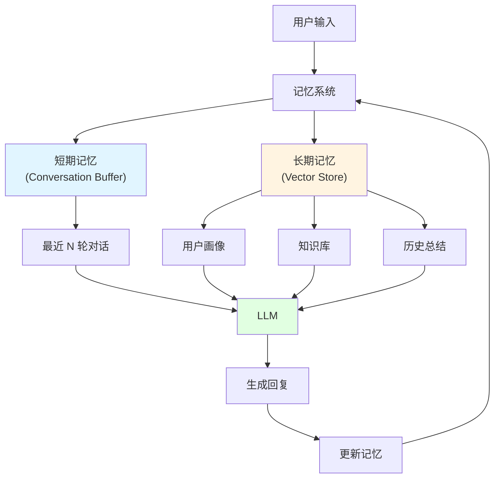

# 12.4 Memory & Storage <DifficultyBadge level="advanced" /> <CostBadge cost="$0.02" />

> AI 聊完就忘？给它装个 **记忆卡**，让它记住你是谁、你喜欢什么！

> 前置知识:12.1 RAG 基础

### 为什么需要它?(Problem)

::: warning AI 的"金鱼记忆"
**对话实录：**

你："我叫小明"
AI："你好小明！很高兴认识你。"

你："我喜欢编程"
AI："编程是个好爱好！"

你："我叫什么名字？"
AI："抱歉，你没告诉我你的名字。" ❌

**你：**💢💢💢 刚说的都忘了？！
:::

**问题:聊天机器人的"金鱼记忆"**

```python
# 用户对话
用户:"我叫小明"
AI:"你好,小明!很高兴认识你。"

用户:"我喜欢编程"
AI:"编程是一个很好的爱好!"

用户:"我叫什么名字?"
AI:"抱歉,你没有告诉我你的名字。"  # ❌ 忘了!

# 问题:LLM 是无状态的,不会自动记住历史对话
```

**记忆的两种类型:**

| 类型 | 时长 | 内容 | 存储位置 |
|-----|------|-----|---------|
| **短期记忆** | 当前对话 | 上下文、最近几轮对话 | Prompt |
| **长期记忆** | 跨会话 | 用户偏好、知识库、历史总结 | 数据库 |

### 它是什么?(Concept)

::: tip 类比时间：记忆卡 vs 硬盘
**短期记忆（RAM）：**
- 像电脑内存，关机就没了
- 聊天中的临时信息
- "刚才你说的那个..."

**长期记忆（硬盘）：**
- 像电脑硬盘，永久保存
- 用户画像、历史偏好
- "你上次喜欢的那个..."

**给 AI 装记忆卡 = 让它像人一样记住历史** 🧠
:::

**记忆架构:**



### 短期记忆实现

**方式 1:Conversation Buffer(对话缓存)**

```python
from langchain.memory import ConversationBufferMemory
from langchain.chains import ConversationChain
from langchain.llms import OpenAI

# 创建记忆
memory = ConversationBufferMemory()

# 创建对话链
conversation = ConversationChain(
    llm=OpenAI(),
    memory=memory
)

# 对话
conversation.predict(input="我叫小明")
# AI: "你好,小明!很高兴认识你。"

conversation.predict(input="我喜欢编程")
# AI: "编程是一个很好的爱好!"

conversation.predict(input="我叫什么名字?")
# AI: "你叫小明。" ✅ 记住了!

# 查看记忆
print(memory.buffer)
# Human: 我叫小明
# AI: 你好,小明!...
# Human: 我喜欢编程
# AI: 编程是...
# ...
```

**方式 2:Conversation Buffer Window(窗口记忆)**

```python
from langchain.memory import ConversationBufferWindowMemory

# 只保留最近 K 轮对话
memory = ConversationBufferWindowMemory(k=3)

conversation = ConversationChain(
    llm=OpenAI(),
    memory=memory
)

# 第 1 轮
conversation.predict(input="我叫小明")

# 第 2 轮
conversation.predict(input="我 25 岁")

# 第 3 轮
conversation.predict(input="我在北京")

# 第 4 轮
conversation.predict(input="我喜欢编程")

# 第 5 轮:只记得最近 3 轮
conversation.predict(input="我叫什么名字?")
# AI: "抱歉,我不记得你的名字。" # ❌ 第 1 轮被遗忘了
```

**方式 3:Conversation Summary(总结记忆)**

```python
from langchain.memory import ConversationSummaryMemory

# 自动总结历史对话
memory = ConversationSummaryMemory(llm=OpenAI())

conversation = ConversationChain(
    llm=OpenAI(),
    memory=memory
)

# 多轮对话后
conversation.predict(input="我叫小明,25 岁,在北京工作,喜欢编程")
conversation.predict(input="我最近在学 Python")
conversation.predict(input="我的目标是成为 AI 工程师")

# 查看总结
print(memory.buffer)
# "用户是一位名叫小明的 25 岁北京工作者,热爱编程,
#  目前学习 Python,目标是成为 AI 工程师。"

# 下次对话
conversation.predict(input="我的目标是什么?")
# AI: "你的目标是成为 AI 工程师。" ✅ 从总结中获取
```

### 长期记忆实现

**方式 1:用户画像(User Profile)**

```python
import json

class UserMemory:
    def __init__(self):
        self.profile = {}
    
    def update(self, key, value):
        """更新用户信息"""
        self.profile[key] = value
        # 持久化到数据库
        self.save_to_db()
    
    def get_context(self):
        """获取用户上下文"""
        return f"""
        用户信息:
        - 姓名:{self.profile.get('name', '未知')}
        - 年龄:{self.profile.get('age', '未知')}
        - 偏好:{self.profile.get('preferences', [])}
        - 历史:{self.profile.get('history', [])}
        """
    
    def save_to_db(self):
        # 保存到 Redis/MongoDB 等
        pass

# 使用
memory = UserMemory()

# 从对话中提取信息并更新
user_input = "我叫小明,25 岁,喜欢编程"
memory.update("name", "小明")
memory.update("age", 25)
memory.update("preferences", ["编程"])

# 下次对话时注入上下文
prompt = f"""
{memory.get_context()}

用户问题:{new_question}
"""
```

**方式 2:向量记忆(Vector Memory)**

```python
from langchain.memory import VectorStoreRetrieverMemory
from langchain.vectorstores import Chroma
from langchain.embeddings import OpenAIEmbeddings

# 创建向量存储
vectorstore = Chroma(
    embedding_function=OpenAIEmbeddings(),
    persist_directory="./user_memory"
)

# 创建向量记忆
memory = VectorStoreRetrieverMemory(
    retriever=vectorstore.as_retriever(search_kwargs={"k": 3})
)

# 保存对话
memory.save_context(
    {"input": "我喜欢 Python"},
    {"output": "Python 是一门很棒的语言!"}
)

memory.save_context(
    {"input": "我在学机器学习"},
    {"output": "机器学习很有前景!"}
)

# 检索相关记忆
memory.load_memory_variables({"prompt": "我喜欢什么编程语言?"})
# 返回:我喜欢 Python
```

**方式 3:混合记忆(Hybrid Memory)**

```python
class HybridMemory:
    def __init__(self):
        # 短期:最近对话
        self.buffer = ConversationBufferWindowMemory(k=5)
        
        # 中期:对话总结
        self.summary = ConversationSummaryMemory(llm=OpenAI())
        
        # 长期:向量存储
        self.vector = VectorStoreRetrieverMemory(
            retriever=vectorstore.as_retriever()
        )
    
    def get_memory(self, query):
        """综合获取记忆"""
        # 1. 短期记忆(最近 5 轮)
        recent = self.buffer.load_memory_variables({})
        
        # 2. 中期记忆(总结)
        summary = self.summary.load_memory_variables({})
        
        # 3. 长期记忆(相关历史)
        long_term = self.vector.load_memory_variables({"prompt": query})
        
        return {
            "recent": recent,
            "summary": summary,
            "long_term": long_term
        }
```

### 实战:记忆聊天机器人

```python
from openai import OpenAI
from langchain.memory import ConversationBufferMemory

client = OpenAI()
memory = ConversationBufferMemory(return_messages=True)

def chat(user_input: str):
    """带记忆的聊天"""
    # 1. 获取历史对话
    history = memory.load_memory_variables({})
    messages = history.get("history", [])
    
    # 2. 添加当前输入
    messages.append({"role": "user", "content": user_input})
    
    # 3. 调用 LLM
    response = client.chat.completions.create(
        model="gpt-4.1-mini",
        messages=messages
    )
    
    assistant_reply = response.choices[0].message.content
    
    # 4. 保存到记忆
    memory.save_context(
        {"input": user_input},
        {"output": assistant_reply}
    )
    
    return assistant_reply

# 使用
print(chat("我叫小明"))
# "你好,小明!很高兴认识你。"

print(chat("我喜欢编程"))
# "编程是一个很好的爱好!"

print(chat("我叫什么名字?"))
# "你叫小明。" ✅
```

### 记忆存储方案

| 方案 | 存储 | 优点 | 缺点 | 适用 |
|-----|------|-----|------|-----|
| **内存** | Python 变量 | 快速 | 重启丢失 | 开发测试 |
| **Redis** | 内存数据库 | 快速、持久化 | 需要部署 | 生产环境(短期) |
| **MongoDB** | 文档数据库 | 灵活、可扩展 | 查询慢 | 用户画像 |
| **PostgreSQL** | 关系数据库 | 结构化、可靠 | 复杂 | 企业级 |
| **向量数据库** | Chroma/Pinecone | 语义搜索 | 成本高 | 长期记忆 |

### 动手试试(Practice)

完整的记忆聊天机器人实现,支持短期和长期记忆。

<ColabBadge path="demos/12-rag-memory/memory_chatbot.ipynb" />

### 小结(Reflection)

- **解决了什么**:理解了 AI 记忆管理,实现了有记忆的聊天机器人
- **没解决什么**:生产环境的 RAG 系统怎么部署、监控、优化?——第 13 章介绍生产化
- **关键要点**:
  1. **两种记忆**:短期(当前对话)、长期(跨会话)
  2. **短期记忆策略**:Buffer(全部)、Window(最近 K 轮)、Summary(总结)
  3. **长期记忆**:用户画像、向量存储、知识库
  4. **混合记忆**:结合多种策略
  5. **持久化**:Redis、MongoDB、向量数据库

::: tip 一句话总结
**记忆管理 = 给 AI 装记忆卡，短期用 RAM（聊天上下文），长期用硬盘（用户画像+向量库）。**
:::

**生态篇检查点:**

第 9-12 章完成了"生态篇":
- ✅ 第 9 章:AI Agents(单个智能体)
- ✅ 第 10 章:Multi-Agent(多智能体协作)
- ✅ 第 11 章:MCP/A2A/ANP(互联协议)
- ✅ 第 12 章:RAG & 记忆(知识管理)

**下一步:**
第 13 章:生产化部署——从实验到上线

---

*最后更新:2026-02-20*
