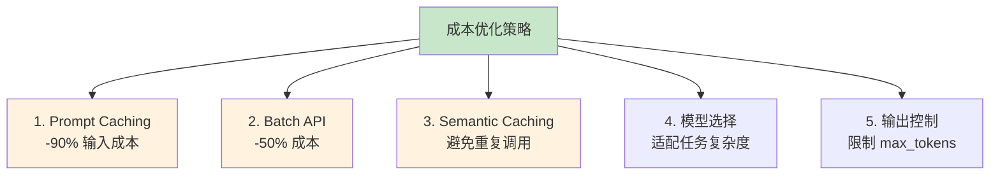
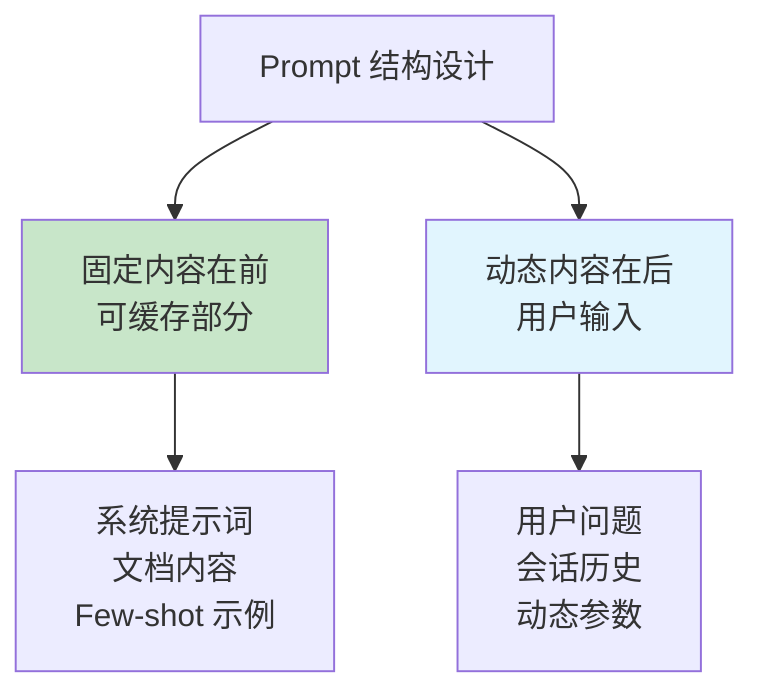
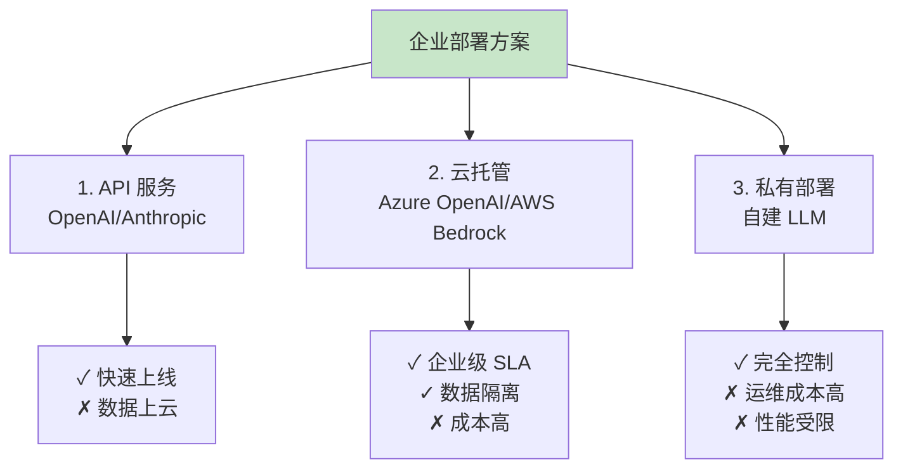

## 13.4 成本优化与安全：别让 AI 成为电费杀手 <DifficultyBadge level="advanced" /> <CostBadge cost="$0" />

> 前置知识：3.1 Token 与计费

::: danger 恐怖故事
**上个月账单：$5000**  
**这个月账单：$15000**  
**老板：下个月预算多少？**  
**你：……要不我们别用 AI 了？**
:::

### 为什么需要它？（Problem）

**"上个月的 AI API 账单：$5000。这个月：$15000。下个月预算多少？"**

没有成本控制的 AI 应用就像**漏水的水龙头**——开始只是滴答滴答，最后变成瀑布。

**🎭 想象这个场景：**
- 第 1 周：账单 $100，感觉还行
- 第 2 周：账单 $500，有点多但能接受
- 第 3 周：账单 $2000，开始心疼
- 第 4 周：账单 $8000，老板把你叫进办公室

**然后你发现：原来是每次都把 3000 Token 的系统提示词重复发送了几千次。**

| 场景 | 成本陷阱 | 损失 |
|------|---------|------|
| **长上下文对话** | 每次都发送完整历史记录 | 10 轮对话 Token 消耗 10 倍 |
| **重复问题** | 同样的问题重复调用 LLM | 浪费 70% Token |
| **批量处理** | 逐条实时调用 | 成本是批量的 2 倍 |
| **未优化 Prompt** | 冗长的系统提示词 | 每次多消耗 500 Token |

**真实案例：**

::: tip 企业文档 Q&A 系统的成本优化传奇
**优化前：**
- 系统提示词：3000 Token（包含详细的公司规则）
- 每次查询重复发送系统提示词
- 每日 10000 次查询 = 3000万 输入 Token
- **月成本：$4500**（仅系统提示词！）

**使用 Prompt Caching 后：**
- 系统提示词缓存，只计费一次
- **月成本：$450**（**降低 90%**）

**节省的钱干什么了？给团队团建吃了顿火锅。**
:::

**为什么 AI 应用成本难控制？**

- **Token 计费复杂**：输入 Token、输出 Token、缓存 Token 价格不同（像手机套餐一样复杂）
- **成本不透明**：不知道哪个功能在偷偷烧钱
- **用量难预测**：用户行为多样，Token 消耗像过山车
- **优化不直观**：不知道从哪里下手（就像减肥不知道先减哪）

**成本优化不是可选项，是 AI 应用的"水电费账单"。**

### 它是什么？（Concept）

**成本优化**是通过技术手段降低 AI 应用的 Token 消耗和 API 费用：

**💰 打个比方：**
- **Prompt Caching**：重复用的东西（系统提示词）买一次就够了，像办健身卡
- **Batch API**：批量采购打 5 折，像去批发市场
- **Semantic Caching**：记住答案，相同问题不重复问，像做作业抄答案
- **模型选择**：简单任务用便宜货，复杂任务才用贵的，像打车选快车还是专车



### 1. Prompt Caching（最强优化）

**原理：将不变的前缀内容（如系统提示词、文档）缓存 5 分钟，后续请求免费或大幅降价。**

| 供应商 | 缓存价格 | 写入价格 | 节省 |
|--------|---------|---------|------|
| **OpenAI** | 输入价格的 50% | 输入价格的 125% | 降低 50% |
| **Anthropic** | 输入价格的 10% | 输入价格的 125% | **降低 90%** |

**适用场景：**

- 固定的系统提示词（每个请求都相同）
- RAG 检索到的文档（5 分钟内可能重复查询）
- 长上下文文档分析（文档内容不变）

**OpenAI Prompt Caching 示例：**

```python
from openai import OpenAI

client = OpenAI()

# 长系统提示词（3000 Token）
SYSTEM_PROMPT = """
你是一个专业的客服助手...（此处省略 3000 字规则说明）
"""

# 使用 Prompt Caching
response = client.chat.completions.create(
    model="gpt-4.1",  # 需要支持 caching 的模型
    messages=[
        {
            "role": "system",
            "content": [
                {
                    "type": "text",
                    "text": SYSTEM_PROMPT,
                    "cache_control": {"type": "ephemeral"}  # 标记为可缓存
                }
            ]
        },
        {"role": "user", "content": "你们的退货政策是什么？"}
    ]
)

# 第一次调用：写入缓存（125% 价格）
# 5 分钟内的后续调用：使用缓存（50% 价格）
```

**Anthropic Prompt Caching（更激进）：**

```python
import anthropic

client = anthropic.Anthropic()

# 长文档（10000 Token）
LONG_DOCUMENT = """（此处省略 1 万字文档内容）"""

response = client.messages.create(
    model="claude-3-5-sonnet-20241022",
    max_tokens=1024,
    system=[
        {
            "type": "text",
            "text": "你是一个文档分析助手。"
        },
        {
            "type": "text",
            "text": LONG_DOCUMENT,
            "cache_control": {"type": "ephemeral"}  # 缓存文档
        }
    ],
    messages=[
        {"role": "user", "content": "总结这个文档的核心观点"}
    ]
)

# 缓存命中时，文档部分只收取 10% 价格（降低 90%）
print(f"缓存读取 Token: {response.usage.cache_read_input_tokens}")
print(f"缓存写入 Token: {response.usage.cache_creation_input_tokens}")
```

**Prompt Caching 最佳实践：**



### 2. Batch API（-50% 成本）

**原理：离线批量处理任务，24 小时内完成，成本减半。**

| API 类型 | 成本 | 延迟 | 适用场景 |
|---------|------|------|---------|
| **实时 API** | 标准价格 | <5 秒 | 用户实时交互 |
| **Batch API** | **-50%** | <24 小时 | 数据分析、内容生成、评估 |

**OpenAI Batch API 示例：**

```python
from openai import OpenAI
import json

client = OpenAI()

# 1. 准备批量任务文件（JSONL 格式）
tasks = [
    {
        "custom_id": "task-1",
        "method": "POST",
        "url": "/v1/chat/completions",
        "body": {
            "model": "gpt-4.1-mini",
            "messages": [{"role": "user", "content": "什么是 Python？"}]
        }
    },
    {
        "custom_id": "task-2",
        "method": "POST",
        "url": "/v1/chat/completions",
        "body": {
            "model": "gpt-4.1-mini",
            "messages": [{"role": "user", "content": "什么是 JavaScript？"}]
        }
    },
    # ... 最多 50000 个任务
]

# 写入文件
with open("batch_tasks.jsonl", "w") as f:
    for task in tasks:
        f.write(json.dumps(task) + "\n")

# 2. 上传文件
batch_file = client.files.create(
    file=open("batch_tasks.jsonl", "rb"),
    purpose="batch"
)

# 3. 创建批处理任务
batch = client.batches.create(
    input_file_id=batch_file.id,
    endpoint="/v1/chat/completions",
    completion_window="24h"
)

print(f"批处理任务已创建：{batch.id}")
print(f"状态：{batch.status}")

# 4. 查询状态
batch_status = client.batches.retrieve(batch.id)
print(f"进度：{batch_status.request_counts.completed}/{batch_status.request_counts.total}")

# 5. 下载结果（任务完成后）
if batch_status.status == "completed":
    result_file = client.files.content(batch_status.output_file_id)
    results = [json.loads(line) for line in result_file.text.split('\n') if line]
    
    for result in results:
        print(f"Task {result['custom_id']}: {result['response']['body']['choices'][0]['message']['content']}")
```

**适用场景：**

- 评估数据集（1000 个测试用例）
- 内容批量生成（翻译、摘要、分类）
- 数据清洗和标注
- 定期报告生成

### 3. Semantic Caching（语义缓存）

**原理：相似问题不重复调用 LLM，直接返回缓存答案。**

```python
from openai import OpenAI
import hashlib
import json

client = OpenAI()

class SemanticCache:
    def __init__(self, cache_file: str = "cache.json"):
        self.cache_file = cache_file
        self.cache = self._load_cache()
    
    def _load_cache(self) -> dict:
        try:
            with open(self.cache_file, 'r') as f:
                return json.load(f)
        except:
            return {}
    
    def _save_cache(self):
        with open(self.cache_file, 'w') as f:
            json.dump(self.cache, f, ensure_ascii=False, indent=2)
    
    def _hash_key(self, text: str) -> str:
        return hashlib.md5(text.encode()).hexdigest()
    
    def get(self, question: str) -> str | None:
        key = self._hash_key(question.lower().strip())
        return self.cache.get(key)
    
    def set(self, question: str, answer: str):
        key = self._hash_key(question.lower().strip())
        self.cache[key] = answer
        self._save_cache()

# 使用语义缓存
cache = SemanticCache()

def cached_llm_call(question: str) -> tuple[str, bool]:
    """带缓存的 LLM 调用"""
    # 1. 检查缓存
    cached_answer = cache.get(question)
    if cached_answer:
        return cached_answer, True  # 缓存命中
    
    # 2. 调用 LLM
    response = client.chat.completions.create(
        model="gpt-4.1-mini",
        messages=[{"role": "user", "content": question}]
    )
    answer = response.choices[0].message.content
    
    # 3. 写入缓存
    cache.set(question, answer)
    
    return answer, False  # 缓存未命中

# 测试
questions = [
    "什么是 Python？",
    "什么是python？",  # 大小写不同，但内容相同
    "什么是 JavaScript？",
]

for q in questions:
    answer, from_cache = cached_llm_call(q)
    print(f"问题：{q}")
    print(f"回答：{answer}")
    print(f"来源：{'缓存' if from_cache else 'LLM'}")
    print()
```

### 4. 其他成本优化策略

**策略对比：**

| 策略 | 节省成本 | 实施难度 | 适用场景 |
|------|---------|---------|---------|
| **Prompt Caching** | 50-90% | 低 | 固定系统提示词 |
| **Batch API** | 50% | 中 | 非实时任务 |
| **Semantic Caching** | 70%+ | 中 | 重复问题多 |
| **模型降级** | 50-90% | 低 | 简单任务用小模型 |
| **限制 max_tokens** | 20-50% | 低 | 控制输出长度 |
| **压缩上下文** | 30-50% | 高 | 长对话历史 |

**模型选择策略：**

```python
def choose_model(task_complexity: str, max_budget: float) -> str:
    """根据任务复杂度选择模型"""
    
    model_costs = {
        "gpt-4o": {"input": 2.5, "output": 10.0, "quality": 10},
        "gpt-4.1-mini": {"input": 0.15, "output": 0.6, "quality": 8},
        "gpt-3.5-turbo": {"input": 0.5, "output": 1.5, "quality": 7},
    }
    
    if task_complexity == "simple":
        return "gpt-4.1-mini"  # 数据提取、分类
    elif task_complexity == "medium":
        return "gpt-4.1-mini"  # 摘要、问答
    elif task_complexity == "complex":
        return "gpt-4o"      # 推理、代码生成
    
    return "gpt-4.1-mini"  # 默认
```

**输出控制：**

```python
# 限制输出长度
response = client.chat.completions.create(
    model="gpt-4.1-mini",
    messages=[{"role": "user", "content": "解释量子计算"}],
    max_tokens=100  # 限制输出，避免冗长回答
)
```

### 企业安全与合规

**数据安全措施：**

| 措施 | 说明 | 工具 |
|------|------|------|
| **数据脱敏** | 请求前移除 PII | Presidio, 正则表达式 |
| **访问控制** | API Key 权限管理 | IAM, RBAC |
| **审计日志** | 记录所有调用 | LangSmith, ELK |
| **私有部署** | 本地运行模型 | OpenAI Azure, AWS Bedrock |

**企业部署选项：**



**Rate Limiting（速率限制）：**

```python
from time import sleep, time
from collections import deque

class RateLimiter:
    """简单的速率限制器"""
    
    def __init__(self, max_requests: int, time_window: int):
        self.max_requests = max_requests
        self.time_window = time_window  # 秒
        self.requests = deque()
    
    def allow_request(self) -> bool:
        now = time()
        
        # 清理过期请求
        while self.requests and self.requests[0] < now - self.time_window:
            self.requests.popleft()
        
        # 检查是否超限
        if len(self.requests) >= self.max_requests:
            return False
        
        # 记录请求
        self.requests.append(now)
        return True
    
    def wait_if_needed(self):
        """阻塞等待直到可以发送请求"""
        while not self.allow_request():
            sleep(0.1)

# 使用：限制每分钟最多 10 次请求
limiter = RateLimiter(max_requests=10, time_window=60)

def rate_limited_llm_call(question: str) -> str:
    limiter.wait_if_needed()
    response = client.chat.completions.create(
        model="gpt-4.1-mini",
        messages=[{"role": "user", "content": question}]
    )
    return response.choices[0].message.content
```

### 动手试试（Practice）

**实验：Prompt Caching 成本对比**

```python
from openai import OpenAI
import time

client = OpenAI()

# 长系统提示词（模拟 3000 Token）
LONG_SYSTEM_PROMPT = """
你是一个专业的客服助手，需要遵守以下规则：

1. 退货政策：
   - 7 天无理由退货
   - 商品需保持原包装
   - 运费由买家承担
   （此处省略 2500 字详细规则）

2. 发货政策：...
3. 支付政策：...
...（总计约 3000 Token）
""" * 10  # 重复以模拟长内容

# 不使用 Caching
def without_caching():
    """不使用缓存"""
    total_input_tokens = 0
    start = time.time()
    
    questions = [
        "你们的退货政策是什么？",
        "发货需要多久？",
        "支持哪些支付方式？",
    ]
    
    for q in questions:
        response = client.chat.completions.create(
            model="gpt-4.1-mini",
            messages=[
                {"role": "system", "content": LONG_SYSTEM_PROMPT},
                {"role": "user", "content": q}
            ]
        )
        total_input_tokens += response.usage.prompt_tokens
    
    duration = time.time() - start
    
    # 估算成本（GPT-4o-mini 输入价格：$0.15/1M tokens）
    cost = total_input_tokens * 0.15 / 1_000_000
    
    print("=== 不使用 Prompt Caching ===")
    print(f"总输入 Token: {total_input_tokens:,}")
    print(f"估算成本: ${cost:.4f}")
    print(f"耗时: {duration:.2f}s")
    
    return cost

# 使用 Caching（模拟效果）
def with_caching():
    """使用缓存（模拟）"""
    system_prompt_tokens = 3000  # 系统提示词 Token 数
    user_tokens = 50  # 平均用户输入 Token 数
    questions_count = 3
    
    # 第一次：写入缓存（125% 价格）
    first_call_tokens = int(system_prompt_tokens * 1.25) + user_tokens
    
    # 后续调用：缓存命中（50% 价格）
    cached_call_tokens = int(system_prompt_tokens * 0.5) + user_tokens
    
    total_input_tokens = first_call_tokens + cached_call_tokens * (questions_count - 1)
    
    cost = total_input_tokens * 0.15 / 1_000_000
    
    print("\n=== 使用 Prompt Caching ===")
    print(f"第一次调用: {first_call_tokens:,} tokens (写入缓存)")
    print(f"后续调用: {cached_call_tokens:,} tokens/次 (缓存命中)")
    print(f"总输入 Token: {total_input_tokens:,}")
    print(f"估算成本: ${cost:.4f}")
    
    return cost

# 对比
cost_without = without_caching()
cost_with = with_caching()

print("\n=== 对比结果 ===")
print(f"节省成本: ${cost_without - cost_with:.4f}")
print(f"成本降低: {(1 - cost_with / cost_without) * 100:.1f}%")
```

<ColabBadge path="demos/13-production/cost_optimization.ipynb" />

### 小结（Reflection）

**🎯 一句话总结：成本优化是 AI 应用的"节能模式"，Prompt Caching 降 90%，Batch API 打 5 折，别让账单吓跑老板。**

- **解决了什么**：通过 Prompt Caching、Batch API、语义缓存等手段降低 90% 成本
- **没解决什么**：生产化技术都学会了，但怎么应用到真实项目？——下一章介绍 IT 部门实战场景
- **关键要点**：
  1. **Prompt Caching 是王炸**：降低 50-90% 输入成本（不用就是亏）
  2. **Batch API 适合离线任务**：成本减半，但要等 24 小时（能忍就用）
  3. **语义缓存避免重复调用**：相似问题直接返回缓存（懒是第一生产力）
  4. **模型选择要聪明**：简单任务用小模型，复杂任务用大模型（别拿大炮打蚊子）
  5. **企业部署**：Azure OpenAI、AWS Bedrock 提供数据隔离（贵但安全）

::: tip 记住这个比喻
成本优化 = AI 的水电费账单：不优化就等着老板找你谈话。
:::

---

## 🎯 生产篇检查点

恭喜！你已经掌握了 AI 应用生产化的核心技能：

### 你学会了什么？

- ✅ **Guardrails**：防御 Prompt 注入、有害内容、PII 泄露
- ✅ **Evaluation**：构建 LLM-as-Judge 评估体系，量化质量
- ✅ **Observability**：实现日志、指标、追踪，监控运行状态
- ✅ **Cost Optimization**：通过 Prompt Caching 降低 90% 成本

### 能做什么项目？

1. **企业级 AI 应用**：具备安全、监控、成本控制能力
2. **质量保障体系**：自动化评估 + 持续监控
3. **成本可控的服务**：不会出现账单失控的情况

### 下一步？

👉 **第 14 章：IT 部门实战场景** - 将所学技术应用到真实项目：内部知识库、代码审查、运维助手

---

*最后更新：2026-02-20*
