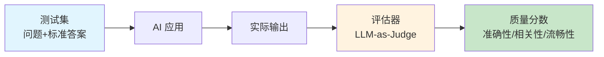
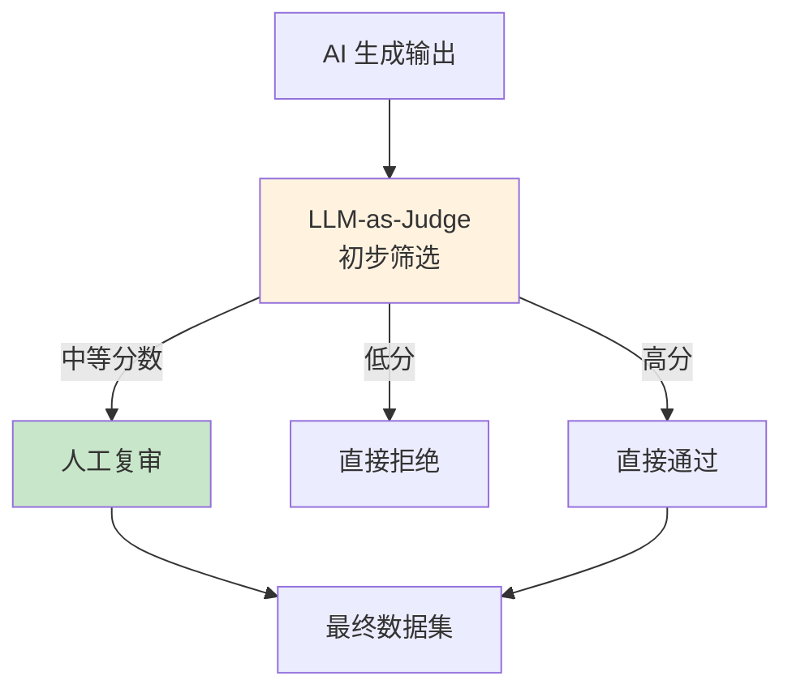
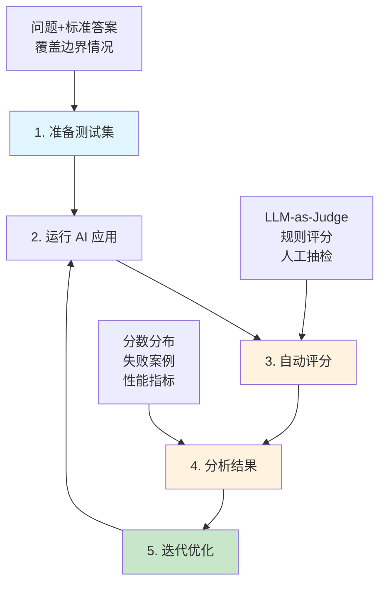

## 13.2 Evaluation（评估） <DifficultyBadge level="advanced" /> <CostBadge cost="$0.05" />

> 前置知识：4.1 Prompt 基础

### 为什么需要它？（Problem）

**"这个 AI 回答得好不好？"**

开发 AI 应用时，你可能会这样评估：

- 跑几个测试用例，"看起来还不错"
- 自己试用几次，"感觉可以了"
- 上线后收到用户投诉，"怎么回答这么离谱？"

**问题：凭感觉无法规模化，更无法持续优化。**

真实场景的挑战：

| 场景 | 挑战 | 后果 |
|------|------|------|
| **改了 Prompt** | 不知道新版本是否更好 | 可能越改越差 |
| **切换模型** | GPT-4 vs Claude，哪个更适合？ | 盲目选择，浪费成本 |
| **100 个测试用例** | 人工检查太慢 | 无法全面测试 |
| **上线后质量下降** | 没有持续监控 | 发现问题时已造成损失 |

**为什么 AI 应用特别需要评估？**

传统软件：输入 → 确定性逻辑 → 输出（可以单元测试）  
AI 应用：输入 → **非确定性** LLM → 输出（**每次都可能不同**）

**需要自动化评估体系：量化质量、快速迭代、持续监控。**

### 它是什么？（Concept）

**Evaluation（评估）** 是通过自动化方法衡量 AI 应用质量的过程：



::: warning 评估范围扩展：从 LLM 到 Agent
**传统 LLM 评估**：输入 → 输出（单轮）  
**Agent 评估**：多步骤工作流 → 工具调用 → 记忆 → 中间决策 → 最终结果

Agent 评估需要关注：
- **过程质量**：工具选择是否合理、推理路径是否有效
- **任务完成度**：是否达成最终目标
- **效率**：步骤数、API 调用次数、成本
- **鲁棒性**：遇到错误时的恢复能力
:::

**核心评估方法：**

### 1. LLM-as-Judge（最流行）

用一个强大的 LLM（如 GPT-4）评估另一个 LLM 的输出：

::: v-pre
```python
# 评估 Prompt 模板
JUDGE_PROMPT = """
你是一个严格的评审专家。请评估以下 AI 回答的质量。

问题：{question}
标准答案：{reference}
AI 回答：{answer}

评估维度（每项 1-10 分）：
1. 准确性：信息是否正确
2. 相关性：是否切题
3. 完整性：是否涵盖关键点
4. 流畅性：表达是否清晰

输出格式：
{{
  "accuracy": <分数>,
  "relevance": <分数>,
  "completeness": <分数>,
  "fluency": <分数>,
  "overall": <总分>,
  "reason": "<简短评语>"
}}
"""
```
:::

### 2. 基于规则的评估

适用于明确标准的任务：

| 任务类型 | 评估规则 | 示例 |
|---------|---------|------|
| **数据提取** | 字段完整性、格式正确性 | 提取的 JSON 是否包含所有必需字段 |
| **分类** | 准确率、召回率、F1 | 情感分类是否正确 |
| **摘要** | ROUGE 分数、长度 | 摘要是否覆盖关键信息 |
| **代码生成** | 语法正确性、测试通过率 | 生成的代码能否运行 |

### 3. 人工评估 + AI 辅助（Human-in-the-Loop）

结合人工标注和 AI 评估，是提升评估质量的黄金标准：



**Human-in-the-Loop 评估模式：**

| 模式 | 适用场景 | 工作流 |
|------|---------|--------|
| **边界案例人工审查** | AI 判断不确定的输出 | AI 筛选 → 人工复审模糊案例 |
| **随机抽样验证** | 持续质量监控 | AI 评估全部 → 人工抽检 5-10% |
| **主动学习标注** | 构建高质量训练集 | AI 选择信息量大的样本 → 人工标注 |
| **A/B 测试人工评分** | 对比不同版本效果 | 用户真实交互 → 人工评估满意度 |

### 4. A/B 测试与成本-质量权衡

**A/B 测试 AI 功能**：

```python
# 生产环境 A/B 测试示例
import random

def get_model_version(user_id: str) -> str:
    """根据用户 ID 分配模型版本"""
    # 稳定哈希，同一用户始终获得同一版本
    hash_val = hash(user_id) % 100
    
    if hash_val < 50:  # 50% 用户
        return "gpt-4.1-mini"  # 便宜快速
    else:
        return "gpt-4.1"  # 贵但质量更高

def call_ai(user_id: str, prompt: str):
    model = get_model_version(user_id)
    
    # 记录版本和用户反馈
    log_experiment(user_id, model, prompt)
    
    return client.chat.completions.create(
        model=model,
        messages=[{"role": "user", "content": prompt}]
    )
```

**成本-质量权衡评估**：

| 评估维度 | 示例对比 | 如何评估 |
|---------|---------|---------|
| **质量** | GPT-4.1 vs GPT-4.1-mini | LLM-as-Judge 评分差异 |
| **成本** | $0.10 vs $0.01 每次调用 | 月度成本预测 |
| **速度** | 2秒 vs 0.5秒 响应时间 | P95 延迟测量 |
| **用户满意度** | 点赞率、留存率 | A/B 测试统计显著性 |

::: tip 决策框架
当考虑降级到更便宜的模型时：
1. **先跑评估集**：质量下降多少？（如 LLM-as-Judge 分数从 8.5 降到 7.8）
2. **计算成本节省**：每月能省多少？（如从 $5,000 降到 $500）
3. **A/B 测试**：用户能感知到差异吗？（点赞率是否下降）
4. **分场景决策**：低风险场景用便宜模型，高风险场景用贵模型
:::

**主流评估工具与框架：**

**1. Braintrust（推荐）**

```python
from braintrust import Eval

# 定义评估任务
def task(input):
    return my_ai_app(input["question"])

# 定义评分函数
def scorer(output, expected):
    return output.strip().lower() == expected.strip().lower()

# 运行评估
Eval(
    "my-app-v1",
    data=[
        {"question": "什么是 API？", "expected": "应用程序编程接口"},
        {"question": "什么是 REST？", "expected": "表述性状态转移"},
    ],
    task=task,
    scores=[scorer],
)
```

**2. DeepEval（开源）**

```python
from deepeval import evaluate
from deepeval.metrics import AnswerRelevancyMetric, FaithfulnessMetric
from deepeval.test_case import LLMTestCase

# 定义测试用例
test_case = LLMTestCase(
    input="什么是机器学习？",
    actual_output="机器学习是人工智能的一个分支...",
    expected_output="机器学习是让计算机从数据中学习的技术...",
    retrieval_context=["机器学习的定义..."]  # RAG 应用需要
)

# 运行评估
metrics = [AnswerRelevancyMetric(), FaithfulnessMetric()]
results = evaluate([test_case], metrics)
```

**3. OpenAI Evals（官方评估框架）**

OpenAI 开源的评估框架，支持自定义评估集：

```bash
# 安装
pip install evals

# 运行官方评估集
oaieval gpt-4.1-mini my-eval

# 自定义评估
# 创建 my_eval.jsonl
{"input": [{"role": "user", "content": "什么是 Python？"}], "ideal": "Python 是一种编程语言"}

# 运行
oaieval gpt-4.1-mini my-eval
```

**4. RAGAS（RAG 应用专用评估）**

专门为 RAG（检索增强生成）应用设计的评估框架：

```python
from ragas import evaluate
from ragas.metrics import faithfulness, answer_relevancy, context_precision

# RAG 评估指标
# - faithfulness: 答案是否忠实于检索的上下文（无幻觉）
# - answer_relevancy: 答案与问题的相关性
# - context_precision: 检索的上下文质量

test_case = {
    "question": "什么是 Docker？",
    "answer": "Docker 是一个容器化平台...",
    "contexts": ["Docker 文档第 1 段", "Docker 文档第 2 段"],
    "ground_truth": "Docker 是容器化工具..."
}

result = evaluate(
    dataset=[test_case],
    metrics=[faithfulness, answer_relevancy, context_precision]
)

print(f"Faithfulness: {result['faithfulness']}")  # 0-1，越高越好
print(f"Answer Relevancy: {result['answer_relevancy']}")
```

**5. AgentBench（Agent 工作流评估）**

评估多步骤 Agent 的任务完成能力：

```python
# AgentBench 示例：评估 Agent 完成复杂任务的能力
# 场景：让 Agent 分析代码库并生成报告

test_task = {
    "task": "分析 Flask 项目结构并生成安全审计报告",
    "tools": ["file_reader", "code_analyzer", "report_generator"],
    "success_criteria": [
        "识别所有 Python 文件",
        "检测潜在安全漏洞",
        "生成结构化报告"
    ]
}

# 评估维度
# 1. Task Success Rate: 是否完成任务
# 2. Tool Selection Accuracy: 工具选择是否合理
# 3. Reasoning Quality: 推理过程是否清晰
# 4. Efficiency: 步骤数、API 调用次数、总成本
# 5. Error Recovery: 遇到错误时的处理能力

def evaluate_agent(agent, task):
    """评估 Agent 性能"""
    
    # 运行 Agent
    trace = agent.run(task)
    
    # 评估结果
    scores = {
        "task_completed": check_success(trace, task["success_criteria"]),
        "tool_accuracy": evaluate_tool_choices(trace),
        "reasoning_quality": judge_reasoning(trace),
        "efficiency": calculate_efficiency(trace),
        "cost": sum([step.cost for step in trace])
    }
    
    return scores
```

::: info Agent 评估的特殊挑战
与单轮 LLM 不同，Agent 评估需要：
- **追踪完整执行路径**：记录每一步的工具调用、推理、决策
- **评估中间步骤**：不仅看结果，还要看过程是否合理
- **处理不确定性**：同一任务可能有多条正确路径
- **平衡质量与成本**：某些 Agent 可能质量高但调用次数过多、成本过高
:::


**评估流程：**



### 动手试试（Practice）

**实验 1：构建 LLM-as-Judge 评估器**

::: v-pre
```python
from openai import OpenAI
import json

client = OpenAI()

# 评估器
def judge_answer(question: str, reference: str, answer: str) -> dict:
    """使用 GPT-4 评估答案质量"""
    
    judge_prompt = f"""
你是一个严格的评审专家。请评估以下 AI 回答的质量。

问题：{question}
参考答案：{reference}
AI 回答：{answer}

评估维度（每项 1-10 分）：
1. 准确性：信息是否正确
2. 相关性：是否切题
3. 完整性：是否涵盖关键点
4. 流畅性：表达是否清晰

输出 JSON 格式：
{{
  "accuracy": <1-10>,
  "relevance": <1-10>,
  "completeness": <1-10>,
  "fluency": <1-10>,
  "overall": <平均分>,
  "reason": "<简短评语>"
}}
"""
    
    response = client.chat.completions.create(
        model="gpt-4.1",  # 使用强模型做评估
        messages=[{"role": "user", "content": judge_prompt}],
        response_format={"type": "json_object"}
    )
    
    return json.loads(response.choices[0].message.content)

# 测试评估器
test_cases = [
    {
        "question": "什么是 REST API？",
        "reference": "REST API 是一种基于 HTTP 协议的 Web 服务架构风格，使用标准的 HTTP 方法（GET、POST、PUT、DELETE）进行资源操作。",
        "answer": "REST API 是一种 API 设计风格，用 HTTP 方法操作资源。"
    },
    {
        "question": "什么是 REST API？",
        "reference": "REST API 是一种基于 HTTP 协议的 Web 服务架构风格。",
        "answer": "Python 是一种编程语言。"  # 完全不相关
    },
]

for i, case in enumerate(test_cases, 1):
    print(f"\n=== 测试用例 {i} ===")
    print(f"问题：{case['question']}")
    print(f"参考答案：{case['reference']}")
    print(f"AI 回答：{case['answer']}")
    
    result = judge_answer(case['question'], case['reference'], case['answer'])
    
    print(f"\n评估结果：")
    print(f"  准确性：{result['accuracy']}/10")
    print(f"  相关性：{result['relevance']}/10")
    print(f"  完整性：{result['completeness']}/10")
    print(f"  流畅性：{result['fluency']}/10")
    print(f"  总分：{result['overall']}/10")
    print(f"  评语：{result['reason']}")
```
:::

**实验 2：批量评估 Prompt 版本**

```python
from openai import OpenAI
import json
from statistics import mean

client = OpenAI()

# 两个不同的 Prompt 版本
PROMPT_V1 = "简单解释：{question}"
PROMPT_V2 = """
你是一个技术导师，擅长用简单语言解释复杂概念。

请用 2-3 句话解释：{question}

要求：
- 通俗易懂，适合初学者
- 使用类比或例子
- 突出核心概念
"""

# 测试数据集
test_dataset = [
    {"question": "什么是 Docker？", "reference": "Docker 是一个容器化平台，可以打包应用及其依赖，确保在任何环境中一致运行。"},
    {"question": "什么是闭包？", "reference": "闭包是函数和其外部作用域变量的组合，函数可以记住并访问外部变量。"},
    {"question": "什么是 DNS？", "reference": "DNS 是域名系统，将域名转换为 IP 地址，让我们可以用易记的网址访问网站。"},
]

def generate_answer(question: str, prompt_template: str) -> str:
    """使用指定 Prompt 模板生成答案"""
    prompt = prompt_template.format(question=question)
    response = client.chat.completions.create(
        model="gpt-4.1-mini",
        messages=[{"role": "user", "content": prompt}],
        max_tokens=150
    )
    return response.choices[0].message.content

def simple_judge(answer: str, reference: str) -> float:
    """简单评分器：计算相关性分数"""
    judge_prompt = f"""
评估以下答案的质量（1-10 分）：

参考答案：{reference}
实际答案：{answer}

只输出一个数字（1-10）。
"""
    response = client.chat.completions.create(
        model="gpt-4.1",
        messages=[{"role": "user", "content": judge_prompt}],
        max_tokens=10
    )
    try:
        return float(response.choices[0].message.content.strip())
    except:
        return 5.0

# 评估两个版本
def evaluate_prompt_version(prompt_template: str, name: str):
    """评估 Prompt 版本"""
    scores = []
    
    print(f"\n{'='*60}")
    print(f"评估 {name}")
    print(f"{'='*60}")
    
    for i, case in enumerate(test_dataset, 1):
        question = case['question']
        reference = case['reference']
        
        # 生成答案
        answer = generate_answer(question, prompt_template)
        
        # 评分
        score = simple_judge(answer, reference)
        scores.append(score)
        
        print(f"\n问题 {i}：{question}")
        print(f"AI 回答：{answer}")
        print(f"分数：{score}/10")
    
    avg_score = mean(scores)
    print(f"\n平均分：{avg_score:.1f}/10")
    
    return avg_score

# 运行评估
v1_score = evaluate_prompt_version(PROMPT_V1, "Prompt V1（简单版）")
v2_score = evaluate_prompt_version(PROMPT_V2, "Prompt V2（优化版）")

# 比较结果
print(f"\n{'='*60}")
print("对比结果")
print(f"{'='*60}")
print(f"V1 平均分：{v1_score:.1f}/10")
print(f"V2 平均分：{v2_score:.1f}/10")
print(f"提升：{v2_score - v1_score:+.1f} 分")

if v2_score > v1_score:
    print("\n✅ V2 优于 V1，建议使用 V2")
elif v2_score < v1_score:
    print("\n❌ V2 不如 V1，建议继续使用 V1")
else:
    print("\n⚖️  两个版本效果相当")
```

**实验 3：基于规则的评估（代码生成任务）**

```python
import ast
import subprocess
import tempfile
import os

def evaluate_code_generation(question: str, generated_code: str) -> dict:
    """评估生成代码的质量"""
    
    results = {
        "syntax_valid": False,
        "runnable": False,
        "has_docstring": False,
        "has_type_hints": False,
        "score": 0
    }
    
    # 1. 语法检查
    try:
        ast.parse(generated_code)
        results["syntax_valid"] = True
        results["score"] += 25
    except SyntaxError as e:
        print(f"语法错误：{e}")
        return results
    
    # 2. 运行测试
    try:
        # 创建临时文件
        with tempfile.NamedTemporaryFile(mode='w', suffix='.py', delete=False) as f:
            f.write(generated_code)
            temp_file = f.name
        
        # 运行代码
        result = subprocess.run(
            ['python', temp_file],
            capture_output=True,
            timeout=5
        )
        
        if result.returncode == 0:
            results["runnable"] = True
            results["score"] += 25
        
        os.unlink(temp_file)
        
    except Exception as e:
        print(f"运行错误：{e}")
    
    # 3. 检查文档字符串
    tree = ast.parse(generated_code)
    for node in ast.walk(tree):
        if isinstance(node, (ast.FunctionDef, ast.ClassDef)):
            if ast.get_docstring(node):
                results["has_docstring"] = True
                results["score"] += 25
                break
    
    # 4. 检查类型注解
    for node in ast.walk(tree):
        if isinstance(node, ast.FunctionDef):
            if node.returns or any(arg.annotation for arg in node.args.args):
                results["has_type_hints"] = True
                results["score"] += 25
                break
    
    return results

# 测试
code1 = """
def fibonacci(n):
    if n <= 1:
        return n
    return fibonacci(n-1) + fibonacci(n-2)

print(fibonacci(10))
"""

code2 = """
def fibonacci(n: int) -> int:
    '''计算斐波那契数列的第 n 项
    
    Args:
        n: 非负整数
        
    Returns:
        第 n 项的值
    '''
    if n <= 1:
        return n
    return fibonacci(n-1) + fibonacci(n-2)

if __name__ == '__main__':
    print(fibonacci(10))
"""

print("=== 代码 1（基础版）===")
result1 = evaluate_code_generation("实现斐波那契", code1)
print(f"语法正确：{'✓' if result1['syntax_valid'] else '✗'}")
print(f"可运行：{'✓' if result1['runnable'] else '✗'}")
print(f"有文档：{'✓' if result1['has_docstring'] else '✗'}")
print(f"有类型注解：{'✓' if result1['has_type_hints'] else '✗'}")
print(f"总分：{result1['score']}/100")

print("\n=== 代码 2（完整版）===")
result2 = evaluate_code_generation("实现斐波那契", code2)
print(f"语法正确：{'✓' if result2['syntax_valid'] else '✗'}")
print(f"可运行：{'✓' if result2['runnable'] else '✗'}")
print(f"有文档：{'✓' if result2['has_docstring'] else '✗'}")
print(f"有类型注解：{'✓' if result2['has_type_hints'] else '✗'}")
print(f"总分：{result2['score']}/100")
```

<ColabBadge path="demos/13-production/evaluation.ipynb" />

### 小结（Reflection）

- **解决了什么**：构建全面的自动化评估体系，覆盖从单轮 LLM 到多步骤 Agent 的质量评估
- **没解决什么**：有了评估，但上线后怎么监控运行状态？——下一节介绍可观测性
- **关键要点**：
  1. **LLM-as-Judge 是最流行的方法**：用 GPT-4 评估 GPT-4o-mini
  2. **Agent 评估不同于 LLM 评估**：需要追踪多步骤执行路径、工具选择、效率与成本
  3. **评估维度**：准确性、相关性、完整性、流畅性（LLM）+ 任务完成度、效率、鲁棒性（Agent）
  4. **丰富的评估框架**：OpenAI Evals（通用）、RAGAS（RAG）、AgentBench（Agent）
  5. **Human-in-the-Loop 不可或缺**：AI 初筛 + 人工复审边界案例
  6. **A/B 测试与成本权衡**：质量提升 vs 成本增加，需要数据驱动决策
  7. **测试集质量决定评估质量**：覆盖边界情况、包含困难样本
  8. **持续评估**：每次改动 Prompt/模型/Agent 工作流后都要重新评估

---

*最后更新：2026-02-22*
