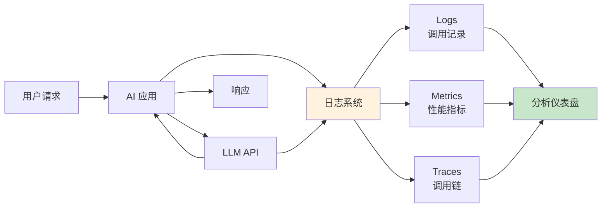
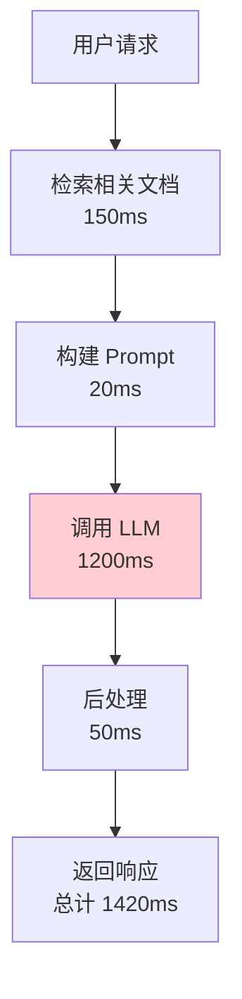
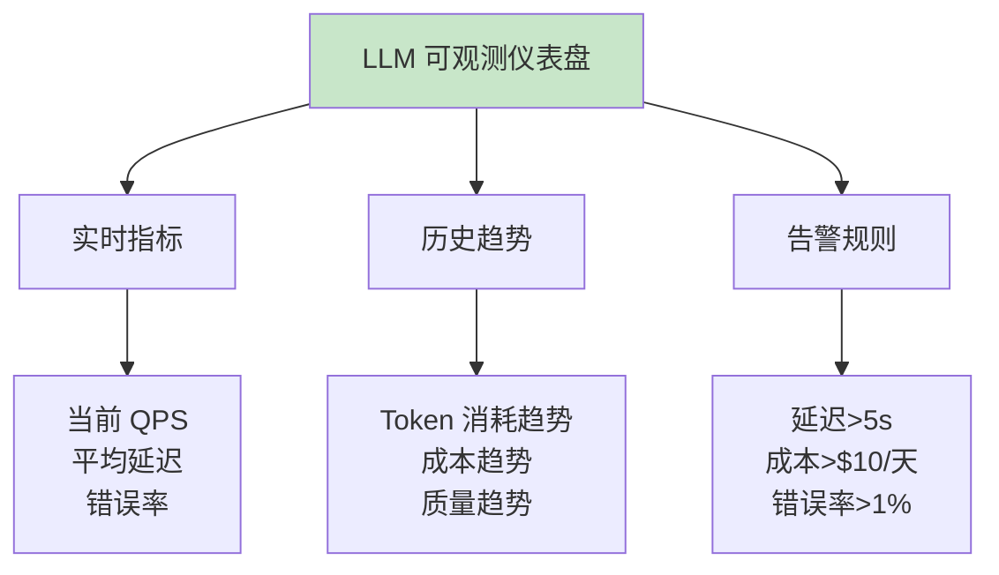

## 13.3 Observability（可观测）：给 AI 装上飞机黑匣子 <DifficultyBadge level="advanced" /> <CostBadge cost="$0.01" />

> 前置知识：7.1 Function Calling 基础

::: warning 一个致命问题
上线 3 天后，用户反馈 AI 回答质量变差了。你打开代码，看了看配置，一切正常。然后……你不知道该怎么办了。
:::

### 为什么需要它？（Problem）

**"上线 3 天后，用户反馈 AI 回答质量变差了，但你不知道为什么。"**

没有可观测性的 AI 应用就像**飞机没有黑匣子**——出事了才知道出事了，但不知道怎么出的事。

**🎭 想象这个场景：**
- 老板：为什么响应时间从 2 秒变成 10 秒了？
- 你：……我看看代码？（10 分钟后）代码没问题啊
- 老板：那为什么慢了？
- 你：……可能是模型变慢了？或者 API 限流？或者……
- 老板：你到底知不知道？

**这就是没有监控的痛苦。**

| 问题 | 症状 | 原因不明 |
|------|------|---------|
| **响应变慢** | 用户等待时间从 2 秒增加到 10 秒 | 是模型变慢还是 API 限流？ |
| **质量下降** | 用户投诉答案不准确 | 哪些问题出错了？ |
| **成本暴涨** | 本月账单是上月 3 倍 | Token 消耗在哪里？ |
| **错误率上升** | API 调用失败 | 是超时、限流还是模型错误？ |

**真实案例：**

::: tip 电商客服机器人的血泪史
某电商客服机器人上线后：
- **第 1 天**：响应时间 2s，用户满意度 85%，团队庆祝
- **第 7 天**：响应时间 8s，用户满意度 60%，开始紧张
- **第 14 天**：发现某些用户的提问触发了超长上下文，单次成本 $0.50

**问题**：没有监控，问题发现太晚，已经烧了 $500。
**教训**：Observability 不是可选项，是救命稻草。
:::

**为什么 AI 应用特别需要可观测性？**

传统应用：请求 → 响应（监控 HTTP 状态码、延迟就够了）  
AI 应用：请求 → LLM（**Token 消耗、上下文长度、质量评分、模型温度、缓存命中……**）→ 响应

**需要监控的维度更多、更复杂、更烧钱。**

### 它是什么？（Concept）

**Observability（可观测性）** 是通过日志、指标、追踪理解 AI 应用运行状态的能力：

**🛩️ 打个比方：**
- **Logs（日志）**：飞行日志，记录每一次操作
- **Metrics（指标）**：仪表盘，显示速度、高度、油耗
- **Traces（追踪）**：飞行轨迹，知道从哪飞到哪



**三大支柱：**

### 1. Logs（日志）

记录每次 LLM 调用的详细信息：

```json
{
  "timestamp": "2026-02-20T10:30:15Z",
  "session_id": "sess_abc123",
  "user_id": "user_456",
  "model": "gpt-4.1-mini",
  "prompt_tokens": 150,
  "completion_tokens": 80,
  "total_tokens": 230,
  "latency_ms": 1250,
  "cost_usd": 0.0012,
  "input": "如何优化 SQL 查询？",
  "output": "优化 SQL 查询的关键方法...",
  "quality_score": 8.5,
  "error": null
}
```

### 2. Metrics（指标）

聚合统计信息：

| 指标类型 | 指标名称 | 用途 |
|---------|---------|------|
| **性能指标** | 平均响应时间、P95/P99 延迟 | 识别性能问题 |
| **成本指标** | Token 消耗总量、每日成本 | 控制预算 |
| **质量指标** | 平均质量评分、错误率 | 监控输出质量 |
| **用量指标** | 请求数、活跃用户数 | 了解使用情况 |

### 3. Traces（追踪）

追踪完整的调用链：



**主流可观测工具：**

**1. LangSmith（推荐）**

```python
from langsmith import Client
from langsmith.run_helpers import traceable

client = Client()

@traceable(run_type="llm", project_name="my-app")
def my_llm_call(question: str) -> str:
    response = openai_client.chat.completions.create(
        model="gpt-4.1-mini",
        messages=[{"role": "user", "content": question}]
    )
    return response.choices[0].message.content

# 自动记录到 LangSmith
result = my_llm_call("什么是 Python？")
```

**2. OpenTelemetry for LLM**

```python
from opentelemetry import trace
from opentelemetry.instrumentation.openai import OpenAIInstrumentor

# 自动追踪 OpenAI 调用
OpenAIInstrumentor().instrument()

tracer = trace.get_tracer(__name__)

with tracer.start_as_current_span("llm_call"):
    response = client.chat.completions.create(...)
```

**3. 自建日志系统**

```python
import logging
import json
from datetime import datetime

class LLMLogger:
    def __init__(self, log_file: str = "llm_calls.jsonl"):
        self.log_file = log_file
    
    def log_call(self, **kwargs):
        log_entry = {
            "timestamp": datetime.utcnow().isoformat(),
            **kwargs
        }
        with open(self.log_file, 'a') as f:
            f.write(json.dumps(log_entry, ensure_ascii=False) + '\n')
```

**监控仪表盘示例：**



**关键监控指标：**

```python
# 核心 KPI
core_metrics = {
    "performance": {
        "avg_latency_ms": 1200,
        "p95_latency_ms": 2500,
        "p99_latency_ms": 4000,
        "requests_per_second": 10,
    },
    "cost": {
        "total_tokens_today": 1500000,
        "cost_usd_today": 15.00,
        "avg_cost_per_request": 0.015,
    },
    "quality": {
        "avg_quality_score": 8.2,
        "error_rate": 0.005,  # 0.5%
        "user_satisfaction": 0.85,
    },
    "usage": {
        "active_users_today": 250,
        "total_requests_today": 1000,
        "avg_requests_per_user": 4,
    }
}
```

### 动手试试（Practice）

**实验 1：构建简单的 LLM 日志系统**

```python
import json
import time
from datetime import datetime
from typing import Optional
from openai import OpenAI

client = OpenAI()

class LLMLogger:
    """LLM 调用日志记录器"""
    
    def __init__(self, log_file: str = "llm_calls.jsonl"):
        self.log_file = log_file
    
    def log_call(
        self,
        input_text: str,
        output_text: str,
        model: str,
        prompt_tokens: int,
        completion_tokens: int,
        latency_ms: float,
        error: Optional[str] = None,
        **metadata
    ):
        """记录一次 LLM 调用"""
        log_entry = {
            "timestamp": datetime.utcnow().isoformat(),
            "model": model,
            "input": input_text,
            "output": output_text,
            "prompt_tokens": prompt_tokens,
            "completion_tokens": completion_tokens,
            "total_tokens": prompt_tokens + completion_tokens,
            "latency_ms": round(latency_ms, 2),
            "error": error,
            **metadata
        }
        
        # 计算成本（示例价格）
        if model == "gpt-4.1-mini":
            input_cost = prompt_tokens * 0.15 / 1_000_000
            output_cost = completion_tokens * 0.6 / 1_000_000
        else:
            input_cost = 0
            output_cost = 0
        
        log_entry["cost_usd"] = round(input_cost + output_cost, 6)
        
        # 写入日志文件
        with open(self.log_file, 'a', encoding='utf-8') as f:
            f.write(json.dumps(log_entry, ensure_ascii=False) + '\n')
    
    def get_metrics(self) -> dict:
        """分析日志，生成指标"""
        with open(self.log_file, 'r', encoding='utf-8') as f:
            logs = [json.loads(line) for line in f]
        
        if not logs:
            return {}
        
        total_calls = len(logs)
        total_tokens = sum(log['total_tokens'] for log in logs)
        total_cost = sum(log['cost_usd'] for log in logs)
        latencies = [log['latency_ms'] for log in logs]
        errors = [log for log in logs if log['error']]
        
        return {
            "total_calls": total_calls,
            "total_tokens": total_tokens,
            "total_cost_usd": round(total_cost, 4),
            "avg_latency_ms": round(sum(latencies) / len(latencies), 2),
            "max_latency_ms": max(latencies),
            "error_count": len(errors),
            "error_rate": round(len(errors) / total_calls, 4),
        }

# 使用日志记录器
logger = LLMLogger()

def tracked_llm_call(question: str) -> str:
    """带日志的 LLM 调用"""
    start_time = time.time()
    error = None
    output_text = ""
    usage = None
    
    try:
        response = client.chat.completions.create(
            model="gpt-4.1-mini",
            messages=[{"role": "user", "content": question}],
        )
        output_text = response.choices[0].message.content
        usage = response.usage
    except Exception as e:
        error = str(e)
    
    latency_ms = (time.time() - start_time) * 1000
    
    # 记录日志
    logger.log_call(
        input_text=question,
        output_text=output_text,
        model="gpt-4.1-mini",
        prompt_tokens=usage.prompt_tokens if usage else 0,
        completion_tokens=usage.completion_tokens if usage else 0,
        latency_ms=latency_ms,
        error=error,
    )
    
    return output_text

# 测试：模拟多次调用
questions = [
    "什么是 Python？",
    "解释什么是闭包",
    "Docker 和虚拟机的区别",
    "如何优化 SQL 查询",
    "什么是 RESTful API",
]

print("=== 执行 LLM 调用 ===\n")
for i, q in enumerate(questions, 1):
    print(f"{i}. {q}")
    answer = tracked_llm_call(q)
    print(f"   回答: {answer[:100]}...\n")

# 查看指标
print("\n=== 运行指标 ===")
metrics = logger.get_metrics()
for key, value in metrics.items():
    print(f"{key}: {value}")
```

**实验 2：追踪 RAG 调用链**

```python
import time
from typing import List, Dict

class TraceLogger:
    """调用链追踪器"""
    
    def __init__(self):
        self.traces: List[Dict] = []
        self.current_trace: Dict = {}
    
    def start_trace(self, name: str):
        """开始一个追踪"""
        self.current_trace = {
            "name": name,
            "start_time": time.time(),
            "spans": []
        }
    
    def add_span(self, name: str, duration_ms: float, **metadata):
        """添加一个步骤"""
        self.current_trace["spans"].append({
            "name": name,
            "duration_ms": round(duration_ms, 2),
            **metadata
        })
    
    def end_trace(self):
        """结束追踪"""
        total_duration = (time.time() - self.current_trace["start_time"]) * 1000
        self.current_trace["total_duration_ms"] = round(total_duration, 2)
        self.traces.append(self.current_trace)
        self.current_trace = {}
    
    def print_trace(self):
        """打印最后一次追踪"""
        if not self.traces:
            return
        
        trace = self.traces[-1]
        print(f"\n{'='*60}")
        print(f"Trace: {trace['name']}")
        print(f"总耗时: {trace['total_duration_ms']}ms")
        print(f"{'='*60}")
        
        for span in trace["spans"]:
            print(f"  └─ {span['name']}: {span['duration_ms']}ms")
            if span.get('tokens'):
                print(f"     Tokens: {span['tokens']}")

# 模拟 RAG 系统
tracer = TraceLogger()

def simulated_rag_query(question: str) -> str:
    """模拟 RAG 查询（带追踪）"""
    tracer.start_trace(f"RAG Query: {question[:30]}...")
    
    # Step 1: 检索文档
    start = time.time()
    time.sleep(0.15)  # 模拟检索耗时
    retrieved_docs = ["文档1", "文档2", "文档3"]
    tracer.add_span("检索相关文档", (time.time() - start) * 1000, doc_count=3)
    
    # Step 2: 构建 Prompt
    start = time.time()
    time.sleep(0.02)  # 模拟构建 Prompt
    prompt = f"基于以下文档回答问题：{retrieved_docs}\n\n问题：{question}"
    tracer.add_span("构建 Prompt", (time.time() - start) * 1000, prompt_length=len(prompt))
    
    # Step 3: 调用 LLM
    start = time.time()
    response = client.chat.completions.create(
        model="gpt-4.1-mini",
        messages=[{"role": "user", "content": prompt}],
    )
    llm_duration = (time.time() - start) * 1000
    answer = response.choices[0].message.content
    tracer.add_span(
        "调用 LLM",
        llm_duration,
        tokens=response.usage.total_tokens,
        model="gpt-4.1-mini"
    )
    
    # Step 4: 后处理
    start = time.time()
    time.sleep(0.05)  # 模拟后处理
    tracer.add_span("后处理", (time.time() - start) * 1000)
    
    tracer.end_trace()
    return answer

# 测试追踪
result = simulated_rag_query("什么是向量数据库？")
tracer.print_trace()

print(f"\n回答: {result}")
```

**实验 3：实时性能监控仪表盘（简化版）**

```python
import time
from collections import deque
from datetime import datetime, timedelta

class MetricsCollector:
    """实时指标收集器"""
    
    def __init__(self, window_minutes: int = 5):
        self.window = timedelta(minutes=window_minutes)
        self.data = deque()  # (timestamp, latency, tokens, cost)
    
    def record(self, latency_ms: float, tokens: int, cost_usd: float):
        """记录一次调用"""
        self.data.append((datetime.now(), latency_ms, tokens, cost_usd))
        self._cleanup_old_data()
    
    def _cleanup_old_data(self):
        """清理过期数据"""
        cutoff = datetime.now() - self.window
        while self.data and self.data[0][0] < cutoff:
            self.data.popleft()
    
    def get_metrics(self) -> dict:
        """获取当前窗口的指标"""
        if not self.data:
            return {}
        
        latencies = [d[1] for d in self.data]
        tokens = [d[2] for d in self.data]
        costs = [d[3] for d in self.data]
        
        # 计算 QPS
        duration_seconds = (self.data[-1][0] - self.data[0][0]).total_seconds()
        qps = len(self.data) / duration_seconds if duration_seconds > 0 else 0
        
        return {
            "qps": round(qps, 2),
            "total_requests": len(self.data),
            "avg_latency_ms": round(sum(latencies) / len(latencies), 2),
            "p95_latency_ms": round(sorted(latencies)[int(len(latencies) * 0.95)], 2),
            "total_tokens": sum(tokens),
            "total_cost_usd": round(sum(costs), 4),
        }
    
    def print_dashboard(self):
        """打印仪表盘"""
        metrics = self.get_metrics()
        
        print("\n" + "="*60)
        print(f"📊 实时监控仪表盘 (最近 {self.window.seconds // 60} 分钟)")
        print("="*60)
        print(f"请求数:       {metrics.get('total_requests', 0)}")
        print(f"QPS:          {metrics.get('qps', 0)}")
        print(f"平均延迟:     {metrics.get('avg_latency_ms', 0)} ms")
        print(f"P95 延迟:     {metrics.get('p95_latency_ms', 0)} ms")
        print(f"Token 消耗:   {metrics.get('total_tokens', 0):,}")
        print(f"成本:         ${metrics.get('total_cost_usd', 0)}")
        print("="*60 + "\n")

# 使用监控器
monitor = MetricsCollector(window_minutes=5)

# 模拟流量
print("模拟 LLM 调用流量...\n")
for i in range(20):
    # 模拟调用
    latency = 800 + (i % 5) * 200  # 800-1600ms
    tokens = 100 + (i % 3) * 50    # 100-200 tokens
    cost = tokens * 0.15 / 1_000_000
    
    monitor.record(latency, tokens, cost)
    
    if (i + 1) % 5 == 0:
        monitor.print_dashboard()
    
    time.sleep(0.1)  # 模拟请求间隔
```

<ColabBadge path="demos/13-production/observability.ipynb" />

### 小结（Reflection）

**🎯 一句话总结：Observability 是 AI 应用的飞机黑匣子，记录一切、分析一切、预警一切。**

- **解决了什么**：为 AI 应用添加日志、指标、追踪，实时监控性能、成本、质量
- **没解决什么**：有了监控，但成本还是太高？——下一节介绍成本优化
- **关键要点**：
  1. **三大支柱**：Logs（详细记录）、Metrics（聚合指标）、Traces（调用链）
  2. **关键指标**：延迟、Token 消耗、成本、质量评分、错误率
  3. **工具选择**：LangSmith（托管，省心）、OpenTelemetry（开源，自由）、自建日志系统（便宜）
  4. **实时监控**：设置仪表盘和告警规则（别等出事才知道）
  5. **持续优化**：根据监控数据发现性能瓶颈和成本异常

::: tip 记住这个比喻
Observability = 飞机黑匣子：平时不起眼，出事后才知道它多重要。
:::

---

*最后更新：2026-02-20*
