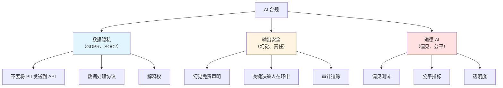

# 13.5 AI 安全与合规

<DifficultyBadge level="advanced" />
<CostBadge cost="$0" />

> 前置章节：13.1 护栏机制

### 为什么需要它？（问题）

你的 AI 聊天机器人刚刚告诉客户你们公司提供"终身退款保证"。你们没有。客户现在威胁起诉，引用 AI 的回复作为有约束力的承诺。

欢迎来到 2026 年的 AI 合规世界。

::: warning 真实恐怖故事
- **加拿大航空（2024）**：聊天机器人承诺了一个不存在的丧亲票价折扣。法院裁定航空公司对其 AI 的陈述负责。
- **律师使用 ChatGPT（2023）**：提交了 AI 生成的虚假案例引用。被法院制裁。
- **多家公司（2025-2026）**：因未经同意将用户数据发送到 LLM API 而被 GDPR 罚款。

法律系统不在乎"是 AI 编造的。"你部署了它，你就负责。
:::

### 它是什么？（概念）

**AI 安全与合规**涵盖三个维度：



### 1. 数据隐私（GDPR / SOC2）

**黄金法则**：如果你的用户数据接触 LLM API，你需要同意和数据处理协议（DPA）。

| 场景 | 风险级别 | 所需行动 |
|------|---------|---------|
| 内部工具，无用户数据 | 低 | 基本 API 协议 |
| 面向客户的聊天，包含 PII | 高 | DPA + 同意 + PII 过滤 |
| 医疗/金融数据 | 关键 | 本地部署或认证 API |
| 欧盟用户（GDPR） | 高 | 明确同意 + 删除权 |

**实用步骤：**
```python
# 始终在发送到外部 API 前过滤 PII
from presidio_analyzer import AnalyzerEngine
from presidio_anonymizer import AnonymizerEngine

analyzer = AnalyzerEngine()
anonymizer = AnonymizerEngine()

def sanitize_for_api(text: str) -> str:
    results = analyzer.analyze(text=text, language="en")
    anonymized = anonymizer.anonymize(text=text, analyzer_results=results)
    return anonymized.text

# 之前："My email is john@example.com and SSN is 123-45-6789"
# 之后："My email is <EMAIL> and SSN is <US_SSN>"
```

### 2. 幻觉与法律责任

**2026 国际 AI 安全报告**（100+ 专家、30+ 国家参与）核心发现：

> "AI 系统正在迅速变得更强大，但关于其风险的证据却出现缓慢。需要建立系统的评估框架和安全标准。"

**OWASP LLM Top 10 (2025 版更新)**：
1. **Prompt 注入**：恶意输入劫持 AI 行为
2. **训练数据中毒**：污染的训练数据导致偏见输出
3. **供应链漏洞**：依赖不安全的第三方模型或数据
4. **数据泄露**：AI 泄露敏感训练数据或 PII
5. **输出幻觉**：AI 自信地生成虚假信息
6. **权限管理不当**：AI 获得超出必要的系统权限
7. **过度依赖**：无人工审查的关键决策
8. **模型拒绝服务**：攻击者耗尽模型资源
9. **模型盗窃**：提取专有模型知识
10. **隐私侵犯**：未经同意使用用户数据训练模型

::: tip 合规新动态
**EU AI Act（欧盟 AI 法案）**于 2024 年 8 月生效，正在分阶段实施（2026 全面执行）：
- **高风险 AI 系统**（医疗、执法、关键基础设施）需要合规认证
- **通用 AI 模型**（如 GPT-4）需要透明度报告
- **禁止操纵行为**和不可接受的风险应用
- **违规罚款**：最高达全球营业额的 7%

👉 详细法规解读见 [13.6 AI 法规与监管章节](#)（涵盖 EU AI Act、美国行政令、中国生成式 AI 管理办法）
:::

**你的合规清单：**

- [ ] AI 回复包含免责声明（"AI 生成，可能包含错误"）
- [ ] 关键决策（医疗、法律、金融）需要人工批准
- [ ] 所有 AI 交互都有完整的审计追踪记录
- [ ] 幻觉率被测量和监控
- [ ] 用户可以报告不正确的 AI 回复
- [ ] 定期评估 AI 输出质量（见第 13.2 章）

::: info 灵魂拷问
如果你的 AI 给出医疗建议，有人听从了它......谁负责？AI 公司？你的公司？部署它的开发者？答案取决于你的管辖区、你的免责声明，以及你的律师有多厉害。
:::

### 3. AI 安全清单

在将任何 AI 应用部署到生产环境之前：

```
上线前安全清单
═══════════════════════════

数据隐私：
□ 实施了 PII 过滤（输入和输出）
□ 与 AI 提供商签署数据处理协议
□ AI 处理的用户同意机制
□ 定义并实施数据保留策略
□ AI 交互的删除权机制

输出安全：
□ 部署了护栏（第 13.1 章）
□ 幻觉免责声明对用户可见
□ 关键决策需要人在环中
□ 启用响应审计日志
□ 输出内容审核

法律：
□ 为 AI 功能更新服务条款
□ 设置责任免责声明
□ 验证 GDPR 合规性（如有欧盟用户）
□ 检查行业特定法规
□ AI 功能范围的法律审查

监控：
□ 设置质量指标仪表板
□ 幻觉率跟踪
□ 用户反馈机制
□ AI 故障事件响应计划
□ 定义定期评估节奏
```

### 总结（反思）

- **我们解决了什么**：理解了在生产环境中部署 AI 的法律、隐私和安全要求
- **关键要点**：
  1. **"AI 说的"不是辩护理由** — 你部署了它，你就负责
  2. **使用外部 API 时 PII 过滤是强制性的**，而不是可选的
  3. **幻觉免责声明**是新的"过去的表现不代表未来的结果"
  4. **关键的人在环中**处理任何可能造成现实伤害的事情
  5. **清单是你的朋友** — 覆膜它，挂在墙上

> *"AI 合规不好玩，不性感，也不会让你升职。但它会让你远离法庭，这可以说比升职更好。"*

---

*最后更新：2026-02-22*
