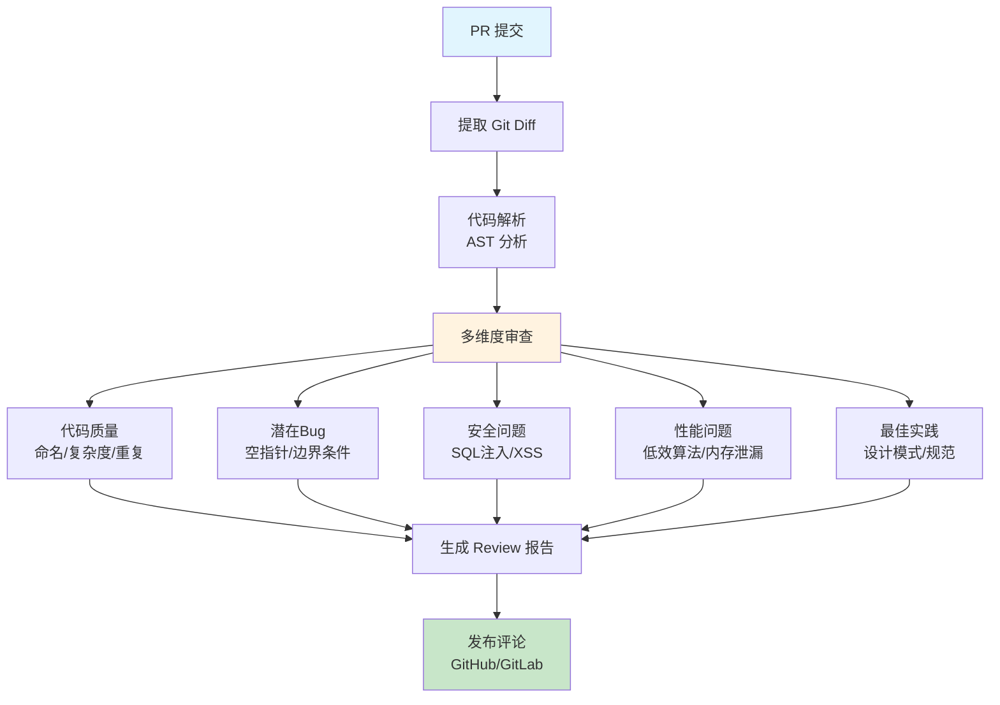

## 14.2 AI Code Review 助手：挑毛病比人还狠的代码审查官 <DifficultyBadge level="advanced" /> <CostBadge cost="$0.10" />

> 综合应用：Ch9（AI Agents）、Ch7（Function Calling）、Ch11（MCP）、Ch6（Context Engineering）

::: danger 每个团队都在经历的痛苦
**早上 9 点**：提交了 5 个 PR  
**中午 12 点**：还在等 Review  
**下午 3 点**：终于有人看了，评论："变量名不规范，请修改"  
**下午 5 点**：修改后再提交  
**第二天**：还在等下一轮 Review……

**结论**：Code Review 成了开发流程的瓶颈。
:::

### 为什么需要它？（Problem）

**"团队每天 20 个 PR，Code Review 变成了瓶颈。"**

Code Review 的痛点：

| 场景 | 痛点 | 后果 |
|------|------|------|
| **PR 积压** | Review 不及时 | 开发流程堵塞 |
| **Review 质量不一致** | 不同 Reviewer 标准不同 | 代码质量参差不齐 |
| **低级问题占用时间** | 命名、格式、基础错误 | 浪费高级工程师时间 |
| **新人不熟悉规范** | 反复修改相同问题 | 学习成本高 |

**传统工具的局限：**

- **静态分析工具**（ESLint、Pylint）：只能检查语法和风格，无法理解业务逻辑
- **人工 Review**：耗时长，容易疲劳，漏掉问题
- **自动化测试**：需要预先编写测试用例

**需要：智能 Code Review 助手，能理解代码逻辑、发现潜在问题、给出改进建议。**

### 它是什么？（Concept）

**AI Code Review 助手** 是基于 LLM 的自动化代码审查工具：



**核心架构：**

### 1. Git Diff 提取

```python
import subprocess

def get_git_diff(base_branch: str = "main") -> str:
    """获取当前分支相对于主分支的代码变更"""
    result = subprocess.run(
        ["git", "diff", f"{base_branch}...HEAD"],
        capture_output=True,
        text=True
    )
    return result.stdout

def parse_diff(diff_text: str) -> list[dict]:
    """解析 diff 输出，提取变更文件和内容"""
    files = []
    current_file = None
    
    for line in diff_text.split('\n'):
        if line.startswith('diff --git'):
            if current_file:
                files.append(current_file)
            current_file = {"changes": []}
        elif line.startswith('+++'):
            current_file["file"] = line[6:]
        elif line.startswith('+') and not line.startswith('+++'):
            current_file["changes"].append(("add", line[1:]))
        elif line.startswith('-') and not line.startswith('---'):
            current_file["changes"].append(("remove", line[1:]))
    
    if current_file:
        files.append(current_file)
    
    return files
```

### 2. 多维度审查

| 审查维度 | 检查内容 | 示例 |
|---------|---------|------|
| **代码质量** | 命名规范、函数长度、圈复杂度 | 函数超过50行、变量名不清晰 |
| **潜在Bug** | 空指针、边界条件、异常处理 | 未检查数组长度、除零错误 |
| **安全问题** | SQL注入、XSS、密码硬编码 | 拼接 SQL、未转义用户输入 |
| **性能问题** | 低效算法、重复计算、内存泄漏 | O(n²) 算法、无缓存 |
| **最佳实践** | 设计模式、SOLID原则、代码重复 | 违反单一职责、重复代码 |

### 3. Prompt 设计

```python
CODE_REVIEW_PROMPT = """
你是一个资深的代码审查专家，请审查以下代码变更。

审查维度：
1. **代码质量** (1-10分)：命名、可读性、复杂度
2. **潜在Bug** (严重性：高/中/低)：逻辑错误、边界条件
3. **安全问题** (严重性：高/中/低)：注入攻击、权限问题
4. **性能问题** (影响：高/中/低)：算法效率、资源使用
5. **最佳实践**：设计模式、代码规范

文件：{file_path}
语言：{language}

代码变更：
{code_diff}

输出格式（JSON）：
{ {
  "quality_score": <1-10>,
  "issues": [
    { {
      "severity": "high|medium|low",
      "category": "bug|security|performance|quality|practice",
      "line": <行号>,
      "description": "<问题描述>",
      "suggestion": "<改进建议>",
      "example": "<示例代码（可选）>"
    } }
  ],
  "summary": "<总体评价>",
  "approve": true|false
} }

请给出详细的审查报告。
"""
```

### 动手试试（Practice）

**完整实现：AI Code Review 工具**

```python
from openai import OpenAI
import subprocess
import json
from typing import List, Dict

client = OpenAI()

class CodeReviewer:
    """AI 代码审查工具"""
    
    def __init__(self, model: str = "gpt-4o"):
        self.client = OpenAI()
        self.model = model
    
    def get_diff(self, base_branch: str = "main") -> str:
        """获取 Git Diff"""
        result = subprocess.run(
            ["git", "diff", f"{base_branch}...HEAD"],
            capture_output=True,
            text=True
        )
        return result.stdout
    
    def parse_diff(self, diff_text: str) -> List[Dict]:
        """解析 Diff，提取变更文件"""
        files = []
        current_file = None
        added_lines = []
        removed_lines = []
        
        for line in diff_text.split('\n'):
            if line.startswith('diff --git'):
                if current_file:
                    current_file['added'] = '\n'.join(added_lines)
                    current_file['removed'] = '\n'.join(removed_lines)
                    files.append(current_file)
                
                current_file = {}
                added_lines = []
                removed_lines = []
            
            elif line.startswith('+++'):
                file_path = line[6:].strip()
                current_file['file'] = file_path
                current_file['language'] = self._detect_language(file_path)
            
            elif line.startswith('+') and not line.startswith('+++'):
                added_lines.append(line[1:])
            
            elif line.startswith('-') and not line.startswith('---'):
                removed_lines.append(line[1:])
        
        if current_file:
            current_file['added'] = '\n'.join(added_lines)
            current_file['removed'] = '\n'.join(removed_lines)
            files.append(current_file)
        
        return files
    
    def _detect_language(self, file_path: str) -> str:
        """根据文件扩展名检测语言"""
        ext_map = {
            '.py': 'Python',
            '.js': 'JavaScript',
            '.ts': 'TypeScript',
            '.jsx': 'React JSX',
            '.tsx': 'React TSX',
            '.java': 'Java',
            '.go': 'Go',
            '.rs': 'Rust',
            '.cpp': 'C++',
            '.c': 'C',
        }
        
        for ext, lang in ext_map.items():
            if file_path.endswith(ext):
                return lang
        
        return 'Unknown'
    
    def review_file(self, file_info: Dict) -> Dict:
        """审查单个文件的变更"""
        prompt = f"""
你是一个资深的 {file_info['language']} 代码审查专家。请审查以下代码变更。

审查维度：
1. **代码质量** (1-10分)：命名、可读性、复杂度
2. **潜在Bug**：逻辑错误、边界条件、异常处理
3. **安全问题**：注入攻击、权限漏洞、敏感信息泄露
4. **性能问题**：算法效率、资源使用
5. **最佳实践**：设计模式、代码规范

文件：{file_info['file']}

新增代码：
```{file_info['language'].lower()}
{file_info['added']}
```

删除代码：
```{file_info['language'].lower()}
{file_info['removed']}
```

输出格式（JSON）：
{ {
  "quality_score": <1-10>,
  "issues": [
    { {
      "severity": "high|medium|low",
      "category": "bug|security|performance|quality|practice",
      "description": "<问题描述>",
      "suggestion": "<改进建议>"
    } }
  ],
  "summary": "<总体评价>",
  "approve": true|false
} }

请给出详细的审查报告。如果代码变更很小或没有问题，可以直接批准。
"""
        
        response = self.client.chat.completions.create(
            model=self.model,
            messages=[{"role": "user", "content": prompt}],
            response_format={"type": "json_object"},
            temperature=0.3
        )
        
        return json.loads(response.choices[0].message.content)
    
    def review_pr(self, base_branch: str = "main") -> Dict:
        """审查整个 PR"""
        # 1. 获取 Diff
        diff_text = self.get_diff(base_branch)
        
        if not diff_text:
            return {
                "status": "no_changes",
                "message": "没有检测到代码变更"
            }
        
        # 2. 解析 Diff
        files = self.parse_diff(diff_text)
        
        # 3. 逐文件审查
        reviews = []
        for file_info in files:
            if not file_info.get('added'):
                continue  # 跳过只有删除的文件
            
            print(f"正在审查: {file_info['file']}...")
            review = self.review_file(file_info)
            reviews.append({
                "file": file_info['file'],
                **review
            })
        
        # 4. 汇总结果
        total_issues = sum(len(r['issues']) for r in reviews)
        high_severity = sum(
            1 for r in reviews for issue in r['issues'] 
            if issue['severity'] == 'high'
        )
        
        overall_approve = all(r['approve'] for r in reviews) and high_severity == 0
        
        return {
            "status": "completed",
            "overall_approve": overall_approve,
            "total_files": len(reviews),
            "total_issues": total_issues,
            "high_severity_issues": high_severity,
            "reviews": reviews
        }
    
    def format_report(self, result: Dict) -> str:
        """格式化审查报告"""
        if result['status'] == 'no_changes':
            return result['message']
        
        report = []
        report.append("=" * 60)
        report.append("📋 AI Code Review 报告")
        report.append("=" * 60)
        report.append(f"审查文件数: {result['total_files']}")
        report.append(f"发现问题数: {result['total_issues']}")
        report.append(f"高危问题数: {result['high_severity_issues']}")
        report.append(f"总体评审: {'✅ 批准' if result['overall_approve'] else '❌ 需要修改'}")
        report.append("")
        
        for review in result['reviews']:
            report.append("-" * 60)
            report.append(f"📄 文件: {review['file']}")
            report.append(f"质量评分: {review['quality_score']}/10")
            report.append(f"总体评价: {review['summary']}")
            
            if review['issues']:
                report.append(f"\n发现 {len(review['issues'])} 个问题：")
                
                for i, issue in enumerate(review['issues'], 1):
                    severity_icon = {
                        'high': '🔴',
                        'medium': '🟡',
                        'low': '🟢'
                    }.get(issue['severity'], '⚪')
                    
                    report.append(f"\n{i}. {severity_icon} [{issue['severity'].upper()}] {issue['category']}")
                    report.append(f"   问题: {issue['description']}")
                    report.append(f"   建议: {issue['suggestion']}")
            else:
                report.append("\n✅ 未发现问题")
        
        report.append("\n" + "=" * 60)
        
        return "\n".join(report)

# ===== 使用示例 =====

# 模拟代码审查（使用示例代码）
def simulate_code_review():
    """模拟代码审查（无需真实 Git 仓库）"""
    
    reviewer = CodeReviewer()
    
    # 模拟文件变更
    file_info = {
        "file": "app/user_service.py",
        "language": "Python",
        "added": """
def get_user(user_id):
    # 从数据库获取用户
    query = "SELECT * FROM users WHERE id = " + str(user_id)
    result = db.execute(query)
    return result[0]

def process_users(users):
    result = []
    for user in users:
        if user['age'] > 18:
            result.append(user['name'].upper())
    return result
""",
        "removed": """
def get_user(user_id):
    return db.query(User).filter(User.id == user_id).first()
"""
    }
    
    print("正在审查代码变更...\n")
    
    review = reviewer.review_file(file_info)
    
    # 格式化输出
    print("=" * 60)
    print(f"📄 文件: {file_info['file']}")
    print("=" * 60)
    print(f"质量评分: {review['quality_score']}/10")
    print(f"总体评价: {review['summary']}")
    print(f"是否批准: {'✅ 是' if review['approve'] else '❌ 否'}")
    
    if review['issues']:
        print(f"\n发现 {len(review['issues'])} 个问题：\n")
        
        for i, issue in enumerate(review['issues'], 1):
            severity_icon = {
                'high': '🔴',
                'medium': '🟡',
                'low': '🟢'
            }.get(issue['severity'], '⚪')
            
            print(f"{i}. {severity_icon} [{issue['severity'].upper()}] {issue['category']}")
            print(f"   问题: {issue['description']}")
            print(f"   建议: {issue['suggestion']}")
            print()
    else:
        print("\n✅ 未发现问题")

# 运行模拟
simulate_code_review()
```

**高级功能：集成到 GitHub/GitLab**

```python
import requests
import os

class GitHubCodeReviewer(CodeReviewer):
    """集成 GitHub 的代码审查工具"""
    
    def __init__(self, repo: str, token: str, *args, **kwargs):
        super().__init__(*args, **kwargs)
        self.repo = repo  # 格式：owner/repo
        self.token = token
        self.api_base = "https://api.github.com"
    
    def review_pull_request(self, pr_number: int):
        """审查指定的 Pull Request"""
        # 1. 获取 PR 的文件变更
        url = f"{self.api_base}/repos/{self.repo}/pulls/{pr_number}/files"
        headers = {"Authorization": f"token {self.token}"}
        
        response = requests.get(url, headers=headers)
        files = response.json()
        
        # 2. 审查每个文件
        reviews = []
        for file_data in files:
            if file_data['status'] == 'removed':
                continue
            
            file_info = {
                'file': file_data['filename'],
                'language': self._detect_language(file_data['filename']),
                'added': file_data.get('patch', ''),
                'removed': ''
            }
            
            review = self.review_file(file_info)
            reviews.append({
                "file": file_data['filename'],
                **review
            })
        
        # 3. 发布审查评论
        self._post_review_comment(pr_number, reviews)
        
        return reviews
    
    def _post_review_comment(self, pr_number: int, reviews: List[Dict]):
        """在 PR 中发布审查评论"""
        url = f"{self.api_base}/repos/{self.repo}/pulls/{pr_number}/reviews"
        headers = {
            "Authorization": f"token {self.token}",
            "Accept": "application/vnd.github.v3+json"
        }
        
        # 构建评论内容
        body = "## 🤖 AI Code Review\n\n"
        
        for review in reviews:
            body += f"### 📄 {review['file']}\n"
            body += f"**质量评分**: {review['quality_score']}/10\n\n"
            
            if review['issues']:
                for issue in review['issues']:
                    severity_icon = {'high': '🔴', 'medium': '🟡', 'low': '🟢'}.get(issue['severity'], '⚪')
                    body += f"- {severity_icon} **{issue['category']}**: {issue['description']}\n"
                    body += f"  *建议*: {issue['suggestion']}\n\n"
            else:
                body += "✅ 未发现问题\n\n"
        
        # 决定审查状态
        has_high_severity = any(
            issue['severity'] == 'high'
            for review in reviews
            for issue in review['issues']
        )
        
        event = "REQUEST_CHANGES" if has_high_severity else "COMMENT"
        
        data = {
            "body": body,
            "event": event
        }
        
        response = requests.post(url, headers=headers, json=data)
        
        if response.status_code == 200:
            print(f"✓ 审查评论已发布到 PR #{pr_number}")
        else:
            print(f"✗ 发布评论失败: {response.text}")

# 使用示例（需要 GitHub Token）
# reviewer = GitHubCodeReviewer(
#     repo="your-org/your-repo",
#     token=os.environ["GITHUB_TOKEN"]
# )
# reviewer.review_pull_request(pr_number=123)
```

**作为 MCP Server 实现**

```python
# code_review_server.py
from mcp.server import Server, stdio_server
from mcp.types import Tool, TextContent

app = Server("code-review-server")
reviewer = CodeReviewer()

@app.list_tools()
async def list_tools():
    return [
        Tool(
            name="review_code",
            description="审查代码变更，发现潜在问题",
            inputSchema={
                "type": "object",
                "properties": {
                    "code": {"type": "string", "description": "要审查的代码"},
                    "language": {"type": "string", "description": "编程语言"},
                },
                "required": ["code", "language"]
            }
        )
    ]

@app.call_tool()
async def call_tool(name: str, arguments: dict):
    if name == "review_code":
        file_info = {
            "file": "code.py",
            "language": arguments["language"],
            "added": arguments["code"],
            "removed": ""
        }
        
        review = reviewer.review_file(file_info)
        
        return [TextContent(
            type="text",
            text=json.dumps(review, indent=2, ensure_ascii=False)
        )]

if __name__ == "__main__":
    stdio_server(app)
```

<ColabBadge path="demos/14-practice/code_review.ipynb" />

### 小结（Reflection）

**🎯 一句话总结：AI Code Review 是不知疲倦的代码审查官，能挑毛病、懂规范、还不伤和气。**

- **解决了什么**：构建 AI Code Review 工具，自动检测代码质量、Bug、安全、性能问题
- **没解决什么**：代码审查搞定了，但 IT 运维呢？——下一节介绍运维智能助手
- **关键要点**：
  1. **多维度审查**：质量、Bug、安全、性能、最佳实践（五管齐下）
  2. **Git Diff 解析**：提取代码变更，聚焦审查范围（不看无关代码）
  3. **严重性分级**：高/中/低，帮助优先处理问题（先救火再扫地）
  4. **可集成 CI/CD**：GitHub Actions、GitLab CI 自动触发（提交即审查）
  5. **MCP Server 模式**：可作为 Cline/Cursor 的工具调用（编辑器里直接用）

::: tip 记住这个比喻
AI Code Review = 代码审查官：24 小时在线，挑毛病比人还狠，还不会因为你不请吃饭就给差评。
:::

---

*最后更新：2026-02-20*
