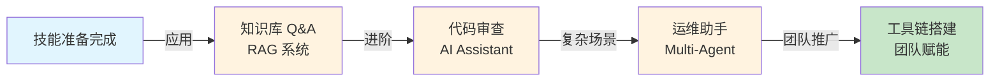
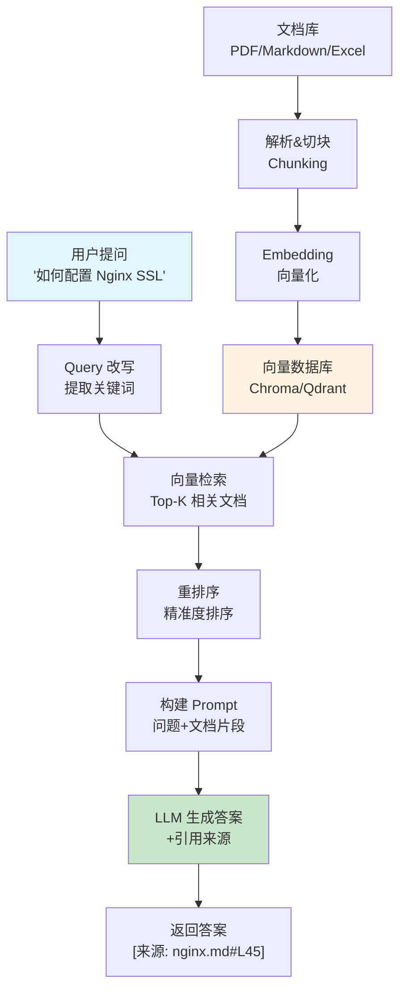

# 第 14 章：IT 部门实战场景

> **从理论到实战**：学完本章，你能完成至少一个可部署到团队的 AI 应用项目（不是玩具，是能用的那种）

前面 13 章学的都是**武功招式**，这一章是**实战对打**。我们要做 4 个真实项目：
1. **知识库 Q&A**：公司的百科全书，告别大海捞针
2. **Code Review 助手**：AI 代码审查官，挑毛病比人还狠
3. **运维智能助手**：凌晨 3 点的救星，日志分析+故障诊断
4. **团队工具链**：从个人到团队，让 AI 落地不翻车

::: tip 目标
**本章结束后，你能拿着这 4 个项目去和老板谈加薪。**
:::




**章节导览：**

- **14.1 内部知识库 Q&A 系统**：完整的文档问答系统（RAG + 引用溯源）
- **14.2 AI Code Review 助手**：自动化代码审查工具
- **14.3 IT 运维智能助手**：日志分析 + 故障诊断 Multi-Agent 系统
- **14.4 团队 AI 工具链搭建**：从个人到团队的 AI 落地指南

---

::: tip 运行环境
本章实战项目需要以下依赖：
```bash
pip install openai chromadb python-dotenv
```
部分项目还需要：
```bash
pip install rank_bm25 flask  # 混合检索、Web 服务
```
:::

## 14.1 内部知识库 Q&A 系统：公司的百科全书 <DifficultyBadge level="intermediate" /> <CostBadge cost="$0.10" />

> 综合应用：Ch4（Prompt）、Ch7（Function Calling）、Ch12（RAG）、Ch13（生产化）

::: warning 每个公司都有的痛点
**新员工**："请问 Nginx SSL 怎么配置？"  
**老员工**："去 Wiki 找找"  
**新员工**：（30 分钟后）"我找了 5 个文档，哪个是对的？"  
**老员工**：（叹气）"算了我给你发个链接……"
:::

### 为什么需要它？（Problem）

**"公司有几百份技术文档，但每次找信息都像大海捞针。"**

IT 部门的痛点：

| 场景 | 痛点 | 后果 |
|------|------|------|
| **新员工入职** | 不知道去哪找文档 | 反复问老员工相同问题 |
| **技术规范查询** | 文档分散在多个平台 | 花 30 分钟找一个 API 说明 |
| **历史决策查询** | 项目文档无人维护 | 重复犯相同错误 |
| **跨部门协作** | 不了解其他团队的系统 | 重复造轮子 |

**传统解决方案的问题：**

- **全文搜索**：关键词匹配，无法理解语义
- **Wiki 系统**：需要精确知道文档标题
- **人工咨询**：占用专家时间，效率低

**需要：智能问答系统，能理解自然语言问题，准确找到答案并给出出处。**

### 它是什么？（Concept）

**知识库 Q&A 系统** 是基于 RAG（检索增强生成）的文档问答应用：



**核心架构：**

### 1. 文档处理流程

```python
# 伪代码
documents = load_documents(["*.pdf", "*.md", "*.xlsx"])
chunks = split_documents(documents, chunk_size=500, overlap=50)
embeddings = embed_chunks(chunks)
vector_db.store(embeddings)
```

**切块策略：**

| 文档类型 | 切块大小 | 策略 |
|---------|---------|------|
| **Markdown** | 500 Token | 按标题层级切分 |
| **PDF** | 400 Token | 按段落切分 |
| **代码** | 函数级别 | 按函数/类切分 |
| **Excel** | 行/表 | 按表格结构切分 |

### 2. 检索流程

```python
# 用户提问
question = "如何配置 Nginx SSL？"

# 向量检索（Top-5）
relevant_chunks = vector_db.search(question, top_k=5)

# 重排序（可选，提高精准度）
reranked_chunks = reranker.rerank(question, relevant_chunks)[:3]

# 构建 Prompt
prompt = build_rag_prompt(question, reranked_chunks)

# 生成答案
answer = llm.generate(prompt)
```

**关键技术点：**

| 技术 | 作用 | 工具 |
|------|------|------|
| **Embedding 模型** | 将文本转为向量 | OpenAI text-embedding-3, BGE |
| **向量数据库** | 存储和检索向量 | Chroma, Qdrant, Pinecone |
| **重排序** | 精准排序相关文档 | Cohere Rerank, BGE Reranker |
| **引用溯源** | 标注答案来源 | 自定义 Prompt |
| **混合检索** | 向量 + 关键词 | BM25 + Vector |

### 3. Prompt 设计

```python
RAG_PROMPT = """
你是一个知识库问答助手。请基于以下文档片段回答用户问题。

重要规则：
1. 只使用提供的文档内容回答，不要编造信息
2. 如果文档中没有答案，明确说"文档中未找到相关信息"
3. 在答案末尾列出引用来源（格式：[来源: 文件名#行号]）
4. 如果多个文档提到相同信息，列出所有来源

文档片段：
{documents}

用户问题：{question}

回答：
"""
```

### 动手试试（Practice）

**完整实现：内部知识库 Q&A 系统**

```python
from openai import OpenAI
import chromadb
from pathlib import Path
import hashlib

client = OpenAI()

class KnowledgeBase:
    """知识库 Q&A 系统"""
    
    def __init__(self, collection_name: str = "company_docs"):
        self.client = OpenAI()
        self.chroma_client = chromadb.Client()
        self.collection = self.chroma_client.get_or_create_collection(collection_name)
    
    def add_document(self, content: str, source: str, metadata: dict = None):
        """添加文档到知识库"""
        # 切块（简化版：按段落切分）
        chunks = self._split_into_chunks(content, chunk_size=500)
        
        for i, chunk in enumerate(chunks):
            # 生成 Embedding
            embedding = self._embed(chunk)
            
            # 生成唯一 ID
            chunk_id = hashlib.md5(f"{source}_{i}".encode()).hexdigest()
            
            # 存储
            self.collection.add(
                ids=[chunk_id],
                embeddings=[embedding],
                documents=[chunk],
                metadatas=[{
                    "source": source,
                    "chunk_index": i,
                    **(metadata or {})
                }]
            )
        
        print(f"✓ 已添加文档: {source} ({len(chunks)} 个片段)")
    
    def _split_into_chunks(self, text: str, chunk_size: int) -> list[str]:
        """简单的文本切块（按字数）"""
        words = text.split()
        chunks = []
        
        for i in range(0, len(words), chunk_size):
            chunk = " ".join(words[i:i + chunk_size])
            chunks.append(chunk)
        
        return chunks
    
    def _embed(self, text: str) -> list[float]:
        """生成 Embedding"""
        response = self.client.embeddings.create(
            model="text-embedding-3-small",
            input=text
        )
        return response.data[0].embedding
    
    def search(self, question: str, top_k: int = 3) -> list[dict]:
        """检索相关文档"""
        # 查询向量
        query_embedding = self._embed(question)
        
        # 向量检索
        results = self.collection.query(
            query_embeddings=[query_embedding],
            n_results=top_k
        )
        
        # 格式化结果
        retrieved_docs = []
        for i in range(len(results['ids'][0])):
            retrieved_docs.append({
                "content": results['documents'][0][i],
                "source": results['metadatas'][0][i]['source'],
                "chunk_index": results['metadatas'][0][i]['chunk_index'],
                "distance": results['distances'][0][i]
            })
        
        return retrieved_docs
    
    def ask(self, question: str) -> dict:
        """问答接口"""
        # 1. 检索相关文档
        docs = self.search(question, top_k=3)
        
        if not docs:
            return {
                "answer": "抱歉，知识库中没有找到相关信息。",
                "sources": []
            }
        
        # 2. 构建 Prompt
        docs_text = "\n\n".join([
            f"[文档 {i+1}] 来源: {doc['source']}\n{doc['content']}"
            for i, doc in enumerate(docs)
        ])
        
        prompt = f"""
你是一个知识库问答助手。请基于以下文档片段回答用户问题。

重要规则：
1. 只使用提供的文档内容回答，不要编造信息
2. 如果文档中没有答案，明确说"文档中未找到相关信息"
3. 在答案末尾列出引用来源（格式：[来源: 文件名]）

文档片段：
{docs_text}

用户问题：{question}

回答：
"""
        
        # 3. 调用 LLM
        response = self.client.chat.completions.create(
            model="gpt-4.1-mini",
            messages=[{"role": "user", "content": prompt}],
            temperature=0.3  # 降低随机性,提高准确性
        )
        
        answer = response.choices[0].message.content
        
        return {
            "answer": answer,
            "sources": [{"source": doc['source'], "snippet": doc['content'][:100]} for doc in docs]
        }

# ===== 使用示例 =====

# 1. 创建知识库
kb = KnowledgeBase()

# 2. 添加文档（模拟公司技术文档）
kb.add_document(
    content="""
Nginx SSL 配置指南

1. 生成 SSL 证书
使用 Let's Encrypt 生成免费证书：
sudo certbot --nginx -d yourdomain.com

2. 配置 Nginx
编辑 /etc/nginx/sites-available/default：

server {
    listen 443 ssl;
    server_name yourdomain.com;
    
    ssl_certificate /etc/letsencrypt/live/yourdomain.com/fullchain.pem;
    ssl_certificate_key /etc/letsencrypt/live/yourdomain.com/privkey.pem;
    
    ssl_protocols TLSv1.2 TLSv1.3;
    ssl_ciphers HIGH:!aNULL:!MD5;
}

3. 重启 Nginx
sudo systemctl restart nginx

注意：确保防火墙开放 443 端口。
""",
    source="nginx-ssl.md",
    metadata={"category": "运维", "author": "张三"}
)

kb.add_document(
    content="""
Python FastAPI 部署指南

1. 安装依赖
pip install fastapi uvicorn

2. 创建应用
# main.py
from fastapi import FastAPI

app = FastAPI()

@app.get("/")
def read_root():
    return {"message": "Hello World"}

3. 运行服务
uvicorn main:app --host 0.0.0.0 --port 8000

4. 生产环境部署
使用 Gunicorn + Uvicorn：
gunicorn main:app --workers 4 --worker-class uvicorn.workers.UvicornWorker

推荐使用 Supervisor 管理进程。
""",
    source="fastapi-deployment.md",
    metadata={"category": "后端", "author": "李四"}
)

kb.add_document(
    content="""
公司 API 网关使用规范

1. 认证方式
所有 API 请求必须包含 Authorization header：
Authorization: Bearer <your_token>

2. 限流规则
- 普通用户：100 req/min
- VIP 用户：1000 req/min
- 超限返回 429 状态码

3. 常见错误码
- 401: 未授权，Token 无效
- 403: 禁止访问，权限不足
- 429: 请求过多，触发限流
- 500: 服务器错误

4. 联系方式
遇到问题联系：api-support@company.com
""",
    source="api-gateway.md",
    metadata={"category": "规范", "author": "王五"}
)

# 3. 测试问答
print("="*60)
print("知识库 Q&A 系统测试")
print("="*60)

questions = [
    "如何配置 Nginx 的 SSL？",
    "FastAPI 怎么部署到生产环境？",
    "API 限流是多少？",
    "如何连接数据库？",  # 知识库中没有的问题
]

for q in questions:
    print(f"\n问题：{q}")
    print("-"*60)
    
    result = kb.ask(q)
    
    print(f"回答：{result['answer']}")
    print(f"\n引用来源：")
    for source in result['sources']:
        print(f"  - {source['source']}: {source['snippet']}...")
```

**增强功能：混合检索**

```python
from rank_bm25 import BM25Okapi

class HybridKnowledgeBase(KnowledgeBase):
    """混合检索：向量检索 + BM25 关键词检索"""
    
    def __init__(self, *args, **kwargs):
        super().__init__(*args, **kwargs)
        self.bm25_corpus = []
        self.bm25_metadata = []
        self.bm25_index = None
    
    def add_document(self, content: str, source: str, metadata: dict = None):
        """添加文档（同时建立 BM25 索引）"""
        super().add_document(content, source, metadata)
        
        # 添加到 BM25 索引
        chunks = self._split_into_chunks(content, chunk_size=500)
        for i, chunk in enumerate(chunks):
            self.bm25_corpus.append(chunk.split())
            self.bm25_metadata.append({"source": source, "chunk_index": i, "content": chunk})
        
        # 重建 BM25 索引
        self.bm25_index = BM25Okapi(self.bm25_corpus)
    
    def search(self, question: str, top_k: int = 3) -> list[dict]:
        """混合检索：向量 + BM25"""
        # 1. 向量检索
        vector_results = super().search(question, top_k=top_k * 2)
        
        # 2. BM25 检索
        bm25_scores = self.bm25_index.get_scores(question.split())
        top_bm25_indices = sorted(range(len(bm25_scores)), key=lambda i: bm25_scores[i], reverse=True)[:top_k * 2]
        
        bm25_results = [
            {
                "content": self.bm25_metadata[i]["content"],
                "source": self.bm25_metadata[i]["source"],
                "chunk_index": self.bm25_metadata[i]["chunk_index"],
                "score": bm25_scores[i]
            }
            for i in top_bm25_indices
        ]
        
        # 3. 合并结果（简单策略：取并集后按分数排序）
        combined = {}
        
        for doc in vector_results:
            key = f"{doc['source']}_{doc['chunk_index']}"
            combined[key] = doc
        
        for doc in bm25_results:
            key = f"{doc['source']}_{doc['chunk_index']}"
            if key not in combined:
                combined[key] = doc
        
        # 返回 Top-K
        return list(combined.values())[:top_k]
```

<ColabBadge path="demos/14-practice/knowledge_base.ipynb" />

### 小结（Reflection）

**🎯 一句话总结：知识库 Q&A 是公司的百科全书，RAG 让文档"活"起来，引用溯源让答案有据可查。**

- **解决了什么**：构建完整的知识库 Q&A 系统，支持文档上传、向量检索、引用溯源
- **没解决什么**：文档 Q&A 搞定了，但怎么自动化代码审查？——下一节介绍 AI Code Review 助手
- **关键要点**：
  1. **RAG 是核心架构**：检索 + 生成，避免模型胡编乱造
  2. **Embedding + 向量数据库**：语义检索比关键词搜索更智能（能理解"SSL 配置"和"HTTPS 设置"是一回事）
  3. **引用溯源很重要**：让用户知道答案来源，建立信任（不然就是"据我所知"）
  4. **混合检索提升准确率**：向量检索 + BM25 关键词检索（两条腿走路更稳）
  5. **Prompt 设计关键**：明确告诉模型"不要编造"（不然它会瞎说）

::: tip 记住这个比喻
知识库 Q&A = 公司的百科全书：想知道什么，问它就行，还附带页码引用。
:::

---

*最后更新：2026-02-20*
