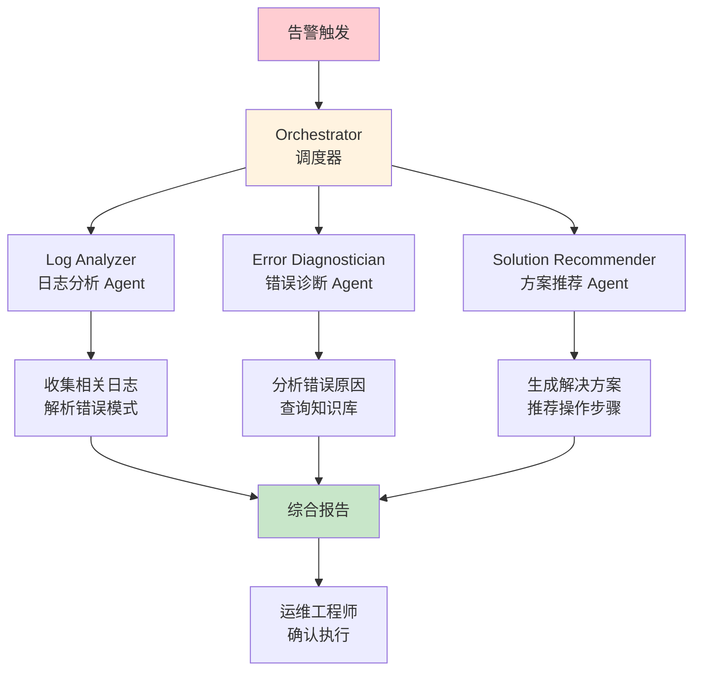

## 14.3 IT 运维智能助手：凌晨3点的救星 <DifficultyBadge level="advanced" /> <CostBadge cost="$0.20" />

> 综合应用：Ch10（Multi-Agent）、Ch11（MCP）、Ch8（Multimodal）

::: danger 运维工程师的噩梦
**凌晨 3 点**，手机响了……  
📱 **告警**：API 响应时间超过 5 秒  
🥱 **你**：（从床上爬起来）先看应用日志……再看 Nginx 日志……再看数据库日志……  
⏰ **20 分钟后**：终于定位到是数据库慢查询  
😭 **心里OS**：要是有个 AI 能自动分析就好了……

**现在，这个 AI 来了。**
:::

### 为什么需要它？（Problem）

**"凌晨 3 点服务器告警，运维工程师需要快速定位问题。"**

IT 运维的痛点：

| 场景 | 痛点 | 后果 |
|------|------|------|
| **紧急故障** | 日志散落在多个系统 | 定位问题慢，MTTR 长 |
| **经验依赖** | 新手不知道从哪查起 | 错过故障黄金处理时间 |
| **重复性问题** | 相同告警反复出现 | 人工排查效率低 |
| **知识流失** | 老员工离职带走经验 | 团队能力下降 |

**真实案例：**

```
某电商平台晚高峰告警：
- 告警信息：API 响应时间超过 5 秒
- 日志分散在：应用日志、Nginx 日志、数据库日志、监控系统
- 传统流程：运维工程师手动查看 4 个系统，花 20 分钟定位到数据库慢查询

使用 AI 助手后：
- 输入：告警信息
- AI 自动：
  1. 收集相关日志
  2. 分析错误模式
  3. 定位到慢查询 SQL
  4. 给出优化建议
- 定位时间：3 分钟
```

**需要：智能运维助手，能自动分析日志、诊断故障、给出解决方案。**

### 它是什么？（Concept）

**IT 运维智能助手** 是基于 Multi-Agent 的故障诊断系统：



**Multi-Agent 架构：**

### 1. Log Analyzer（日志分析 Agent）

**职责：收集和分析日志，提取关键信息。**

```python
class LogAnalyzerAgent:
    """日志分析 Agent"""
    
    def __init__(self, llm):
        self.llm = llm
        self.system_prompt = """
你是一个日志分析专家。你的任务是：
1. 解析日志文件，提取错误信息
2. 识别错误模式（如：频繁出现的异常、时间规律）
3. 提取关键指标（如：错误数量、影响范围）

输出格式：
- 错误摘要
- 关键时间点
- 受影响的组件
- 错误频率统计
"""
    
    def analyze(self, logs: str) -> dict:
        """分析日志"""
        prompt = f"{self.system_prompt}\n\n日志内容：\n{logs}"
        
        response = self.llm.generate(prompt)
        
        return {
            "summary": response,
            "timestamp": datetime.now()
        }
```

### 2. Error Diagnostician（错误诊断 Agent）

**职责：根据错误信息诊断根本原因。**

```python
class ErrorDiagnosticianAgent:
    """错误诊断 Agent"""
    
    def __init__(self, llm, knowledge_base):
        self.llm = llm
        self.kb = knowledge_base
        self.system_prompt = """
你是一个故障诊断专家。你的任务是：
1. 分析错误模式，推断根本原因
2. 查询历史案例，找到相似问题
3. 评估问题严重程度和影响范围

输出格式：
- 根本原因分析
- 相似历史案例
- 严重程度评估（高/中/低）
- 可能的触发条件
"""
    
    def diagnose(self, error_summary: str) -> dict:
        """诊断错误"""
        # 查询知识库
        similar_cases = self.kb.search(error_summary, top_k=3)
        
        prompt = f"""
{self.system_prompt}

当前错误：
{error_summary}

历史相似案例：
{similar_cases}

请给出诊断结果。
"""
        
        response = self.llm.generate(prompt)
        
        return {
            "diagnosis": response,
            "similar_cases": similar_cases
        }
```

### 3. Solution Recommender（方案推荐 Agent）

**职责：生成解决方案和操作步骤。**

```python
class SolutionRecommenderAgent:
    """方案推荐 Agent"""
    
    def __init__(self, llm):
        self.llm = llm
        self.system_prompt = """
你是一个运维解决方案专家。你的任务是：
1. 根据诊断结果，提出解决方案
2. 给出详细的操作步骤
3. 标注风险点和注意事项

输出格式：
- 推荐方案（优先级排序）
- 操作步骤（可执行的命令）
- 风险提示
- 预期效果
"""
    
    def recommend(self, diagnosis: str) -> dict:
        """推荐解决方案"""
        prompt = f"{self.system_prompt}\n\n诊断结果：\n{diagnosis}"
        
        response = self.llm.generate(prompt)
        
        return {
            "solutions": response
        }
```

### 4. Orchestrator（调度器）

**职责：协调多个 Agent，生成综合报告。**

```python
class OpsOrchestrator:
    """运维助手调度器"""
    
    def __init__(self):
        self.log_analyzer = LogAnalyzerAgent(llm)
        self.diagnostician = ErrorDiagnosticianAgent(llm, kb)
        self.solution_recommender = SolutionRecommenderAgent(llm)
    
    def handle_alert(self, alert: dict) -> dict:
        """处理告警"""
        # Step 1: 分析日志
        log_analysis = self.log_analyzer.analyze(alert['logs'])
        
        # Step 2: 诊断错误
        diagnosis = self.diagnostician.diagnose(log_analysis['summary'])
        
        # Step 3: 推荐方案
        solutions = self.solution_recommender.recommend(diagnosis['diagnosis'])
        
        # 生成综合报告
        return {
            "alert": alert,
            "log_analysis": log_analysis,
            "diagnosis": diagnosis,
            "solutions": solutions,
            "timestamp": datetime.now()
        }
```

**工具集成（MCP）：**

运维助手可以调用的工具：

| 工具 | 功能 | 示例 |
|------|------|------|
| **Log Fetcher** | 从日志系统获取日志 | `fetch_logs(service='api', time_range='1h')` |
| **Metrics Reader** | 读取监控指标 | `get_metrics(service='db', metric='cpu')` |
| **Command Executor** | 执行运维命令（需审批） | `restart_service(name='nginx')` |
| **Knowledge Base** | 查询历史案例 | `search_cases(query='timeout')` |

### 动手试试（Practice）

**完整实现：IT 运维智能助手**

```python
from openai import OpenAI
from datetime import datetime
import json

client = OpenAI()

class OpsAssistant:
    """IT 运维智能助手"""
    
    def __init__(self):
        self.client = OpenAI()
        self.knowledge_base = self._load_knowledge_base()
    
    def _load_knowledge_base(self) -> dict:
        """加载知识库（历史案例）"""
        return {
            "timeout": {
                "symptoms": "API 响应超时，日志显示 connection timeout",
                "root_cause": "数据库连接池耗尽",
                "solution": "增加连接池大小或优化慢查询"
            },
            "oom": {
                "symptoms": "服务崩溃，日志显示 OutOfMemoryError",
                "root_cause": "内存泄漏或堆内存配置不足",
                "solution": "分析堆转储文件或增加 -Xmx 参数"
            },
            "high_cpu": {
                "symptoms": "CPU 使用率持续 100%",
                "root_cause": "死循环或低效算法",
                "solution": "使用 profiler 定位热点代码"
            }
        }
    
    def analyze_logs(self, logs: str) -> dict:
        """Step 1: 分析日志"""
        prompt = f"""
你是一个日志分析专家。请分析以下日志,提取关键信息。

日志内容：
{logs}

输出 JSON 格式：
{ {
  "error_type": "<错误类型>",
  "error_message": "<错误信息>",
  "affected_components": ["<组件1>", "<组件2>"],
  "error_count": <错误次数>,
  "first_occurrence": "<首次出现时间>",
  "pattern": "<错误模式描述>"
} }
"""
        
        response = self.client.chat.completions.create(
            model="gpt-4.1-mini",
            messages=[{"role": "user", "content": prompt}],
            response_format={"type": "json_object"}
        )
        
        return json.loads(response.choices[0].message.content)
    
    def diagnose_error(self, log_analysis: dict) -> dict:
        """Step 2: 诊断错误"""
        # 查询知识库
        similar_cases = self._search_knowledge_base(log_analysis['error_type'])
        
        prompt = f"""
你是一个故障诊断专家。请根据日志分析结果和历史案例，诊断根本原因。

日志分析：
{json.dumps(log_analysis, ensure_ascii=False, indent=2)}

历史相似案例：
{json.dumps(similar_cases, ensure_ascii=False, indent=2)}

输出 JSON 格式：
{ {
  "root_cause": "<根本原因>",
  "severity": "high|medium|low",
  "impact_scope": "<影响范围>",
  "possible_triggers": ["<触发条件1>", "<触发条件2>"],
  "confidence": <0-100>
} }
"""
        
        response = self.client.chat.completions.create(
            model="gpt-4.1",  # 使用更强的模型做诊断
            messages=[{"role": "user", "content": prompt}],
            response_format={"type": "json_object"}
        )
        
        return json.loads(response.choices[0].message.content)
    
    def recommend_solution(self, diagnosis: dict) -> dict:
        """Step 3: 推荐解决方案"""
        prompt = f"""
你是一个运维解决方案专家。请根据诊断结果，提出解决方案。

诊断结果：
{json.dumps(diagnosis, ensure_ascii=False, indent=2)}

输出 JSON 格式：
{ {
  "solutions": [
    { {
      "priority": 1,
      "description": "<方案描述>",
      "steps": ["<步骤1>", "<步骤2>"],
      "risks": ["<风险1>"],
      "estimated_time": "<预计时间>"
    } }
  ],
  "preventive_measures": ["<预防措施1>", "<预防措施2>"]
} }
"""
        
        response = self.client.chat.completions.create(
            model="gpt-4.1",
            messages=[{"role": "user", "content": prompt}],
            response_format={"type": "json_object"}
        )
        
        return json.loads(response.choices[0].message.content)
    
    def _search_knowledge_base(self, error_type: str) -> list:
        """搜索知识库"""
        results = []
        error_type_lower = error_type.lower()
        
        for key, case in self.knowledge_base.items():
            if key in error_type_lower or error_type_lower in case['symptoms'].lower():
                results.append(case)
        
        return results
    
    def handle_incident(self, alert_info: dict) -> dict:
        """处理故障（主流程）"""
        print("\n" + "="*60)
        print("🚨 运维助手启动")
        print("="*60)
        
        # Step 1: 日志分析
        print("\n[1/3] 分析日志...")
        log_analysis = self.analyze_logs(alert_info['logs'])
        print(f"✓ 检测到错误类型: {log_analysis['error_type']}")
        print(f"✓ 受影响组件: {', '.join(log_analysis['affected_components'])}")
        
        # Step 2: 错误诊断
        print("\n[2/3] 诊断根本原因...")
        diagnosis = self.diagnose_error(log_analysis)
        print(f"✓ 根本原因: {diagnosis['root_cause']}")
        print(f"✓ 严重程度: {diagnosis['severity'].upper()}")
        print(f"✓ 置信度: {diagnosis['confidence']}%")
        
        # Step 3: 方案推荐
        print("\n[3/3] 生成解决方案...")
        solutions = self.recommend_solution(diagnosis)
        print(f"✓ 已生成 {len(solutions['solutions'])} 个解决方案")
        
        # 生成报告
        report = {
            "alert": alert_info,
            "log_analysis": log_analysis,
            "diagnosis": diagnosis,
            "solutions": solutions,
            "timestamp": datetime.now().isoformat()
        }
        
        print("\n" + "="*60)
        print("📋 故障诊断报告")
        print("="*60)
        
        return report
    
    def format_report(self, report: dict):
        """格式化输出报告"""
        print(f"\n告警时间: {report['alert']['timestamp']}")
        print(f"告警服务: {report['alert']['service']}")
        
        print(f"\n📊 日志分析:")
        print(f"  错误类型: {report['log_analysis']['error_type']}")
        print(f"  错误信息: {report['log_analysis']['error_message']}")
        print(f"  错误次数: {report['log_analysis']['error_count']}")
        
        print(f"\n🔍 根本原因:")
        print(f"  {report['diagnosis']['root_cause']}")
        print(f"  严重程度: {report['diagnosis']['severity'].upper()}")
        print(f"  影响范围: {report['diagnosis']['impact_scope']}")
        
        print(f"\n💡 推荐解决方案:")
        for i, solution in enumerate(report['solutions']['solutions'], 1):
            print(f"\n  方案 {i} (优先级 {solution['priority']}):")
            print(f"  {solution['description']}")
            print(f"  操作步骤:")
            for j, step in enumerate(solution['steps'], 1):
                print(f"    {j}. {step}")
            if solution.get('risks'):
                print(f"  ⚠️  风险提示: {', '.join(solution['risks'])}")
            print(f"  ⏱️  预计时间: {solution['estimated_time']}")
        
        print(f"\n🛡️  预防措施:")
        for measure in report['solutions']['preventive_measures']:
            print(f"  - {measure}")

# ===== 使用示例 =====

assistant = OpsAssistant()

# 模拟告警场景 1：数据库连接超时
alert_1 = {
    "timestamp": "2026-02-20 03:15:30",
    "service": "api-server",
    "severity": "high",
    "message": "API 响应时间超过 5 秒",
    "logs": """
[2026-02-20 03:15:28] ERROR: API request /api/users failed
[2026-02-20 03:15:28] ERROR: Database connection timeout after 5000ms
[2026-02-20 03:15:28] ERROR: Connection pool exhausted (50/50 connections in use)
[2026-02-20 03:15:29] ERROR: Retry failed, returning 504 Gateway Timeout
[2026-02-20 03:15:30] WARN: Connection pool size: 50, waiting threads: 120
"""
}

print("\n" + "#"*60)
print("场景 1: 数据库连接超时")
print("#"*60)

report_1 = assistant.handle_incident(alert_1)
assistant.format_report(report_1)

# 模拟告警场景 2：内存溢出
alert_2 = {
    "timestamp": "2026-02-20 10:45:12",
    "service": "worker-service",
    "severity": "critical",
    "message": "服务崩溃重启",
    "logs": """
[2026-02-20 10:45:10] ERROR: java.lang.OutOfMemoryError: Java heap space
[2026-02-20 10:45:10] ERROR: at com.company.worker.DataProcessor.process(DataProcessor.java:156)
[2026-02-20 10:45:10] ERROR: Unable to create new native thread
[2026-02-20 10:45:11] FATAL: JVM crashed, generating heap dump to /tmp/heapdump.hprof
[2026-02-20 10:45:12] INFO: Service restarting...
"""
}

print("\n\n" + "#"*60)
print("场景 2: 内存溢出")
print("#"*60)

report_2 = assistant.handle_incident(alert_2)
assistant.format_report(report_2)
```

**高级功能：自动执行（需审批）**

```python
class AutomatedOpsAssistant(OpsAssistant):
    """自动化运维助手（支持自动执行）"""
    
    def __init__(self, *args, **kwargs):
        super().__init__(*args, **kwargs)
        self.safe_commands = {
            "restart_service": self._restart_service,
            "scale_up": self._scale_up,
            "clear_cache": self._clear_cache,
        }
    
    def execute_solution(self, solution: dict, auto_approve: bool = False) -> dict:
        """执行解决方案（需审批）"""
        if not auto_approve:
            print(f"\n🔐 需要人工审批：{solution['description']}")
            approval = input("是否执行？(yes/no): ")
            if approval.lower() != 'yes':
                return {"status": "cancelled", "message": "用户取消操作"}
        
        # 解析步骤，提取可执行命令
        for step in solution['steps']:
            if step.startswith("命令:"):
                command = step.split("命令:", 1)[1].strip()
                print(f"\n执行: {command}")
                
                # 检查是否为安全命令
                cmd_name = command.split()[0]
                if cmd_name in self.safe_commands:
                    result = self.safe_commands[cmd_name](command)
                    print(f"结果: {result}")
                else:
                    print(f"⚠️  不安全的命令，需要人工执行")
        
        return {"status": "completed"}
    
    def _restart_service(self, command: str) -> str:
        """重启服务（模拟）"""
        # 实际实现应该调用 K8s API、Systemd 等
        return "服务已重启（模拟）"
    
    def _scale_up(self, command: str) -> str:
        """扩容（模拟）"""
        return "已增加 2 个实例（模拟）"
    
    def _clear_cache(self, command: str) -> str:
        """清除缓存（模拟）"""
        return "Redis 缓存已清除（模拟）"
```

<ColabBadge path="demos/14-practice/ops_assistant.ipynb" />

### 小结（Reflection）

**🎯 一句话总结：运维智能助手是凌晨 3 点的救星，Multi-Agent 协作分析日志、诊断故障、推荐方案，让你多睡会儿。**

- **解决了什么**：构建 Multi-Agent 运维助手，自动分析日志、诊断故障、推荐方案
- **没解决什么**：个人能力提升了，但怎么让整个团队用起来？——下一节介绍团队工具链搭建
- **关键要点**：
  1. **Multi-Agent 协作**：日志分析 + 诊断 + 方案推荐（分工明确，效率高）
  2. **知识库很重要**：历史案例提高诊断准确率（前人栽树，后人乘凉）
  3. **人机协作**：AI 推荐，人工审批执行（别让 AI 删库跑路）
  4. **可扩展性**：通过 MCP 集成更多运维工具（想加啥加啥）
  5. **安全第一**：敏感操作必须人工审批（不怕一万就怕万一）

::: tip 记住这个比喻
运维智能助手 = 凌晨 3 点的救星：自动分析日志、诊断问题、给出方案，你只需要确认执行。
:::

---

*最后更新：2026-02-20*
