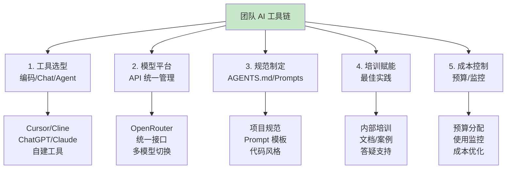
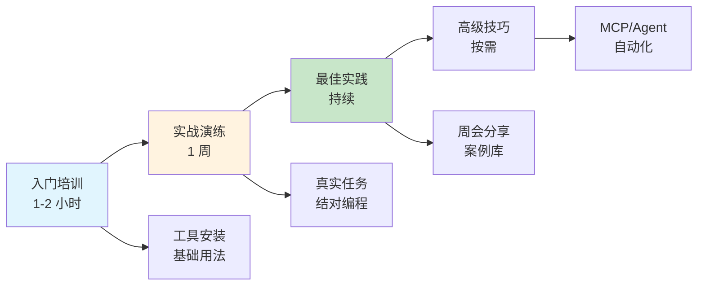

## 14.4 团队 AI 工具链搭建：别让AI落地变成团建失败 <DifficultyBadge level="intermediate" /> <CostBadge cost="$0" />

> 综合应用：Ch5（AI 编码工具）、Ch6（上下文工程）、Ch2（AI 全景）

::: warning 一个悲伤的故事
**第 1 个月**：买了 10 个 ChatGPT Plus，信心满满  
**第 2 个月**：只有 3 个人在用，其他人说"不会用"  
**第 3 个月**：账单 $2000，老板问"为什么这么贵"  
**第 4 个月**：团队放弃 AI，回到传统开发  
**第 5 个月**：你在写这个失败案例的复盘报告……

**问题出在哪？缺少系统性的落地方案。**
:::

### 为什么需要它？（Problem）

**"我学会了 AI，但团队其他人不会用，怎么推广？"**

个人到团队的鸿沟：

| 阶段 | 挑战 | 后果 |
|------|------|------|
| **个人使用** | 自己摸索，效率提升 | 团队效率参差不齐 |
| **推广阶段** | 不知道从哪开始 | 推广失败，工具浪费 |
| **工具选型** | 选项太多，不知道哪个适合 | 工具冲突，学习成本高 |
| **统一规范** | 每个人用法不同 | 无法协作，知识难共享 |
| **成本控制** | 账单失控 | 预算超支，项目暂停 |

**真实案例：**

```
某创业公司的 AI 落地失败案例：
1. 买了 10 个 ChatGPT Plus 账号，但只有 3 个人在用
2. 每个人用不同的工具：Cursor、Cline、GitHub Copilot
3. 没有统一的 Prompt 规范，代码风格混乱
4. 没有成本监控，第一个月花了 $2000
5. 3 个月后放弃，回到传统开发模式

失败原因：缺少系统性的落地方案。
```

**需要：团队级别的 AI 工具链，包括工具选型、规范制定、培训计划、成本控制。**

### 它是什么？（Concept）

**团队 AI 工具链** 是支撑团队 AI 能力的完整体系：



**核心要素：**

### 1. 工具选型矩阵

| 工具类型 | 工具名称 | 适用场景 | 成本 | 推荐指数 |
|---------|---------|---------|------|---------|
| **AI 编码** | Cursor | 主力开发工具 | $20/月/人 | ⭐⭐⭐⭐⭐ |
| **AI 编码** | GitHub Copilot | VS Code 用户 | $10/月/人 | ⭐⭐⭐⭐ |
| **AI 编码** | Cline（MCP） | 高级自动化 | $0（需API） | ⭐⭐⭐⭐ |
| **对话助手** | ChatGPT Plus | 通用问答 | $20/月/人 | ⭐⭐⭐⭐⭐ |
| **对话助手** | Claude Pro | 长文本处理 | $20/月/人 | ⭐⭐⭐⭐ |
| **API 平台** | OpenRouter | 统一 API 入口 | 按量付费 | ⭐⭐⭐⭐⭐ |
| **团队协作** | 自建 Slack Bot | 内部问答 | 开发成本 | ⭐⭐⭐ |

**推荐配置方案：**

**小团队（5-10人）：**
- 编码：Cursor（全员）
- 对话：ChatGPT Plus（2-3 个给技术 Leader）
- API：OpenRouter（团队账号，按需使用）
- 月成本：~$150

**中型团队（10-50人）：**
- 编码：Cursor（开发）+ GitHub Copilot（运维）
- 对话：ChatGPT Plus（技术骨干）+ 自建内部 Bot（全员）
- API：OpenRouter + Azure OpenAI（企业账号）
- 月成本：~$800

**大型团队（50+人）：**
- 编码：统一采购 Cursor 企业版
- 对话：自建企业级平台 + ChatGPT Plus（管理层）
- API：Azure OpenAI（私有部署）
- 月成本：协商定价

### 2. 统一 API 平台：OpenRouter

**为什么需要 OpenRouter？**

```python
# 问题：团队使用多个模型，代码难以统一
# OpenAI
from openai import OpenAI
client1 = OpenAI(api_key="sk-...")

# Anthropic
import anthropic
client2 = anthropic.Anthropic(api_key="sk-ant-...")

# Google
import google.generativeai as genai
genai.configure(api_key="...")

# 每个模型 API 不同，切换困难
```

**解决方案：OpenRouter 统一接口**

```python
# 统一使用 OpenAI SDK，通过 base_url 切换模型
from openai import OpenAI

client = OpenAI(
    base_url="https://openrouter.ai/api/v1",
    api_key="sk-or-..."  # OpenRouter API Key
)

# 轻松切换模型
response = client.chat.completions.create(
    model="anthropic/claude-3.5-sonnet",  # 或 openai/gpt-4o
    messages=[{"role": "user", "content": "Hello"}]
)
```

**OpenRouter 优势：**

| 优势 | 说明 |
|------|------|
| **统一接口** | 所有模型用同一套代码 |
| **成本优化** | 自动选择最便宜的供应商 |
| **降级策略** | 主模型失败自动切换备用 |
| **用量追踪** | 统一的成本监控 |
| **无需多个账号** | 一个 Key 访问所有模型 |

### 3. 项目规范：AGENTS.md

**为什么需要 AGENTS.md？**

让 AI 理解你的项目，生成符合规范的代码。

**AGENTS.md 模板：**

```markdown
# 项目 AI 开发指南

## 项目概述
- **项目名称**: 内部知识库系统
- **技术栈**: Python 3.11, FastAPI, PostgreSQL, Redis, React
- **部署环境**: Docker + K8s

## 代码规范

### Python 代码风格
- 使用 Black 格式化（行长度 88）
- 使用 Ruff 进行 Linting
- 类型注解必须完整
- 文档字符串使用 Google 风格

### 命名规范
- 文件名：snake_case（user_service.py）
- 类名：PascalCase（UserService）
- 函数名：snake_case（get_user_by_id）
- 常量：UPPER_SNAKE_CASE（MAX_RETRY_COUNT）

### 目录结构
```
project/
├── app/
│   ├── api/           # API 路由
│   ├── models/        # 数据模型
│   ├── services/      # 业务逻辑
│   ├── utils/         # 工具函数
│   └── tests/         # 测试
```

## AI 使用规则

### 生成代码要求
1. 必须包含类型注解
2. 必须包含文档字符串
3. 必须包含错误处理
4. 必须包含单元测试

### 禁止操作
- ❌ 不要硬编码敏感信息（密码、API Key）
- ❌ 不要使用已废弃的库
- ❌ 不要忽略异常（禁止空 except）
- ❌ 不要使用 `import *`

### 常用 Prompt 模板

#### 生成 API 端点
```
生成一个 FastAPI 端点，实现用户创建功能。

要求：
- 路径：POST /api/users
- 请求体：UserCreate 模型（username, email, password）
- 响应：UserResponse 模型（id, username, email, created_at）
- 包含参数验证和错误处理
- 使用 SQLAlchemy 写入数据库
- 包含单元测试
```

#### Code Review
```
审查以下代码，关注：
1. 是否符合项目规范（AGENTS.md）
2. 是否有潜在 Bug
3. 是否有安全问题
4. 是否有性能问题

代码：
[粘贴代码]
```

## 依赖库

### 必选依赖
- FastAPI：Web 框架
- SQLAlchemy：ORM
- Pydantic：数据验证
- pytest：测试框架

### 禁用依赖
- Flask（使用 FastAPI 代替）
- requests（使用 httpx 代替）

## 安全规范
- 密码使用 bcrypt 加密
- 敏感配置使用环境变量
- API 需要 JWT 认证
- 输入必须验证和转义

## 测试要求
- 单元测试覆盖率 > 80%
- 每个 API 端点必须有集成测试
- 使用 pytest fixtures 管理测试数据

---
最后更新：2026-02-20
```

**使用方式：**

```python
# 在 Cursor/Cline 中使用 AGENTS.md
# 1. 创建文件：.cursor/AGENTS.md 或项目根目录
# 2. AI 会自动读取并遵循规范
# 3. 生成代码时自动应用规范

# Cline 会自动读取项目中的 AGENTS.md
# Cursor 需要在 Rules for AI 中引用
```

### 4. 团队培训计划

**培训阶段：**



**培训内容大纲：**

**第 1 课：工具安装与基础使用（1 小时）**
- Cursor/Cline 安装配置
- 第一个 AI 辅助编码任务
- Prompt 基础技巧
- 常见问题排查

**第 2 课：实战演练（1 周）**
- 每人完成 1 个真实需求
- 结对编程，互相 Review
- 记录遇到的问题和解决方案
- 周末总结分享

**第 3 课：最佳实践（持续）**
- 每周技术分享会（30 分钟）
- 内部案例库建设
- Prompt 模板共享
- 问题答疑

**第 4 课：高级技巧（按需）**
- MCP Server 开发
- Multi-Agent 应用
- 自动化工作流
- 性能优化

### 5. 成本控制方案

**预算分配：**

| 项目 | 月预算 | 说明 |
|------|--------|------|
| **Cursor 订阅** | $20 × 人数 | 编码工具 |
| **ChatGPT Plus** | $20 × 骨干人数 | 问答工具 |
| **API 使用** | $200-500 | 自建应用 |
| **测试/评估** | $50-100 | 质量保障 |
| **储备金** | $100 | 应对超支 |

**监控指标：**

```python
# 团队 AI 使用仪表盘
metrics = {
    "daily_usage": {
        "cursor_completions": 1500,
        "api_calls": 500,
        "cost_usd": 15.50
    },
    "top_users": [
        {"name": "张三", "cost": 5.20},
        {"name": "李四", "cost": 3.80},
    ],
    "top_models": [
        {"model": "gpt-4.1-mini", "calls": 400, "cost": 8.00},
        {"model": "claude-3.5-sonnet", "calls": 100, "cost": 7.50},
    ],
    "alerts": [
        "⚠️  李四今日使用量超过配额 150%"
    ]
}
```

**成本优化策略：**

1. **任务分级**：简单任务用 GPT-4o-mini，复杂任务用 GPT-4o
2. **Prompt Caching**：固定提示词启用缓存
3. **Batch API**：非实时任务用 Batch（-50% 成本）
4. **定期 Review**：每月检查使用情况，优化低效调用

### 动手试试（Practice）

**实验：搭建团队 AI 工具链**

**Step 1: 创建项目 AGENTS.md**

```markdown
# 项目名称：团队任务管理系统

## 技术栈
- 后端：Python 3.11 + FastAPI
- 数据库：PostgreSQL
- 前端：React + TypeScript

## 代码规范

### Python
- 格式化：Black（行长度 88）
- Linting：Ruff
- 类型注解：必须完整

### API 设计
- RESTful 风格
- 响应格式：`{"data": {...}, "error": null}`
- 错误格式：`{"data": null, "error": {"code": "...", "message": "..."}}`

## AI 使用规则

### 生成代码模板
```python
from fastapi import APIRouter, Depends, HTTPException
from pydantic import BaseModel
from typing import List

router = APIRouter(prefix="/api/tasks", tags=["tasks"])

class TaskCreate(BaseModel):
    title: str
    description: str

class TaskResponse(BaseModel):
    id: int
    title: str
    description: str
    created_at: str

@router.post("/", response_model=TaskResponse)
async def create_task(task: TaskCreate):
    """创建任务
    
    Args:
        task: 任务创建数据
        
    Returns:
        创建的任务对象
        
    Raises:
        HTTPException: 创建失败
    """
    # TODO: 实现逻辑
    pass
```

### 必须遵守
1. 所有函数包含文档字符串
2. 所有参数包含类型注解
3. 错误必须抛出 HTTPException
4. 数据库操作必须使用事务

---
最后更新：2026-02-20
```

**Step 2: 配置统一 API（OpenRouter）**

```python
# config/ai.py
from openai import OpenAI

def get_ai_client(model: str = "gpt-4.1-mini"):
    """获取 AI 客户端（统一接口）"""
    return OpenAI(
        base_url="https://openrouter.ai/api/v1",
        api_key="sk-or-..."  # 团队共享 Key
    )

# 使用示例
client = get_ai_client()

response = client.chat.completions.create(
    model="openai/gpt-4.1-mini",  # 或切换为 anthropic/claude-3.5-sonnet
    messages=[{"role": "user", "content": "Hello"}]
)
```

**Step 3: 建立 Prompt 模板库**

```python
# prompts/templates.py

PROMPTS = {
    "generate_api": """
生成一个 FastAPI 端点，实现 {feature} 功能。

要求：
- 路径：{method} {path}
- 请求体：{request_model}
- 响应：{response_model}
- 包含参数验证和错误处理
- 使用 SQLAlchemy 操作数据库
- 包含文档字符串和类型注解
- 遵循项目规范（见 AGENTS.md）

生成完整代码。
""",
    
    "code_review": """
审查以下代码，检查：
1. 是否符合 AGENTS.md 规范
2. 类型注解是否完整
3. 错误处理是否合理
4. 是否有安全问题
5. 是否有性能问题

代码：
```python
{code}
```

给出详细的审查意见。
""",
    
    "generate_test": """
为以下函数生成 pytest 单元测试。

函数代码：
```python
{function_code}
```

要求：
- 覆盖正常情况和边界情况
- 使用 pytest fixtures
- 包含异常测试
- 代码覆盖率 > 80%

生成完整测试代码。
""",
}

def get_prompt(template_name: str, **kwargs) -> str:
    """获取填充后的 Prompt"""
    template = PROMPTS[template_name]
    return template.format(**kwargs)

# 使用示例
prompt = get_prompt(
    "generate_api",
    feature="用户创建",
    method="POST",
    path="/api/users",
    request_model="UserCreate",
    response_model="UserResponse"
)
```

**Step 4: 成本监控脚本**

```python
# monitor/ai_usage.py
import json
from datetime import datetime, timedelta
from collections import defaultdict

class AIUsageMonitor:
    """AI 使用量监控"""
    
    def __init__(self, log_file: str = "ai_usage.jsonl"):
        self.log_file = log_file
    
    def log_usage(self, user: str, model: str, tokens: int, cost: float):
        """记录使用情况"""
        entry = {
            "timestamp": datetime.now().isoformat(),
            "user": user,
            "model": model,
            "tokens": tokens,
            "cost": cost
        }
        
        with open(self.log_file, 'a') as f:
            f.write(json.dumps(entry) + '\n')
    
    def get_daily_report(self, date: str = None) -> dict:
        """获取每日报告"""
        if not date:
            date = datetime.now().strftime("%Y-%m-%d")
        
        with open(self.log_file, 'r') as f:
            logs = [json.loads(line) for line in f]
        
        # 筛选当日数据
        daily_logs = [
            log for log in logs
            if log['timestamp'].startswith(date)
        ]
        
        # 统计
        user_stats = defaultdict(lambda: {"tokens": 0, "cost": 0})
        model_stats = defaultdict(lambda: {"calls": 0, "cost": 0})
        
        for log in daily_logs:
            user = log['user']
            model = log['model']
            
            user_stats[user]['tokens'] += log['tokens']
            user_stats[user]['cost'] += log['cost']
            
            model_stats[model]['calls'] += 1
            model_stats[model]['cost'] += log['cost']
        
        total_cost = sum(log['cost'] for log in daily_logs)
        
        return {
            "date": date,
            "total_cost": round(total_cost, 2),
            "total_calls": len(daily_logs),
            "user_stats": dict(user_stats),
            "model_stats": dict(model_stats),
            "alerts": self._check_alerts(user_stats, total_cost)
        }
    
    def _check_alerts(self, user_stats: dict, total_cost: float) -> list:
        """检查告警"""
        alerts = []
        
        # 检查每日总成本
        if total_cost > 100:
            alerts.append(f"⚠️  每日成本 ${total_cost:.2f} 超过预算 $100")
        
        # 检查个人使用量
        for user, stats in user_stats.items():
            if stats['cost'] > 20:
                alerts.append(f"⚠️  {user} 每日成本 ${stats['cost']:.2f} 超过个人配额 $20")
        
        return alerts

# 使用示例
monitor = AIUsageMonitor()

# 记录使用
monitor.log_usage(
    user="张三",
    model="gpt-4.1-mini",
    tokens=500,
    cost=0.05
)

# 获取报告
report = monitor.get_daily_report()
print(f"今日成本：${report['total_cost']}")
print(f"调用次数：{report['total_calls']}")

if report['alerts']:
    print("\n告警：")
    for alert in report['alerts']:
        print(f"  {alert}")
```

**Step 5: 培训文档生成器**

```python
# training/doc_generator.py

def generate_onboarding_doc() -> str:
    """生成新员工 AI 工具入门文档"""
    doc = """
# 团队 AI 工具使用指南

## 1. 工具安装

### Cursor（主力编码工具）
1. 访问 https://cursor.com 下载
2. 使用团队邮箱注册
3. 在 Settings → API Keys 中配置团队 OpenRouter Key

### ChatGPT（问答工具）
- 骨干人员：公司提供 Plus 账号
- 其他人员：使用内部 Slack Bot（@ai-bot）

## 2. 快速开始

### 第一个 AI 辅助编码任务
1. 打开 Cursor，按 Ctrl+K
2. 输入：`生成一个 FastAPI 路由，实现用户列表查询`
3. 查看生成的代码，按 Tab 接受
4. 验证代码是否符合 AGENTS.md 规范

### 常用快捷键
- `Ctrl+K`: 生成代码
- `Ctrl+L`: 对话窗口
- `Ctrl+I`: 内联编辑
- `Cmd+/`: 快速问答

## 3. 最佳实践

### 编写好的 Prompt
✅ 好的 Prompt：
```
生成一个 FastAPI 端点，实现用户创建功能。

要求：
- 路径：POST /api/users
- 请求体：UserCreate 模型（username, email, password）
- 响应：UserResponse 模型
- 包含参数验证
- 使用 SQLAlchemy 写入数据库
```

❌ 差的 Prompt：
```
写一个创建用户的接口
```

### 代码 Review 流程
1. 生成代码后，让 AI 自己 Review
2. 检查是否符合 AGENTS.md 规范
3. 运行测试
4. 提交前人工 Review

## 4. 注意事项

### 安全规范
- ❌ 不要让 AI 生成包含真实密码、API Key 的代码
- ❌ 不要把生产环境配置发给 AI
- ✅ 敏感信息使用占位符，手动替换

### 成本控制
- 个人每日配额：$20
- 超出配额会收到邮件提醒
- 简单任务优先用 GPT-4o-mini

## 5. 获取帮助

- 技术问题：Slack #ai-help 频道
- 账号问题：联系 IT 部门
- 最佳实践：查看内部 Wiki

---
最后更新：2026-02-20
"""
    return doc

# 生成文档
print(generate_onboarding_doc())
```

<ColabBadge path="demos/14-practice/team_toolchain.ipynb" />

### 小结（Reflection）

**🎯 一句话总结：团队 AI 工具链是从个人到团队的桥梁，工具选型+规范制定+培训赋能+成本控制，缺一不可。**

- **解决了什么**：建立团队级 AI 工具链，包括工具选型、规范制定、培训、成本控制
- **本章总结**：完成了 4 个实战项目，从知识库到代码审查到运维到团队落地
- **关键要点**：
  1. **工具选型**：Cursor + ChatGPT + OpenRouter 是高性价比组合（别乱买一堆用不上的）
  2. **AGENTS.md 是核心**：让 AI 理解项目规范，生成符合要求的代码（相当于给 AI 发工作手册）
  3. **Prompt 模板库**：复用最佳实践，提高团队效率（别让每个人重复造轮子）
  4. **成本监控**：预算分配 + 使用监控 + 告警机制（别等老板发飙才知道超支）
  5. **培训赋能**：入门培训 + 实战演练 + 持续分享（授人以鱼不如授人以渔）

::: tip 记住这个比喻
团队 AI 工具链 = 公司的AI基础设施：工具、规范、培训、监控一个都不能少。
:::

---

## 🎓 实战篇检查点

恭喜！你已经完成了 4 个完整的 IT 部门实战项目：

### 你学会了什么？

- ✅ **内部知识库 Q&A 系统**：RAG + 向量检索 + 引用溯源
- ✅ **AI Code Review 助手**：多维度代码审查 + GitHub 集成
- ✅ **IT 运维智能助手**：Multi-Agent 协作 + 日志分析 + 故障诊断
- ✅ **团队 AI 工具链搭建**：工具选型 + 规范 + 培训 + 成本控制

### 能做什么？

1. **独立开发**：从需求到部署的完整 AI 应用（不是玩具，是能用的）
2. **团队协作**：建立团队级 AI 开发规范和流程（让团队一起上车）
3. **持续优化**：监控、评估、成本控制的闭环体系（不翻车）

### 你的 AI 能力等级

经过 14 章的学习，你已经从 **AI 初学者** 成长为 **AI 应用开发者**：

- ✅ 理解 LLM 原理和 Prompt Engineering
- ✅ 熟练使用 AI 编码工具（Cursor/Cline）
- ✅ 掌握 Function Calling 和 Agents 开发
- ✅ 会构建 RAG 和 Multi-Agent 系统
- ✅ 具备生产化和团队落地能力

**现在，你可以拿着这些项目去和老板谈加薪了。**

### 继续提升

**进阶方向：**
1. **深入 MCP 生态**：开发更多 MCP Server
2. **Multi-Agent 应用**：构建复杂的 Agent 协作系统
3. **Fine-tuning**：针对特定任务微调模型
4. **AI 产品化**：从工具到产品的完整路径

**学习资源：**
- OpenAI Cookbook：https://cookbook.openai.com
- LangChain 文档：https://python.langchain.com
- Anthropic Claude Docs：https://docs.anthropic.com
- 本课程 GitHub：https://github.com/your-org/ai-first-app

---

## 🎉 课程结语

感谢你完成《AI First 应用开发实战》课程！

**你已经具备了：**
- ✅ 扎实的 AI 应用开发基础
- ✅ 完整的生产化能力
- ✅ 实战经验和最佳实践

**下一步：**
- 🚀 将所学应用到实际项目
- 🤝 与团队分享知识
- 📈 持续学习最新技术

**记住：AI 技术发展迅速，保持学习和实践才是关键。**

祝你在 AI First 的道路上越走越远！

---

*最后更新：2026-02-20*
