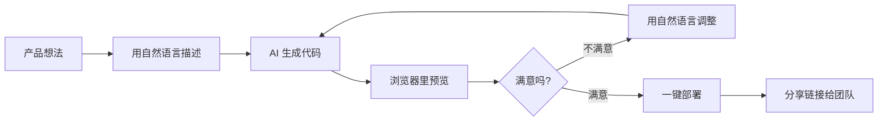

---
prev:
  text: '15.2 主流平台详解'
  link: '/zh/15-ai-workflow/platforms'
next:
  text: 'A. 术语表'
  link: '/zh/appendix/'
---

# 16.1 人人都是开发者

::: info 拓展篇
本章为拓展内容，探讨 AI 对组织和角色的影响。不依赖前面的编程实战章节，任何人都能直接阅读。
:::

> "这个世界上最危险的程序员,是一个手持 Cursor 的产品经理。" —— 某位匿名工程师的临终遗言

## 开场白:代码民主化的来临

2026 年的办公室里,发生了一件让传统开发者集体破防的事情:销售 Amy 用 ChatGPT 写了个客户跟进自动化脚本,运营 Bob 用 Replit 搭了个活动报名系统,法务 Carol 用 AI 生成了合同审查工具,就连前台 David 都用 v0.dev 做了个访客登记应用。

与此同时,开发团队的需求池积压了 347 个需求,最早的一个是 2024 年 3 月提的"能不能在报表里加个导出按钮"。

这不是科幻小说,这是 Anthropic《2026 年代理式编程趋势报告》揭示的现实:**编程能力正在从开发部门扩散到整个组织**。当 AI 成为每个人的编程助手,我们正在见证一场静悄悄的革命——或者说,一场让程序员们瑟瑟发抖的"起义"。

::: warning 友情提示
本文不是在鼓励所有人都去写代码(虽然你们确实可以),而是探讨当非技术人员获得编程能力后,组织结构、协作模式和开发者角色会发生什么变化。如果你是开发者,建议深呼吸后继续阅读。
:::

## 谁在用 AI 写代码?他们在写什么?

### 真实案例集锦

**场景一:产品经理的逆袭**

王产品(化名)厌倦了等待开发排期。他的需求"用户反馈收集表单"在需求池里躺了两个月,眼看竞品都要上线三代了。

某天下午,他打开 Cursor,输入:

```
创建一个用户反馈表单,包括:
- 满意度评分(1-5星)
- 功能建议(文本框)
- 联系方式(可选)
- 提交后发送邮件通知到 feedback@company.com
- 数据存储到 Google Sheets
```

40 分钟后,一个完整的反馈系统上线了。技术栈?他不知道也不在乎。能用就行。

**场景二:设计师的升维打击**

张设计师以前的工作流:在 Figma 画原型 → 等开发实现 → 发现和设计稿有 37 处不一致 → 来回扯皮 → 妥协 → 上线 → 不满意。

现在的工作流:在 Figma 画原型 → 导出到 v0.dev → AI 生成可交互的 React 组件 → 微调样式 → 部署 → 直接给开发者看成品 → "就做成这样"。

开发者:"......"(无言以对)

**场景三:数据分析师的解放**

李分析师以前需要:写 SQL 查询 → 导出 CSV → 用 Excel 做透视表 → 手动画图表 → 复制到 PPT → 每周重复一次。

现在她对 ChatGPT Code Interpreter 说:"用这个 CSV 文件创建一个自动更新的销售仪表盘,包含趋势图、区域对比和同比增长率。" 

10 分钟后,一个交互式仪表盘生成了,还附带自动刷新功能。

**场景四:运营的自动化帝国**

运营小陈的日常工作包括:每天 9 点发送昨日数据报告、每周三更新活动页面、每月初生成上月分析报告。

他用 Replit Agent 创建了三个自动化脚本:

1. 定时数据爬取与邮件发送(Python + cron)
2. 活动页面内容管理系统(Next.js)
3. 月报生成器(调用 Claude API 分析数据并生成报告)

现在他每天 10 点才到公司,因为"反正脚本都跑完了"。

::: tip 数据支撑
根据 Anthropic 报告,2025-2026 年间:
- 非技术团队的 AI 编程工具使用率增长了 312%
- 内部工具的平均开发周期从 6 周缩短到 3 天
- 43% 的"小型应用"现在由需求方直接实现
:::

## 产品经理:从"需求提出者"到"解决方案实现者"

### PM 们正在构建什么

1. **MVP 原型**:不再是 PPT 原型,而是真实可运行的产品
2. **内部工具**:CRM 插件、数据看板、A/B 测试面板
3. **用户研究工具**:调研表单、访谈记录系统、用户旅程可视化
4. **竞品分析自动化**:爬取竞品数据、价格监控、功能对比表

### "Vibe Coding"的典型流程



::: warning PM 请注意
你现在能写代码了,但这不意味着你应该重写整个产品。请记住:
- **边界意识**:小工具可以自己做,核心系统还是要专业团队
- **沟通升级**:你现在能看懂代码了,但别在 Code Review 时指点江山
- **责任自负**:你写的代码,你自己维护(至少前三个月)
:::

## 设计师:从"画图的"到"做出来的"

### v0.dev 改变的游戏规则

传统设计交付物:Figma 文件 + 标注 + 一堆"请按设计稿实现"的备注。

AI 时代设计交付物:可运行的 React 组件 + Tailwind CSS 样式 + 响应式布局 + 交互动画。

**真实案例:**

某设计师用 v0.dev 做了个"登录页面生成器":

- 输入:品牌色、Logo、Slogan
- 输出:10 种风格的完整登录页面(含表单验证、错误提示、Loading 状态)
- 时间:5 分钟

以前开发实现这个需要 2 天,现在设计师直接交付成品代码。

### Figma AI + 前端框架的组合拳

1. **Figma AI 生成设计稿** → 描述产品需求,自动生成多种设计方案
2. **Figma to Code 插件** → 一键导出为 React/Vue/HTML 代码
3. **v0.dev 优化** → AI 重构代码,优化性能和可访问性
4. **直接部署** → Vercel/Netlify 一键上线

开发者:"所以你们还需要我做什么?"

设计师:"帮我看看这个 API 为什么调不通。"

::: tip 设计师的新技能树
- **基础 HTML/CSS**:知道什么是 div、class、响应式
- **组件思维**:理解组件复用、Props 传递
- **开发者语言**:能说"这个组件需要 loading 和 error 状态"
- **Git 基础**:知道怎么提交代码(虽然经常忘记写 commit message)
:::

## 数据分析师:告别 SQL 地狱

### 从"取数工程师"到"洞察提供者"

传统数据分析师的时间分配:
- 70% 写 SQL 查询
- 20% 清洗数据
- 10% 真正做分析

AI 时代数据分析师的时间分配:
- 10% 对话式查询("帮我找出上个月复购率最高的用户群体")
- 10% 审查 AI 生成的查询逻辑
- 80% 深度分析和业务建议

### ChatGPT Code Interpreter 的魔法

**场景:CEO 突然要一个复杂报告**

以前:
1. 理解需求(1 小时)
2. 写 SQL 查询(3 小时,期间卡在 JOIN 语句)
3. 导出数据(10 分钟)
4. Excel 处理(2 小时)
5. 制作图表(1 小时)
6. 写分析报告(2 小时)
**总计:9+ 小时**

现在:
1. 上传数据文件到 ChatGPT
2. 输入:"创建一个包含以下维度的分析报告:用户增长趋势、留存率分析、收入来源分布、地域差异。生成可视化图表和 3 个关键洞察。"
3. 审查 AI 的分析逻辑
4. 导出交互式 HTML 报告
**总计:30 分钟**

::: details 真实对话示例
**分析师:** "帮我分析这个用户行为数据集,找出流失用户的共同特征"

**AI:** (生成代码执行分析)

**AI:** "我发现了 4 个显著特征:1) 首周登录少于 3 次;2) 未完成新手任务;3) 未添加好友;4) 集中在安卓低端设备。建议优化新手引导流程。这是详细的数据分布图..."

**分析师:** "生成一个 PPT 格式的报告,包含这些图表和建议"

**AI:** "已生成,包含 8 页内容:执行摘要、数据概览、4 个特征分析、可视化图表、改进建议。"

**CEO:** "小王效率真高,升职加薪!"

**小王内心:** "谢谢 Claude。"
:::

## 运营团队:自动化一切可自动化的

### 运营人员的 AI 工具箱

1. **Zapier + AI**:无代码自动化工作流
   - 示例:新客户注册 → AI 生成欢迎邮件(个性化内容)→ 发送 → 记录到 CRM

2. **Replit Agent**:会话式应用开发
   - 示例:"创建一个活动报名系统,包含表单、支付、邮件通知和后台管理"

3. **ChatGPT + Python**:数据处理自动化
   - 示例:每日自动抓取竞品价格、生成对比表、发送到 Slack

4. **AI 文案生成器**:批量内容创作
   - 示例:输入产品参数,输出 100 条不同风格的广告文案

### 案例:一个运营如何解放自己

小李是电商运营,以前每天:
- 9:00 - 手动更新商品库存到网站
- 10:00 - 整理昨日销售数据
- 11:00 - 制作每日报表发给老板
- 14:00 - 回复客户咨询邮件
- 16:00 - 更新促销活动页面
- 18:00 - 准备明日的社交媒体内容

现在她用 AI 工具搭建了自动化系统:
- **库存同步脚本**(Python):每小时自动同步 ERP 和网站库存
- **数据看板**(Retool + AI):实时显示关键指标,无需手动整理
- **报表机器人**(Claude API):每天 8:30 自动生成报表发邮件
- **客服 AI**(自定义 GPT):自动回复 80% 的常见问题
- **内容管理系统**(Replit):提前编辑好内容,定时自动发布

结果:她现在每天 12 点到公司,"处理那 20% AI 解决不了的复杂问题"。

::: tip 运营自动化的黄金法则
1. **重复性工作优先**:做了 10 次以上的事情就该自动化
2. **从小处着手**:先自动化一个小流程,成功后再扩展
3. **保留人工审核**:AI 生成内容,人类最终检查
4. **文档记录**:写清楚每个自动化脚本做什么,方便交接
:::

## 专业开发者的新角色:从建设者到架构师与审查员

### "我的工作被抢了吗?"

短答案:没有。

长答案:你的工作内容变了。

**以前的开发者:**
- 90% 写业务代码(增删改查、表单、页面)
- 10% 架构设计和难题攻关

**现在的开发者:**
- 30% 审查非专业人员写的代码
- 30% 设计系统架构和技术方案
- 20% 解决复杂技术难题
- 20% 建立开发规范和最佳实践

### 具体来说,你要做什么?

#### 1. **架构师角色**

非开发人员:"我用 AI 做了个用户管理系统!"

开发者:"很好,但你考虑过:
- 密码加密用什么算法?
- 会话管理怎么做?
- GDPR 合规问题?
- 并发 1000 人访问会不会崩?
- 数据备份策略?"

非开发人员:"......"

**你的价值:**设计可扩展、安全、可维护的系统架构。

#### 2. **Code Reviewer**

非开发人员提交了一个"完美运行"的脚本:

```python
# 他们的代码
password = "admin123"  # 硬编码密码
db_data = requests.get(f"http://api.com/users?id={user_input}").json()  # SQL 注入风险
for i in range(10000):  # O(n²) 复杂度
    for j in range(10000):
        # 一些低效操作
```

你的审查意见:
- ❌ 密码硬编码 → 使用环境变量
- ❌ SQL 注入风险 → 参数化查询
- ❌ 性能问题 → 算法优化
- ❌ 缺少错误处理 → 添加 try-catch
- ❌ 没有日志记录 → 添加 logging

**你的价值:**确保代码质量、安全和性能。

#### 3. **技术债务管理者**

非开发人员写的代码特点:
- ✅ 功能能用
- ❌ 没有测试
- ❌ 硬编码到处都是
- ❌ 没有文档
- ❌ 三个月后没人看得懂

你的工作:
1. 建立代码规范和模板
2. 提供可复用的组件库
3. 定期重构和优化
4. 培训和指导

#### 4. **安全守门员**

非技术人员容易犯的安全错误:
- 在前端验证权限(后端不验证)
- 把 API 密钥提交到 GitHub
- 未加密存储敏感数据
- 使用过时的依赖库(含已知漏洞)
- 缺少输入验证

你的检查清单:
- [ ] 身份认证和授权
- [ ] 数据加密(传输和存储)
- [ ] 输入验证和 SQL 注入防护
- [ ] XSS 和 CSRF 防护
- [ ] 依赖库安全审计
- [ ] 日志和监控

::: tip 开发者的心态转变
**旧思维:** "为什么他们不懂技术还要写代码?这代码写的什么玩意儿!"

**新思维:** "太好了,他们解决了自己的问题,我可以专注在更有挑战的事情上。让我帮他们把代码优化一下,顺便建立一套规范。"

从"守门人"到"赋能者",从"唯一的建设者"到"首席质量官"。
:::

## 风险与护栏:不是所有人都应该写所有代码

### 真实的灾难案例

**案例 1:销售总监的"小工具"**

某销售总监用 AI 做了个"客户数据分析工具",直接连接到生产数据库,没有任何权限控制。结果:
- 实习生误操作删除了 3000 条客户记录
- 销售数据泄露到竞争对手(工具没有访问日志)
- 数据库因为低效查询几次崩溃

**损失:**估计 50 万美元 + 客户信任危机

**案例 2:市场部的"自动化脚本"**

市场部用 ChatGPT 写了个"批量邮件发送脚本",结果:
- 因为没有限流,触发了 ESP 的反垃圾邮件机制
- 公司域名被列入黑名单
- 3 万封邮件发送到错误的客户(变量名写错了)

**损失:**品牌声誉受损 + 2 周时间恢复域名信誉

**案例 3:财务的"自动对账系统"**

财务人员用 AI 搭建了自动对账系统,但:
- 浮点数计算精度问题导致金额不准
- 没有事务处理,系统崩溃时数据不一致
- 审计时发现账目有 $12,847 的"神秘差异"

**损失:**审计不通过 + CFO 被问责

::: danger 危险区域:请勿擅自进入
以下类型的系统,请务必由专业开发团队负责:

1. **金融交易系统**:涉及金钱的,一分钱都不能错
2. **用户认证和授权**:安全是专业活儿
3. **生产数据库操作**:一个 DELETE 没有 WHERE,全公司凉凉
4. **对外 API 服务**:性能、安全、SLA 保障
5. **合规相关系统**:GDPR、HIPAA、SOC 2 等,法律责任很重
6. **高并发系统**:扛不住流量,损失的是真金白银

这些不是 AI 生成代码就能解决的,需要深厚的专业知识。
:::

### 建立安全护栏

#### 1. **权限分级制度**

| 角色 | 可以做 | 不可以做 |
|------|--------|----------|
| **非技术人员** | 个人工具、数据分析脚本、原型 | 访问生产数据库、部署到生产环境 |
| **技术 Leader** | 内部工具、自动化流程 | 修改核心系统、绕过 Code Review |
| **专业开发** | 大部分开发工作 | 直接修改生产数据库、跳过测试 |
| **高级工程师** | 核心系统开发 | 单人决策架构变更 |

#### 2. **Code Review 流程**

所有代码,无论谁写的,都要经过:
1. **自动化检查**:Linter、安全扫描、测试覆盖率
2. **同行审查**:至少一名开发者 Review
3. **安全审查**(如果涉及敏感数据):信息安全团队审查
4. **上线审批**:技术负责人批准

#### 3. **环境隔离**

```
开发环境 (Dev)
  ↓ 测试通过
测试环境 (Staging)
  ↓ Review 通过
生产环境 (Production) ← 严格权限控制
```

非技术人员:只能访问 Dev 环境

技术人员:Dev + Staging

高级工程师:Dev + Staging + Production(有审计日志)

#### 4. **技术债务管理**

建立"AI 生成代码"标记制度:
- 🤖 **AI Generated**:完全由 AI 生成,需要审查
- 🔍 **AI Assisted**:AI 辅助,人类大幅修改
- 👨‍💻 **Human Written**:人类从头编写

定期(每月)审查 AI 生成的代码,优化或重构。

::: tip 一个好的比喻
AI 编程工具就像**电动工具**:

- **手电钻**让装修变简单,但你不会让没培训过的人去拆承重墙
- **电锯**让木工高效,但你不会让新手去切手术室的精密设备

AI 让编程民主化,但不意味着所有编程都应该民主化。

关键是:**根据任务风险选择合适的人和工具**。
:::

## IT 团队如何应对这场变革

### 策略一:拥抱而非抵制

**错误做法:** "禁止非技术人员使用 AI 编程工具!"

**结果:**他们偷偷用,IT 团队完全失控。

**正确做法:** "我们提供官方支持的 AI 编程平台,附带培训和最佳实践。"

**结果:**IT 团队掌握主动权,能监控和指导。

### 策略二:建立"AI 编程卓越中心"

一个跨职能团队,负责:

1. **工具评估与推荐**
   - 评测各种 AI 编程工具(Cursor、Replit、v0.dev、Copilot)
   - 根据不同角色推荐合适工具
   - 统一采购和许可证管理

2. **最佳实践与培训**
   - 编写"非技术人员 AI 编程指南"
   - 每月举办培训工作坊
   - 建立内部案例库

3. **代码审查与支持**
   - 提供"AI 代码诊所"(每周固定时间,帮助审查代码)
   - 建立 Slack 频道快速答疑
   - 代码模板和组件库

4. **安全与合规**
   - 制定 AI 编程安全规范
   - 自动化安全扫描
   - 定期安全审计

### 策略三:提供"轨道和护栏"

**轨道(Paved Roads):**让正确的做法成为最简单的做法

- **模板库**:"想做数据看板?用这个模板,已经配置好认证和数据库连接"
- **组件库**:"需要表单?导入我们的 FormBuilder,自动处理验证和错误"
- **部署平台**:"代码写好了?推送到内部平台,自动测试和部署"

**护栏(Guardrails):**防止危险操作

- **自动扫描**:提交代码时自动检测硬编码密码、SQL 注入风险
- **权限限制**:非技术人员的代码默认不能访问生产数据库
- **资源限额**:防止低效代码耗尽服务器资源

### 策略四:重新定义开发团队的 KPI

**旧 KPI:**
- 完成需求数量
- 代码行数
- Bug 修复速度

**新 KPI:**
- **赋能指标**:帮助其他团队实现了多少需求
- **代码质量**:Review 发现并修复的问题数
- **架构健壮性**:系统可扩展性、安全性评分
- **知识传播**:培训次数、文档质量

从"交付者"变成"赋能者"。

::: warning IT 领导者的挑战
最大的挑战不是技术,而是**文化转变**:

- 从"我们是唯一能写代码的人"到"我们帮助所有人安全地写代码"
- 从"保护我们的领地"到"扩大技术的影响力"
- 从"需求实现者"到"平台和工具提供者"

需要的领导力:开放心态 + 系统思维 + 服务意识
:::

## 组织变革:当每个部门都有"半个开发者"

### 新的协作模式

**传统模式:**

```
业务部门 → 需求文档 → 开发团队 → 开发 → 测试 → 上线 → 业务验收
           ↑_______反馈循环(周期:数周到数月)_________|
```

**AI 时代模式:**

```
业务部门 → AI 快速原型 → 开发团队审查优化 → 上线
           ↑____反馈循环(周期:数小时到数天)_____|
```

### 实际案例:一个功能的两种实现路径

**功能需求:**客户要求记录功能(销售人员记录客户拜访)

#### 传统路径(6 周)

1. **Week 1:**需求讨论会议,产品经理写 PRD
2. **Week 2:**开发评估技术方案,UI 设计稿
3. **Week 3-4:**开发实现前后端
4. **Week 5:**测试发现问题,返工
5. **Week 6:**上线,销售团队:"咦,这不是我想要的..."

#### AI 时代路径(3 天)

1. **Day 1 上午:**销售主管用 Replit 做出原型,给团队试用
2. **Day 1 下午:**收集反馈,AI 调整原型
3. **Day 2:**开发团队 Review,优化性能和安全
4. **Day 3:**测试通过,上线

**关键差异:**需求在实现前就被验证了,因为"原型"就是"成品"。

### 组织结构的微妙变化

#### 出现的新角色

1. **公民开发者(Citizen Developer)**
   - 定义:非技术背景但能用 AI 工具实现解决方案的员工
   - 技能:自然语言编程、基础调试、产品思维
   - 职责:快速原型、内部工具、自动化脚本

2. **技术使能者(Tech Enabler)**
   - 定义:专业开发者中专注于赋能他人的角色
   - 技能:架构设计、Code Review、教学能力
   - 职责:审查代码、提供培训、建立规范

3. **AI 编程教练(AI Coding Coach)**
   - 定义:帮助非技术人员更好使用 AI 工具的专家
   - 技能:AI 工具精通、编程基础、沟通能力
   - 职责:培训、答疑、最佳实践推广

#### 传统开发团队的分化

一个 10 人的开发团队可能变成:

- **3 人 - 核心系统开发**:负责复杂、关键系统
- **2 人 - 平台工程**:维护内部开发平台和工具
- **2 人 - 代码审查与质量**:Review 所有代码,确保质量
- **2 人 - 技术使能**:培训、支持其他部门
- **1 人 - 架构与规划**:技术方向、架构决策

### 跨部门协作的新范式

**案例:一个完整的产品迭代**

**背景:**电商公司要增加"购物车推荐"功能

**参与者:**
- **产品经理:**用 v0.dev 创建 UI 原型
- **数据分析师:**用 ChatGPT 分析用户行为,生成推荐算法
- **设计师:**在原型基础上优化视觉
- **后端开发:**实现推荐引擎 API 和性能优化
- **前端开发:**Review 产品经理的代码,重构优化
- **QA:**编写自动化测试

**结果:**
- 开发周期从 4 周缩短到 1 周
- 产品更符合预期(因为产品经理自己实现了核心交互)
- 开发团队专注在高价值工作(算法优化、性能调优)

::: tip 成功的关键
- **清晰的责任边界**:谁负责什么,出了问题找谁
- **持续沟通**:每天 15 分钟站会,同步进展
- **互相尊重**:开发者尊重业务专业性,业务尊重技术复杂性
- **共同目标**:不是"你的代码"vs"我的代码",而是"我们的产品"
:::

## 现实检验:这不是乌托邦

### 仍然存在的挑战

1. **技能天花板**
   - AI 能帮你写 CRUD 应用,但复杂算法、性能优化、分布式系统仍需专业知识
   - 非技术人员很难判断"这个方案能不能扛住 100 万用户"

2. **维护噩梦**
   - 6 个月后,当初写代码的产品经理离职了,留下 15 个"AI 生成的遗产系统"
   - 没人看得懂,没人敢动,最后还是开发团队重写

3. **安全隐患**
   - AI 不懂安全最佳实践,生成的代码可能有漏洞
   - 非技术人员更不懂,导致安全债务积累

4. **质量参差不齐**
   - 有人用 AI 写出了优雅的代码
   - 有人写出了"能跑就行"的意大利面代码
   - 技术债务像滚雪球

### 这不是银弹

AI 编程工具不能解决的问题:

- ❌ **架构设计**:系统如何拆分、技术栈选择、扩展性考虑
- ❌ **性能优化**:为什么慢?怎么优化?需要深入理解
- ❌ **调试复杂 Bug**:跨系统、偶发性、生产环境专有的问题
- ❌ **技术决策**:要不要重构?用什么框架?如何权衡?
- ❌ **团队协作**:代码冲突解决、架构一致性、技术债务管理

::: warning 务实的建议
**对非技术人员:**
- ✅ 用 AI 工具做小型内部工具、原型、自动化脚本
- ✅ 主动寻求开发团队的 Code Review
- ✅ 学习基础的编程概念(变量、循环、函数)
- ❌ 不要碰生产数据库、认证系统、金融相关代码
- ❌ 不要绕过 Code Review 直接部署
- ❌ 不要认为"能跑"就等于"做好了"

**对专业开发者:**
- ✅ 拥抱变化,从"独占"到"赋能"
- ✅ 建立规范和护栏,而不是一禁了之
- ✅ 将这视为机会:摆脱重复工作,专注高价值任务
- ❌ 不要鄙视非专业代码(记住你第一次写代码的样子)
- ❌ 不要拒绝 Review(这是质量保障的关键)
- ❌ 不要固守旧角色定义(世界在变,角色也在变)
:::

## 未来展望:5 年后的办公室

### 2031 年的一天

**上午 9:00 - 市场部**

市场经理 Alice:"我们需要一个活动页面,要有倒计时、报名表单、支付集成。"

AI 助手:"已生成,采用你的品牌模板,集成了 Stripe 支付,部署到 landing.company.com/summer-event。需要我生成配套的邮件模板和社交媒体素材吗?"

Alice:"生成吧。顺便帮我预测一下这个活动的转化率。"

AI:"根据历史数据,预计转化率 8.3%,建议优化标题和 CTA 按钮位置。我已生成 A/B 测试版本。"

**上午 10:00 - 开发团队**

Tech Lead Bob:"今天我们要 Review 这周其他部门提交的 12 个应用。"

AI 助手:"我已完成初步审查:
- 6 个通过自动化检查,建议批准
- 4 个有轻微性能问题,我已生成优化建议
- 2 个有安全风险,标记为高优先级人工审查"

Bob:"重点看那 2 个安全风险的。"(20 分钟审查完毕,提供修改意见)

**下午 2:00 - 销售部**

销售总监 Carol:"我需要一个客户健康度评分系统,根据互动频率、合同金额、支持工单数量计算。"

AI 助手:"已创建,集成到你的 CRM。这是评分逻辑,请确认是否符合预期。"

Carol:"很好,但我想加入'决策层联系人数量'这个维度。"

AI:"已添加,重新计算了所有客户评分。发现 23 个高风险客户,已发送提醒给对应销售。"

**下午 4:00 - 产品团队**

产品经理 David:"我们的新功能准备好了,开发团队帮我审查过了,部署吧。"

AI 助手:"正在部署...完成。已启用 1% 灰度发布,监控中...未发现异常,逐步扩展到 100%。"

**晚上 6:00 - CEO**

CEO:"给我一个今日公司全景报告。"

AI 助手:"
- 📈 市场部新活动上线,预计新增 500 客户
- 🛡️ 开发团队审查了 12 个应用,拦截了 2 个安全风险
- 💰 销售部识别出 23 个高风险客户,已采取行动
- 🚀 产品新功能顺利上线,用户反馈正面 87%
- 💡 本周全公司通过 AI 工具节省开发时间约 120 小时"

CEO:"不错。明年我们的工程师团队可以缩减到 5 个人了吗?"

AI 助手:"不建议。工程师团队的价值在于架构设计、质量保障和技术债务管理,这些是 AI 和非技术人员无法替代的。建议保持当前团队规模,但转型为'平台工程'模式。"

CEO:"有道理。"

::: tip 这个未来的特点
1. **AI 是基础设施**:像水电一样无处不在
2. **人人能编程**:但不是人人都是程序员
3. **专业开发者更重要**:角色升级,不是被替代
4. **速度极大提升**:从想法到实现,以小时计算
5. **质量仍然关键**:自动化审查 + 人工把关
:::

## 总结:一场静悄悄的革命

### 核心洞察

1. **编程能力的民主化是大势所趋**
   - AI 工具让非技术人员能实现简单到中等复杂度的解决方案
   - 这不是威胁,而是整个组织生产力的解放

2. **专业开发者的角色在升级,而非消失**
   - 从"需求实现者"到"架构师、审查员、赋能者"
   - 从重复性工作中解放,专注高价值任务

3. **组织需要新的协作模式**
   - 建立清晰的边界和护栏
   - 培养"公民开发者"文化
   - 开发团队提供"平台和工具"而非"所有代码"

4. **风险是真实存在的**
   - 安全、质量、维护性问题不能忽视
   - 需要制度、流程和文化保障
   - 不是所有代码都应该由所有人写

5. **未来属于那些适应变化的人**
   - 拥抱 AI 工具的非技术人员将获得超能力
   - 转型为"赋能者"的开发者将更有价值
   - 抵制变化的人将被边缘化

### 行动建议

**如果你是非技术人员:**
1. 开始学习一个 AI 编程工具(推荐:ChatGPT、Cursor、Replit)
2. 从小项目开始:自动化一个重复任务
3. 主动寻求开发团队的指导和 Code Review
4. 学习基础编程概念(不需要精通,但要理解)
5. 记住边界:小工具自己做,核心系统找专业团队

**如果你是专业开发者:**
1. 拥抱变化,重新定义自己的价值
2. 学习如何 Review 和指导非专业代码
3. 建立"轨道和护栏",让正确的做法成为简单的做法
4. 专注深度技能:架构、性能、安全、复杂问题解决
5. 培养沟通和教学能力,成为"技术使能者"

**如果你是管理者:**
1. 制定 AI 编程工具的使用政策和规范
2. 投资建立"AI 编程卓越中心"
3. 重新定义开发团队的角色和 KPI
4. 培训全员基础编程和 AI 工具使用
5. 建立代码审查和安全保障机制

::: tip 一行总结
**AI 让编程民主化,但专业开发者变得更重要——因为当每个人都能写代码时,我们更需要有人确保这些代码是好的、安全的、可维护的。**
:::

## 延伸阅读

- 📄 [Anthropic 2026 Agentic Coding Trends Report](https://www.anthropic.com)
- 🛠️ [v0.dev](https://v0.dev) - Vercel 的 AI 网站生成器
- 🛠️ [Replit Agent](https://replit.com) - 会话式应用开发
- 📚 ["Platform Engineering" 理念](https://platformengineering.org)
- 🎓 [Low-Code/No-Code + AI 的未来](https://github.com/awesome-no-code)

---

**下一章:**我们将进入附录部分,整理本指南中出现的关键术语,让你能快速查阅。

**上一章:**回顾 AI 工作流和主流平台的详细对比。
