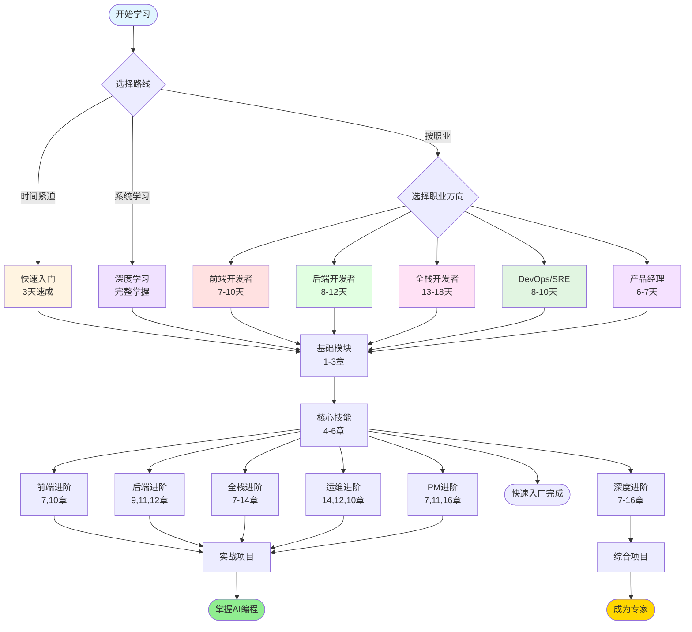

---
prev:
  text: 'E. 2026 年度热词'
  link: '/zh/appendix/buzzwords-2026'
---

# F. 学习路线图

## 如何使用本指南

本章节根据不同角色和学习目标,为你提供量身定制的学习路线。每条路线都经过精心设计,确保你能以最高效的方式掌握 AI 辅助编程的核心技能。

**选择建议:**
- 如果你是初学者,建议先完成「快速入门」路线,再根据职业方向选择对应的专业路线
- 如果你想系统深入学习,可以选择「深度学习」路线
- 如果你时间有限,可以直接跳到与你工作最相关的章节

---

## 路线 1: 前端开发者 🎨

**适合人群:** React/Vue/Angular 开发者,UI/UX 工程师

**学习目标:** 掌握使用 AI 工具快速开发现代前端应用,提升组件开发和调试效率

**推荐学习顺序:**

### 第一阶段:基础认知 (1-2 天)
1. **第 1 章:AI 编程简介** - 了解 AI 辅助编程的基本概念
2. **第 2 章:工具选择** - 选择适合前端开发的 AI 工具(推荐 Cursor、GitHub Copilot)
3. **第 3 章:Prompt 工程基础** - 学习如何编写有效的提示词

### 第二阶段:实战技能 (3-5 天)
4. **第 4 章:代码生成** - 重点学习组件生成、样式生成
5. **第 5 章:代码补全与重构** - 掌握自动完成和代码优化技巧
6. **第 7 章:UI/UX 开发** - 学习使用 AI 快速实现设计稿
8. **第 8 章:测试与调试** - 学习自动化测试生成(Jest、Vitest)

### 第三阶段:进阶优化 (2-3 天)
9. **第 10 章:性能优化** - 学习使用 AI 分析和优化前端性能
10. **第 13 章:多语言开发** - 如果涉及国际化项目
11. **附录 B:Prompt 模板库** - 收藏前端开发常用模板

**实践项目建议:**
- 使用 AI 辅助开发一个完整的 React/Vue 组件库
- 将现有项目的某个功能模块用 AI 重构
- 使用 AI 生成响应式布局和动画效果

---

## 路线 2: 后端开发者 ⚙️

**适合人群:** Node.js/Python/Java/Go 后端工程师,API 开发者

**学习目标:** 利用 AI 工具提升 API 开发、数据库设计和系统架构能力

**推荐学习顺序:**

### 第一阶段:基础准备 (1-2 天)
1. **第 1 章:AI 编程简介**
2. **第 2 章:工具选择** - 选择支持后端语言的工具
3. **第 3 章:Prompt 工程基础**

### 第二阶段:核心技能 (4-6 天)
4. **第 4 章:代码生成** - 重点学习 API 端点、数据模型生成
5. **第 5 章:代码补全与重构** - 学习重构复杂业务逻辑
6. **第 6 章:文档生成** - 自动生成 API 文档(OpenAPI/Swagger)
7. **第 9 章:数据库与 SQL** - 学习数据库设计、查询优化
8. **第 8 章:测试与调试** - 单元测试、集成测试生成

### 第三阶段:系统设计 (3-4 天)
9. **第 11 章:架构设计** - 使用 AI 进行系统架构设计
10. **第 10 章:性能优化** - 后端性能分析和优化
11. **第 12 章:安全最佳实践** - 学习安全编码和漏洞修复
12. **第 14 章:DevOps 集成** - CI/CD 流程优化

**实践项目建议:**
- 使用 AI 设计并实现一个 RESTful API 服务
- 用 AI 优化现有项目的数据库查询性能
- 让 AI 帮助你重构一个复杂的业务逻辑模块

---

## 路线 3: 全栈开发者 🚀

**适合人群:** 全栈工程师,独立开发者,创业团队技术负责人

**学习目标:** 全面掌握 AI 辅助全栈开发,从前端到后端、从开发到部署

**推荐学习顺序:**

### 第一阶段:全局认知 (2-3 天)
1. **第 1 章:AI 编程简介**
2. **第 2 章:工具选择** - 选择支持多语言的综合工具
3. **第 3 章:Prompt 工程基础**
4. **第 11 章:架构设计** - 先建立系统思维

### 第二阶段:前端技能 (3-4 天)
5. **第 4 章:代码生成** - 前端组件开发
6. **第 7 章:UI/UX 开发**
7. **第 5 章:代码补全与重构**

### 第三阶段:后端技能 (3-4 天)
8. **第 4 章:代码生成** - 后端 API 开发(重读,关注后端部分)
9. **第 9 章:数据库与 SQL**
10. **第 12 章:安全最佳实践**

### 第四阶段:集成与部署 (2-3 天)
11. **第 8 章:测试与调试** - 全栈测试策略
12. **第 14 章:DevOps 集成**
13. **第 10 章:性能优化** - 全栈性能优化

### 第五阶段:进阶专题 (3-4 天)
14. **第 6 章:文档生成**
15. **第 13 章:多语言开发**
16. **第 15 章:团队协作**
17. **附录 A:工具对比矩阵** - 选择最适合团队的工具组合

**实践项目建议:**
- 使用 AI 从零开发一个完整的 SaaS 应用
- 用 AI 重构一个老项目的前后端架构
- 让 AI 帮助你实现从开发到部署的完整流程

---

## 路线 4: DevOps / SRE 🔧

**适合人群:** 运维工程师,SRE,平台工程师

**学习目标:** 利用 AI 优化部署流程、基础设施管理和系统监控

**推荐学习顺序:**

### 第一阶段:基础了解 (1 天)
1. **第 1 章:AI 编程简介**
2. **第 2 章:工具选择** - 选择支持脚本和配置文件的工具
3. **第 3 章:Prompt 工程基础**

### 第二阶段:核心领域 (3-4 天)
4. **第 14 章:DevOps 集成** - 核心章节,重点学习
5. **第 4 章:代码生成** - 重点学习脚本、配置文件生成
6. **第 12 章:安全最佳实践** - 基础设施安全
7. **第 10 章:性能优化** - 系统性能监控和优化

### 第三阶段:实践应用 (2-3 天)
8. **第 9 章:数据库与 SQL** - 数据库运维
9. **第 8 章:测试与调试** - 基础设施测试
10. **第 6 章:文档生成** - 运维文档自动化
11. **第 15 章:团队协作** - DevOps 文化和协作

### 第四阶段:高级专题 (2 天)
12. **第 11 章:架构设计** - 了解云架构设计
13. **第 13 章:多语言开发** - 如果需要维护多语言项目

**实践项目建议:**
- 使用 AI 编写 Kubernetes 配置文件和 Helm Charts
- 让 AI 帮助你优化 CI/CD Pipeline
- 用 AI 生成监控告警规则和自动化响应脚本

---

## 路线 5: 产品经理 📊

**适合人群:** 产品经理,项目经理,技术型 PM

**学习目标:** 了解 AI 编程能力边界,更好地与技术团队协作,快速验证产品原型

**推荐学习顺序:**

### 第一阶段:概念理解 (1 天)
1. **第 1 章:AI 编程简介** - 了解 AI 编程的可能性和局限性
2. **第 2 章:工具选择** - 了解团队可以使用的工具
3. **第 3 章:Prompt 工程基础** - 学习如何与 AI 沟通

### 第二阶段:实用技能 (2-3 天)
4. **第 7 章:UI/UX 开发** - 学习快速原型开发
5. **第 4 章:代码生成** - 了解功能开发的复杂度
6. **第 6 章:文档生成** - 自动生成需求文档、API 文档
7. **第 15 章:团队协作** - 如何在团队中推广 AI 工具

### 第三阶段:技术洞察 (2 天)
8. **第 11 章:架构设计** - 理解技术架构决策
9. **第 10 章:性能优化** - 了解性能指标和优化方向
10. **第 12 章:安全最佳实践** - 理解安全需求

### 第四阶段:战略思考 (1 天)
11. **第 16 章:未来趋势** - 了解 AI 编程的未来方向
12. **附录 E:2026 年度热词** - 保持技术敏感度

**实践项目建议:**
- 使用 AI 工具自己搭建产品原型验证想法
- 用 AI 生成产品需求文档和技术规格说明
- 学习使用 AI 工具与开发团队更高效沟通

---

## 路线 6: 快速入门(3 天速成) ⚡

**适合人群:** 所有希望快速上手 AI 编程的开发者

**学习目标:** 3 天内掌握 AI 辅助编程的核心技能,立即提升工作效率

### Day 1: 基础认知与工具准备
- **上午(2-3 小时)**
  - 第 1 章:AI 编程简介(了解基本概念)
  - 第 2 章:工具选择(选择并安装一个工具)
- **下午(2-3 小时)**
  - 第 3 章:Prompt 工程基础(重点学习)
  - 实践:编写 10 个不同场景的 Prompt

### Day 2: 核心技能实战
- **上午(3 小时)**
  - 第 4 章:代码生成(重点学习,多做练习)
  - 实践:生成一个完整的小功能模块
- **下午(2-3 小时)**
  - 第 5 章:代码补全与重构
  - 第 8 章:测试与调试(快速浏览)
  - 实践:重构一段你自己的代码

### Day 3: 进阶技巧与最佳实践
- **上午(2-3 小时)**
  - 第 7 章:UI/UX 开发 或 第 9 章:数据库与 SQL(根据你的方向选一个)
  - 实践:完成一个小型实战项目
- **下午(2 小时)**
  - 第 15 章:团队协作(快速浏览)
  - 附录 B:Prompt 模板库(收藏备用)
  - 总结与复盘

**3 天后你将能够:**
- 熟练使用 AI 工具编写代码
- 提升至少 30% 的开发效率
- 独立解决日常开发中的常见问题

---

## 路线 7: 深度学习(系统化完整学习) 🎓

**适合人群:** 希望系统掌握 AI 编程所有技能的开发者,技术团队 Leader

**学习目标:** 完整学习本指南所有内容,成为 AI 辅助编程专家

**推荐学习顺序(预计 3-4 周):**

### 第一周:基础与核心技能
1. 第 1 章:AI 编程简介
2. 第 2 章:工具选择
3. 第 3 章:Prompt 工程基础
4. 第 4 章:代码生成
5. 第 5 章:代码补全与重构
6. 第 6 章:文档生成

**本周任务:** 完成 5 个小型实战项目,每个项目使用不同的 AI 工具

### 第二周:专业领域深化
7. 第 7 章:UI/UX 开发
8. 第 8 章:测试与调试
9. 第 9 章:数据库与 SQL
10. 第 10 章:性能优化

**本周任务:** 用 AI 重构一个中型项目的核心模块

### 第三周:架构与工程化
11. 第 11 章:架构设计
12. 第 12 章:安全最佳实践
13. 第 13 章:多语言开发
14. 第 14 章:DevOps 集成

**本周任务:** 从零开始用 AI 设计并实现一个完整系统

### 第四周:团队与战略
15. 第 15 章:团队协作
16. 第 16 章:未来趋势
17. 附录 A:工具对比矩阵
18. 附录 B:Prompt 模板库
19. 附录 C:常见问题
20. 附录 D:资源列表
21. 附录 E:2026 年度热词

**本周任务:** 
- 制定团队 AI 编程推广计划
- 编写团队 Prompt 规范和最佳实践文档
- 分享学习心得,带动团队成长

**完成后你将能够:**
- 成为团队的 AI 编程专家和推广者
- 深刻理解 AI 编程的能力边界和最佳实践
- 制定适合团队的 AI 工具和流程规范

---

## 学习路线可视化

下面的流程图展示了不同学习路线的关系和推荐路径:

---

## 学习建议

### 1. 制定个性化计划
- 根据你的当前技能水平调整学习速度
- 不要跳过基础章节(1-3 章),这是后续学习的基础
- 根据实际项目需要灵活调整学习重点

### 2. 边学边练
- 每学完一章,立即在实际项目中应用
- 建立自己的 Prompt 模板库
- 记录学习笔记和最佳实践

### 3. 持续迭代
- AI 工具发展迅速,定期回顾和更新知识
- 关注附录 D 中的资源,保持学习
- 加入社区,与其他开发者交流经验

### 4. 评估成果
- 使用本指南的知识完成至少 3 个实际项目
- 衡量开发效率的实际提升(建议目标:30-50%)
- 团队学习可以定期组织分享会

---

## 下一步

选择好适合你的学习路线后,建议:

1. **第一步:** 前往 [第 1 章：3 分钟体验 AI](/zh/01-first-experience/) 开始学习
2. **工具准备:** 查看 [第 5 章：AI 编程工具全景](/zh/05-ai-coding-tools/) 选择合适的工具
3. **实战练习:** 使用 [附录 C：资源索引](/zh/appendix/resources) 获取更多学习材料
4. **问题解答:** 遇到问题查看 [附录 D：FAQ](/zh/appendix/faq)

记住:AI 是辅助工具,核心编程能力和系统思维仍然是最重要的。祝你学习愉快! 🚀
