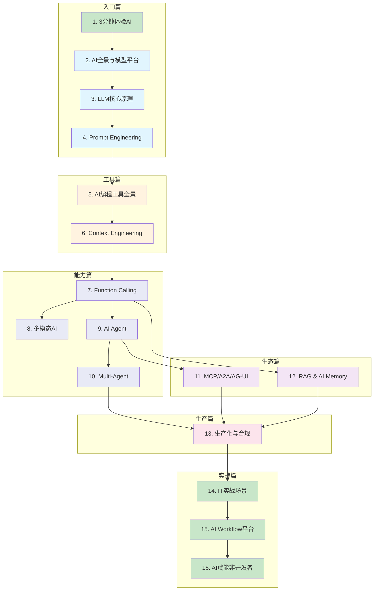

## 学习路线图

## 三种学习路径

### ⚡ 速成路径（7 节，约 3 小时） {#速成路径}

快速跑通 AI 开发全流程，适合时间有限想快速上手的同事：

**1.1 第一次AI对话** → **4.1 Prompt基础** → **5.1 IDE工具** → **7.1 Function Calling** → **9.2 ReAct Agent** → **12.1 RAG基础** → **14.1 知识库实战**

### 🎯 角色路径

按你的岗位选择重点章节：

<RolePaths />

### 📚 完整路径

16 章 60+ 节全部学完，从入门到精通。按章节顺序阅读即可。也可参考 [附录 F. 学习路线图](/zh/appendix/learning-paths) 按角色定制学习路径。

---

::: info 关于本教程
本教程基于 **2026 年 2 月** 的 AI 技术生态编写。AI 领域发展迅速，部分内容可能随版本更新而变化。每节底部标注了最后更新时间，核心 Demo 绑定了具体的包版本号。
:::
